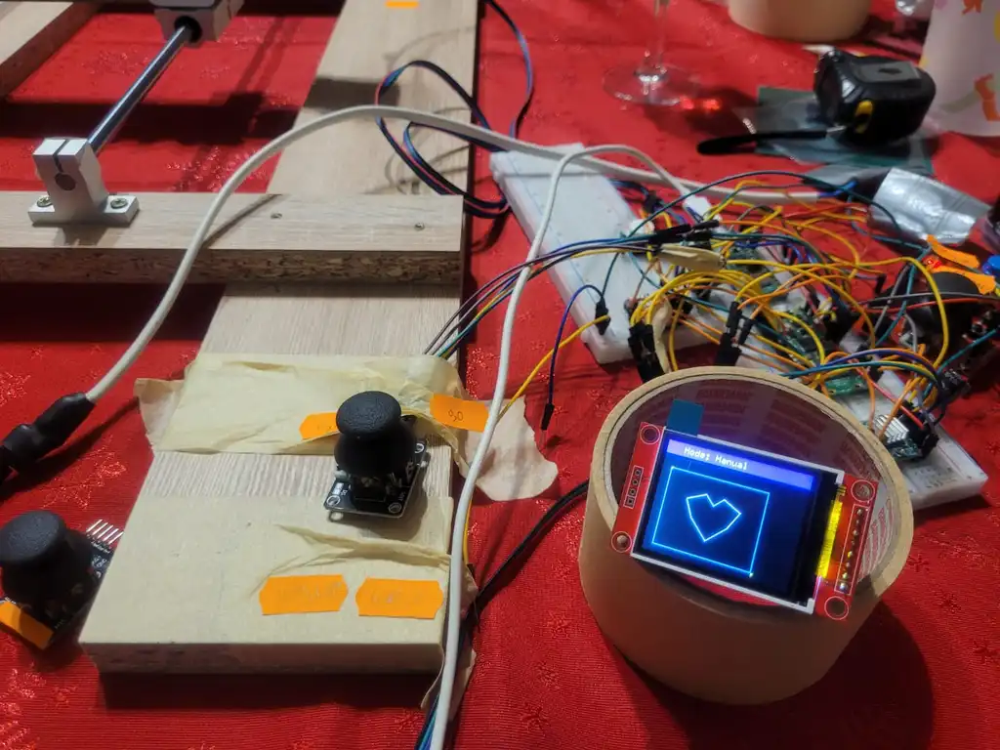
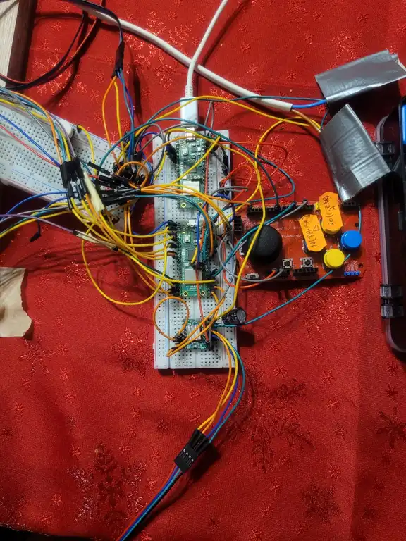
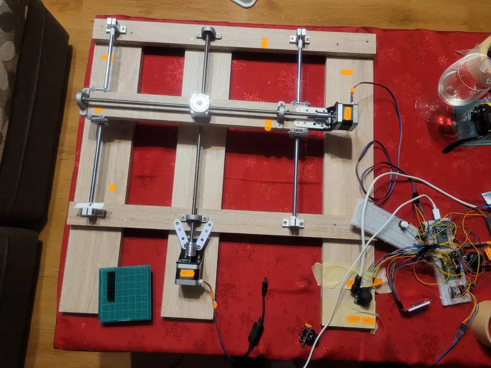
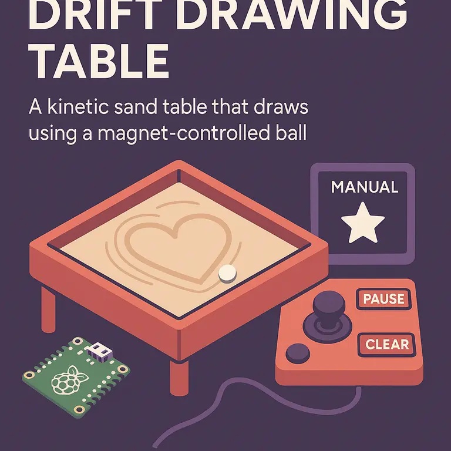

# Drift Drawing Table
A kinetic sand table that draws using a magnet-controlled ball.

:::info

**Author**: Aliu Maria-Denisa \
**GitHub Project Link**: [Drift Drawing Table](https://github.com/UPB-PMRust-Students/proiect-mariaaliu)

:::

## Description

An interactive coffee table that draws patterns in sand using a steel ball moved by a magnet underneath. It features an automatic mode with predefined patterns and a manual mode controlled by a joystick. The user can pause the drawing to admire the current shape or press a reset button and start fresh.

## Motivation

I wanted to create a relaxing and visually engaging project that combines artistic expression with embedded systems. The idea of a kinetic sand table felt like a unique way to explore motion control, user interaction, and creative design. It's a great opportunity to learn more about stepper motor control and real-time input handling, while also building something people can enjoy watching and interacting with.

## Architecture

- **Controller Core**: Raspberry Pi Pico 2 runs the main control loop and manages motor drivers, input handling and display output.
- **Motion Controller**: Two stepper motors control the X and Y position of the magnet beneath the table, based on trajectory data.
- **User Input Manager**: A joystick is used to switch between modes and control the ball in manual mode. Additional buttons allow the user to pause the drawing or clear (stop automatic and switch to manual so the user can clear the sand), etc.
- **Drawing Engine**: In automatic mode, a pattern generator creates coordinate sequences (e.g., circles, spirals) sent to the motion controller.

These components communicate in an event-driven and partially asynchronous manner using Embassy's async runtime on the microcontroller.

## Log

### Week 5 - 11 May
- Defined the project scope and functionality (manual + automatic drawing modes).
- Designed system architecture and created component diagram.
- Selected core hardware components (RP Pico 2, NEMA 17, A4988).
- Started basic Rust setup for Pico alone using Embassy framework.

### Week 12 - 18 May
- Completed schematic in KiCad with all real hardware components used.
- Created custom component symbols for Joystick and TFT screen.
- Verified all pin mappings against Rust codebase.
- Began testing Embassy-based async control loop for both motors.
- Integrated screen output for mode status (Manual / Auto / Paused).
- First try mapping for automatic drawing patterns.
- Implemented basic joystick input handling for manual mode.
- Created a simple test program for the buttons and joystick to control the motors.
- Implemented a simple way to show on screen the current mode and pattern.

### Week 19 - 25 May

## Hardware

### Raspberry Pi Pico 2W

- **Purpose**: Central controller
- **Function**: Coordinates the operation of all components, including stepper motors, input buttons, joystick, and optional display. Runs the control logic for both automatic and manual drawing modes.

### Stepper Motors (2x NEMA 17 – 17HS4401)

- **Purpose**: Drives the magnetic drawing mechanism
- **Function**: Moves a strong magnet in X and Y directions underneath the sand surface. The magnet guides a steel ball placed on top, forming visible patterns.

### A4988 Stepper Motor Drivers (2x)

- **Purpose**: Motor control interface
- **Function**: Controls the power and step timing of the stepper motors, based on signals received from the Raspberry Pi Pico.

### Joystick (with X/Y movement and click)

- **Purpose**: User interaction (manual mode + mode switching)
- **Function**: Allows users to directly control the ball's position or switch between automatic and manual drawing modes via button press.

### Push Buttons ("Pause" and "Clear")

- **Purpose**: Additional user input
- **Function**:

    - *Pause Button*: Freezes the drawing to let users admire the current shape.

    - *Clear Button*: Stops and changes mode to manual to flatten the sand for a new design.

    - Buttons for selecting the drawing pattern in automatic mode.

### LCD Display (1.8” TFT – ST7735S)

- **Purpose**: Displays system status / user feedback
- **Function**: Shows current mode (Manual / Automatic / Paused), drawing pattern name, and progress. 
LED indicators were considered as a fallback option, but the final system includes an LCD display.

### Metal Bar + Mechanical Structure

- **Purpose**: Physical movement support
- **Function**: Guides the motors and magnet system along defined X and Y axes, ensuring smooth and accurate motion beneath the sand layer.

 Table Interfaces & Pinout

## Table Interfaces & Pinout

| Component                | Role                             | Interface            | Microcontroller Pins                        |
|--------------------------|----------------------------------|----------------------|---------------------------------------------|
| **Raspberry Pi Pico 2W** | Main controller                  | -                    | -                                           |
| **Joystick**             | Manual ball control & mode toggle (K button) | ADC + GPIO          | ADC0 (GP26), ADC1 (GP27), K (GP18)          |
| **Pause Button**         | Pauses/resumes current mode      | GPIO Input (Pull-up) | GP19                                        |
| **Clear Button**         | Stops and clears current pattern | GPIO Input (Pull-up) | GP20                                        |
| **Stepper Motor X**      | Moves magnet horizontally        | A4988 (DIR + STEP)   | DIR: GP16, STEP: GP17                       |
| **Stepper Motor Y**      | Moves magnet vertically          | A4988 (DIR + STEP)   | DIR: GP14, STEP: GP15                       |
| **TFT Display (ST7735S)**| Displays status and position     | SPI                  | SPI0 (GP2, GP3, GP4), CS: GP5, DC: GP7, RST: GP6 |

 Functional Validation

## Functional Validation

- Display was initialized and renders text and vector shapes (heart, star).
- Joystick movement is mapped and read through ADC.
- Stepper motor drivers tested with manual and automatic signals.
- Push buttons successfully trigger mode changes and pauses.

Each hardware component has been validated independently and in partial integration.

### Some reference images  

 Screen Display (TFT)

 Breadboard Wiring

 Rod & Rail System

### Video

<!-- 
[*Play video here*](https://www.youtube.com/watch?v=zvSr5EOP77k) -->

[*Play video here*](https://www.youtube.com/watch?v=zvSr5EOP77k)

 Detailed Hardware Description

### 1. **Microcontroller – Raspberry Pi Pico 2W**
Acts as the central controller running asynchronous Rust (via Embassy). Manages all sensors, motors, buttons, and display.

### 2. **Stepper Motors + A4988 Drivers**
- Two **NEMA 17HS4401** motors  
- Controlled using **A4988** driver boards  
- Connected via 12V power supply (Laptop charger)  
- GPIOs used for `STEP` and `DIR` signals  
- Maximum motion range capped via software 

#### Power Supply

- **Purpose**: Provides power to the stepper motors and drivers
- **Function**: A standard **12V laptop charger** is connected to a **female barrel jack socket** mounted on the base. This jack distributes power to both A4988 motor drivers.

### 3. **Joystick**
- 2-axis analog stick with integrated click  
- Connected to ADC (GP26, GP27)  
- `K` click is connected to GP18  
- Used for manual movement and toggling mode  

### 4. **Push Buttons**
- **Pause** (GP19): pauses or resumes drawing  
- **Clear** (GP20): stops current pattern and switches to manual  
- Pull-up configured on both lines  

### 5. **TFT LCD (1.8” ST7735S)**
- Connected via SPI0  
- Pins: CLK (GP2), MOSI (GP3), MISO (GP4), CS (GP5), DC (GP7), RST (GP6)  
- Used to display current mode, pattern, and X/Y ball position  
- Powered at 3.3V and initialized via `mipidsi` + `embedded-graphics`

### Schematics

### Bill of Materials

| Device | Usage | Price |
|--------|--------|-------|
| [Raspberry Pi Pico W](https://www.raspberrypi.com/documentation/microcontrollers/raspberry-pi-pico.html) | The microcontroller | [39 RON](https://www.optimusdigital.ro/ro/placi-raspberry-pi/13327-raspberry-pi-pico-2-w.html?search_query=5056561803975&results=1) |
| 2 x [NEMA 17HS4401 Stepper Motor](https://www.alldatasheet.com/datasheet-pdf/pdf/1245671/NINGBO/17HS4401.html) | The motor that moves the ball | 2 x [34 RON](https://www.optimusdigital.ro/ro/motoare-motoare-pas-cu-pas/5057-motor-pas-cu-pas-17hs4401-17-a-40-ncm.html?search_query=0104110000039231&results=1) |
| 2 x  [A4988 Stepper Motor Driver](https://www.pololu.com/product/1182) | The driver for the stepper motors | 2 x [8 RON](https://www.optimusdigital.ro/ro/drivere-de-motoare-pas-cu-pas/155-driver-pentru-motoare-pas-cu-pas-a4988.html?search_query=0104110000000040&results=1) |
| [Joystick Module](https://handsontec.com/dataspecs/module/Arduino%20Shield/Joystick%20Shield.pdf) | The joystick used to control the ball | [20 RON](https://www.optimusdigital.ro/ro/shield-uri-pentru-arduino/1283-shield-joystick-pentru-arduino.html?search_query=0104110000009807&results=1) |
| [Breadboard + Jumper Wires](https://www.optimusdigital.ro/ro/cautare?controller=search&orderby=position&orderway=desc&search_query=Kit+Breadboard+HQ830+cu+Fire+%C8%99i+Surs%C4%83&submit_search=) | Prototyping connections | [22 RON](https://www.optimusdigital.ro/ro/cautare?controller=search&orderby=position&orderway=desc&search_query=Kit+Breadboard+HQ830+cu+Fire+%C8%99i+Surs%C4%83&submit_search=) |
| [Steel Ball](https://euromagnet.ro/bil-magnetic-neodim-13mm-n40?gad_source=1&gad_campaignid=21662404508&gclid=Cj0KCQjw2tHABhCiARIsANZzDWooYVeVaVG_7j-K9WNkBQOXlxx8pOWa-ywj-nRS9EYUWV7GFKytoYEaAsNHEALw_wcB) | The ball that draws in the sand | 8 RON |
| [Magnet](https://www.optimusdigital.ro/ro/magnei-disc-din-neodim/10300-magnet-disc-din-neodim-33x10-mm-n38.html?search_query=magnet&results=364) | The magnet that moves the ball | 25 RON |
| [Metal bar for Ox and Oy](https://www.temu.com/ul/kuiper/un9.html?subj=coupon-un&_bg_fs=1&_p_jump_id=895&_x_vst_scene=adg&goods_id=601099563639421&sku_id=17592407214716&adg_ctx=a-fbaaccb2~c-e6246f78~f-3ba1efa7&_x_ads_sub_channel=shopping&_p_rfs=1&_x_ns_prz_type=-1&_x_ns_sku_id=17592407214716&_x_ns_gid=601099563639421&mrk_rec=1&_x_ads_channel=google&_x_gmc_account=778689129&_x_login_type=Google&_x_ads_account=5683721747&_x_ads_set=21734348112&_x_ads_id=174678035464&_x_ads_creative_id=714578127546&_x_ns_source=g&_x_ns_gclid=Cj0KCQjw2tHABhCiARIsANZzDWobpE6ql2oJHeZuVbWw8pnxuDFj2E_C2u6mESc5KaPPqVyepC6fjJQaAqZREALw_wcB&_x_ns_placement=&_x_ns_match_type=&_x_ns_ad_position=&_x_ns_product_id=17592407214716&_x_ns_target=&_x_ns_devicemodel=&_x_ns_wbraid=Cj4KCAjwt8zABhBJEi4AaTmnTHH3iKDVlX22EA51ieGmjqgYqNE2bCzUlCSScSaM2LeaHEAK8-IcZiNqGgLrKA&_x_ns_gbraid=0AAAAAo4mICGFkXhamxAuEbvBsmB9P5-8N&_x_ns_targetid=pla-2319869360114&gad_source=1&gad_campaignid=21734348112&gclid=Cj0KCQjw2tHABhCiARIsANZzDWobpE6ql2oJHeZuVbWw8pnxuDFj2E_C2u6mESc5KaPPqVyepC6fjJQaAqZREALw_wcB&refer_page_name=kuiper&refer_page_id=13554_1746174012766_euhucr5b61&refer_page_sn=13554&_x_sessn_id=n9qgybhp2w&is_back=1&no_cache_id=54wi1) | Movement of the ball | 2 x [90 RON](https://www.temu.com/ul/kuiper/un9.html?subj=coupon-un&_bg_fs=1&_p_jump_id=895&_x_vst_scene=adg&goods_id=601099563639421&sku_id=17592407214716&adg_ctx=a-fbaaccb2~c-e6246f78~f-3ba1efa7&_x_ads_sub_channel=shopping&_p_rfs=1&_x_ns_prz_type=-1&_x_ns_sku_id=17592407214716&_x_ns_gid=601099563639421&mrk_rec=1&_x_ads_channel=google&_x_gmc_account=778689129&_x_login_type=Google&_x_ads_account=5683721747&_x_ads_set=21734348112&_x_ads_id=174678035464&_x_ads_creative_id=714578127546&_x_ns_source=g&_x_ns_gclid=Cj0KCQjw2tHABhCiARIsANZzDWobpE6ql2oJHeZuVbWw8pnxuDFj2E_C2u6mESc5KaPPqVyepC6fjJQaAqZREALw_wcB&_x_ns_placement=&_x_ns_match_type=&_x_ns_ad_position=&_x_ns_product_id=17592407214716&_x_ns_target=&_x_ns_devicemodel=&_x_ns_wbraid=Cj4KCAjwt8zABhBJEi4AaTmnTHH3iKDVlX22EA51ieGmjqgYqNE2bCzUlCSScSaM2LeaHEAK8-IcZiNqGgLrKA&_x_ns_gbraid=0AAAAAo4mICGFkXhamxAuEbvBsmB9P5-8N&_x_ns_targetid=pla-2319869360114&gad_source=1&gad_campaignid=21734348112&gclid=Cj0KCQjw2tHABhCiARIsANZzDWobpE6ql2oJHeZuVbWw8pnxuDFj2E_C2u6mESc5KaPPqVyepC6fjJQaAqZREALw_wcB&refer_page_name=kuiper&refer_page_id=13554_1746174012766_euhucr5b61&refer_page_sn=13554&_x_sessn_id=n9qgybhp2w&is_back=1&no_cache_id=54wi1) |
| 12V Power Supply + Barrel Jack | Power supply for the motors | Reused charger + 5 RON socket |
| [LCD Display](https://www.emag.ro/display-tft-lcd-1-8-inch-128x160-spi-st7735s-arduino-emg204/pd/D8RPFSYBM/) | Display for showing the current mode and pattern | [34 RON](https://www.emag.ro/display-tft-lcd-1-8-inch-128x160-spi-st7735s-arduino-emg204/pd/D8RPFSYBM/) |
| Consumables | leds, capacitors, resistors, switches, screws, etc | 50 RON |
| Custom wooden pieces | The table and the structure for the motors | 18 RON |

## Software

| Library | Description | Usage |
|---------|-------------|-------|
| [embassy](https://github.com/embassy-rs/embassy) | Async embedded framework for Rust | Main framework for handling async tasks like motor control, button input, and joystick |
| [embassy-rp](https://github.com/embassy-rs/embassy) | RP2350 support for Embassy | Provides access to GPIO, SPI, and timers for Raspberry Pi Pico 2 |
| [embedded-hal-async](https://github.com/rust-embedded/embedded-hal) | Async traits for embedded drivers | Used to write generic and portable async code for GPIO and other devices |
| [mipidsi](https://github.com/almindor/mipidsi) | Display driver for ST7735s via SPI | Used for LED display, to show mode, pattern, or pause state |
| [embedded-graphics](https://github.com/embedded-graphics/embedded-graphics) | Draw UI and shapes on screen | Used to create a user interface on the display |
| [defmt](https://github.com/knurling-rs/defmt) | Logging framework for embedded Rust | Debugging tool for monitoring runtime behavior over RTT |
| [micromath](https://docs.rs/micromath/latest/micromath) | Lightweight math utilities | Used to generate circular, spiral, or custom paths for drawing |
| [tiny-skia](https://github.com/RazrFalcon/tiny-skia) | 2D drawing and rasterization library | Optional, used offline (on PC) to convert images or vector art to point paths for the table |
| [heapless](https://github.com/japaric/heapless) | Fixed-size data structures | Used to buffer the X/Y coordinate queue for the ball to follow |
| [embassy-sync](https://github.com/embassy-rs/embassy/tree/main/embassy-sync) | Async-safe synchronization primitives | Used for signaling between tasks and mutex sharing (e.g., SPI bus) |

## Links

1. [Sisyphus Table](https://sisyphus-industries.com/) – The original kinetic sand table that inspired this project
2. [Embassy (Async Embedded Framework)](https://embassy.dev/) – Used for multitasking, motor control, and async I/O
3. [Rust Embedded Book](https://docs.rust-embedded.org/book/) – Useful for understanding how embedded Rust works
4. [Stepper Motor Basics](https://www.youtube.com/watch?v=09Mpkjcr0bo) – Overview of how stepper motors work
5. [tiny-skia](https://github.com/RazrFalcon/tiny-skia) – (Optional) For offline conversion of images to paths
