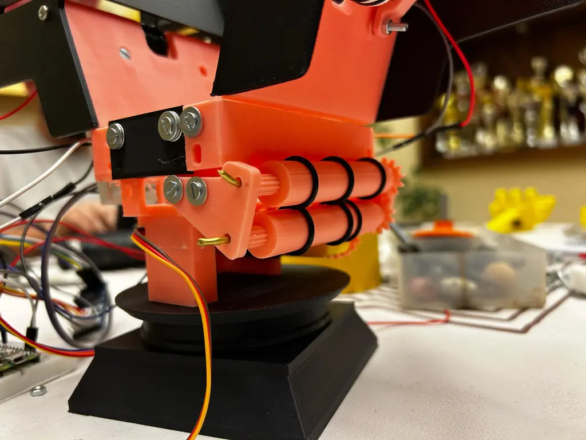
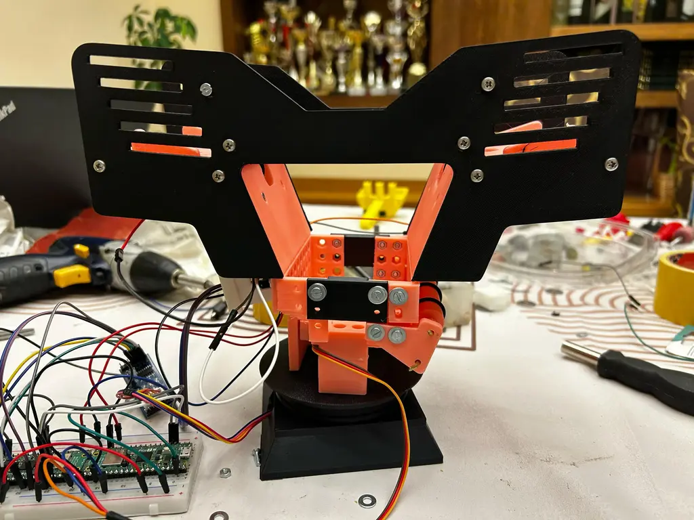

# Automatic card shuffler and dealer

Automatic card shuffler and dealer for board games with a display and buttons to select the number of players and the cards to be dealt.

:::info

**Author**: Dragusin Matei Cosmin \
**GitHub Project Link**: [Repository](https://github.com/UPB-PMRust-Students/proiect-Matei-Dragusin)

:::

## Description

This project is an automatic card shuffler and dealer for board games. The device consists of three main sections:

1. An upper section with left and right input zone equipped with IR sensors to detect the cards.
2. A middle shuffling area with rubber rollers driver by DC motors to mix the cards.
3. A lower section with a rotating base controlled by a servo motor to deal the cards.

Users can interact with the device through a simple OLED display interface and control buttons, allowing them to select:

1. Number of players participating in the game
2. Cards to be dealt per player

## Motivation

The motivation behind this project is to create a fun and interactive device that can enhance the experience of playing card games. The automatic shuffler and dealer will save time and effort, allowing players to focus on enjoying the game rather than dealing with the tedious task of shuffling and dealing cards.

## Architecture

```mermaid
graph TD
   A[User Interface Module] --> B[Control System]
   B --> C[Card Input System]
   B --> D[Shuffling System]
   B --> E[Card Distribution System]

   A -->|"WiFi Interface<br>Control Buttons"| B
   B -->|"Main Controller Logic<br>Game Settings"| C
   B -->|"Shuffle Algorithm<br>Motor Control"| D
   B -->|"Player Distribution<br>Rotation Control"| E
   
   C -->|"Cards Flow"| D
   D -->|"Shuffled Cards"| E
```

## Log

### Week 5 - 11 May

- Purchased all necessary components for the project
- Individually tested all motors to verify functionality
- Completed the 3D design of the device

### Week 12 - 18 May

- Assembled the 3D printed parts
- Attached the motors to the main structure
- Started software development, focusing on motor control
- Configured WiFi communication for the user interface

### Week 19 - 25 May

## Hardware

The automatic card shuffler uses a Raspberry Pi Pico 2W as the main controller, which connects to the local WiFi network and is controlled through a web interface. The mechanical system includes three DC motors driving rubber rollers for card movement and one stepper motor for the rotating dealing platform, all powered through a wall outlet.

| Breadboard | DC Motor View | Dealer View |
|:----------:|:-------------:|:-----------:|
|  |  |  |

| Full View | Side View |
|:---------:|:---------:|
|  |  |

### Schematics

### Bill of Materials

| Device | Usage | Price |
|--------|--------|-------|
| [Raspberry Pi Pico 2 W](https://www.raspberrypi.com/documentation/microcontrollers/raspberry-pi-pico.html) | The main microcontroller that runs the embedded Rust software and controls all system components | [35 RON x](https://www.optimusdigital.ro/ro/placi-raspberry-pi/13327-raspberry-pi-pico-2-w.html?search_query=pico+2w&results=33) |
| [ULN2003 Stepper Motor Driver](https://www.optimusdigital.ro/ro/motoare-motoare-pas-cu-pas/101-driver-uln2003-motor-pas-cu-pas-de-5-v-.html) | Controls the stepper motor for precise rotation of the card distribution platform | [17 RON](https://www.optimusdigital.ro/ro/motoare-motoare-pas-cu-pas/101-driver-uln2003-motor-pas-cu-pas-de-5-v-.html) |
| [GA12-N20 DC Motor with Gearbox](https://sigmanortec.ro/Motor-DC-Micro-Metal-6V-HPCB-Perii-Carbon-30-1-p200733572) | Drives the rubber rollers for card movement and shuffling (need 3 units) | [75 RON](https://sigmanortec.ro/Motor-DC-Micro-Metal-6V-HPCB-Perii-Carbon-30-1-p200733572) |
| [L298N Dual Motor Driver](https://www.optimusdigital.ro/ro/drivere-de-motoare-cu-perii/145-driver-de-motoare-dual-l298n.html?search_query=l298&results=5) | Controls the DC motors for the shuffling mechanism (need 2) | [40 RON](https://www.optimusdigital.ro/ro/drivere-de-motoare-cu-perii/145-driver-de-motoare-dual-l298n.html?search_query=l298&results=5) |
| [Servomotor MG90S](https://www.optimusdigital.ro/ro/motoare-servomotoare/271-servomotor-mg90s.html) | Provides precise control for the card distribution platform rotation | [25 RON](https://www.optimusdigital.ro/ro/motoare-servomotoare/271-servomotor-mg90s.html) |
| [Motor cu reductor si roata](https://www.optimusdigital.ro/ro/motoare-altele/139-motor-cu-reductor-si-roata.html) | Used for additional mechanical movement in the card distribution system | [30 RON](https://www.optimusdigital.ro/ro/motoare-altele/139-motor-cu-reductor-si-roata.html) |
| [Consumables](https://www.optimusdigital.ro) | Cards, adhesives, and other small items needed for assembly and operation | [30 RON](https://www.optimusdigital.ro) |

## Software

| Library | Description | Usage |
|---------|-------------|-------|
| [embassy-executor](https://github.com/embassy-rs/embassy/tree/main/embassy-executor) | Async/await executor | Managing concurrent tasks for motor control and user interface |
| [embassy-time](https://github.com/embassy-rs/embassy/tree/main/embassy-time) | Timekeeping and delays | Timing for motors, animations, and card distribution |
| [embassy-rp](https://github.com/embassy-rs/embassy/tree/main/embassy-rp) | RP2350 HAL | Hardware interface for Raspberry Pi Pico |
| [embassy-sync](https://github.com/embassy-rs/embassy/tree/main/embassy-sync) | Synchronization primitives | Resource sharing between tasks |
| [embassy-net](https://github.com/embassy-rs/embassy/tree/main/embassy-net) | Network stack | Networking interface for WiFi connectivity |
| [cyw43](https://github.com/embassy-rs/embassy/tree/main/cyw43) | WiFi Chip Driver | Driver for the Pico W's onboard WiFi chip |
| [embedded-graphics](https://github.com/embedded-graphics/embedded-graphics) | 2D graphics library | Used for creating interface elements for web display |
| [tinybmp](https://crates.io/crates/tinybmp) | BMP image handling | Loading and displaying card images |
| [defmt](https://github.com/knurling-rs/defmt) | Logging framework | Debug information during development |
| [defmt-rtt](https://crates.io/crates/defmt-rtt) | RTT debug channel | Real-time debugging output |
| [embedded-hal](https://github.com/rust-embedded/embedded-hal) | Hardware abstraction | Generic hardware interface for motors and sensors |
| [rand](https://crates.io/crates/rand) | Random number generation | Card shuffling algorithm implementation |
| [heapless](https://github.com/rust-embedded/heapless) | Stack-based collections | Memory-efficient data structures |
| [cortex-m-rt](https://crates.io/crates/cortex-m-rt) | Runtime support | Core functionality for ARM Cortex-M |
| [critical-section](https://crates.io/crates/critical-section) | Critical section API | Thread-safe operations for motor control |
| [panic-probe](https://crates.io/crates/panic-probe) | Panic handler | Error handling during development |
| [serde](https://crates.io/crates/serde) | Serialization framework | Data serialization for web communication |
| [serde-json-core](https://crates.io/crates/serde-json-core) | JSON serialization | JSON encoding/decoding for web interface |
| [step-dir](https://crates.io/crates/step-dir) | Stepper motor control | Precise control for rotating platform |

## Links

1. [Automatic card shuffler and dealer on Amazon](https://www.amazon.com/KPAW-Automatic-Shuffler-Dealer-Built/dp/B0DF7KXF87?crid=VQXMFEMOLJPK&dib=eyJ2IjoiMSJ9.dKA_jXeVZJ87ninzvYXMfybjRSgt3DU87L7RMkeNm-7rr1sA03cQxvmPIiaEHKNArWhQkwR0jGWoxu9ntZDRsDiFuKEjXR2-iTms068c5ksyEHIsGWzokvkEchlmJnmcp6oxuFT3PiSayY5AHT1TgiBfPqHmjqqC7mYgToOR61j_WQ2nEKCptaoSue6Eik0-vveT0qVm9M6AjhT4rfogDZSBInUUJFRK8xTWlmqE9JuBd8sW2U7KX22Lsi02naiOukhreJlzJ4OxmRKyyJ0oxBetJm4BEI2CVzfJiunv4do.FUeDq026LKc7ZkL_3obY3aYIdnFNWye8d2O7QJDlezU&dib_tag=se&keywords=card%2Bdealer&qid=1746203396&sprefix=card%2Bdeal%2Caps%2C465&sr=8-5&th=1)
