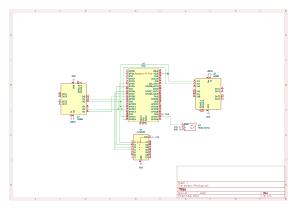

# Automatic card shuffler and dealer

Automatic card shuffler and dealer for board games with a display and buttons to select the number of players and the cards to be dealt.

:::info

**Author**: Dragusin Matei Cosmin \
**GitHub Project Link**: [Repository](https://github.com/UPB-PMRust-Students/proiect-Matei-Dragusin)

:::

## Description

This project is an automatic card shuffler and dealer for board games. The device consists of three main sections:

1. An upper section with left and right input zone equipped with IR sensors to detect the cards.
2. A middle shuffling area with rubber rollers driver by DC motors to mix the cards.
3. A lower section with a rotating base controlled by a servo motor to deal the cards.

Users can interact with the device through a simple OLED display interface and control buttons, allowing them to select:

1. Number of players participating in the game
2. Cards to be dealt per player

## Motivation

The motivation behind this project is to create a fun and interactive device that can enhance the experience of playing card games. The automatic shuffler and dealer will save time and effort, allowing players to focus on enjoying the game rather than dealing with the tedious task of shuffling and dealing cards.

## Architecture

```mermaid
graph TD
    A[User Interface Module] --> B[Control System]
    B --> C[Card Input System]
    B --> D[Shuffling System]
    B --> E[Card Distribution System]
    B --> F[Sensor System]

    A -->|"OLED Display<br>Control Buttons"| B
    B -->|"Main Controller Logic<br>Game Settings"| C
    B -->|"Shuffle Algorithm<br>Motor Control"| D
    B -->|"Player Distribution<br>Rotation Control"| E
    B -->|"Card Detection<br>System Monitoring"| F
    
    F -->|"Card Detection Signals"| B
    C -->|"Cards Flow"| D
    D -->|"Shuffled Cards"| E
```

## Log

### Week 5 - 11 May

### Week 12 - 18 May

### Week 19 - 25 May

## Hardware

The automatic card shuffler uses a Raspberry Pi Pico 2W as the main controller, connected to an OLED display and buttons for user interface. The mechanical system includes three DC motors driving rubber rollers for card movement, one stepper motor for the rotating dealing platform, and IR sensors for card detection, all powered through a wall outlet.

### Schematics

### Bill of Materials

| Device | Usage | Price |
|--------|--------|-------|
| [Raspberry Pi Pico 2 W](https://www.raspberrypi.com/documentation/microcontrollers/raspberry-pi-pico.html) | The main microcontroller that runs the embedded Rust software and controls all system components | [35 RON](https://www.optimusdigital.ro/ro/placi-raspberry-pi/13327-raspberry-pi-pico-2-w.html?search_query=pico+2w&results=33) |
| [ULN2003 Stepper Motor Driver](https://www.optimusdigital.ro/ro/motoare-motoare-pas-cu-pas/101-driver-uln2003-motor-pas-cu-pas-de-5-v-.html) | Controls the stepper motor for precise rotation of the card distribution platform | [17 RON](https://www.optimusdigital.ro/ro/motoare-motoare-pas-cu-pas/101-driver-uln2003-motor-pas-cu-pas-de-5-v-.html) |
| [GA12-N20 DC Motor with Gearbox](https://www.optimusdigital.ro/ro/motoare-micro-motoare-cu-reductor/678-micro-motor-cu-reductor-ga12-n20-130.html) | Drives the rubber rollers for card movement and shuffling (need 3 units) | [75 RON](https://www.optimusdigital.ro/ro/motoare-micro-motoare-cu-reductor/678-micro-motor-cu-reductor-ga12-n20-130.html) |
| [LM2596HV DC-DC Step-down Module](https://www.optimusdigital.ro/ro/surse-coboratoare-reglabile/1108-modul-dc-dc-step-down-lm2596hv.html) | Regulates power from the wall adapter to appropriate voltage levels for motors and electronics | [12 RON](https://www.optimusdigital.ro/ro/surse-coboratoare-reglabile/1108-modul-dc-dc-step-down-lm2596hv.html) |
| [Round Cap Buttons](https://www.optimusdigital.ro/ro/butoane-i-comutatoare/1114-buton-cu-capac-rotund-rou.html) | User interface controls for selecting number of players, cards per player, and distribution angle | [3 RON](https://www.optimusdigital.ro/ro/butoane-i-comutatoare/1114-buton-cu-capac-rotund-rou.html) |
| [V-Groove Roller with Bearing](https://www.optimusdigital.ro/ro/mecanica-rulmenti/3826-rola-neagra-pentru-profil-v-cu-rulment-v-625.html) | Provides smooth, low-friction movement of cards through the shuffling mechanism (need 4-5 units) | [17 RON](https://www.optimusdigital.ro/ro/mecanica-rulmenti/3826-rola-neagra-pentru-profil-v-cu-rulment-v-625.html) |
| [OLED Screen](https://www.amazon.de/-/en/gp/aw/d/B0CWN27HVB) | Detects card presence at various points in the system for automated control and error detection | [27 RON](https://www.amazon.de/-/en/gp/aw/d/B0CWN27HVB?psc=1&ref=ppx_pop_mob_b_asin_title) |
| [L298N Dual Motor Driver](https://www.optimusdigital.ro/ro/drivere-de-motoare-cu-perii/145-driver-de-motoare-dual-l298n.html?search_query=l298&results=5) | Controls the DC motors for the shuffling mechanism | [20 RON](https://www.optimusdigital.ro/ro/drivere-de-motoare-cu-perii/145-driver-de-motoare-dual-l298n.html?search_query=l298&results=5) |
| [Consumables](https://www.optimusdigital.ro) | Cards, adhesives, and other small items needed for assembly and operation | [30 RON](https://www.optimusdigital.ro) |

## Software

| Library | Description | Usage |
|---------|-------------|-------|
| [embassy-executor](https://github.com/embassy-rs/embassy/tree/main/embassy-executor) | Async/await executor | Managing concurrent tasks for motor control and user interface |
| [embassy-time](https://github.com/embassy-rs/embassy/tree/main/embassy-time) | Timekeeping and delays | Timing for motors, animations, and card distribution |
| [embassy-rp](https://github.com/embassy-rs/embassy/tree/main/embassy-rp) | RP2350 HAL | Hardware interface for Raspberry Pi Pico |
| [embassy-sync](https://github.com/embassy-rs/embassy/tree/main/embassy-sync) | Synchronization primitives | Resource sharing between tasks |
| [st7735](https://crates.io/crates/st7735-lcd) | Display driver for ST7735 | Used for the display for the Pico Explorer Base |
| [embedded-graphics](https://github.com/embedded-graphics/embedded-graphics) | 2D graphics library | Used for drawing to the display |
| [tinybmp](https://crates.io/crates/tinybmp) | BMP image handling | Loading and displaying card images |
| [defmt](https://github.com/knurling-rs/defmt) | Logging framework | Debug information during development |
| [defmt-rtt](https://crates.io/crates/defmt-rtt) | RTT debug channel | Real-time debugging output |
| [embedded-hal](https://github.com/rust-embedded/embedded-hal) | Hardware abstraction | Generic hardware interface for motors and sensors |
| [rand](https://crates.io/crates/rand) | Random number generation | Card shuffling algorithm implementation |
| [heapless](https://github.com/rust-embedded/heapless) | Stack-based collections | Memory-efficient data structures |
| [cortex-m-rt](https://crates.io/crates/cortex-m-rt) | Runtime support | Core functionality for ARM Cortex-M |
| [critical-section](https://crates.io/crates/critical-section) | Critical section API | Thread-safe operations for motor control |
| [panic-probe](https://crates.io/crates/panic-probe) | Panic handler | Error handling during development |
| [display-interface-spi](https://crates.io/crates/display-interface-spi) | SPI display interface | Communication with the display |
| [step-dir](https://crates.io/crates/step-dir) | Stepper motor control | Precise control for rotating platform |
| [ssd1306](https://crates.io/crates/ssd1306) | OLED display driver | Alternative display option if needed |

## Links

1. [Automatic card shuffler and dealer on Amazon](https://www.amazon.com/KPAW-Automatic-Shuffler-Dealer-Built/dp/B0DF7KXF87?crid=VQXMFEMOLJPK&dib=eyJ2IjoiMSJ9.dKA_jXeVZJ87ninzvYXMfybjRSgt3DU87L7RMkeNm-7rr1sA03cQxvmPIiaEHKNArWhQkwR0jGWoxu9ntZDRsDiFuKEjXR2-iTms068c5ksyEHIsGWzokvkEchlmJnmcp6oxuFT3PiSayY5AHT1TgiBfPqHmjqqC7mYgToOR61j_WQ2nEKCptaoSue6Eik0-vveT0qVm9M6AjhT4rfogDZSBInUUJFRK8xTWlmqE9JuBd8sW2U7KX22Lsi02naiOukhreJlzJ4OxmRKyyJ0oxBetJm4BEI2CVzfJiunv4do.FUeDq026LKc7ZkL_3obY3aYIdnFNWye8d2O7QJDlezU&dib_tag=se&keywords=card%2Bdealer&qid=1746203396&sprefix=card%2Bdeal%2Caps%2C465&sr=8-5&th=1)
