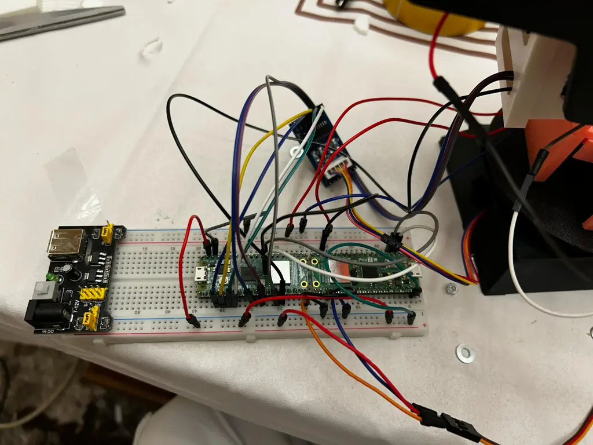
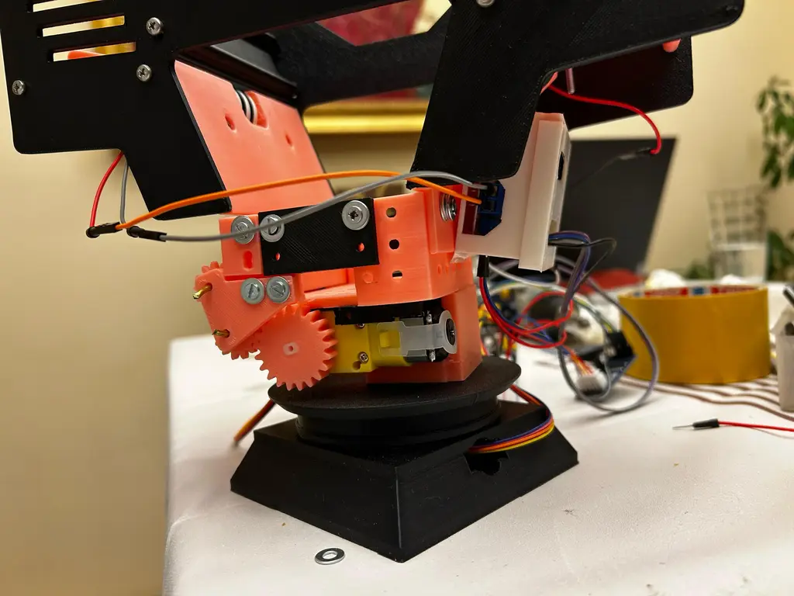

# Automatic Card Shuffler and Dealer

Automatic card shuffler and dealer for board games with WiFi control interface to select shuffling and distribution operations.

:::info

**Author**: Dragusin Matei Cosmin \
**GitHub Project Link**: [Repository](https://github.com/UPB-PMRust-Students/proiect-Matei-Dragusin)

:::

## Description

This project is an automatic card shuffler and dealer for board games controlled via WiFi web interface. The device consists of multiple motor systems:

1. **Shuffling System**: Two DC motors driving rubber rollers in alternating sequence to shuffle cards effectively (5 cycles per shuffle operation)
2. **Card Distribution System**: A DC motor that feeds cards combined with a MG90S servo motor for precise card delivery
3. **Rotatable Platform**: A 28BYJ-48 stepper motor with ULN2003 driver providing 180° rotations for dealing cards to different positions

Users interact with the device through a responsive web interface accessible via WiFi, allowing them to:

- Start automatic shuffling sequence
- Distribute individual cards
- Manually control each motor independently
- Control the stepper motor position with automatic home return functionality

## Motivation

The motivation behind this project is to create a fun and interactive device that can enhance the experience of playing card games. The automatic shuffler and dealer saves time and effort, allowing players to focus on enjoying the game rather than dealing with the tedious task of shuffling and dealing cards. The WiFi control adds modern convenience and allows multiple players to operate the device from their phones.

## Architecture

### System Overview

```mermaid
graph TD
   A[WiFi Web Interface] --> B[Raspberry Pi Pico 2W Controller]
   B --> C[DC Motor Control Task]
   B --> D[Servo/Stepper Control Task]
   B --> E[Network Server Task]

   A -->|"HTTP Requests<br>WiFi Network"| E
   E -->|"Command Flags<br>Atomic Operations"| C
   E -->|"Command Flags<br>Atomic Operations"| D
   
   C -->|"L298N Drivers<br>3x DC Motors"| F[Shuffling & Distribution]
   D -->|"PWM Control<br>ULN2003 Driver"| G[Servo & Stepper Motors]
   
   F -->|"Card Movement"| H[Physical Card Flow]
   G -->|"Positioning Control"| H
```

### Software Architecture

```mermaid
graph TD
   A[WiFi Web Interface] --> B[server_task]
   B --> C[Atomic Flags]
   C --> D[dc_motor_control_task]
   C --> E[servo_stepper_control_task]
   D --> F[3x DC Motors]
   E --> G[MG90S Servo]
   E --> H[28BYJ-48 Stepper]

   subgraph "Embassy Framework"
      I[Async Executor]
      J[Timer]
   end

   I -.-> B
   I -.-> D
   I -.-> E
   J -.-> D
   J -.-> E

   %% Styling
   classDef taskClass fill:#e1f5fe,stroke:#01579b,stroke-width:2px
   classDef hwClass fill:#f3e5f5,stroke:#4a148c,stroke-width:2px
   classDef stateClass fill:#e8f5e8,stroke:#2e7d32,stroke-width:2px

   class B,D,E taskClass
   class F,G,H hwClass
   class C stateClass
```

## Log

### Week 5 - 11 May

- Purchased all necessary components for the project
- Individually tested all motors to verify functionality
- Completed the 3D design of the device

### Week 12 - 18 May

- Assembled the 3D printed parts
- Attached the motors to the main structure
- Started software development, focusing on motor control
- Configured WiFi communication for the user interface

### Week 19 - 25 May

- Implemented complete WiFi web interface with responsive design
- Developed asynchronous motor control system using Embassy framework
- Added stepper motor position tracking and home return functionality
- Integrated servo motor control with precise timing for card distribution
- Optimized shuffling algorithm with alternating motor sequence
- Added comprehensive manual control for all motor systems

## Hardware

The automatic card shuffler uses a Raspberry Pi Pico 2W as the main controller, which connects to the local WiFi network and is controlled through a web interface. The mechanical system includes three DC motors driving rubber rollers for card movement, one MG90S servo motor for card delivery precision, and one 28BYJ-48 stepper motor for the rotating dealing platform, all powered through appropriate motor drivers.

| Breadboard | DC Motor View | Dealer View |
|:----------:|:-------------:|:-----------:|
|  |  |  |

| Full View | Side View |
|:---------:|:---------:|
|  |  |

### Schematics

### Bill of Materials

| Device | Usage | Price |
|--------|--------|-------|
| [Raspberry Pi Pico 2 W](https://www.raspberrypi.com/documentation/microcontrollers/raspberry-pi-pico.html) | The main microcontroller running embedded Rust software with WiFi connectivity | [35 RON](https://www.optimusdigital.ro/ro/placi-raspberry-pi/13327-raspberry-pi-pico-2-w.html) |
| [ULN2003 Stepper Motor Driver](https://www.optimusdigital.ro/ro/motoare-motoare-pas-cu-pas/101-driver-uln2003-motor-pas-cu-pas-de-5-v-.html) | Controls the 28BYJ-48 stepper motor for precise 180° rotations of the distribution platform | [17 RON](https://www.optimusdigital.ro/ro/motoare-motoare-pas-cu-pas/101-driver-uln2003-motor-pas-cu-pas-de-5-v-.html) |
| **28BYJ-48 Stepper Motor** | Provides precise positioning control for the rotating card distribution platform | [15 RON](https://www.optimusdigital.ro/ro/motoare-motoare-pas-cu-pas/102-motor-pas-cu-pas-de-5-v-28byj-48.html) |
| [GA12-N20 DC Motor with Gearbox](https://sigmanortec.ro/Motor-DC-Micro-Metal-6V-HPCB-Perii-Carbon-30-1-p200733572) | Drives the rubber rollers for card shuffling and distribution (3 units required) | [75 RON](https://sigmanortec.ro/Motor-DC-Micro-Metal-6V-HPCB-Perii-Carbon-30-1-p200733572) |
| [L298N Dual Motor Driver](https://www.optimusdigital.ro/ro/drivere-de-motoare-cu-perii/145-driver-de-motoare-dual-l298n.html) | Controls the DC motors for shuffling and distribution (2 units needed) | [40 RON](https://www.optimusdigital.ro/ro/drivere-de-motoare-cu-perii/145-driver-de-motoare-dual-l298n.html) |
| [Servomotor MG90S](https://www.optimusdigital.ro/ro/motoare-servomotoare/271-servomotor-mg90s.html) | Provides precise angular control (0°-180°) for card delivery mechanism | [25 RON](https://www.optimusdigital.ro/ro/motoare-servomotoare/271-servomotor-mg90s.html) |
| [Consumables](https://www.optimusdigital.ro) | 3D printing filament, screws, rubber rollers, and assembly materials | [50 RON](https://www.optimusdigital.ro) |

## Software

The software is built using the Embassy async framework for Rust embedded systems, providing real-time motor control and WiFi connectivity.

### Key Features

- **Asynchronous Task Architecture**: Three main tasks running concurrently
  - `dc_motor_control_task`: Handles all DC motor operations including shuffling sequences
  - `servo_stepper_control_task`: Manages servo and stepper motor precision control
  - `server_task`: Provides HTTP web server for WiFi control interface

- **Atomic State Management**: Thread-safe control using atomic flags for motor coordination
- **Responsive Web Interface**: Mobile-friendly HTML interface with real-time status updates
- **Position Tracking**: Stepper motor position tracking with automatic home return
- **Optimized Shuffling**: 5-cycle alternating motor sequence for effective card shuffling

### Libraries Used

| Library | Description | Usage |
|---------|-------------|-------|
| [embassy-executor](https://github.com/embassy-rs/embassy/tree/main/embassy-executor) | Async/await executor | Managing concurrent motor control and networking tasks |
| [embassy-time](https://github.com/embassy-rs/embassy/tree/main/embassy-time) | Timekeeping and delays | Precise timing for motor sequences and servo control |
| [embassy-rp](https://github.com/embassy-rs/embassy/tree/main/embassy-rp) | RP2350 HAL | Hardware abstraction for Raspberry Pi Pico 2W |
| [embassy-sync](https://github.com/embassy-rs/embassy/tree/main/embassy-sync) | Synchronization primitives | Thread-safe communication between tasks |
| [embassy-net](https://github.com/embassy-rs/embassy/tree/main/embassy-net) | Network stack | TCP/IP networking for web interface |
| [cyw43](https://github.com/embassy-rs/embassy/tree/main/cyw43) | WiFi Chip Driver | Driver for Pico W's onboard CYW43439 WiFi chip |
| [fixed](https://crates.io/crates/fixed) | Fixed-point numbers | Precise PWM duty cycle calculations for servo control |
| [defmt](https://github.com/knurling-rs/defmt) | Logging framework | Debug information and system monitoring |
| [defmt-rtt](https://crates.io/crates/defmt-rtt) | RTT debug channel | Real-time debugging via probe-rs |
| [static_cell](https://crates.io/crates/static_cell) | Static allocation | Memory management for network resources |
| [cortex-m-rt](https://crates.io/crates/cortex-m-rt) | Runtime support | ARM Cortex-M startup and exception handling |
| [panic-probe](https://crates.io/crates/panic-probe) | Panic handler | Development-time error reporting |

### Control Interface

The web interface provides comprehensive control over all system functions:

**Main Functions:**

- **START AMESTECARE**: Executes 5-cycle alternating shuffle sequence
- **IMPARTE CARTE**: Coordinated servo and DC motor card distribution

**Manual Controls:**

- Individual DC motor control (Left, Right, Distribution forward/backward)
- Servo positioning (0° and 180° positions)
- Stepper motor rotation (180° steps in both directions)
- Automatic home return for stepper motor

## Links

1. [Commercial Card Shuffler Reference](https://www.amazon.com/KPAW-Automatic-Shuffler-Dealer-Built/dp/B0DF7KXF87)
