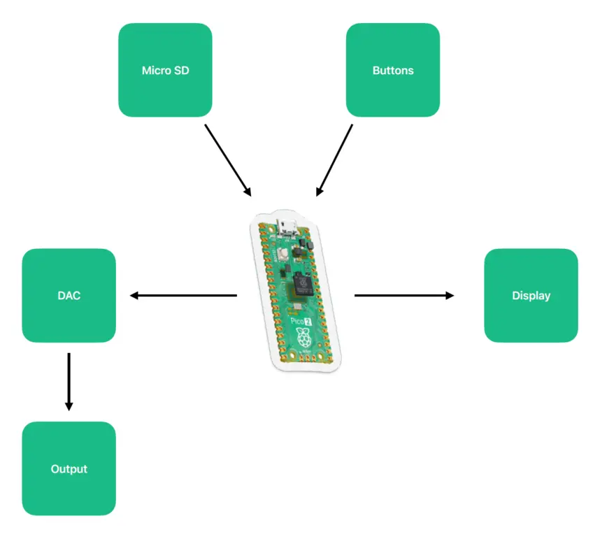
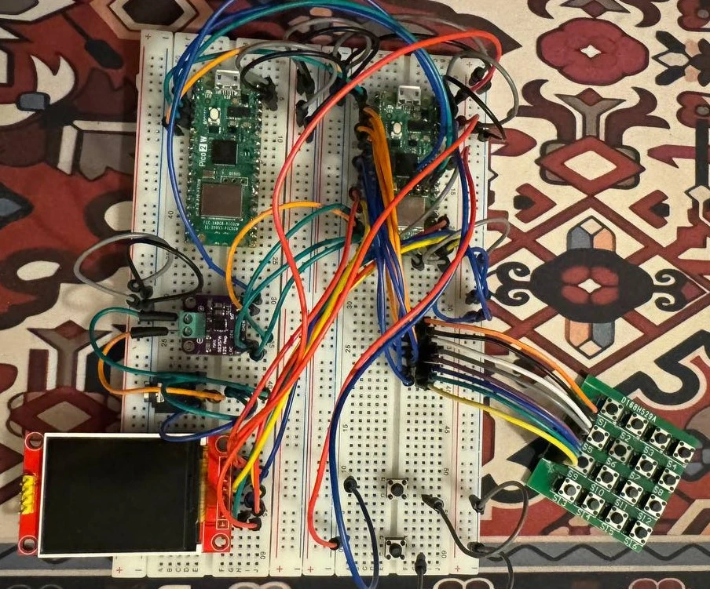
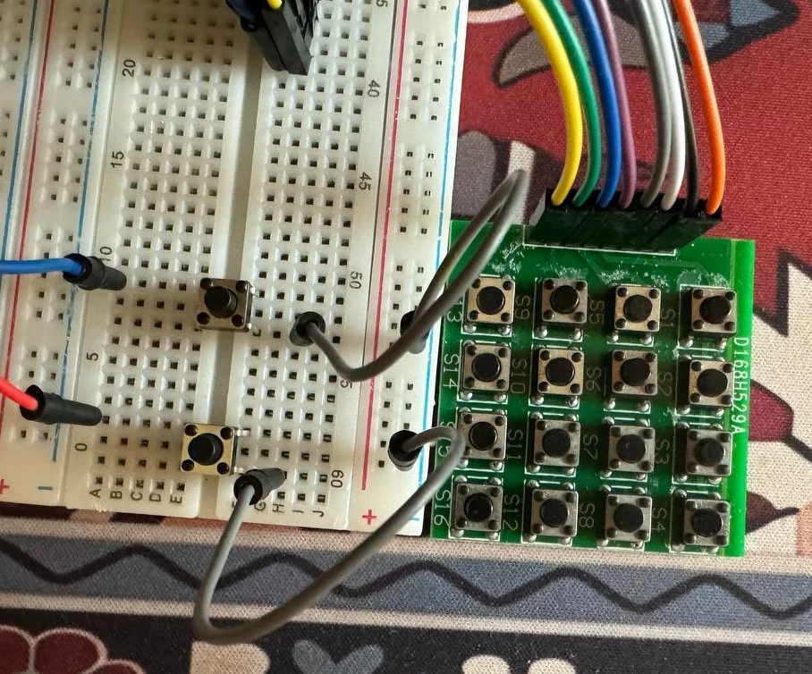
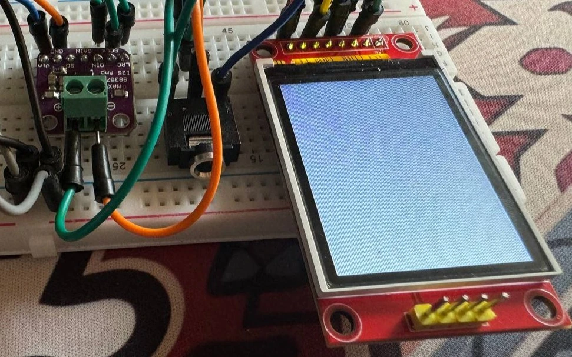

# CrateDigger
Dig. Chop. Loop. Repeat.

:::info

**Author**: Popa Nicolae \
**GitHub Project Link**: https://github.com/UPB-PMRust-Students/proiect-nicupopa

:::

## Description
CrateDigger is a portable sampler built around a Raspberry Pi Pico 2 and programmed using the Embassy framework in Rust. The device allows users to sample audio, playback predefined samples, and perform beat-making using a 16-step sequencer. It features a user interface with tactile buttons, a TFT screen with animations, and high-quality audio output via DAC and an integrated speaker. Ideal for music producers looking for a portable sampler/sequencer.

## Motivation
I have always been passionate about music and beat-making equipment. When the opportunity to pick this project came up, I knew it was the perfect opportunity to blend the two things I'm passionate about. 
My goal is to create a compact, DIY sampler and sequencer that allows musicians and hobbyists to experiment with sounds, create beats, and take their creativity anywhere.  
This project is not only a technical challenge but also a personal mission to create a fun tool that I might use in the future.

## Architecture

### Raspberry Pi Pico 2

**Role:** Central microcontroller, manages audio processing, input/output control, and overall device logic.

**Connections:**  
Display, Micro SD Card Module, DAC, Buttons, and Output components.

---

### Display (ST7735R)

**Interface:** SPI  

**Connections:**  
- SDA (Data Line) connected to Raspberry Pi Pico 2 SPI pins  
- SCL (Clock Line) connected to Raspberry Pi Pico 2 SPI pins

**Role:** Displays user interface, sequencing steps and device status.

---

### Buttons

**Interface:** GPIO

**Connections:**
- Connected to GPIO pins for controls (playback, recording, navigation, sequencing)

**Role:** Allows user input for sampling, playback, sequence control, and settings.

---

### Micro SD Card Module

**Interface:** SPI  

**Connections:**  
- SCK (Serial Clock) connected to Pico SPI pin  
- MOSI (Master Out Slave In) connected to Pico SPI pin  
- MISO (Master In Slave Out) connected to Pico SPI pin  
- CS (Chip Select) connected to Pico GPIO pin

**Role:** Stores audio samples, sequences, presets, and configuration data.

---

### DAC (MAX98357A)

**Interface:** I2S  

**Connections:**  
- Connected via I2S interface pins on the Raspberry Pi Pico 2

**Role:** Converts digital audio signals to high-quality analog audio for speaker output.

---

### Output (Speaker)

**Role:** Outputs audio signal from the DAC to provide sound playback.

---

## Log
- **Week 5 - 11 May**:  
  Began with a minimal setup: Pico and DAC, in order to verify the quality of the audio output.
  Next, I have connected the button matrix and mapped the buttons to sounds of different frequencies.
  By the end of the week I had a minimal implementation of the core functionality of the project.
- **Week 12 - 18 May**:  
  Finished setting up the hardware parts on a breadboard, as well as tampering with the screen.
  Made adjustments to the KiCad schematic in order to illustrate the complete hardware. 
- **Week 19 - 25 May**:  
  WIP...

## Hardware
- Raspberry Pi Pico 2 (RP2350): Main microcontroller handling audio processing and system logic.
- I2S DAC – MAX98357A: Converts digital audio signals to analog for high-quality speaker output.
- ST7735R display: Colored screen for animations.
- 3.5mm socket: Outputs audio playback. (Headphones not included!)
- Buttons: Input for interraction with the device.

Below I have provided an overview of the project on a breadboard:

User input close-up:

DAC, 3.5mm socket and screen close-up:

## Schematics
Made using KiCad, this schematic represents the electronic design for CrateDigger.
The MAX98357 DAC and the 3.5mm socket are placed on the left and next to them is the 4x4 button matrix used for
adding samples. The display is placed on the right, along with play/write buttons.

## Bill of Materials

| Device | Usage | Price |
|:------:|:-----:|:-----:|
| [2x Raspberry Pi Pico 2 W](https://www.optimusdigital.ro/en/raspberry-pi-boards/13327-raspberry-pi-pico-2-w.html?search_query=5056561803975&results=1) | The microcontroller | 80 RON |
| [ST7735R Display](https://www.optimusdigital.ro/en/lcds/1311-modul-lcd-spi-de-18-128x160.html?search_query=0104110000012661&results=1) | OLED visual interface | 29 RON |
| [MAX98357 I2S DAC](https://www.emag.ro/amplificator-audio-max98357-i2s-compatibil-cu-esp32-si-raspberry-pi-emg238/pd/DVYJWJYBM/?ref=history-shopping_418527241_221614_1) | Audio output module | 24 RON |
| [4 Ohm Speaker](https://www.emag.ro/difuzor-mini-arduino-3w-4-ohm-40mm-diametru-z001351/pd/DX2RLHYBM/?ref=history-shopping_418528639_187129_1) | Sound playback | 40 RON |
| Consumables (buttons,  wires, etc.) | Various components | 50 RON |

## Software

| Library | Description | Usage |
|:-------:|:-----------:|:-----:|
| [embassy](https://embassy.dev/) | Asynchronous embedded framework for Rust | Core framework for running async tasks on the Raspberry Pi Pico 2 |
| [embassy-rp](https://embassy.dev/) | Embassy HAL for RP2040 | Hardware abstraction layer for the Raspberry Pi Pico 2 |
| [embedded-hal](https://github.com/rust-embedded/embedded-hal) | Hardware Abstraction Layer (HAL) traits | Provides unified interfaces for hardware drivers |
| [embedded-graphics](https://github.com/embedded-graphics/embedded-graphics) | 2D graphics library | Used for drawing to the ST7735R display |
| [st7735-lcd](https://github.com/almindor/st7735-lcd) | Rust driver for ST7735 display | Controls the ST7735R display |
| [embassy_rp::pio_programs::i2s] | PIO-backed I²S output driver | Enables I²S audio output using the Programmable I/O system |

## Links
- [Making some noise with Raspberry Pi Pico](https://community.element14.com/challenges-projects/design-challenges/pi-fest/b/blog/posts/pi-fest---making-some-noise-with-raspberry-pi-pico-blog1)
- [Pico Sequencer](https://www.hackster.io/Arnov_Sharma_makes/pico-sequencer-173a5f)
- [RP2040 Drum Machine](https://hackaday.io/project/171112-twrtdm) 

