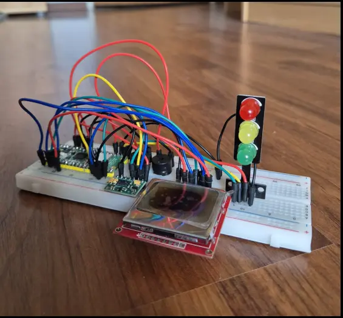
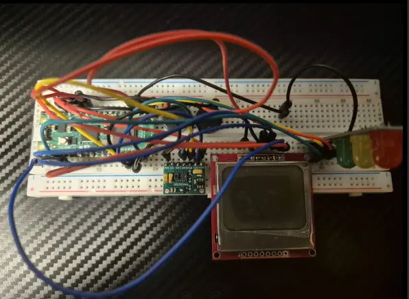

# Pulse Oximeter
Device for measuring pulse and SpO2 levels

:::info 

**Author**: Gavrila Paul-Alexandru \
**GitHub Project Link**: [https://github.com/UPB-PMRust-Students/proiect-paulgavrila0310](https://github.com/UPB-PMRust-Students/proiect-paulgavrila0310)

:::

## Description

Built using Rust and the Embassy-rs framework, this project provides a simple way to measure a person's blood oxygen saturation (SpO2) and heart rate (beats/min) and to check if the values are within healthy limits. The measured values will be displayed on an LCD screen. If the MAX30100 sensor detects low levels of blood oxygen or an abnormal heart rate, the user will be alerted by flashing LEDs and buzzer noise.

## Motivation

I wanted to build a device that measures and processes data that would also be useful to the average person on a day-to-day basis. Measuring your heart rate and SpO2 levels can help detect any possible heart or lung conditions, for which early diagnosis is essential in getting a positive outcome. Additionally, people who suffer from these kinds of health conditions can use a pulse oximeter to monitor any changes in the functioning of their heart or lungs.

## Architecture 


## Log

<!-- write your progress here every week -->

### Week 5 - 11 May

I bought the parts for the project and I soldered the pins for the microcontroller

### Week 12 - 18 May

I soldered the pins for the sensor and for the LCD screen, built the KiCad schematics and assembled the parts on the breadboard

### Week 19 - 25 May

## Hardware

- **Raspberry Pi Pico 2W**: microcontroller
- **MAX30100**: pulse oximetry and heart rate monitor sensor
- **PCD8544**: LCD display module
- **Li-Poly Battery 1Ah**: battery for powering the device
- **TP4056**: LiPo charger
- **Buzzers**: for emitting sound warnings
- **LEDs**: for emitting visual warnings
- **Breadboard 830 pct.**: base on which the project is assembled




### Schematics


### Bill of Materials

<!-- Fill out this table with all the hardware components that you might need.

The format is 
```
| [Device](link://to/device) | This is used ... | [price](link://to/store) |

```

-->

| Device                 | Usage                        | Price   |
|------------------------|------------------------------|---------|
| [Raspberry Pi Pico 2W](https://www.raspberrypi.com/documentation/microcontrollers/pico-series.html)   | microcontroller              | [40 RON](https://www.optimusdigital.ro/en/raspberry-pi-boards/13327-raspberry-pi-pico-2-w.html)  |
| [MAX30100](https://www.analog.com/en/products/max30100.html)               | pulse oximetry sensor        | [25 RON](https://www.optimusdigital.ro/en/others/2166-green-max30100-heart-rate-sensor-module.html)  |
| [PCD8544](https://esp32-pcd8544.readthedocs.io/en/latest/get-started/)                | LCD display                  | [22 RON](https://www.optimusdigital.ro/ro/optoelectronice-lcd-uri/1944-modul-lcd-cu-controller-pcd8544-rou-lcd-compatibil-cu-5110.html)  |
| Li-Poly Battery        | battery                      | [33 RON](https://www.emag.ro/baterie-li-poly-400mah-3-7v-liter-energy-battery-model-902025-418/pd/DPWPRVYBM/)  |
| [TP4056](https://radioremont.com/wa-data/public/shop/products/19/42/4219/attachments/TP4056.pdf)                 | Li-Po Charger                | [6 RON](https://www.optimusdigital.ro/en/chargers/7534-incarcator-tp4056-cu-micro-usb-pt-baterie-lipo-1a-cu-protectie-pentru-circuite.html)   |
| Breadboard 830 pct.    | breadboard                   | [10 RON](https://www.optimusdigital.ro/en/breadboards/8-breadboard-hq-830-points.html)  |
| Various Consumables    | buzzers, LEDs, wires, resistors | 35 RON  |

## Software

| Library               | Description                                           | Usage                                                                 |
|-----------------------|-------------------------------------------------------|-----------------------------------------------------------------------|
| [embassy](https://embassy.dev/)               | Asynchronous embedded framework for Rust              | Core async runtime; handles tasks, timers, and async hardware support |
| [embassy-rp](https://docs.embassy.dev/embassy-rp/git/rp2040/index.html)            | Embassy HAL for Raspberry Pi RP2040 chips             | Provides async support for Raspberry Pi Pico 2W                       |
| [embassy-hal](https://docs.embassy.dev/embassy-embedded-hal/git/default/index.html)           | Hardware abstraction layer for Embassy                | Interface layer for embedded peripherals in Embassy projects          |
| [max3010x](https://docs.rs/max3010x/latest/max3010x/)              | Rust driver for MAX30100 pulse oximeter               | Interfaces with MAX30100 over I2C to read SpO2 and heart rate data    |
| [pcd8544](https://crates.io/crates/pcd8544)               | Rust driver for Nokia 5110 (PCD8544) LCD display      | Controls the PCD8544 LCD via SPI using embedded-hal traits            |

## Links

<!-- Add a few links that inspired you and that you think you will use for your project -->

1. [HealthLine - Pulse Oximetry: uses, readings and how it works](https://www.healthline.com/health/pulse-oximetry)
2. [Lab 03 - PWM & ADC](https://pmrust.pages.upb.ro/docs/acs_cc/lab/03)
3. [Lab 04 - Asynchronous Development](https://pmrust.pages.upb.ro/docs/acs_cc/lab/04)
4. [Lab 05 - SPI](https://pmrust.pages.upb.ro/docs/acs_cc/lab/05)
5. [Lab 06 - I2C](https://pmrust.pages.upb.ro/docs/acs_cc/lab/06)
