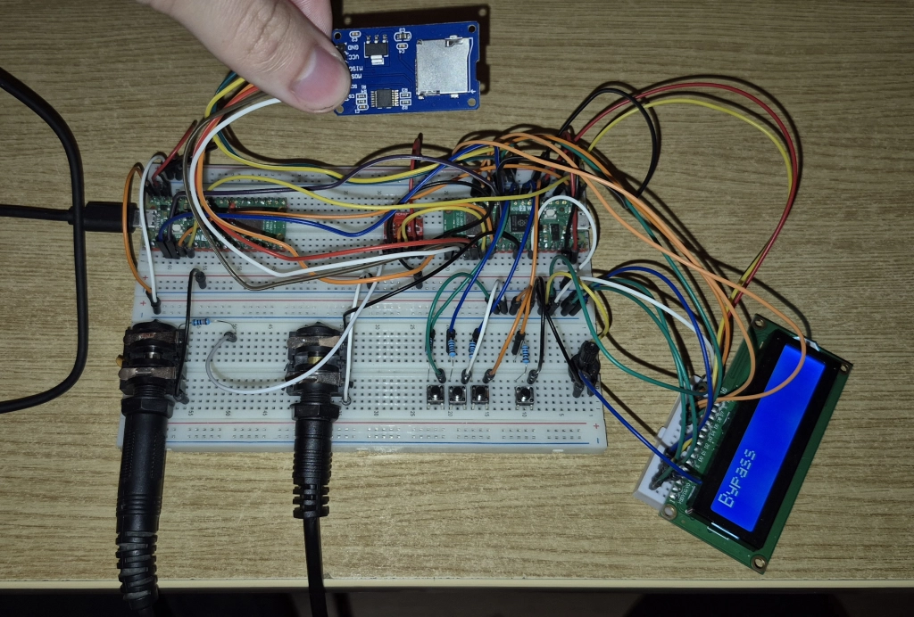
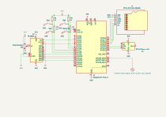

# Rusty Musician
Sound processor for electric musical instruments

:::info 

**Author**: Petru-Cristian NANIA \
**GitHub Project Link**: [repository](https://github.com/UPB-PMRust-Students/proiect-PetruCristian)

:::

## Description

The device can be connected between an electric musical instrument and an amplifier. \
It can apply sound effects to the signal generated by the instrument. \
It can also function as a looping station (it records sequences of sound and plays them back repeatedly).

## Motivation

I have a passion for music and I've always wanted such a device. \
I think it's more fun to make it myself than to buy one. \
I also don't always have and entire musical band with me when I want to entertain my friends and a looping station would be awesome.

## Architecture 

## Log

### Week 5 - 11 May

I connected all the debug wires and managed to run the lab skeleton code on my Pico, printing "Hello, World!" to the debug console.

I did not stop there! I had a first test where I connected the 6.3mm jack sockets and the DAC to the breadboard and wrote some simple code to test if the audio signal from my electric guitar can be easily read by the Pico's ADC, copied to the DAC's register, and sent to the amplifier.
It actually worked -- The 12-bit resolution of both the on-board ADC and the external DAC is not great, but the sound quite clearly has the timbre of an electric guitar!

Here is the first recording I made that night:

<iframe width="356" height="634" src="https://www.youtube.com/embed/50Oz55luKHc" title="guitar pedal - first test" frameborder="0" allow="accelerometer; autoplay; clipboard-write; encrypted-media; gyroscope; picture-in-picture; web-share" referrerpolicy="strict-origin-when-cross-origin" allowfullscreen></iframe>

I've experimented with passive filters and noticed that there is some strange noise that I can't get rid of.
I suspect it's a problem with my amplifier.
I've even tried filtering out all the frequencies above 5Hz and that just meant the guitar couldn't be heard anymore, but the background noise was still there.

### Week 12 - 18 May

Quite hard to focus on the project this week.
The weather has been so nice lately that I wanted to spend time outside as much as possible (and even learn rollerblading).
The anxiety about the presidential election on Sunday and the recent breakup I'm still going though have also impeded my progress.

Nevertheless, I was able to connect all the other pieces from the schematic.
They even work, but I still need to write some proper code for them next week.

More details in the "hardware" section below (with images).

Also here is an updated recording of the hardware working:

<iframe width="1024" height="377" src="https://www.youtube.com/embed/XjrNJ9nL63E" title="guitar pedal - hardware done" frameborder="0" allow="accelerometer; autoplay; clipboard-write; encrypted-media; gyroscope; picture-in-picture; web-share" referrerpolicy="strict-origin-when-cross-origin" allowfullscreen></iframe>

As you can see, I was watching the vote count live :)

### Week 19 - 25 May

I've had problems with the original crate I had chosen ([lcd1602-rs](https://crates.io/crates/lcd1602-rs)), which was quite old and incompatible with my project. I was able to find a new one ([ag-lcd](https://crates.io/crates/ag-lcd)) which was compatible.

The LCD still did not work, but no errors were showing up.
Turns out I had problems with the wiring of the potentiometer used for the screen contrast.
Now the screen works.

I've added a new task called `menu_task` in the executor which handles button presses and changes the effect added to the audio.

I've also been researching and implementing a couple of commonly used audio effects.

Hope I'll finish by the deadline... I'm greatful it's been extended by a day!

## Hardware

### Overview

For videos of the project, look at the logs above.

An electric guitar pickup is just a coil with magnets (the magnetized strings) vibrating around it.
These vibrations induce in the coil an electrical current which is normally conducted though an audio cable to an amplifier.

In my project, the aim is to take that current, send it to Rusty Musician device, and do funky stuff with it before sending it to the amplifier.

First of all, the input is be preprocessed with a passive low-pass filter that has a threshold as high as the highest note on the guitar.
This ensures the signal is as clean as possible before sending it to the ADC on the Raspberry Pi Pico 2 and processing it using software written in Rust for the RP2350 MCU.

Multiple buttons (with pull-up resistors) are used to select options from the menu (cycle between live effects or select the loop station function).
The options are shown on an LCD screen.

For certain effects and for looping, storage space is needed.
This is achieved by using an external microSD module.

The processed signal is sent to an external DAC module, filtered again, and ultimately sent to the amplifier.

Here are the components from the image:
- the two Picos are the green rectangles (left for debug, right for project)
- the DAC is the red square in the middle of the image
- the microSD is in my hand, at the top of the image
- the audio jack sockets with cables plugged in can be seen on the left side
- the buttons for menu selection in the bottom-right corner
- the potentiometer is to the right of the buttons
- the 1602A LCD is on a separate breadboard, glowing a bright blue shade

### Detailed look

The challenge of designing the hardware comes from the multitude of communication methods with the components:
- the DAC uses the I2C protocol
- the microSD card adapter uses the SPI protocol
- the audio signal si an analog one and must use the on-board ADC
- the 1602A LCD requires a specialized driver to send the information directly to the data lines

### Schematics

### Bill of Materials

| Device | Usage | Price |
|--------|--------|-------|
| [Raspberry Pi Pico 2W](https://datasheets.raspberrypi.com/rp2350/rp2350-datasheet.pdf) | The microcontroller | [39.66 RON](https://www.optimusdigital.ro/ro/placi-raspberry-pi/13327-raspberry-pi-pico-2-w.html) |
| [A second Raspberry Pi Pico 2W](https://datasheets.raspberrypi.com/rp2350/rp2350-datasheet.pdf) | The debugger | [39.66 RON](https://www.optimusdigital.ro/ro/placi-raspberry-pi/13327-raspberry-pi-pico-2-w.html) |
| [MCP4725 with I2C interface](https://ww1.microchip.com/downloads/aemDocuments/documents/MSLD/ProductDocuments/DataSheets/MCP4725-Data-Sheet-20002039E.pdf) | DAC module for generating the output signal | [24.99 RON](https://www.optimusdigital.ro/ro/altele/1327-modul-dac-mcp4725-cu-interfaa-i2c.html) |
| LCD 1602A | For the effects menu | [9.82 RON](https://www.optimusdigital.ro/ro/optoelectronice-lcd-uri/867-modul-lcd-1602-cu-backlight-galben-verde-de-5v.html) |
| Three pin headers - 2.54mm with 40 pins | For the two dev boards and the LCD | 3 × [0.99 RON](https://www.optimusdigital.ro/ro/componente-electronice-headere-de-pini/464-header-de-pini-rosu-254-mm-40p.html) |
| At least two MF1401 6.3mm jack sockets | Connecting the instrument and the amplifier tot the Rusty Musician device | 2 × [2.00 RON](https://electroniclight.ro/mf1401-jack-mama-63mm-mono/2907.html) |
| Audio cable | An extra one is needed to connect the Rusty Musician device and the amp | [29.00 RON](https://electroniclight.ro/cablu-jack-63mm-mono--63mm-mono-3m/4650.htm) |
| Buttons | To select options from the menu | 4 × [0.36 RON](https://www.optimusdigital.ro/ro/senzori-senzori-de-atingere/742-modul-joystick-ps2-biaxial-negru-cu-5-pini.html) |
| Potentiometer | Change LCD contrast | [1.49 RON](https://www.optimusdigital.ro/ro/componente-electronice-potentiometre/1885-potentiometru-mono-50k.html) |
| Breadboard + Jump wires + Stabilized power source | Mounting, connecting and powering everything | [22.00 RON](https://www.optimusdigital.ro/ro/kituri/2222-kit-breadboard-hq-830-p.html) |
| Breadboard | For development, an extra one is needed since the project is quite large | [16.50 RON](https://electroniclight.ro/placa-breadboard-165x55mm/8244.htm) |
| Breadboard 33mm x 46mm | For mounting the 1602A LCD separately | [14.00 RON](https://electroniclight.ro/wbp-317-placa-universala-prototip-breadboard-33mm-x-46mm/11615.htm) |
| Micro USB cable | Powering the dev board and uploading the code | [3.99 RON](https://www.optimusdigital.ro/ro/cabluri-cabluri-usb/11939-cablu-negru-micro-usb-1-m.html) |
| [MicroSD card module with SPI interface](https://sigmanortec.ro/Modul-MicroSD-p126079625?SubmitCurrency=1&id_currency=2&gad_source=1&gbraid=0AAAAAC3W72O583Lr5l62Wu-ikqzQMfuL2&gclid=Cj0KCQjw2tHABhCiARIsANZzDWrlsAY6TVOV6OsCqmh9uFbf-u8zYH7SExosl4_2Qs3X1Pkyj0U9nsAaAhsEEALw_wcB) | Loop recording and playback | [4.39 RON](https://www.optimusdigital.ro/ro/memorii/1516-modul-slot-card-microsd.html?search_query=card+SD&results=191) |
| Soundking AL 103 Footswitch | Starting and stopping loop recording/playback | [11.90 RON](https://www.muziker.ro/soundking-al-103?gad_source=1&gbraid=0AAAAADdcsprwsrtO0GaPnRNnnX49fcVSd&gclid=Cj0KCQjw_JzABhC2ARIsAPe3yno-_9jVy8plRFpghh77IrSKaBIFcNDLurl8_neTuTrRFzz4REu6CQcaApXwEALw_wcB) |
| Total | - | 225.81 RON |

## Software

### Software diagram

### Crates used in the project

| Library | Description | Usage |
|---------|-------------|-------|
| [embassy-rp](https://embassy.dev/) | Rust + async ❤️ embedded | Next-generation framework for embedded applications |
| [cortex-m-rt](https://crates.io/crates/cortex-m-rt) | Startup code and minimal runtime for Cortex-M microcontrollers | Pretty much everything else needs this |
| [ag-lcd](https://crates.io/crates/ag-lcd) | Driver for 1602 LCD which uses embedded-hal | Show menu on LCD screen |
| [embedded-sdmmc](https://crates.io/crates/embedded-sdmmc) | Read/write files on a FAT formatted SD card | Storing samples of the signal on SD card for looping |

## Links

<!-- Add a few links that inspired you and that you think you will use for your project -->

1. [Inspiration: Ed Sheeran](https://www.youtube.com/watch?v=HFvPftwNcSY)
2. [1602A LCD connected to Pico](https://www.youtube.com/watch?v=Xq0bt-0kbBk)
3. [Looper for Linux written in Rust](https://github.com/mwylde/loopers)
4. [PWM & ADC lab](https://pmrust.pages.upb.ro/docs/acs_cc/lab/03)
5. [SPI lab](https://pmrust.pages.upb.ro/docs/acs_cc/lab/05)
6. [I2C lab](https://pmrust.pages.upb.ro/docs/acs_cc/lab/06)
