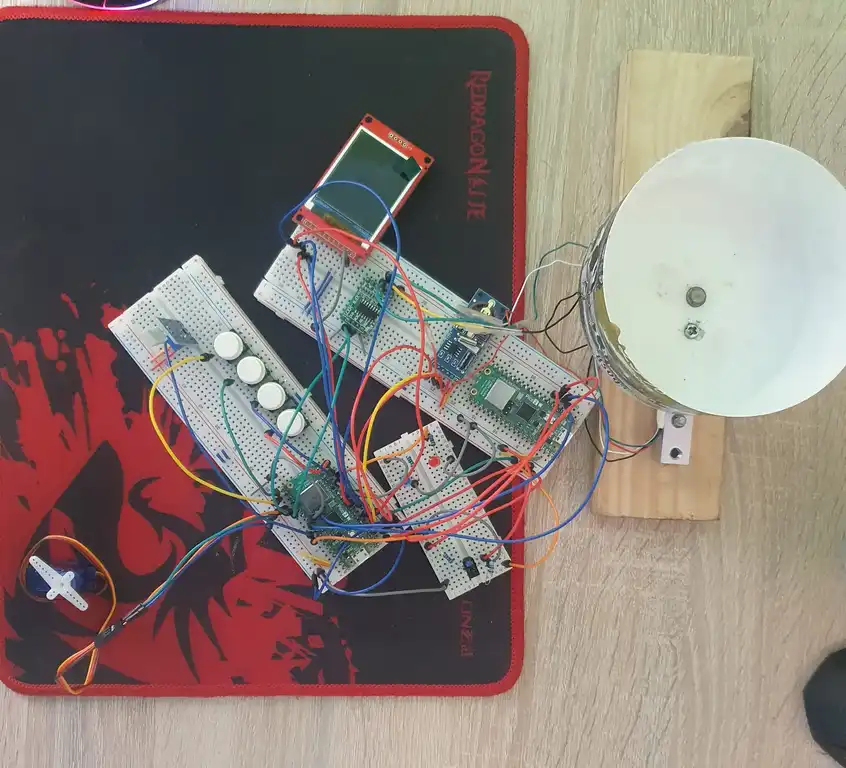
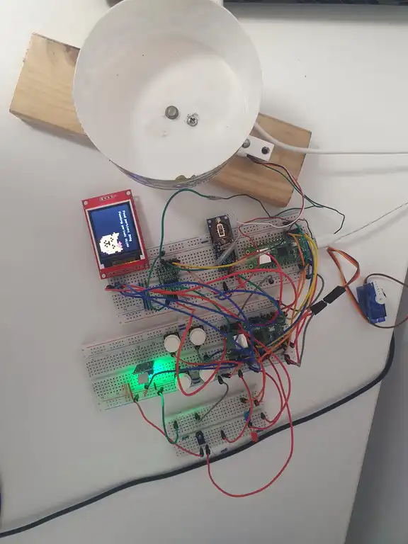
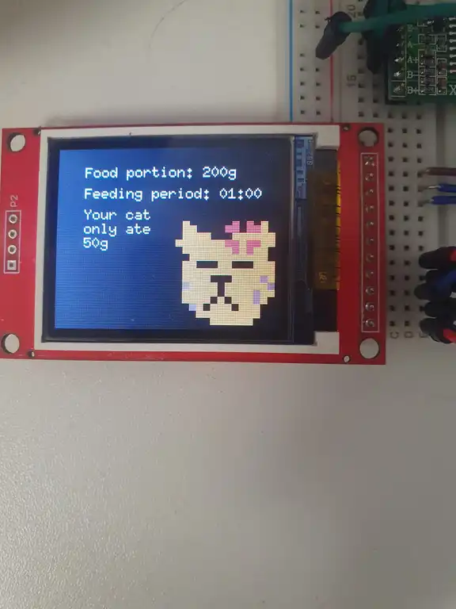

# Cat Feeder
An automatic cat food dispenser with humidity sensors and smart display.

:::info 

**Author**: Clinci Rareș-Mihail \
**GitHub Project Link**: [Link Github](https://github.com/UPB-PMRust-Students/proiect-RaresClinci)

:::

## Description

The project is an automatic cat feeder, capable of dispensing food portions according to a preset schedule. The user can set the feeding interval and the amount of food the pet should receive. Sensors will detect whether the cat has eaten, the amount of food available (and alert when it's empty), and the weight of the tray (to account for the food already present before dispensing more). Red LEDs will indicate when the food compartment is empty or if the humidity level is too high. An electronically controlled mechanism will handle food distribution. The system will also include a display showing information such as when the cat last ate, how much food it receives, and at what intervals.

## Motivation

Being a cat owner and having spoken with friends who own such devices, it was easy for me to identify the most important functionalities for a user, which helped me design and pitch the project.

## Architecture 

### Components
  
| Components | Purpose |
|--------|--------|
| Dispensing mechanism | Dispenses the food into the cat bowl |
| Weighing scale | Measures the amount of food in the bowl |
| Info display | Displays info from the sensors |
| User input | Lets user change the food quantity and dispensing intervals |
| Food level sensor | Measures whether the container has any food |
| Humidity measurer | Measures the humidity of the container |
| Clock | Measures time |

### Interconnection
- The Food Level Sensor and Clock determine when the dispensing mechanism gets fired
- The User Input and Weighing Scale determine for how long the Dispensing Mechanism stays fired
- Info Display receives info about:
  - the amount of food the cat has eaten from the Weighing Scale
  - whether the food container is empty from the Food Level Sensor
  - the humidity level in the food container from the Humidity Measurer
  - the variables set by the user from User Input

### Diagram
```mermaid
graph TD
    %% Components
    FL(Food Level Sensor)
    CLK(Clock)
    UI(User Input)
    WS(Weighing Scale)
    DISP(Dispensing Mechanism)
    DISPLAY(Info Display)
    HUM(Humidity Measurer)

    %% Connections to Dispensing Mechanism
    FL --> DISP
    CLK --> DISP
    UI -->DISP
    WS -->DISP

    %% Info to Display
    WS --> DISPLAY
    FL --> DISPLAY
    HUM --> DISPLAY
    UI --> DISPLAY

```


## Log

<!-- write your progress here every week -->

### Week 5 - 11 May
- obtained all components

### Week 12 - 18 May
- glued the headers of all the componets
- built the set up for the Load Cell
- designed the hardware for the project in KiCad
- designed the hardware on the board

### Week 19 - 25 May
- added screen module
- added humidity module: connected the HR202 module and LED through code
- set up the user input thorugh the buttons
- added the food level module: though the distance sensor
- tried several crates for HX711 module: hx711, hx711_spi, loadcell
- set up the food dispensing module: through the servo
- added the clock module: by setting up the spi RTC using interrupts
- created the general flow of the mechanism
- created a README


## Hardware


Hardware used:
- Raspberry Pi Pico 2W
- Micro Servomotor
- Real Time Clock PCF8563
- LCD Screen SPI 128x160 ST7735S
- Load Cell 2kg
- HX711 ADC
- Photoelectric Sensor TCRT5000
- Humidity Sensor HR202 
- 2 Red LEDs
- 4 buttons
- breadboard and wires







### Schematics

<!-- TODO: Place your KiCAD schematics here. -->


### Bill of Materials

<!-- Fill out this table with all the hardware components that you might need.

The format is 
```
| [Device](link://to/device) | This is used ... | [price](link://to/store) |

```

-->

| Device | Usage | Quantity | Price |
|--------|--------|-------| -------|
| [Raspberry Pi Pico 2W](https://www.raspberrypi.com/documentation/microcontrollers/raspberry-pi-pico.html) | The microcontroller | 1 | [39.66 RON](https://www.optimusdigital.ro/ro/placi-raspberry-pi/13327-raspberry-pi-pico-2-w.html?search_query=pico+2w&results=33) |
| [Raspberry Pi Pico 2W](https://www.raspberrypi.com/documentation/microcontrollers/raspberry-pi-pico.html) | The debugger | 1 | [39.66 RON](https://www.optimusdigital.ro/ro/placi-raspberry-pi/13327-raspberry-pi-pico-2-w.html?search_query=pico+2w&results=33) |
| Micro Servomotor | Dispensing food | 1 | [13.99 RON](https://www.optimusdigital.ro/ro/motoare-servomotoare/26-micro-servomotor-sg90.html) |
| Real Time Clock | Measuring time intervals | 1 | [5.77 RON](https://www.optimusdigital.ro/ro/altele/12286-modul-ceas-in-timp-real-rtc-pcf8563.html?search_query=rtc&results=149) |
| LCD Screen | Displaying info | 1 | [43.58 RON](https://ardushop.ro/ro/electronica/2124-modul-lcd-spi-128x160-6427854032546.html) |
| Load Cell | Measuring the food's weight | 1 | [23.99 RON](https://www.emag.ro/celula-de-sarcina-pentru-masurarea-greutatilor-elektroweb-5-12-v-np-071/pd/D3LR35MBM/) |
| HX711 Module | Sending load cell info to the board | 1 | [13.39 RON](https://www.emag.ro/modul-de-cantarire-hx711-elektroweb-24-biti-2-6-5-5-v-2-a-015/pd/D3RC35MBM/?ref=graph_profiled_similar_fallback_1_1&provider=rec&recid=rec_49_8d6e082ea6b74ffb10e7a843ba7ffb11555222752e69c036611a4fd4b113d7b3_1746196248&scenario_ID=49) |
| Photoelectric Sensor | Detecting if the food container is empty | 1 | [1.49 RON](https://www.optimusdigital.ro/ro/senzori-senzori-optici/42-senzor-fotoelectric-reflectiv-tcrt5000.html?search_query=senzor+infrarosu&results=116) |
| Humidity Sensor | Detecting the humidity in the food container | 1 | [9.99 RON](https://www.optimusdigital.ro/ro/senzori-senzori-de-umiditate/2492-modul-senzor-de-umiditate-hr202.html?search_query=umiditate&results=165) |
| Red LEDs | Displaying info | 2 | [0.39 RON](https://www.optimusdigital.ro/ro/optoelectronice-led-uri/696-led-rou-de-3-mm-cu-lentile-difuze.html) |
| Buttons | Setting dispensing period and food quantity | 4 | [1.99 RON](https://www.optimusdigital.ro/ro/butoane-i-comutatoare/1115-buton-cu-capac-rotund-alb.html) |
| Breadboard | Connecting components | 2 | 9.89 RON |
| Wires | Connecting components | 1 | [7.99 RON](https://www.optimusdigital.ro/ro/fire-fire-mufate/12-set-de-cabluri-pentru-breadboard.html?search_query=Set+Fire+pentru+Breadboard&results=37) |
| Rigid Wires | Connecting components | 1 | [12.49 RON](https://www.optimusdigital.ro/ro/fire-fire-nemufate/899-set-de-fire-pentru-breadboard-rigide.html?search_query=%09Set+de+fire+Rigide+pentru+Breadboard&results=1) |
| Male Header | Connecting microcontroller | 3 | [0.99 RON](https://www.optimusdigital.ro/ro/componente-electronice-headere-de-pini/1268-header-de-pini-verde-254-mm-40p.html?search_query=Header+de+pini+verde+2.54+mm+%2840p%29&results=1) |
| Female Header | Connecting microcontroller | 2 | [2.56 RON](https://www.optimusdigital.ro/ro/componente-electronice-headere-de-pini/1285-header-de-pini-mama-40p-254-mm-separabil.html?search_query=%09Header+de+Pini+Mama+40p+2.54+mm+Separabil&results=1) |


## Software

| Library | Description | Usage |
|--------|-------------|-------|
| [embassy](https://github.com/embassy-rs/embassy) | Async embedded framework | Core runtime for async tasks and peripherals |
| [embassy-rp](https://github.com/embassy-rs/embassy) | HAL for Raspberry Pi Pico (RP2040) | Controls GPIOs, SPI, I2S, etc. |
| [embedded-graphics](https://github.com/embedded-graphics/embedded-graphics) | 2D graphics library | Used for drawing text and shapes on LCD |
| [display-interface-spi](https://github.com/almindor/display-interface) | SPI display abstraction | Connects the embedded-graphics to SPI-based displays |
| [embedded-hal](https://github.com/rust-embedded/embedded-hal) | Traits for embedded devices | Base for SPI, I2C, ADC, GPIO, etc. |
| [defmt](https://github.com/knurling-rs/defmt) | Logging crate for embedded | For debugging and structured logs |
| [loadcell](http://github.com/DaneSlattery/hx711) | Load Cell Library | Reading the data from the load cell |

## Links

<!-- Add a few links that inspired you and that you think you will use for your project -->
[LoadCell](https://crates.io/crates/loadcell)
[Pixel art site](https://www.pixilart.com/draw#)

