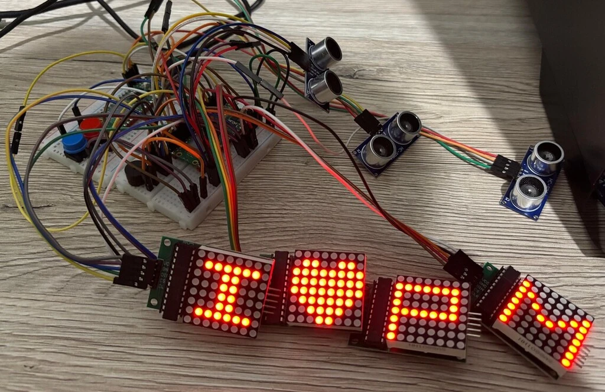

# Tic-Tac-Toe Contactless Game

This project brings the timeless fun of Tic-Tac-Toe to life with a touchless, futuristic twist, letting you play the classic game using your bare hands.

:::info 

**Author**: Visan Rares-Stefan \
**GitHub Project Link**: https://github.com/UPB-PMRust-Students/proiect-raresvizan.git

:::

## Description

This project implements a physical Tic-Tac-Toe (X and O) game using a 16x16 LED matrix display driven by a Raspberry Pi Pico 2W. Players interact with the game using ultrasonic distance sensors, pointing with their hands to select grid positions. A passive buzzer provides audio feedback, and two physical buttons are used for confirming moves and resetting the game.

## Motivation

The motivation behind this project is:
- To explore human–machine interaction through non-traditional interfaces.
- To create interactive and fun embedded system for the boring old game of Tic-Tac-Toe played by everyone during classes.
- To try an unique way of choosing the desired cell. No basic buttons, no Playstation type joysticks from 2003...DISTANCE SENSORS & BARE HANDS.

## 3. Architecture

The system has the following layers:
- **Input Layer**:
  - 3x Ultrasonic distance sensors (for selecting grid positions using finger)
  - 2x Push-buttons (confirm, reset, etc.)
- **Processing Layer**:
  - Raspberry Pi Pico 2W
  - Game logic engine written in Rust
- **Output Layer**:
  - 4x MAX7219-controlled 8x8 LED matrices
  - 1x Passive buzzer for sound feedback

Communication is done using:

| Component           | Interface | Connection Notes                |
|---------------------|-----------|---------------------------------|
| LED Matrix (4x)     | SPI       | DIN, CLK, CS to SPI bus         |
| Ultrasonic Sensors  | GPIO      | Each sensor uses TRIG + ECHO    |
| Buzzer              | PWM       | Simple digital on/off control   |
| Push Buttons        | GPIO      | Connected to GPIO with pull-ups |

### Diagram

## Log

### Week 5 - 11 May

Documentation milestone, materials purchase, preparing materials for installation and testing the components.

### Week 12 - 18 May

Assembled all the materials and wired everything up. Wrote test software for each component to check good installation. Created the schematics in KiCad mirroring the phisical connections. Completed the Hardware Milestone.

### Week 19 - 25 May

This week, I completed the source code for the project and finalized all necessary features. I built a custom box from cardboard to house the components securely and hide the wiring. Additionally, I wrote the README file and prepared the full software documentation. With these steps, I have successfully completed the Software Milestone.

## Hardware

The Raspberry Pi Pico 2W is the central microcontroller for the Contactless Tic-Tac-Toe Game. 

It reads input from three HC-SR04P ultrasonic sensors to detect hand proximity, allowing players to choose the row and column of the cell without touching anything. 

The 4 x MAX7219 8x8 LED Matrix modules are separately connected to the microcontroller. All four matrices share the same DIN and CLK lines (SPI bus). Each matrix has its own Chip Select (CS) line, allowing the Raspberry Pi Pico to control them independently via SPI. 

All the hardware components are mounted on a cardboard base, with the LED matrices arranged to form a 16x16 grid. The sensors are positioned on the sides of the matrices to detect hand movements, and the buttons are easily accessible for player interaction. All wires are are hidden under the cardboard to create a clean and user-friendly interface.

Two tactile push buttons are used to confirm actions and reset the game. 

A passive buzzer generates sound effects, enhancing user feedback and engagement.

[VIDEO: Testing the Components](https://imgur.com/urttDcY)

### Schematics

### Bill of Materials

| Device | Usage | Price |
|--------|--------|-------|
| [Raspberry Pi Pico 2W](https://www.optimusdigital.ro/en/raspberry-pi-boards/13327-raspberry-pi-pico-2-w.html) | The microcontroller | [2 x 40 RON](https://www.optimusdigital.ro/en/raspberry-pi-boards/13327-raspberry-pi-pico-2-w.html) |
| [MAX7219 LED Matrix](https://www.optimusdigital.ro/en/led-matrices/118-max7219-led-dot-matrix-module.html) | Displaying the game (Output Device) | [4 x 17.5 RON](https://www.optimusdigital.ro/en/led-matrices/118-max7219-led-dot-matrix-module.html) |
| [HC-SR04P Ultrasonic](https://www.optimusdigital.ro/en/distance-sensors/8150-hc-sr04p-ultrasonic-distance-sensor-3-55-v.html) | Selecting the cell by hand (Input Device) | [3 x 7 RON](https://www.optimusdigital.ro/en/distance-sensors/8150-hc-sr04p-ultrasonic-distance-sensor-3-55-v.html) |
| [Passive Buzzer](https://www.optimusdigital.ro/en/buzzers/12247-3-v-or-33v-passive-buzzer.html) | Selecting the cell by hand (Input Device) | [1 RON](https://www.optimusdigital.ro/en/buzzers/12247-3-v-or-33v-passive-buzzer.html) |
| [Push Button](https://www.optimusdigital.ro/en/buttons-and-switches/1114-red-button-with-round-cover.html) | Confirm move / Reset Game | [2 x 2 RON](https://www.optimusdigital.ro/en/buttons-and-switches/1114-red-button-with-round-cover.html) |
| [Breadboard](https://www.optimusdigital.ro/en/breadboards/44-400p-hq-breadboard.html) | Testing the connections | [2 x 5 RON](https://www.optimusdigital.ro/en/breadboards/44-400p-hq-breadboard.html) |
| [Jumper wires](https://www.optimusdigital.ro/en/wires-with-connectors/885-wires-male-male-10p-10cm.html) | Connecting the components | [5 x 3 RON](https://www.optimusdigital.ro/en/wires-with-connectors/885-wires-male-male-10p-10cm.html) |
| **Total**             |          | **200 RON**     |

## Software

| Library                                                         | Description                                     | Usage                                                                      |
| --------------------------------------------------------------- | ----------------------------------------------- | -------------------------------------------------------------------------- |
| [`embassy`](https://github.com/embassy-rs/embassy)              | Async framework for embedded Rust               | Manages async tasks for input polling, game logic, and display updates     |
| [`embassy-rp`](https://github.com/embassy-rs/embassy)           | Embassy RP2040 HAL                              | Provides GPIO, SPI, PWM, and peripheral drivers for the Raspberry Pi Pico  |
| [`embedded-hal`](https://github.com/rust-embedded/embedded-hal) | Hardware Abstraction Layer for embedded systems | Abstracts SPI, GPIO, and digital input for cross-platform embedded support |
| [`defmt`](https://github.com/knurling-rs/defmt)                 | Logging for embedded systems                    | Used for info/debug output (via RTT) in embedded context                   |
| [`defmt-rtt`](https://github.com/knurling-rs/defmt)             | RTT (Real-Time Transfer) backend for defmt      | Transports debug logs to the host                                          |
| [`panic-probe`](https://github.com/probe-rs/probe-rs)           | Panic handler for embedded systems              | Handles runtime panics for debugging                                       |
| [`embassy-time`](https://github.com/embassy-rs/embassy)         | Embassy async timing primitives                 | Used for delays, timers, and async time operations                         |

- **Initialization** (`main`):
  - Configure SPI (1 MHz, Mode 0) for MAX7219
  - Initialize CS pins, buttons, sensors, buzzer
  - Set MAX7219 registers: shutdown, display-test, scan-limit, intensity
  - Initialize push buttons and sensors
  - Initialize buzzer with PWM
- **Welcome Screen**: `select_mode` renders a scrolling message across the full 16×16 grid.
- **Input Handling**:
  - **Buttons**: Debounced reads on navigation/place pins
  - **Sensors**: Take 7 distance samples, vote on the most consistent row (minimum 4), and resolve conflicts with majority logic
- **Game Logic**:
  - Convert selected row/column into a cell index
  - Update the display via `draw_board_fb` function
  - After each move, evaluate win/draw conditions
- **Feedback**:
  - Buzzer beep on a successful placement
  - Victory animation on game end

The program begins by initializing the SPI bus and configuring four chip-select pins for four MAX7219 LED matrix displays. It also sets up buttons (navigation and placement), three distance sensors (trigger/echo pins), and a buzzer via PWM.

All four displays are initialized and cleared.
The user is prompted to select a game mode (basic button control or sensor-based control). This is done by scrolling text across the displays and checking which button is pressed (`select_mode` function).

The main loop starts a Tic-Tac-Toe game using the selected mode (buttons or sensors). After each game, it updates the score, shows a winner/score screen, and waits before restarting the loop.

During the sensor-based input mode, each sensor corresponds to a column of the 3x3 grid. The software continuously measures the distance detected by each sensor. When a finger or object is brought close to a sensor, it registers the selection for its assigned row and column. By combining the readings from all three sensors, the software determines the specific cell that the player intends to choose.

#### Software Diagram

## Links

- [Using Ultrasonic Sensors for Gesture Control](https://circuitdigest.com/microcontroller-projects/gesture-controlled-wireless-home-automation-using-ultrasonic-sensor)  

- [MAX7219 LED Matrix Tutorial for Raspberry Pi Pico](https://pico.dev/tutorials/max7219-led-matrix)  

- [embedded-graphics + MAX7219 Rust Driver](https://github.com/almindor/max7219)  

- [Embassy: Async Framework for Embedded Rust](https://embassy.dev/)  