# IoT house
A IoT device monitoring the air quality in a house and sends alerts to the user if the air quality is bad.

:::info 

**Author**: Mihăescu Răzvan-Andrei \
**GitHub Project Link**: [link_to_github](https://github.com/UPB-PMRust-Students/proiect-mihaescurazvan.git)

:::

## Description

A device that monitors the air quality in a house using multiple sensors and sends alerts to the user if the air quality is bad. The device will be connected to a Raspberry Pi Pico 2W and will use a display to show the data. 

The indexes that will be monitored are:
- **temperature**
- **pressure**
- **CO**
- **noise**
- **ultraviolet radiation**
- **fire risk**

These indexes will be shown on the display and it will sent to a TCP server to the user's computer and saved in a database to be analyzed later if the user demands this. The data will be displayed on the screen in different colors depending on the value of the index. For example, if the temperature is too high, the text will be red, if it is normal, it will be green and if it is too low, it will be blue. The same will be done for all the indexes.

In case of fire or high CO levels, the device will start a buzzer to alert the user, and in case of not being at home, the device will send a notification to the user using a server. 

Also, in case of high temperature or humidity, the device is able to turn on a fan to cool the room if the user sets this option. And in case of a sound detected in the house, the device will turn on the lights in the house.

The LCD display will be use to show the indexes in real time together with the timestamp.

## Motivation

I choose this project because it could have a real usage in my life. I am a person that is very careful about the air quality in my house and I want to be able to monitor it in real time. 

Also, I want to be able to see the data over time and be able to see if there are any changes in the air quality. I also want to be able to receive alerts if the air quality is bad, so I can take action and improve it. 

In this modern world we live in, where air pollution and climate change are becoming more and more of a problem, I want to be very careful about the air quality in my house and prevent any problems that might occur so my health is not affected.

## Architecture 

The **Rasperry Pi Pico 2W** will be the main microcontroller of the project. It will be connected to multiple sensors that will monitor the air quality in the house. 

The **sensors** will be connected to the microcontroller using I2C or SPI communication. The data from the sensors will be read by the microcontroller and will be displayed on the **LCD display**. This data will be sent through a **Wi-Fi network** to a **server** that will store the data in a database. The user will be able to access this data from his computer and analyze it over time.

There will also be mechanisms to prevend the rise of the temperature and humidity in the house, like **a fan** that will be turned on automatically if the temperature or humidity is too high.

The device will also have a **buzzer** that will be used to alert the user if the air quality is bad. The buzzer will be turned on automatically if the air quality is bad (eg. if the CO level is too high, if a fire is detected, if dust is too high etc.).

For very high risk, like fire, high measurements of CO or very high temperature, the device will send a notification to the user using **a server** through the Wi-Fi network to alert him even if he is not at home.



## Log

<!-- write your progress here every week -->

### Week 5 - 11 May

In thss week I stuck the pins on the Raspberry Pi Pico 2W microcontrollers and tried to test the debugger setup, but I had some issues because my debugger didn't see any target. So I had to buy another Raspberry Pi Pico 2W and I stuck the pins on it too. After that I tried to test the debugger setup again and it worked. 
The final thing I did in this week was to test the LCD display and I managed to make it work and display 'Hello World' on the screen.
For the LCD display I used the mipidisi driver with the SPI comunication to write data on the screen. I used the pin 18 for the CS pin, pin 16 for the DC pin and pin 17 for the reset pin. I used the SPI1 communication with the pins 10, 11 and 12 for the SCK, MOSI and MISO pins.

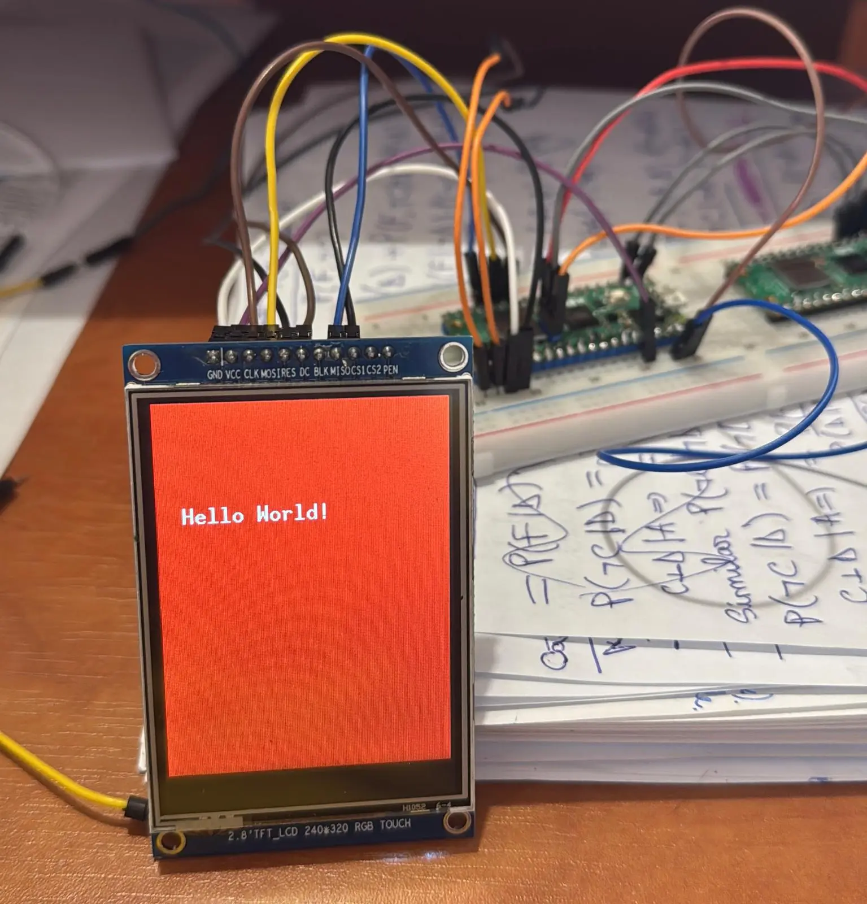

### Week 12 - 18 May

In this week I started to test the sensors and to write their data on the LCD display.

I started with the MQ-7 sensor and wrote the driver for it to get the CO PPM value and display it on the screen. I used ADC pin 26 to read the value and transform it to PPM. I displayed the value on the screen in dynamic colors depending on the value of the CO level:
- CO between 0 and 9 PPM - green
- CO between 9 and 29 PPM - yellow
- CO between 29 and 36 PPM - orange
- CO above 36 PPM - red

After this I connected the flame sensor and I wrote a driver for it to get the flame parcentage chance and display it on the screen. I used ADC pin 28 for the analog ping to calculate the flame percentage and I used the ping 22 for the digital pin to check if the flame is detected or not. I displayed the value on the screen in dynamic colors depending on the value of the flame percentage:
- If flame is detected by the digital pin, the text is red
- Flame percentage between 0 and 20% - green
- Flame percentage between 20 and 50% - yellow
- Flame percentage above 50% - orange

Then I connected the RTC DS3231 module and I used ds3231 driver to get the time and date and display it on the screen. I used I2C communication with the pins 20 and 21 for SDA and SCL pins. I noted that the datetime is inaccurate but I will fix it later, now is important that the RTC module is working and I can get the data from it successfully and the time passes correctly every second even though it is not the correct time and date.

I connected the BMP280 sensor and I used bmp280 driver to get the temperature and pressure values and display them on the screen. I used I2C communication with the pins 14 and 15 for SDA and SCL pins. I displayed the values on the screen in dynamic colors depending on the value of the temperature and pressure:
- Temperature between 0 and 15 degrees - blue
- Temperature between 15 and 30 degrees - green
- Temperature above 30 degrees - red
- Pressure between 0 and 990 hPa - blue
- Pressure between 990 and 1030 hPa - green
- Pressure above 1030 hPa - red

I connected the UV sensor and I used the ADC 27 pin and connected to a voltage of 3.3V to get the UV index value and display it on the screen. I categorized the UV index in 5 categories:
- UV index between 0 and 2 - LOW - green
- UV index between 2 and 5 - MODERATE - yellow
- UV index between 5 and 7 - HIGH - orange
- UV index between 7 and 10 - VERY HIGH - red
- UV index above 10 - EXTREME - purple

I connected the sound senor and I realised that this is a digiatal sensor, so it only has a digital pin that can be used to check if the sound is detected or not and has a potentiometer to set the sensitivity. So I decided to change the utility of this sensor because I wanted the display the sound level in dB. I will use this sensor to check if the sound is detected or not and if the sound is detected I will turn on my lights in the house. I used pin 13 for the digital pin.

I connected a buzzer to the pin 9 and wrote the code for it to turn on when a flame is detected or the CO level is too high (above 36 PPM). I set a higher frequency so the buzzer will be heard better. Also in this situation I will display a red text on the screen to alert the user.

I connected the mini fan to the pin 3 beause I used pwm on channel 1B and I wrote the code for it to turn on when the temperature is above 28 degrees. The fan will be turned on at 50% of the speed and it will increase the speed to 100% at 35 degrees. Also when the fan is turned on, I will display a green text on the screen to alert the user that the fan is turned on and the speed percentage.

I made some tests:
- I wanted to test the buzzer and I started a flame in front of the flame sensor and the buzzer started to beep and the text on the screen turned red.

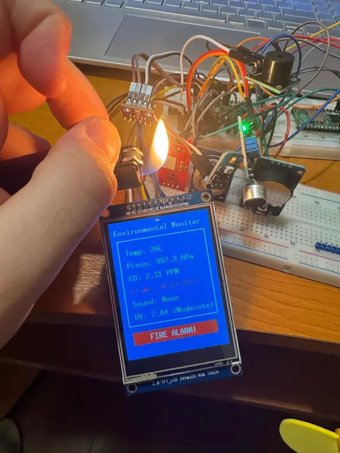

- I decreased the temperature threshold to 26 degrees to test the fan and I verified that the fan started to turn on and the text on the screen turned green.


- I test the buzzer and the fan together to see how they will appear on the screen and I verified that the buzzer started to beep and the text on the screen turned red and green.

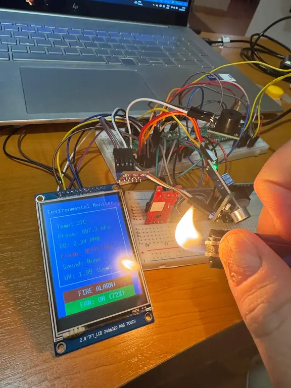

These tests were before I displayed the time and date on the screen, so I will did the test again to see how the screen will look like with the time and date on it. I verified that the text is not overlapping:

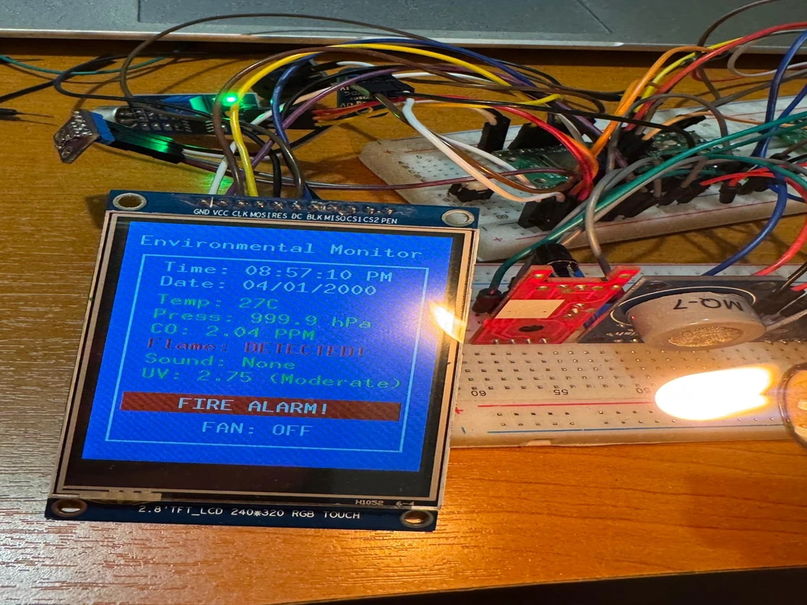
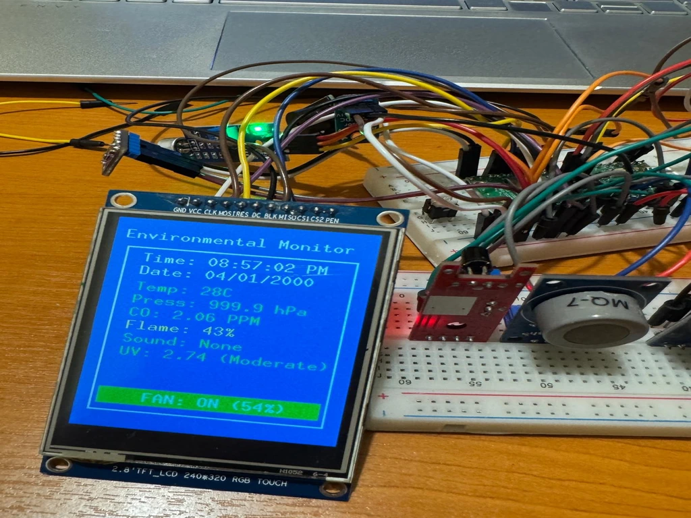
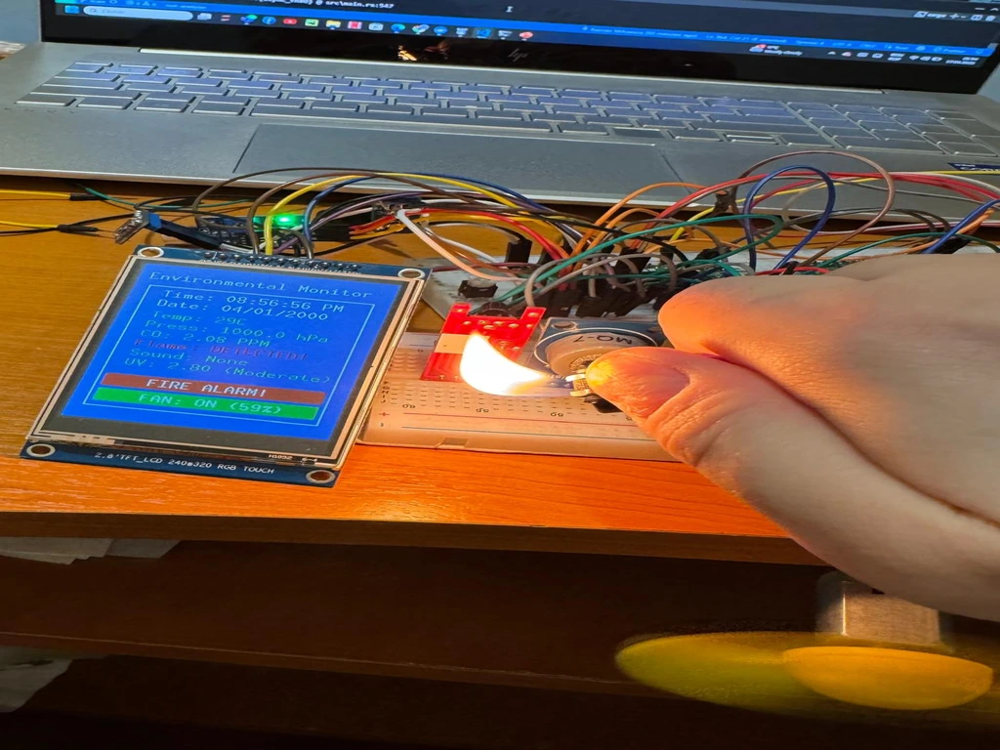

### Week 19 - 25 May

First I tried to smooth the refresh of the screen so the text would not disapear all at once, so I made the text refresh per sections. 
Then I set up the TCP sever with my computer and started to send alerts when a fire is detected, the CO level is too high or the fan is turned on.
I implemented the logic to turn on the lights in the house when the sound is detected and I made the controller sent the values of the sensors to the server every 5 seconds. In the python script which runs the server, I saved the sensor values in a csv database.

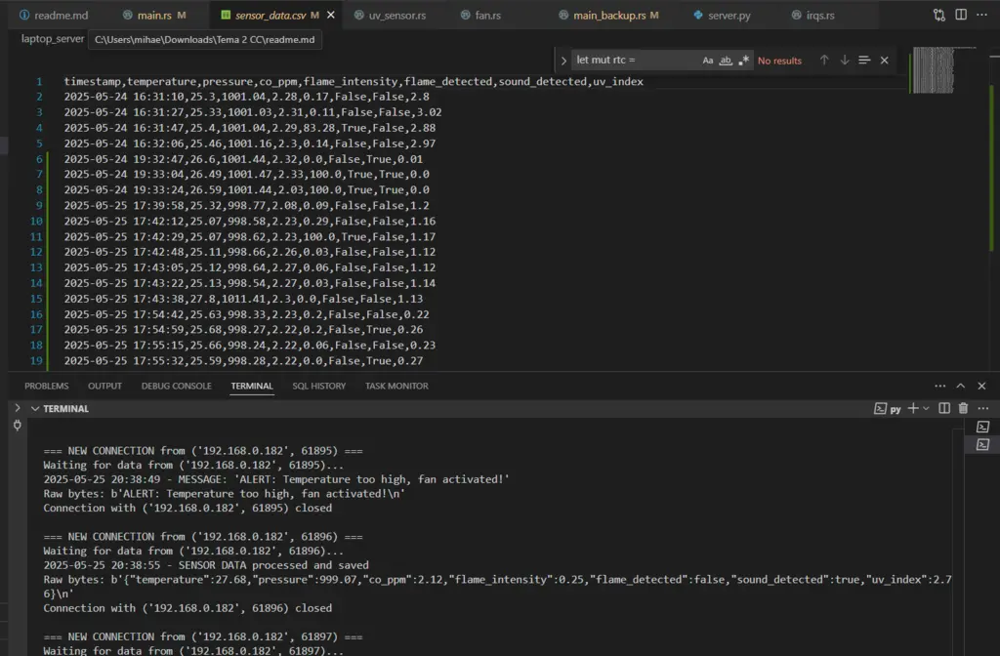

I set the datetime for the RTC module to the current time and date and I verified that the time is passing correctly every second.
I modified the code for displaying UV indexes as follows:
- UV index between 0 and 3 - LOW - green
- UV index between 3 and 6 - MODERATE - yellow
- UV index between 6 and 8 - HIGH - orange
- UV index between 8 and 11 - VERY HIGH - red
- UV index above 11 - EXTREME - purple
I finished by making the DIY for the house and stacking the wires to the house and I tested that everything is working correctly.


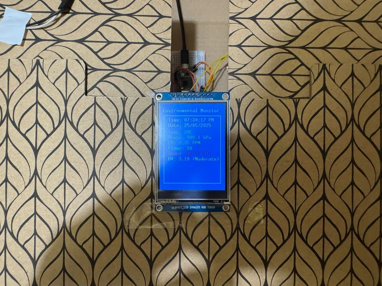


## Hardware

1. **Raspberry Pi Pico 2W**:
- **Function**: Acts as the main controller, coordinating the operations of sensors, buzzer, fan and the LCD display. Also, used to connect to the Wi-Fi network, send alerts to the user and process the data from the sensors.

2. **Raspberry Pi Pico 2W as Debugger**:
- **Function**: Acts as a secondary microcontroller, used to test the code and components before integrating them into the main microcontroller. This will help to identify any issues with the code or components before they are used in the final project.

3. **LCD display**:
- **Function**: Acts as a user interface, used to display the data from the sensors in real time and show graphs of the data over time. The LCD will display the data in different colors depending on the value of the index. For example, if the temperature is too high, the text will be red, if it is normal, it will be green and if it is too low, it will be blue. The same will be done for all the indexes.
- **Model**: ILI9341 & XPT2046 (240x320 px).

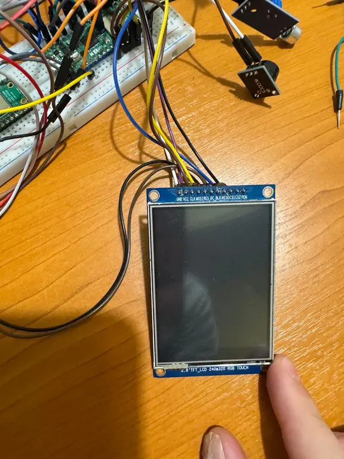

4. **Pressure & Temperature sensor**:
- **Function**: Calculates the pressure and temperature in the house. The data will be displayed on the LCD display.
- **Model**: BMP280.

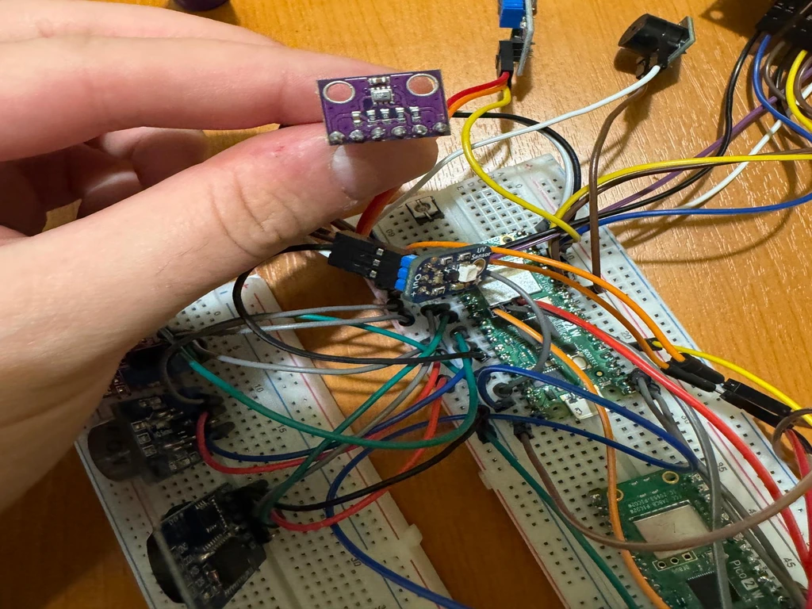

5. **Real-time clock**:
- **Function**: Keeps track of the time and date. The data will be displayed on the LCD display.
- **Model**: DS3231.

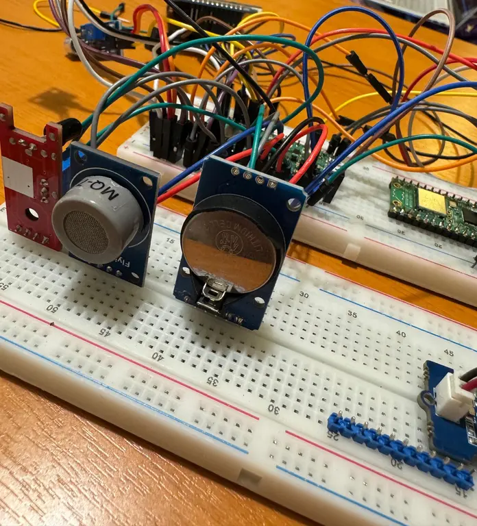
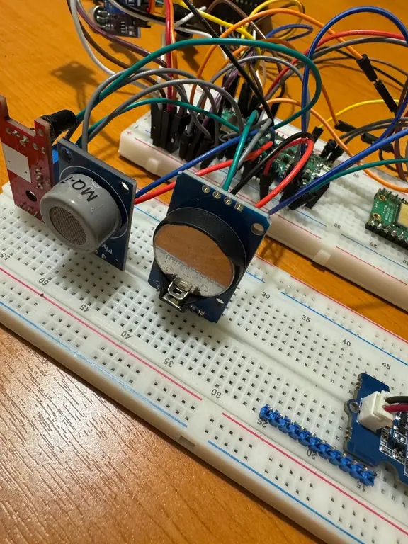

6. **Carbon monoxide sensor**:
- **Function**: Calculates the CO level in the house. The data will be displayed on the LCD display. If the CO level is too high, the buzzer will be turned on to alert the user.
- **Model**: MQ-7.

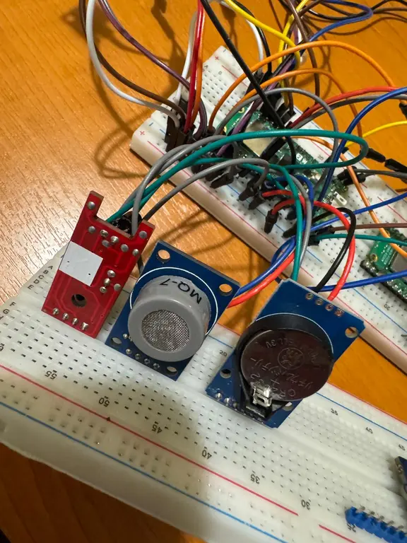

7. **Noise sensor**:
- **Function**: Detects the noise in the house. If the noise is detected, the lights in the house will be turned on.

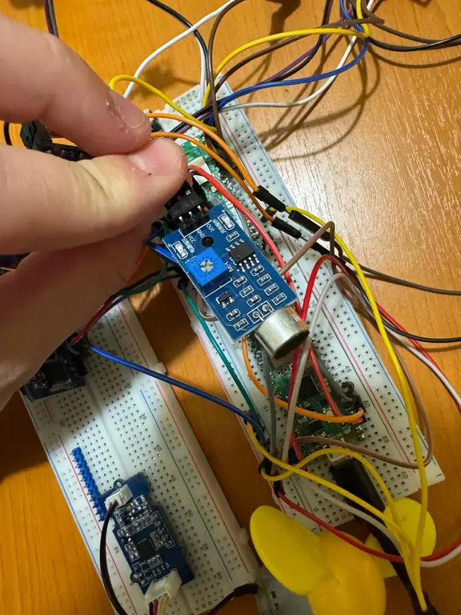

8. **Fire sensor**:
- **Function**: Detects flame and smoke in the house. If a fire is detected, the buzzer will be turned on to alert the user and a notification will be sent to the user using the server.
- **Model**: KY-026.

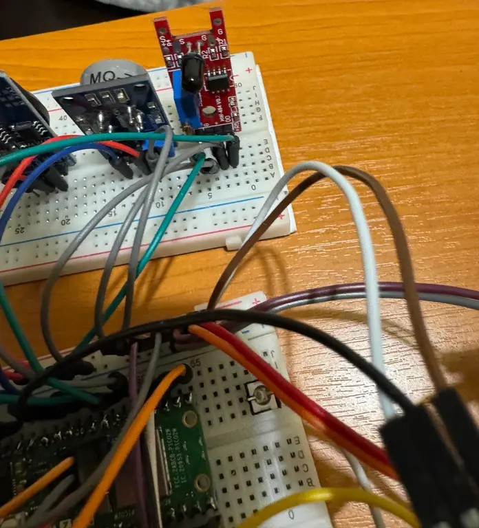

9. **Ultraviolet radiation sensor**:
- **Function**: Calculates the UV radiation level in the house. The data will be displayed on the LCD display.
- **Model**: GUVA-S12SD.

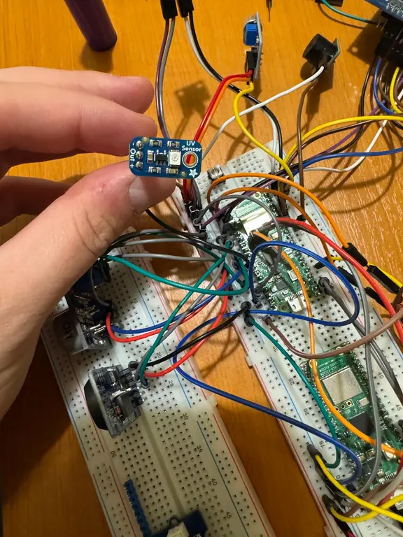

10. **Mini fan**:
- **Function**: If the temperature or humidity is too high, the fan will be turned on to cool the room. The user can set this option in the code.


11. **Buzzer module**:
- **Function**: If the air quality is bad (eg. if the CO level is too high, if a fire is detected, if dust is too high etc.), the buzzer will be turned on to alert the user. The buzzer will be turned on automatically if the air quality is bad.

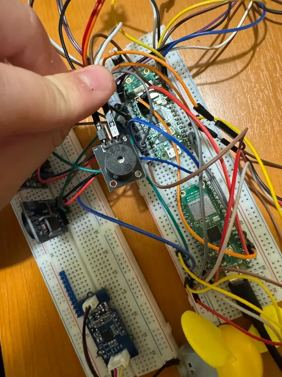

### Schematics

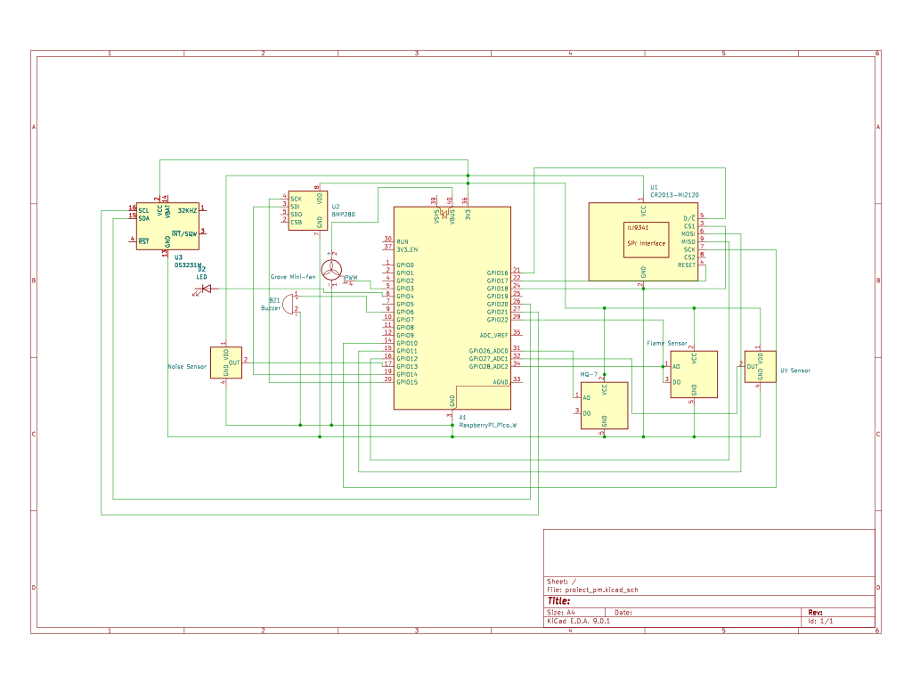

### Bill of Materials

<!-- Fill out this table with all the hardware components that you might need.

The format is 
```
| [Device](link://to/device) | This is used ... | [price](link://to/store) |

```

-->

| Device | Usage | Price |
|--------|--------|-------|
| [Rapspberry Pi Pico 2W](https://datasheets.raspberrypi.com/picow/pico-2-w-datasheet.pdf) | The microcontroller | [39,66 RON](https://www.optimusdigital.ro/en/raspberry-pi-boards/13327-raspberry-pi-pico-2-w.html?search_query=raspberry+pi+pico+2&results=36) |
| [Rapspberry Pi Pico 2W](https://datasheets.raspberrypi.com/picow/pico-2-w-datasheet.pdf) | Used as debugger | [39,66 RON](https://www.optimusdigital.ro/en/raspberry-pi-boards/13327-raspberry-pi-pico-2-w.html?search_query=raspberry+pi+pico+2&results=36) |
| [LCD display](https://cdn-shop.adafruit.com/datasheets/ILI9341.pdf) | Used to display the data from the sensors | [69,99 RON](https://www.optimusdigital.ro/ro/optoelectronice-lcd-uri/3544-modul-lcd-spi-de-28-cu-touchscreen-controller-ili9341-i-xpt2046-240x320-px.html?search_query=%09Modul+LCD+SPI+de+2.8%27%27+cu+Touchscreen+-+Controller+ILI9341+%C8%99i+XPT2046+%28240x320+px%29&results=2) |
| [Pressure & Temperature sensor](https://cdn-shop.adafruit.com/datasheets/BST-BMP280-DS001-11.pdf) | Used to measure the pressure and temperature in the house | [8,49 RON](https://www.optimusdigital.ro/ro/senzori-senzori-de-presiune/1666-modul-senzor-de-presiune-barometric-bmp280.html?search_query=Modul+Senzor+de+Presiune+Barometric+BMP280+GY&results=3) |
| [Real-time clock](https://www.analog.com/media/en/technical-documentation/data-sheets/ds3231.pdf) | Used to keep track of the time and date | [18,99 RON](https://www.optimusdigital.ro/ro/altele/1102-modul-cu-ceas-in-timp-real-ds3231.html?search_query=Modul+cu+Ceas+in+Timp+Real+DS3231&results=3) |
| [Carbon monoxide sensor](https://www.pololu.com/file/0j313/mq7.pdf) | Used to measure the CO level in the house | [32,13 RON](https://www.emag.ro/senzor-detectie-monoxid-de-carbon-mq-7-cl208/pd/DFFSGJBBM/?utm_source=cns_payment_accepted&utm_medium=email&utm_campaign=cns_status_update&utm_content=cns_product_title&ref_id=1777940605) |
| [Noise sensor](https://www.openimpulse.com/blog/wp-content/uploads/wpsc/downloadables/Sound-Sensor-Schematic.pdf) | Used to measure the noise level in the house | [4,99 RON](https://www.optimusdigital.ro/ro/senzori-altele/12325-modul-senzor-sunet-fara-cablu.html?search_query=Modul+Senzor+Sunet+%28fara+cablu%29&results=1) |
| [Fire sensor](https://moviltronics.com/wp-content/uploads/2019/10/KY-026.pdf?srsltid=AfmBOor8DJEfJC36RB7NFECCiRJe-YsMCXLLZZN4_MH0TMZMwkindiLl) | Used to detect flame and smoke in the house | [6,99 RON](https://www.bitmi.ro/electronica/modul-senzor-flacar-ir-ky-026-10657.html) |
| [Ultraviolet radiation sensor](https://cdn-shop.adafruit.com/datasheets/1918guva.pdf) | Used to measure the UV radiation level in the house | [6,20 £](https://thepihut.com/products/adafruit-analog-uv-light-sensor-breakout-guva-s12sd) |
| Mini fan | Used to cool the room if the temperature or humidity is too high | [7,80 £](https://thepihut.com/products/grove-mini-fan-v1-1) |
| Buzzer module | Used to alert the user if the air quality is bad | [4,98 RON](https://www.optimusdigital.ro/ro/altele/1102-modul-cu-ceas-in-timp-real-ds3231.html?search_query=Modul+cu+Ceas+in+Timp+Real+DS3231&results=3) |


## Software

| Library | Description | Usage |
|---------|-------------|-------|
| [embassy-rp](https://github.com/embassy-rs/embassy/tree/main/embassy-rp) | RP2350 Peripherals | Used for accessing the peripherals |
| [embedded-hal](https://crates.io/crates/embedded-hal) | Embedded Hardware Abstraction Layer | Used for accessing the hardware |
| [cortex-m](https://github.com/rust-embedded/cortex-m) | Provides low-level APIs for ARM Cortex-M processors | Interrupt handling and system control |
| [embassy-executor](https://github.com/embassy-rs/embassy/tree/main/embassy-executor) | Asynchronous executor for embedded systems | Used for managing tasks and scheduling |
| [mipidisi](https://crates.io/crates/mipidsi/0.5.0) | LCD driver | Used for controlling the LCD display |
| [bmp280](https://crates.io/crates/bmp280) | BMP280 driver | Used for controlling the BMP280 sensor |
| [ds3231](https://crates.io/crates/ds3231) | DS3231 driver | Used for controlling the DS3231 sensor |
| [embassy-time](https://docs.rs/embassy-time/latest/embassy_time/) | Timekeeping, delays and timeouts | Used to make time constraints and awaits |
| [micromath](https://crates.io/crates/micromath) | Embedded-friendly math library featuring fast floating point approximations | Used for mathematical operations |
| [chrono](https://crates.io/crates/chrono) | Date and time library | Used for handling date and time operations |

### Software Design:

* **Sensor Management**: Asynchronous sensor reading with calibration routines for gas sensors
* **Display System**: Dynamic color-coded display with real-time updates showing all environmental parameters
* **Network Communication**: WiFi-based TCP client sending both periodic sensor data and emergency alerts
* **Safety Control Logic**: Automated responses including buzzer activation, fan control, and remote notifications
* **Data Logging**: Sensor data transmitted to Python TCP server every 5 seconds for historical analysis

### Key Software Components:

| Module | Description | Functionality |
|--------|-------------|---------------|
| `main.rs` | Core application logic | Sensor coordination, display management, safety algorithms |
| `bmp280.rs` | Temperature/pressure sensor driver | I2C communication, calibration, compensated readings |
| `mq7.rs` | Carbon monoxide sensor driver | ADC reading, PPM calculation, baseline calibration |
| `flame_sensor.rs` | Flame detection driver | Dual-mode sensing (analog intensity + digital detection) |
| `sound_sensor.rs` | Audio detection driver | Digital noise level detection |
| `uv_sensor.rs` | UV radiation sensor driver | UV index calculation with safety categorization |
| `buzzer.rs` | Alert system driver | Tone generation for emergency warnings |
| `fan.rs` | Climate control driver | PWM-based speed control for temperature regulation |
| `server.py` | Data logging server | TCP server for receiving and storing sensor data |


## Links

<!-- Add a few links that inspired you and that you think you will use for your project -->
* https://ai.thestempedia.com/extension/iot-house-quarky/

* https://www.youtube.com/watch?v=VK_0CKheeUY

* https://www.youtube.com/watch?v=eidD14dXW8s

* https://ocw.cs.pub.ro/courses/pm/prj2023/ncaroi/smart-home?&#rezultate_obtinute
