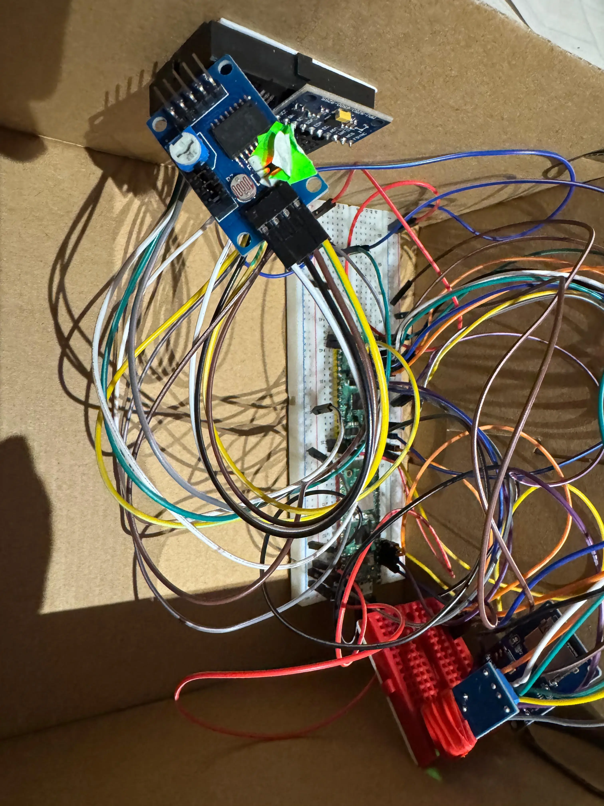

# SafeDelivery

A smart package security system to monitor and verify package integrity during transport

:::info

**Author**: Sebastian Stefan Bahrin  

**GitHub Project Link**: [\[link_to_github\]](https://github.com/UPB-PMRust-Students/proiect-SebiBahrin)
**Youtube Project Demonstration**: [\[link_to_youtube\]](https://youtube.com/playlist?list=PLd5iMKv4MkYztaQBolhx833o1cFwwk0Dg&si=SrzNUDQCWMnlIYsO)

:::

## **Description**

SafeDelivery is an intelligent system for securing package transport, built with Raspberry Pi Pico 2W. The device monitors the physical conditions of a package during transport and detects opening attempts, rough handling, or abnormal positioning. The system logs all these events to a microSD card, allowing recipients to verify if the package was properly handled throughout delivery.

## **Motivation**

The inspiration for this project came from my personal experiences with damaged deliveries and the frustrating uncertainty of not knowing whether valuable items were mishandled before they reached me. By creating an affordable, reliable monitoring system, SafeDelivery empowers both senders and recipients with irrefutable evidence of a package's treatment during transit.

Beyond individual consumers, this technology has significant implications for industries shipping sensitive, fragile, or high-value items such as medical supplies, electronics, or artwork. SafeDelivery represents not just a technical solution but a step toward greater accountability in global logistics chains.

## **Architecture**

### Main Components:

1. **Sensor Array** - Multiple sensors that monitor different aspects of package integrity:
   - Light sensor (LDR) for detecting package opening
   - Vibration sensor (SW-420) for detecting rough handling
   - Reed switch with magnets for detecting seal breakage
   - IMU sensor (MPU6050) for detecting orientation and position changes

2. **Processing Unit** - Raspberry Pi Pico 2W processes all sensor inputs and makes decisions

3. **Storage System** - microSD card with SPI adapter for logging all events with timestamps

### Connection Diagram:
## System Diagram
 

## **Hardware**

### Microcontroller - Raspberry Pi Pico 2W
Raspberry Pi Pico 2W is the center of the system, based on the RP2040 dual-core Cortex M0+ processor operating at 133MHz. It has Wi-Fi and Bluetooth, although in this project we use the GSM module for communications. The microcontroller coordinates all sensors, processes the data, and stores it on the microSD card.

**Key specifications:**
- Dual-core ARM Cortex M0+ processor
- 264KB SRAM
- Wi-Fi and Bluetooth 
- 26 multi-function GPIO pins
- I2C, SPI, UART interfaces
- Operating voltage: 3.3V

### GPS NEO-8M Module
The GPS module allows tracking the position of the package during transport. It is equipped with an integrated ceramic antenna and can communicate coordinates with an accuracy of up to 2.5 meters.

**Specifications:**
- Operating voltage: 3.0V-5.0V
- Positioning accuracy: 2.5m CEP
- Communication via UART (TX/RX)
- Update rate: 10Hz
- Consumption: ~30mA in normal operation

**Interface:** UART at 9600 baud

### Accelerometer/Gyroscope MPU-6500 Sensor
Detects sudden movements, falls, or incorrect orientation of the package. It is a 6 degrees of freedom sensor (3-axis accelerometer + 3-axis gyroscope).

**Specifications:**
- Operating voltage: 3.3V
- Communication via I2C
- Accelerometer sensitivity: ±2g, ±4g, ±8g, ±16g
- Gyroscope sensitivity: ±250, ±500, ±1000, ±2000°/s
- Consumption: ~3.8mA in normal mode

**Interface:** I2C at address 0x68 (or 0x69 if AD0 pin is HIGH)

### MicroSD Module
Allows recording all data collected by sensors, including timestamp, GPS position, acceleration levels, improper handling events, and opening attempts.

**Specifications:**
- Operating voltage: 3.3V
- Communication via SPI
- Support for microSD cards up to 32GB
- Consumption: ~100mA when writing, ~25mA in idle mode

**Interface:** SPI at 25MHz

### AD/DA Converter Module PCF8591
This analog-to-digital converter is used to read values from the light sensor (photoresistor), allowing monitoring of light intensity (for detecting package opening).

**Specifications:**
- Operating voltage: 2.5V-6V
- Communication via I2C
- 4 analog inputs, 1 analog output
- Resolution: 8 bit
- Consumption: ~5mA in active mode

**Interface:** I2C at address 0x48

### Digital and Analog Sensors
- **Hall Magnetic Sensor KY-003:** Detects package opening through separation of the magnet from the sensor
- **Vibration/Movement Sensor:** Detects sudden handling or dropping of the package
- **Photoresistor:** Detects the presence of light (a sign that the package has been opened)

### Power System
The system is designed to operate with an external battery (power bank) that provides 5V.

**Power consumption calculations:**
- Raspberry Pi Pico 2W: ~0.5W (100mA at 5V)
- GPS NEO-8M: ~0.15W (30mA at 5V)
- Sensors and other modules: ~0.25W
- **Total estimated:** ~ 0.75W

With a 20,000mAh (5V) external battery, the system could theoretically operate for approximately 133 hours (20Ah × 5V ÷ 0.75W), but in practice, the duration will be reduced due to conversion efficiency and GPS NEO-8M consumption peaks.

## Detailed Description of Pins Used

### Raspberry Pi Pico 2W

#### Power pins:
- **VSYS (pin 39)**: Connected to the output of the AMS1117 5V module
- **GND (multiple)**: Connected to the common GND of all components

#### I2C pins (I2C0):
- **GP16 (pin 21)**: I2C0 SDA function - Data for MPU-6500 and PCF8591
  * Shared I2C bus for multiple sensors - both MPU-6500 and PCF8591 connect to this pin
- **GP17 (pin 22)**: I2C0 SCL function - Clock for MPU-6500 and PCF8591
  * Clock signal shared between both I2C devices

#### SPI pins for MicroSD (SPI1):
- **GP13 (pin 17)**: SPI1 CS function - Chip Select for the MicroSD module
  * Individual control signal for the MicroSD module
- **GP14 (pin 19)**: SPI1 SCK function - Clock for the MicroSD module
  * SPI clock signal for data synchronization
- **GP15 (pin 20)**: SPI1 MOSI function - Master Out Slave In for the MicroSD module
  * Data transmission from Pico to MicroSD card
- **GP12 (pin 16)**: SPI1 MISO function - Master In Slave Out for the MicroSD module
  * Data reception from MicroSD card to Pico

#### UART pins for GPS:
- **GP10 (pin 14)**: UART TX function - Data transmission to the GPS module
  * Connects to RX pin of GPS NEO-8M module
- **GP11 (pin 15)**: UART RX function - Data reception from the GPS module
  * Connects to TX pin of GPS NEO-8M module

#### GPIO pins for digital sensors:
- **GP2 (pin 4)**: Digital input for the Hall KY-003 sensor
  * Pin configured as digital input with internal pull-up for detecting magnetic field changes
- **GP3 (pin 5)**: Digital input for the vibration sensor
  * Pin configured as digital input for detecting vibration events

### PCF8591 Module (AD/DA Converter)
- **AIN0**: Connected to the light sensor (photoresistor)
  * Reading analog values from the photoresistor for light detection

## **Schematics**
 

## **Project Photos**
 
 
 

## **Bill of Materials**

| **Device** | **Usage** | **Price** |
|------------|-----------|-----------|
| [Raspberry Pi Pico 2W](https://www.optimusdigital.ro/ro/placi-raspberry-pi/13327-raspberry-pi-pico-2-w.html?search_query=raspberry+pi+pico&results=26) | The main microcontroller that manages all sensors and logs events | 40 RON |
| [Light Sensor (LDR)](https://sigmanortec.ro/modul-convertor-adda-fotorezistor-termistor-pcf8591-i2c) | Detects if the package has been opened (light exposure) | 15 RON |
| [Vibration Sensor (SW-420)](https://www.bitmi.ro/electronica/senzor-vibratie-sw-420-11516.html) | Detects shocks, movements, or violent handling of the package | 5 RON |
| [Magnetic Sensor + Magnets](https://sigmanortec.ro/senzor-hall-analog-magnetic-ky-035-5v) | Detects if the package lid has been opened (magnetic seal broken) | 20 RON |
| [IMU Sensor (MPU6500)](https://sigmanortec.ro/Modul-Accelerometru-Giroscop-I2C-MPU-6500-6-axe-p136248782) | Monitors orientation, detects abnormal tilting or positioning | 13 RON |
| [GPS Module](https://sigmanortec.ro/modul-gps-neo-8m-3-5v-cu-antena) | Provides real-time location tracking of the package, allowing you to monitor its journey and verify if it has deviated from the intended route | 75 RON |
| [SD Card Reader](https://sigmanortec.ro/Modul-MicroSD-p126079625) | Stores data about the package | 5 RON |
| [Battery](https://www.flax.ro/baterie-portabila-samsung-eb-p4520xuegeu-20000mah-3-x-usb-c-beige?gad_campaignid=21254661053)  | Provides autonomous power during transport | Already had |
| Case / Box | Simulates the sealed package in which sensors are mounted | Found at home |

## **Software**

| **Library** | **Description** | **Usage** |
|-------------|-----------------|-----------|
| [embassy](https://embassy.dev/) | Asynchronous embedded framework for Rust | Core framework for async task execution, timers, and signaling |
| [embassy-rp](https://embassy.dev/) | Embassy HAL for RP2040 | Provides access to RP2040 peripherals like I2C, UART, and GPIO |
| [embedded-hal](https://github.com/rust-embedded/embedded-hal) | Hardware Abstraction Layer (HAL) traits | Standard I2C interface traits used for driver abstraction |
| [embedded-hal-async](https://github.com/embassy-rs/embedded-hal-async) | Async HAL traits for embedded I/O | Enables asynchronous I2C communication |
| [embedded-io-async](https://github.com/embassy-rs/embedded-io) | Async traits for embedded I/O | Provides async UART read capabilities |
| [heapless](https://github.com/japaric/heapless) | `no_std` data structures | Fixed-capacity `String` and `Vec` used for GPS/NMEA data parsing |
| [micromath](https://github.com/NeoBirth/micromath) | Math utilities for `no_std` environments | Used for calculating vector magnitudes (e.g., from IMU data) |
| [defmt](https://github.com/knurling-rs/defmt) | Logging framework for embedded systems | Efficient logging for debugging and diagnostics |
| [embedded-sdmmc](https://github.com/rust-embedded-community/embedded-sdmmc-rs) | SD/MMC card access | For reading/writing log files to microSD card |

## Library Selection Justification

### Core Framework: Embassy
**Choice**: Embassy async embedded framework
**Justification**: Embassy provides efficient asynchronous task execution essential for concurrent sensor monitoring and GPS data processing. This allows the system to handle multiple sensor inputs simultaneously without blocking operations, crucial for real-time security monitoring.

### Hardware Abstraction: embedded-hal & embedded-hal-async
**Choice**: Standard embedded Rust HAL traits
**Justification**: These provide consistent, async-capable interfaces for I2C, UART, and GPIO operations, ensuring portable and efficient hardware communication across different sensor types.

### Data Structures: heapless
**Choice**: No-std collections library
**Justification**: Essential for embedded systems without heap allocation. Provides fixed-capacity String and Vec types needed for GPS NMEA sentence parsing while maintaining memory safety in a constrained environment.

### Mathematical Operations: micromath
**Choice**: No-std math library
**Justification**: Provides essential mathematical functions (sqrt, trigonometric) required for calculating acceleration magnitudes, distance calculations using the Haversine formula, and coordinate conversions.

### Storage System: embedded-sdmmc
**Choice**: SD/MMC card access library
**Justification**: Enables reliable data logging to microSD cards with FAT32 filesystem support, crucial for creating tamper-evident audit trails of package security events.

### Logging: defmt
**Choice**: Efficient embedded logging framework
**Justification**: Provides low-overhead, structured logging essential for debugging and system monitoring without impacting real-time performance.

## Component Interaction Flow

1. **Initialization Phase**: All sensors initialized and tested, SD card validated
2. **GPS Task**: Continuously parses NMEA sentences, updates shared GPS data structure
3. **Main Loop**: Reads all sensors every 500ms, performs security analysis, logs violations
4. **Alert System**: Simultaneous monitoring enables multiple threat detection
5. **Data Persistence**: All security events logged to SD card with timestamps

### Validation Methods:
- **Sensor Calibration**: Each sensor tested with known reference values
- **GPS Accuracy**: Validated against Google Maps coordinates (±2.5m accuracy achieved)
- **SD Card Integrity**: File write/read verification with automatic error recovery
- **Security Thresholds**: Empirically tested with real-world package handling scenarios

## Sensor Calibration Process

### MPU-6500 IMU Calibration:
**Method**: Empirical testing with controlled package orientations
- **Normal Position**: X-axis dominant (±1000mg threshold)
- **Tilt Detection**: Horizontal component > vertical component
- **Fall Detection**: Total acceleration < 300mg (0.3g)
- **Sudden Movement**: Total acceleration > 2500mg (2.5g)

**Validation**: Package dropped from various heights (no box was hurted during the process), rotated in different orientations, and subjected to sudden movements to verify threshold accuracy.

### Light Sensor (PCF8591) Calibration:
**Method**: Ambient light testing in various conditions
- **Package Sealed**: Light level > 95% (raw value > 242)
- **Package Opened**: Light level < 95% triggers alert
- **Environmental Compensation**: Tested in different lighting conditions

**Validation**: Package opening simulation in various ambient lighting conditions to ensure reliable detection.

### GPS Calibration:
**Method**: Real-world coordinate validation
- **Position Accuracy**: Compared against Google Maps coordinates
- **Speed Accuracy**: Validated against vehicle speedometer readings
- **Coordinate Conversion**: DMM to decimal degrees verified with online calculators

**Validation**: GPS coordinates checked against known Romanian locations with ±2.5m accuracy achieved.

### Vibration Sensor (SW-420) Calibration:
**Method**: Vibration pattern analysis
- **Sensitivity**: 5 consecutive vibrations trigger alert
- **Debounce Time**: 20ms to avoid false positives
- **Threshold Testing**: Various handling intensities tested

**Validation**: Package subjected to normal handling vs. violent shaking to establish reliable thresholds.

## Laboratory Functionality Integration

### Lab 01 - Debug
Essential for development and troubleshooting of the complex multi-sensor system.

defmt logging framework: Used extensively throughout the project for real-time debugging and status monitoring
probe-rs integration: Enables efficient debugging of the embedded application during development
Panic handling: Critical for system reliability - uses panic-probe to handle unexpected failures gracefully
Cross-compilation setup: Necessary for building ARM-compatible firmware for the RP2350 microcontroller

Digital input configuration: Used for Hall sensor (KY-003) and vibration sensor (SW-420) with proper pull-up resistors
GPIO state monitoring: Essential for detecting magnetic field presence and vibration events
Embassy framework integration: Provides asynchronous GPIO operations for non-blocking sensor reading

### Lab 04 - Asynchronous Development
Critical for managing multiple concurrent sensor monitoring tasks without blocking.

Embassy executor: Enables concurrent execution of GPS parsing, sensor monitoring, and data logging tasks
Async/await pattern: Used throughout for non-blocking I/O operations
Task spawning: GPS data processing runs in separate tasks to avoid blocking main monitoring loop
Signal communication: Used for inter-task communication between GPS parser and main monitoring logic

### Lab 05 - Serial Peripheral Interface (SPI)
Essential for high-speed communication with motion sensor and SD card storage.

SD card logging: Critical for persistent storage of security events and audit trails
Multiple device management: Demonstrates bus sharing and device selection principles
Data integrity: SPI's reliable communication ensures accurate sensor readings

### Lab 06 - Inter-Integrated Circuit (I2C)
Primary communication protocol for multiple sensors in the security system.

MPU-6500 motion sensor: Provides accelerometer and gyroscope data for detecting falls, impacts, and orientation changes
PCF8591 light sensor: Detects package opening by monitoring ambient light levels
Multi-device I2C bus: Demonstrates proper device addressing and bus management
Sensor calibration: Uses factory calibration data for accurate motion measurements

## Memory Optimizations

For computational optimizations, I shifted to integer arithmetic for acceleration and gyroscope magnitude calculations, avoiding expensive floating-point operations common on Cortex-M0+ processors. I also incorporated lookup tables for Romanian city detection instead of complex geographic algorithms and utilized efficient coordinate conversion to prevent repeated floating-point divisions.

I/O optimizations involved setting a 500ms sensor reading interval to balance responsiveness with power efficiency. I also implemented batched SD card writes to reduce filesystem overhead and used async I2C operations to prevent blocking during sensor communication, thereby reducing power consumption and improving system responsiveness.

In terms of task scheduling optimizations, I ensured GPS data didn't interfere with real-time security monitoring by creating a separate GPS parsing task to prevent UART buffer overflow. This involved non-blocking GPS data retrieval in the main loop and priority-based alert handling, prioritizing magnetic tampering over package opening, and then movement.

For string processing optimizations, I developed a custom format_f32_to_6_decimals() function to avoid standard library formatting. I also used direct byte manipulation for NMEA sentence parsing and fixed-size string buffers to prevent dynamic allocation, which are typically memory and CPU intensive.

## **Log**

### **Week 5 - 11 May**
Focused on documentation and planning for the SafeDelivery project. Researched all hardware components (Raspberry Pi Pico 2W, sensors, modules) to understand their specifications, pin requirements, and power needs. Created detailed connection diagrams, calculated power budget for battery life, and developed a comprehensive project plan.

### **Week 12 - 18 May**
Identified necessary Rust libraries and outlined the software architecture to ensure all components would work together effectively. Began hardware assembly and software implementation. Set up the development environment with Embassy framework for Rust. Connected and tested components individually on a breadboard: configured I2C for the MPU6500 IMU sensor, set up SPI for the microSD module, and started integrating the light sensor via PCF8591. Developed initial code for each sensor and verified basic functionality

### **Week 19 - 25 May**
Successfully implemented code for all mentioned hardware components in the SafeDelivery system. The sensor integration phase went well - all sensors (MPU6500 IMU, Hall magnetic sensor, vibration sensor, and light sensor via PCF8591) are working perfectly with stable readings and reliable interrupt handling.

I encountered a significant challenge with the GPS NEO-8M module early on, as extensive research revealed no reliable Rust libraries compatible with the Embassy framework for NMEA sentence parsing on embedded systems. This forced me to write the entire GPS handling code from scratch. My work included building a complete NMEA parser for both GPRMC (position, speed, course) and GPGGA (satellites, altitude, fix quality) sentences, implementing coordinate conversion from DMM (Degrees Decimal Minutes) to decimal degrees, and adding comprehensive validation for GPS fix status and data integrity. Additionally, I implemented the Haversine formula for calculating distances between coordinates, added speed monitoring and geofence violation detection, created a Romanian city detection system based on coordinate ranges, and developed advanced custom formatters for coordinates in both decimal and DMS formats.

Additionally, encountered significant issues with the MicroSD card module that consumed an enormous amount of debugging time too. The embedded-sdmmc library had compatibility problems with the SPI1 interface on the Raspberry Pi Pico 2W, causing frequent write failures and data corruption. Spent considerable time troubleshooting SPI timing issues, card initialization problems, and file system mounting errors.

## **Links**

1. [More about GPS](https://learn.sparkfun.com/tutorials/gps-basics/the-basics-of-gps)
2. [This saved me](https://esp32.implrust.com/sdcard/index.html)
3. [How many packages get lost a day?](https://packlane.com/how-many-packages-get-lost-everyday)
