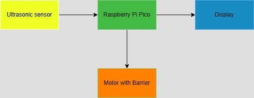
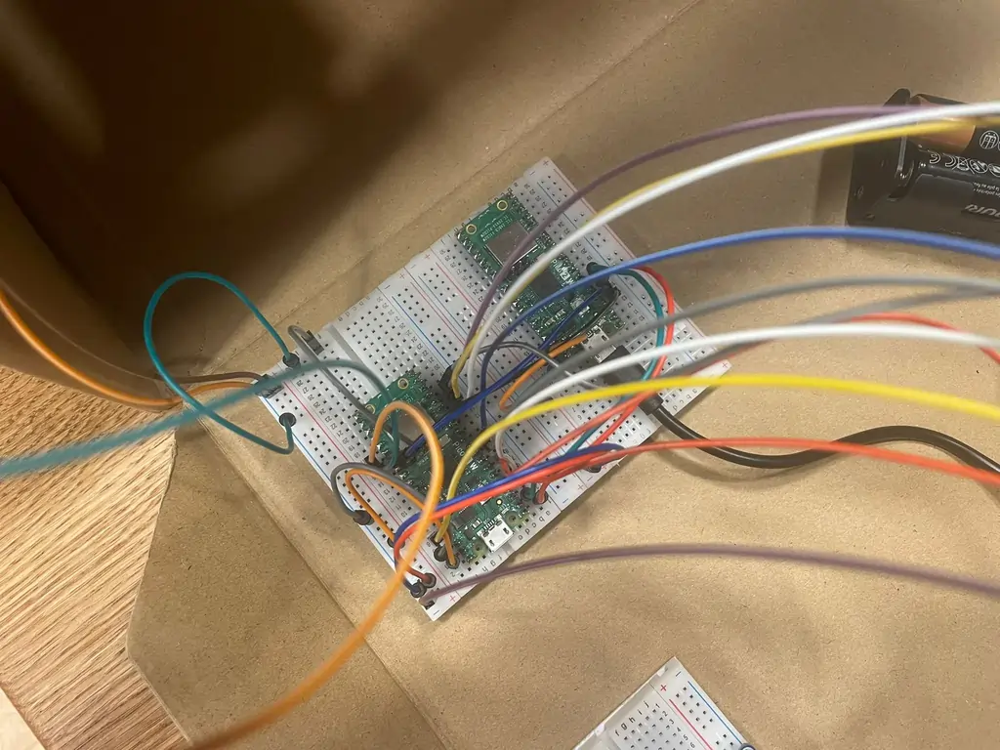
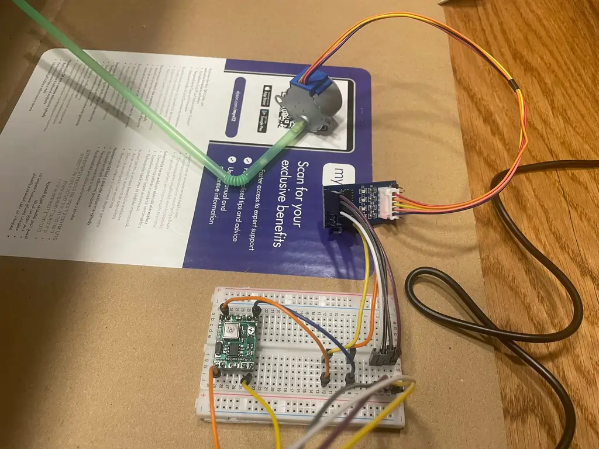
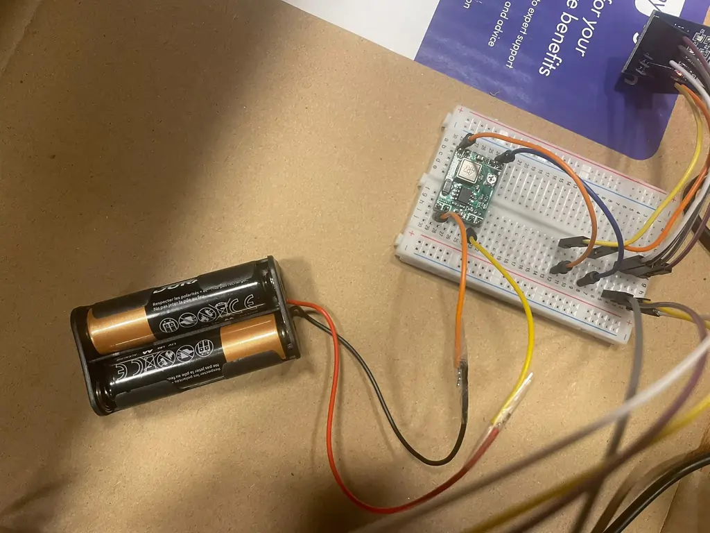
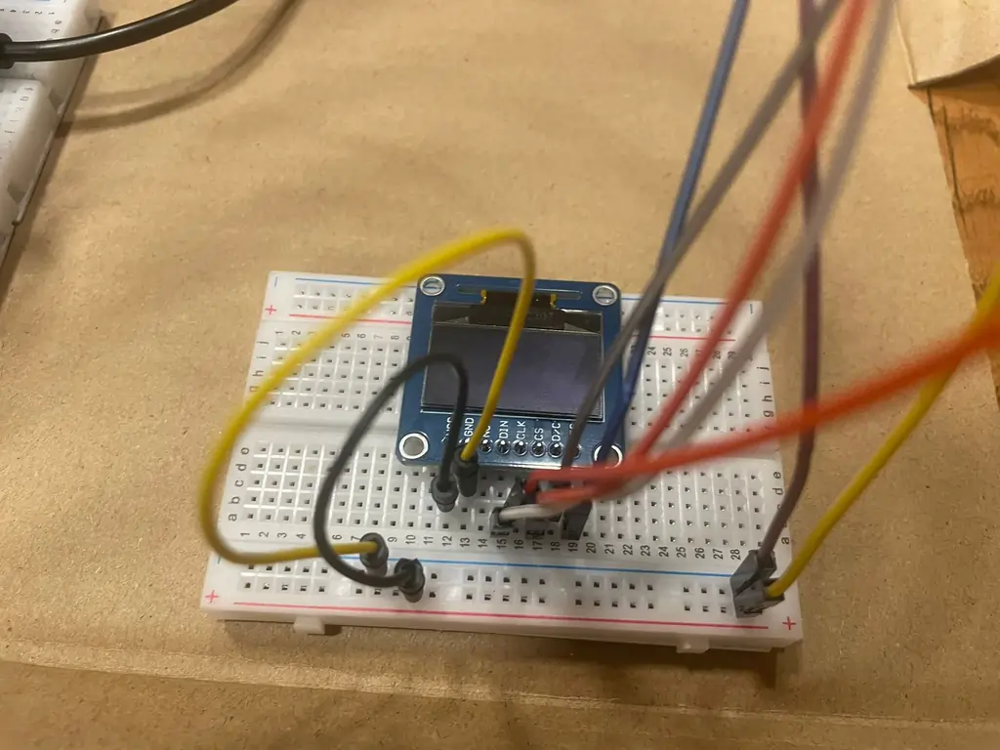
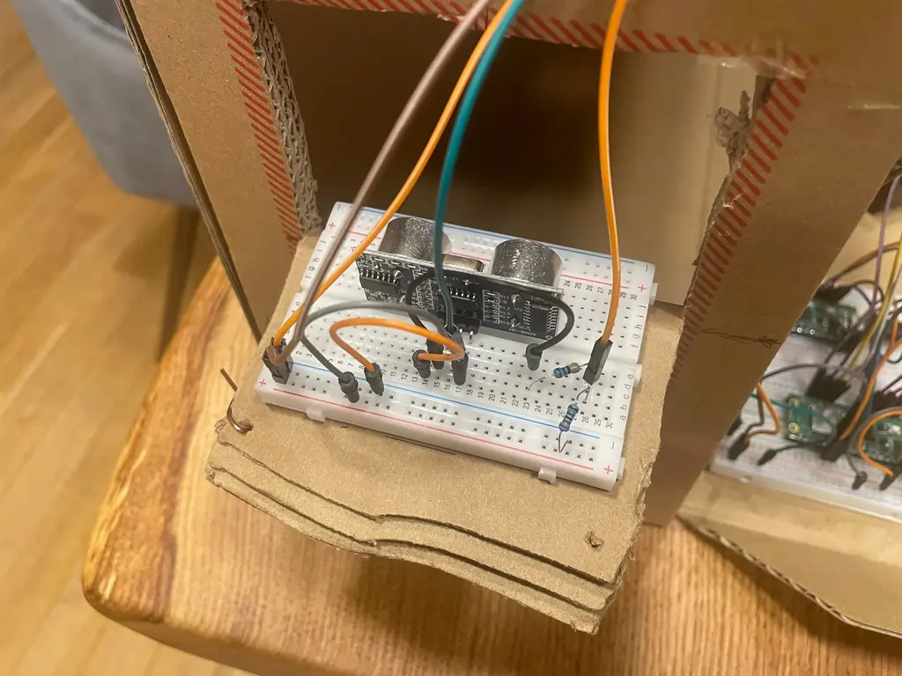
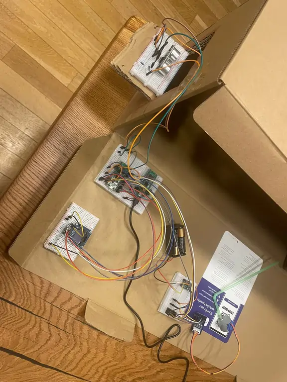
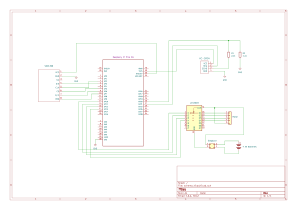

# Barrier Parking Spot
Automated parking barrier with distance display for tall vehicles

:::info 

**Author**: Stefan Talpos \
**GitHub Project Link**: https://github.com/UPB-PMRust-Students/proiect-stefantlp

:::

## Description

The project consists of a miniature automated parking system designed for tall vehicles. It uses a barrier that opens when a vehicle approaches and displays the distance to the rear wall on a screen. Once the vehicle is close enough to the wall, the barrier closes automatically. The system is controlled by a microcontroller and uses sensors to detect vehicle presence and distance.

## Motivation

I chose this project because I wanted to experiment with multiple hardware components such as sensors and a display, and I’m particularly interested in automation systems. This idea gave me the opportunity to integrate different devices into a functional setup and better understand how microcontrollers interact with various peripherals in real-time scenarios.

## Architecture 

Main components used in Barrier Parking Spot project:
1. Ultrasonic Sensor - This sensor is used to detect the presence and distance of the approaching vehicle. It sends distance data to the Raspberry Pi Pico in real time.

2. Raspberry Pi Pico - The central microcontroller of the system, responsible for processing the distance data from the ultrasonic sensor and controlling both the motorized barrier and the display accordingly.

3. Display - A visual interface (e.g., LCD or OLED screen) that shows the distance between the vehicle and the wall, helping the driver park safely.

4. Motor with Barrier - This component represents the physical gate mechanism. It receives commands from the Raspberry Pi Pico to open or close the barrier depending on the vehicle’s position.

## Log

### Week 5 - 11 May

Purchased all components: Raspberry Pi Pico W, ultrasonic sensor, OLED display, stepper motor with driver, power module, and battery holder. Set up the Pico W and ultrasonic sensor with working distance detection code. Attempted but failed to connect the OLED display.

### Week 12 - 18 May

Successfully set up the OLED display and displayed live distance data. Installed and configured the stepper motor with driver. Wrote and tested the final code that integrates all components. The project is now fully functional.

### Week 19 - 25 May

I did nothing this week.

## Hardware

This project is built around the Raspberry Pi Pico W, which reads distance data from an HC-SR04 ultrasonic sensor and controls a 28BYJ-48 stepper motor via a ULN2003 driver to raise or lower a barrier. A 0.96'' OLED display provides visual feedback to the user.

The components are connected using jumper wires on a 400-point breadboard. Power is supplied through a 2x18650 battery holder regulated by a DC-DC Step-Down MP1584EN module, with a micro USB cable used for programming and optional power input.

This setup ensures a compact, low-cost prototype suitable for quick testing and deployment.

### Schematics

### Bill of Materials

| Device | Usage | Price |
|--------|-------|-------|
| [Set de cabluri pentru breadboard](https://www.optimusdigital.ro/ro/fire-fire-mufate/12-set-de-cabluri-pentru-breadboard.html?search_query=Set+Fire+pentru+Breadboard&results=37) | Connecting components on the breadboard | 8 RON |
| [Fire Colorate Mama-Tata (10p) 10 cm](https://www.optimusdigital.ro/ro/fire-fire-mufate/650-fire-colorate-mama-tata-10p.html?search_query=Fire+Colorate+Mama-Tata+%2810p%29+10+cm&results=6) | Connecting modules to the microcontroller | 3 RON |
| [Senzor ultrasonic HC-SR04](https://www.optimusdigital.ro/ro/senzori-senzori-ultrasonici/12897-senzor-ultrasonic-hc-sr04-.html?search_query=Senzor+ultrasonic+HC-SR04&results=31) | Measuring distance to the vehicle | 7 RON |
| [Display OLED 0.96''](https://www.optimusdigital.ro/ro/optoelectronice-altele/12657-display-oled-096-.html?search_query=Display+OLED+0.96%27%27&results=7) | Displaying distance information | 50 RON |
| [Raspberry Pi Pico 2W](https://www.optimusdigital.ro/ro/placi-raspberry-pi/13327-raspberry-pi-pico-2-w.html?search_query=%09Raspberry+Pi+Pico+2W&results=26) | Main microcontroller unit | 40 RON |
| [Breadboard HQ (400 Points)](https://www.optimusdigital.ro/ro/prototipare-breadboard-uri/44-breadboard-400-points.html?search_query=Breadboard+HQ+%28400+Points%29&results=1) | Prototyping circuit connections | 5 RON |
| [Cablu Negru Micro USB 1 m](https://www.optimusdigital.ro/ro/cabluri-cabluri-usb/11939-cablu-negru-micro-usb-1-m.html?search_query=%09Cablu+Negru+Micro+USB+1+m&results=20) | Powering the Raspberry Pi Pico | 4 RON |
| [Suport baterii 4 x R6 Patrat](https://www.optimusdigital.ro/ro/toate-produsele/2374-suport-baterii-4-x-r6-patrat.html?search_query=suport+baterii+aa+4&results=58) | Providing portable power supply | 5 RON |
| [Modul DC-DC Step-Down MP1584EN](https://www.optimusdigital.ro/ro/surse-coboratoare-reglabile/166-modul-dc-dc-step-down-mp1584en.html?search_query=Modul+DC-DC+Step-Down+MP1584EN&results=2) | Regulating voltage to suitable levels | 7 RON |
| [Set Motor Pas cu Pas 28BYJ-48 5V și Driver ULN2003 Albastru](https://www.optimusdigital.ro/ro/motoare-motoare-pas-cu-pas/101-driver-uln2003-motor-pas-cu-pas-de-5-v-.html?search_query=Set+Motor+Pas+cu+Pas+28BYJ-48+5V+%C8%99i+Driver+ULN2003+Albastru&results=1) | Controlling the barrier mechanism | 17 RON |
| [Header de Pini Tată de 1.27 mm 40p](https://www.optimusdigital.ro/ro/componente-electronice-headere-de-pini/8865-header-de-pini-tata-de-127-mm-2-x-40p.html?search_query=%09Header+de+Pini+Tata+de+1.27+mm+40p&results=4) | Connecting modules to the breadboard | 2 RON |

## Software

| Library | Description | Usage |
|---------|-------------|-------|
| [gpio (embedded-hal)](https://docs.rs/embedded-hal/latest/embedded_hal/digital/index.html) | General Purpose Input/Output | Used to interface with sensors, motor, and other components |
| [i2c (embedded-hal)](https://docs.rs/embedded-hal/latest/embedded_hal/i2c/index.html) | I2C communication protocol | Used for communicating with the OLED display |
| [embassy-time](https://github.com/embassy-rs/embassy) | Managing time | Used for implementing delays and scheduling tasks |
| [embassy-rp](https://github.com/embassy-rs/embassy) | Peripheral access library | Used for accessing Raspberry Pi Pico 2W hardware features |
| [uln2003](https://github.com/JorgeSegarra/stepper) | Stepper motor driver | Used to control the 28BYJ-48 stepper motor |
| [ssd1306](https://crates.io/crates/ssd1306) | OLED display driver | Used to show distance measurements or status messages |
| [hc-sr04](https://github.com/eldruin/hc-sr04) | Ultrasonic sensor driver | Used for distance measurement |
| [defmt](https://crates.io/crates/defmt) | Logging framework | Used for debugging over serial connection |
| [panic-probe](https://crates.io/crates/panic-probe) | Panic handler for embedded Rust | Used for logging panic messages via USB serial |

## Links

1. [Youtube Similar Project](https://www.youtube.com/watch?v=O7yoa-hwnkI&ab_channel=TheNeoStudios)
2. [Last Year Similar Project](https://pmrust.pages.upb.ro/docs/fils_en/project/2024/luca.rosoiu)
