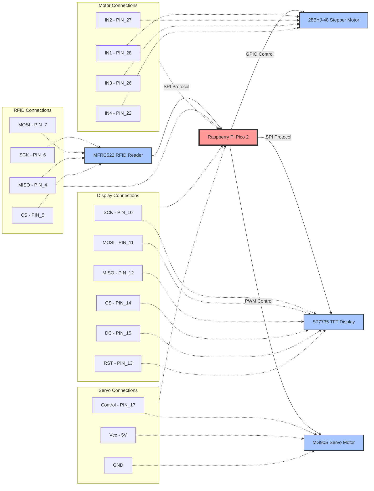

# RFID-Controlled Corporate Elevator System
A corporate elevator system that uses RFID cards for floor access control, built with Raspberry Pi Pico 2 and stepper motor technology.

:::info 

**Author**: Vicentiu Duta \
**GitHub Project Link**: https://github.com/UPB-PMRust-Students/proiect-VicentiuDuta

:::

## Description

This project implements a miniature elevator system featuring access control through RFID technology. The system operates on a Raspberry Pi Pico 2 microcontroller and utilizes stepper motor control for precise vertical movement. The core functionality allows users to present specific RFID cards, which automatically direct the elevator to the associated floor. 

The system employs a 28BYJ-48 stepper motor for smooth and controlled movement between floors, with precise positioning achieved through programmatic control of step sequences. The RFID reader, based on the MFRC522 module, communicates via SPI protocol to identify and authenticate access cards. 

For visual feedback, the system features an ST7735 color TFT display that provides real-time information about the elevator's current floor position, status, and operation mode. This visual indicator ensures users can easily monitor the elevator's location and verify their access status.

The system also includes an MG90S servo motor that controls the elevator door, automatically opening when arriving at a destination floor and closing before departure, enhancing the realism and functionality of the miniature elevator.

This design showcases practical integration of embedded systems programming in Rust with mechanical control systems to create an automated, access-controlled transportation system.

## Motivation

This project was chosen to explore the practical implementation of access control systems in automated environments. Building an RFID-controlled elevator system provides an opportunity to work with multiple interconnected technologies: digital identification systems, motor control, and embedded programming. The motivation behind this project stems from:

1. **Real-world Application**: Access control is fundamental in modern buildings, and implementing a miniature version offers insights into security systems used in corporate environments.

2. **Learning Rust in Embedded Systems**: This project provides hands-on experience with Rust programming in embedded contexts, allowing exploration of low-level hardware control while maintaining code safety.

3. **System Integration**: The project demands understanding of multiple protocols (SPI for RFID communication and display) and hardware components working in harmony, developing valuable skills in embedded systems design.

4. **User Experience Enhancement**: The implementation of an ST7735 color display adds a crucial user interface element that provides rich visual feedback. This feature improves the user experience by showing current floor position, operation status, and system messages, making the system more professional and user-friendly.

5. **Mechanical Automation**: The addition of a servo-controlled door mechanism demonstrates integration of multiple motion systems (vertical movement and door operation), adding complexity and realism to the project.

The miniature nature of the project makes it manageable for implementation while still showcasing the essential concepts of automated access control systems.

## Architecture 

    

### Component Connections:
The Authentication Module receives RFID data via SPI and outputs authorized floor commands to the Motor Controller. The Motor Controller generates step patterns through GPIO to drive the stepper motor. The Door Controller manages the servo motor using PWM signals for precise door movement. The Display Controller communicates with the ST7735 via SPI to show real-time system status. The Microcontroller orchestrates all modules, ensuring sequential operation and proper state transitions between floor movement and door operations.

## Log

<!-- write your progress here every week -->

### Week 5 - 11 May
TODO
### Week 12 - 18 May
TODO
### Week 19 - 25 May
TODO

## Hardware

The system consists of a Raspberry Pi Pico 2 microcontroller interfacing with four main components: an MFRC522 RFID reader for contactless card authentication via SPI protocol, a 28BYJ-48 stepper motor with ULN2003 driver for precise elevator movement control, an ST7735 color TFT display for providing rich visual feedback on system status, and an MG90S servo motor for controlling the elevator door. The RFID reader and display both communicate via SPI, while the stepper motor uses direct GPIO control and the servo motor is controlled through PWM. All modules connect directly to the Pico, creating a compact, integrated access control system with automated mechanical components.

### Schematics

### Bill of Materials

| Device | Usage | Price |
|--------|--------|-------|
| [2x Raspberry Pi Pico 2W](https://www.raspberrypi.com/documentation/microcontrollers/pico-series.html) | The microcontroller | [39,66 RON x 2](https://www.optimusdigital.ro/en/raspberry-pi-boards/13327-raspberry-pi-pico-2-w.html?search_query=raspberry+pi+pico+2&results=36) |
| [MFRC522 RFID Module](https://www.nxp.com/docs/en/data-sheet/MFRC522.pdf) | RFID authentication | [9,99 RON](https://www.optimusdigital.ro/en/wireless-rfid/67-mfrc522-rfid-module.html?search_query=rfid&results=30) |
| [28BYJ-48 Stepper Motor](https://components101.com/motors/28byj-48-stepper-motor) | Elevator vertical movement control | [16,97 RON](https://www.optimusdigital.ro/ro/motoare-motoare-pas-cu-pas/101-driver-uln2003-motor-pas-cu-pas-de-5-v-.html?search_query=motor+pas+cu+pas&results=117) |
| [ST7735 TFT Display](https://www.displayfuture.com/Display/datasheet/controller/ST7735.pdf) | Status and floor indicator display | [19,99 RON](https://www.optimusdigital.ro/en/oled-lcd-displays/8166-st7735-tft-display.html) |
| [MG90S Micro Servo](https://components101.com/motors/mg90s-metal-gear-servo-motor) | Elevator door control | [12,90 RON](https://www.optimusdigital.ro/en/servomotors/34-micro-servomotor-mg90s.html) |
| Consumables | Jumper wires, breadboard, pins, 3d printing, etc. | TBD |

## Software

| Library | Description | Usage |
|---------|-------------|-------|
| [embassy-rs](https://embassy.dev/) | Async embedded framework | Task scheduling and hardware abstraction |
| [mfrc522](https://docs.rs/mfrc522/latest/mfrc522/) | RFID module driver | RFID card detection and authentication |
| [embedded-hal](https://docs.rs/embedded-hal/latest/embedded_hal/) | Hardware abstraction layer | GPIO and SPI interface |
| [st7735-lcd](https://docs.rs/st7735-lcd/latest/st7735_lcd/) | ST7735 display driver | Controlling the TFT display |
| [embedded-graphics](https://docs.rs/embedded-graphics/latest/embedded_graphics/) | Graphics library | Drawing UI elements on the display |
| [defmt](https://defmt.ferrous-systems.com/) | Debug formatting | System logging and debugging |

## Links

<!-- Add a few links that inspired you and that you think you will use for your project -->

1. [link](https://example.com)
2. [link](https://example3.com)
...
