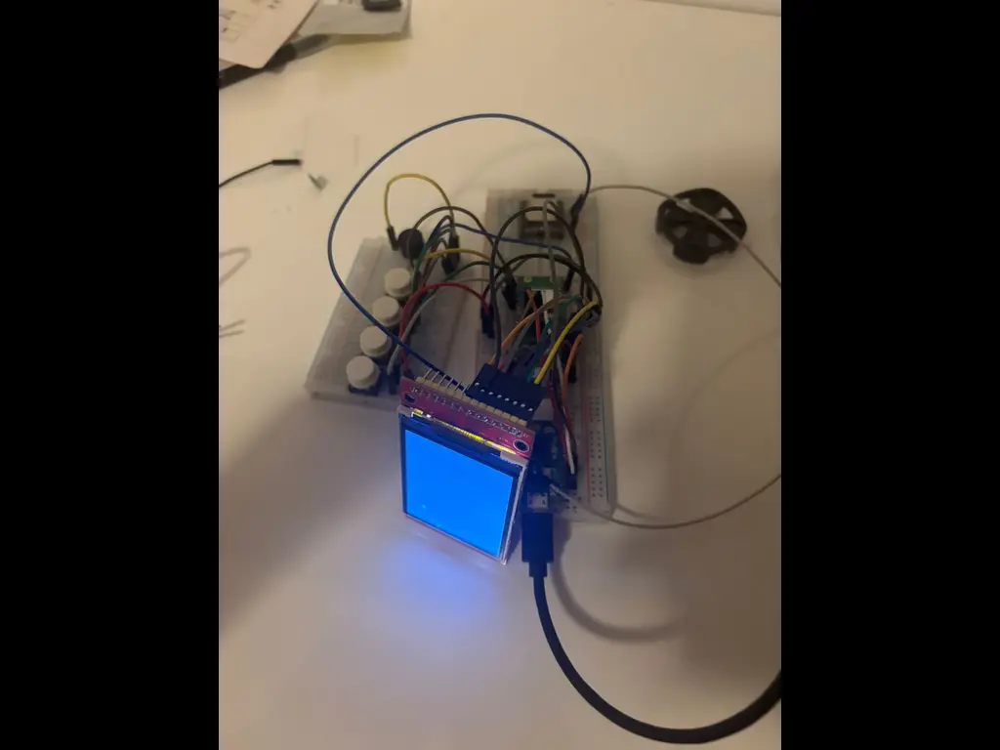
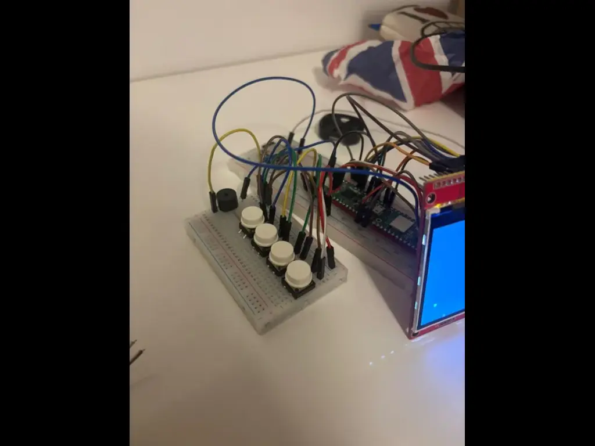

# Snake game

This project brings the classic Snake game to life on a minimalist embedded system, offering a retro gaming experience using physical button controls and a dynamic LED matrix display.

:::info 

*Author*: Vlad Adascalului \
*GitHub Project Link*: https://github.com/UPB-PMRust-Students/proiect-vladadas01

:::

## Description

This project consists of an interactive, classic Snake game implemented on a Raspberry Pi Pico. The game is displayed on a LED matrix screen and controlled using four directional push-buttons. The player navigates the snake on a 2D grid to collect "food," causing the snake's body to grow progressively. The game includes collisions with the walls and the snake's own body. Sound effects for events such as eating food or game over are provided using an MP3 module, offering richer audio feedback compared to simple tones.

Navigate your pixelated snake across a grid, gobbling up food and growing with each bite—all powered by a Raspberry Pi Pico 2W, an LED matrix, four tactile buttons, and an MP3 sound module. This embedded Snake game captures the charm of early arcade games in a compact and educational hardware setup.

## Motivation

The motivation behind this project is:

To implement a dynamic game on a resource-constrained embedded device.

To practice real-time rendering and input handling.

To explore using a microcontroller for interactive visual games with hardware.

## 3. Architecture

The system has the following layers:
- **Input Layer**:
  - 4x Push-buttons (for directional control: up, down, left, right)
- **Processing Layer**:
  - Raspberry Pi Pico 2W
  - Game logic engine written in Rust
  - MicroSD Card
- **Output Layer**:
  - 1x TFT SPI LCD screen (for visual game rendering)
  - 1x Passive buzzer for sound feedback
  - 1x DFPlayer Mini MP3 Module (for audio playback)
  - 1x PAM8403 Audio Amplifier Module with Potentiometer (for volume control and amplification)
  - 1x Set of Car Tweeters 003 (used as audio output/speakers)

Communication is done using:

| Component           | Interface | Connection Notes                |
|---------------------|-----------|---------------------------------|
| TFT LCD Screen      | SPI       |Uses SPI interface: CLK, MOSI,CS |
| Push Buttons (4x)   | GPIO      | Connected to GPIO with pull-up  |
| Piezo Buzzer        | GPIO      | Simple digital on/off control   |
| DFPlayer Mini MP3   | UART      | Connected via UART for audio    |
| Car Tweeters        | Analog    | Connected for speakers          |
| PAM8403 Audio       | Analog    | Connected to DFPlayer MP3       |
| MicroSD Card        | SPI/UART  | Used for storage                |

### Diagram
TODO

## Log

### Week 5 - 11 May
Documentation milestone, materials purchase, preparing materials for installation and testing the components.
### Week 12 - 18 May
Assembled all the materials and wired everything up. Wrote test software for each component to check good installation. Created the schematics in KiCad mirroring the phisical connections. Completed the Hardware Milestone.
### Week 19 - 25 May

## Hardware

The Raspberry Pi Pico 2W is the central microcontroller for the Snake Game. It offers a sufficient GPIOs to interface with peripherals required by the system.

The user controls the snake using four tactile push-buttons corresponding to movement directions. The game is displayed on a grid rendered on a TFT SPI LCD screen, offering a colorful and responsive interface. A piezo buzzer is also connected for basic sound feedback, such as playing a tone when food is collected or when the game ends. The snake game has a score system, and the game finish when the snake collide with a wall or when the head collide with snake's body. Also, when the snake eats it will become bigger. 

[VIDEO: Testing the Components](https://imgur.com/a/Mxk566S)

### Schematics
TODO

### Bill of Materials

| Device | Usage | Price |
|--------|--------|-------|
| [Raspberry Pi Pico 2W](https://www.optimusdigital.ro/en/raspberry-pi-boards/13327-raspberry-pi-pico-2-w.html) | The microcontroller | [40 RON](https://www.optimusdigital.ro/en/raspberry-pi-boards/13327-raspberry-pi-pico-2-w.html) |
| [LCD Screen](https://www.bitmi.ro/module-electronice/ecran-lcd-ili9341-cu-touch-si-slot-pentru-card-sd-2-4-10797-bitmi-ro.html) | Displaying the game (Output Device) | [70 RON](https://www.bitmi.ro/module-electronice/ecran-lcd-ili9341-cu-touch-si-slot-pentru-card-sd-2-4-10797-bitmi-ro.html) |
| [MicroSD card](https://www.optimusdigital.ro/ro/memorii/8678-card-microsd-original-de-16-gb-cu-noobs-compatibil-cu-raspberry-pi-4-model-b-varianta-bulk.html?srsltid=AfmBOopEUm88lKfpiyAiExQ-WxdVxxV2b42i_SbrP0cf6LYQUzrazFlq) | Memory Storage | [40 RON](https://www.optimusdigital.ro/ro/memorii/8678-card-microsd-original-de-16-gb-cu-noobs-compatibil-cu-raspberry-pi-4-model-b-varianta-bulk.html?srsltid=AfmBOopEUm88lKfpiyAiExQ-WxdVxxV2b42i_SbrP0cf6LYQUzrazFlq) |
| [Tweeters Auto](https://www.optimusdigital.ro/ro/tweetere/7870-set-tweetere-auto-003.html?srsltid=AfmBOooDD9xbXM-nMIsO6Ax_n_UrIk0siMkLCGdysj7wRW_E_SXpXezv) | Sound | [10 RON](https://www.optimusdigital.ro/ro/tweetere/7870-set-tweetere-auto-003.html?srsltid=AfmBOooDD9xbXM-nMIsO6Ax_n_UrIk0siMkLCGdysj7wRW_E_SXpXezv) |
| [MP3 Module](hhttps://www.optimusdigital.ro/ro/audio/1484-modul-mp3-player-in-miniatura-dfplayer-mini.html?srsltid=AfmBOookXmPbkRPnsb9FpwuL7V_COzi7vlHzNMjGprB6YizVn927mLTpjao&gQT=2) | Audio Module | [14 RON](https://www.optimusdigital.ro/ro/audio/1484-modul-mp3-player-in-miniatura-dfplayer-mini.html?srsltid=AfmBOookXmPbkRPnsb9FpwuL7V_COzi7vlHzNMjGprB6YizVn927mLTpjao&gQT=2) |
| [PAM8403 Potentiometer](https://www.optimusdigital.ro/ro/altele/1501-modul-amplificator-audio-cu-poteniometru-pam8403.html?srsltid=AfmBOoqDzrWRAIh-tnX9ry9jge_WvnLDy0ErJqzqNfDu0q6CRbLXAL3Pw7w&gQT=2) | Potentiometer | [7 RON](https://www.optimusdigital.ro/ro/altele/1501-modul-amplificator-audio-cu-poteniometru-pam8403.html?srsltid=AfmBOoqDzrWRAIh-tnX9ry9jge_WvnLDy0ErJqzqNfDu0q6CRbLXAL3Pw7w&gQT=2) |
| [Passive Buzzer](https://www.optimusdigital.ro/en/buzzers/12247-3-v-or-33v-passive-buzzer.html) | For collision | [1 RON](https://www.optimusdigital.ro/en/buzzers/12247-3-v-or-33v-passive-buzzer.html) |
| [Push Button](https://www.optimusdigital.ro/en/buttons-and-switches/1114-red-button-with-round-cover.html) | Confirm move | [4 x 2 RON](https://www.optimusdigital.ro/en/buttons-and-switches/1114-red-button-with-round-cover.html) |
| [Breadboard](https://www.optimusdigital.ro/en/breadboards/44-400p-hq-breadboard.html) | Testing the connections | [5 RON](https://www.optimusdigital.ro/en/breadboards/44-400p-hq-breadboard.html) |
| [Jumper wires](https://www.optimusdigital.ro/en/wires-with-connectors/885-wires-male-male-10p-10cm.html) | Connecting the components | [4 x 3 RON](https://www.optimusdigital.ro/en/wires-with-connectors/885-wires-male-male-10p-10cm.html) |
| **Total**             |          | **207 RON**     |

## Software

| Library                                                                 | Description                                             | Usage                                                             |
|-------------------------------------------------------------------------|---------------------------------------------------------|-------------------------------------------------------------------|
| [`embedded-hal`](https://github.com/rust-embedded/embedded-hal)        | Hardware Abstraction Layer for embedded systems         | Abstracts SPI and GPIO interfaces for peripherals like sensors |
| [`embassy`](https://github.com/embassy-rs/embassy)                     | Async framework for embedded Rust                       | Manages async tasks for input polling, game logic, and display update      |
| [`embedded-graphics`](https://github.com/embedded-graphics/embedded-graphics) | 2D graphics library for embedded devices                | Used to render the Snake grid and object markers |
| [`rp2040-hal`](https://github.com/rp-rs/rp-hal)                       | Hardware Abstraction Layer for Raspberry Pi Pico           | Gives the game firmware direct, safe access to on‑chip peripherals                                   |
| [`ili9341`](https://github.com/JeremySayers/pi-pico-ili9341-display)           | Platform‑agnostic driver for the ILI9341 SPI TFT controller |Drop‑in alternative if you wire up a larger colour display                    |
| [`log`](https://github.com/rust-lang/log)                              | Logging facade for Rust                                 | Provides internal logging for debugging                                 |
| [`panic-probe`](https://github.com/probe-rs/probe-rs)                  | Panic handler for embedded systems                      | Helps diagnose runtime panics                                            |
| [`static-cell`](https://github.com/embassy-rs/static-cell)             | Safe static storage                                     | For safely storing peripherals and shared resources in async context     
| [`heapless`](https://github.com/rust-embedded/heapless?utm_source=chatgpt.com)             | Fixed‑capacity, heap‑free data structures (Vec, String, queues, maps) for microcontrollers   | Stores the snake’s body coordinates and input queue without dynamic allocation   |

## Links
 

- [Embassy: Async Framework for Embedded Rust](https://embassy.dev/)  
- [PWM Buzzer How‑To: Generating tones on a piezo buzzer](https://www.reddit.com/r/embedded/comments/18uhi4c/rpi_pico_with_buzzer_how_to_play_a_tonesound/)
- [heapless: Fixed‑capacity collections for microcontrollers](https://docs.rs/heapless/latest/heapless/)

