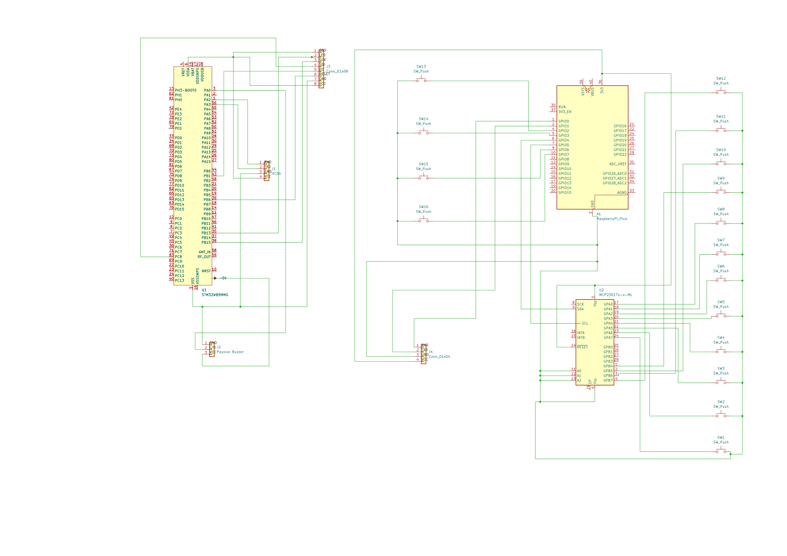

# Piano Trainer
A wireless piano learning assistant with falling notes, physical keys, and real-time scoring.

:::info 

**Author**: Adela-Mihaela Băieșiu \
**GitHub Project Link**: https://github.com/UPB-PMRust-Students/acs-project-2026-Adela717.git

:::

<!-- do not delete the \ after your name -->

## Description

Piano Trainer is an embedded piano learning system built around a wireless keyboard unit and a main display unit.

The project is inspired by piano tutorial videos where colored notes fall toward the piano keys. The user has a 12-key piano keyboard covering one chromatic octave. The keyboard unit detects key presses and sends them wirelessly using Bluetooth.

The main unit, built around the STM32 Nucleo-U545RE-Q development board, receives the key events, displays the falling notes on a TFT screen, generates audio feedback using a passive buzzer, and computes gameplay statistics.

The device includes a menu system for choosing predefined songs, a gameplay screen with falling notes, a listening mode for visualizing song notes without scoring, a results screen, and a best scores screen.

## Motivation

I chose this project because I learned piano using online videos where colored notes move toward the keys and show when and for how long each note should be played. I wanted to recreate this learning method as a physical embedded device.

## Architecture 

- **Piano input module**: reads the 12 physical piano keys corresponding to one chromatic octave.
- **Menu input module**: reads the control buttons used for navigating the interface: UP, DOWN, SELECT, and BACK.
- **Display module**: renders the start menu, song selection screen, gameplay screen, falling notes, results screen, listening mode screen, and best scores screen.
- **Song engine**: stores each song as a sequence of note events. Each event contains the note, the expected start time, and the note duration.
- **Audio module**: generates musical tones using a passive buzzer controlled through PWM.
- **Scoring module**: compares the expected notes with the user input and computes the final score, accuracy, number of correct notes, missed notes, and maximum combo.
- **Best scores module**: keeps track of the best scores achieved during the current runtime session.
- **Application state machine**: controls the transitions between the main menu, song selection, listening mode, gameplay, results, and best scores screens.
- **Wireless keyboard module**: reads the physical piano keys and menu buttons on a separate keyboard unit.
- **Bluetooth communication module**: sends key press, key release, and menu button events from the keyboard unit to the main display unit.
- **Listening mode module**: allows the user to visualize the notes of a selected song without scoring, useful for learning the melody before playing it.


## Log

<!-- write your progress here every week -->

### Week 5 - 11 May

- Settled on the project idea and shaped it into a small piano trainer with physical keys, audio feedback, a display, song selection, and scoring.
- Split the system into two parts: a wireless keyboard side and a main unit that handles sound, display, and game logic.
- Picked the main components and put together the first version of the hardware plan and bill of materials.

### Week 12 - 18 May

- Built the first working prototype and wired the keyboard side to the main unit.
- Got the 12 piano keys and menu buttons working, then configured the Bluetooth link between the two boards.
- Added the first STM32-side logic so the received key events could trigger piano sounds.
- Brought up a basic version of the TFT screen to confirm that the display integration was working.

### Week 19 - 25 May

- Reworked the display UI into a more complete menu-based interface.
- Added the screens for song selection, listening mode, gameplay, statistics, and navigation.
- Integrated the scoring and gameplay flow with the keyboard input and audio feedback.

## Hardware

The project is built as two separate hardware units: a wireless keyboard unit and a main display unit.

The wireless keyboard unit contains the physical piano keys and the menu control buttons. It is responsible for detecting user input and sending key events to the main unit through Bluetooth. The keyboard contains 12 physical keys, covering a chromatic octave.

The main display unit contains the STM32 Nucleo-U545RE-Q development board, the TFT display, and the passive buzzer. It receives input events from the wireless keyboard unit, updates the game state, displays the falling notes, generates sound, and computes the final statistics.

### Schematics



### Bill of Materials

<!-- Fill out this table with all the hardware components that you might need.

The format is 
```
| [Device](link://to/device) | This is used ... | [price](link://to/store) |

```

-->

| Device | Usage | Price |
|--------|--------|-------|
| STM32 Nucleo-U545RE-Q | Main microcontroller board used to run the Rust firmware, receive keyboard events, control the TFT display, and generate audio through PWM | Provided |
| Raspberry Pi Pico H | Secondary microcontroller used in the wireless keyboard unit to read the piano keys and menu buttons through the MCP23017 and forward events to the Bluetooth UART module | 41.14 RON |
| HC-05 Bluetooth UART Module | Bluetooth master module used on the Pico keyboard unit to transmit key and menu events wirelessly | 30.25 RON |
| HC-06 Bluetooth UART Module | Bluetooth slave module used on the STM32 main unit to receive key and menu events wirelessly | 30.4 RON |
| TFT SPI Display ST7789V 2.8 inch 240x320 | Used to display the main menu, song selection screen, listening mode, falling notes, results, and best scores | 58.99 RON |
| MCP23017 I/O Expander | Used by the wireless keyboard unit to read most of the piano keys through I2C, reducing the number of GPIO pins required | 7.77 RON |
| 12x12mm Tactile Push Buttons x16 | Used as 12 physical piano keys and 4 menu control buttons | 1.52 RON |
| Passive Buzzer Module 3.3V-5V | Used to generate musical tones through PWM | 6.44 RON |
| Breadboards | Used as the prototyping area for connecting the modules, buttons, power rails, and peripherals | 12.89 RON |
| 10 Male-Male Jumper Wires x4 | Used for breadboard connections between components | 10.30 RON |
| 10 Female-Male Jumper Wires x4 | Used for connecting modules with pins to the breadboard or Nucleo board | 8.66 RON |
| 10 Female-Female Jumper Wires x4 | Used for direct connections between modules with male header pins | 6.54 RON |

## Software

| Library | Description | Usage |
|---------|-------------|-------|
| embassy-rs | Async embedded framework for Rust | Used as the main runtime for the STM32 firmware |
| embassy-stm32 | STM32 hardware abstraction layer for Embassy | Used for UART, SPI, DMA, GPIO, timers, PWM, and clock configuration on the main unit |
| embassy-futures | Async utilities for Embassy-based applications | Used for coordinating asynchronous tasks and handling concurrent input/display logic |
| embedded-io-async | Async I/O traits for embedded systems | Used for reading UART data asynchronously from the Bluetooth module |
| embedded-hal | Common embedded hardware abstraction traits | Used for shared embedded traits such as PWM control |
| defmt + defmt-rtt | Lightweight embedded logging framework | Used for debugging and runtime logs through probe-rs |
| panic-probe | Panic handler for embedded Rust programs | Used to report firmware panics during debugging |
| Custom ST7789V display driver | Minimal SPI display driver implemented in Rust | Used to initialize the TFT display and draw the menu, gameplay, and results UI |
| heapless | Fixed-capacity data structures for embedded systems | Used for storing songs, notes, menu items, and scoring data without dynamic allocation |
| rp2040-hal / rp-pico | Hardware abstraction layer and board support package for Raspberry Pi Pico H | Used for GPIO, I2C, UART, and timing on the wireless keyboard unit |
| UART-based Bluetooth communication | Serial communication over HC-05/HC-06 Bluetooth modules | Used for sending key press, key release, and menu events from the keyboard unit to the main display unit |

## Links

<!-- Add a few links that inspired you and that you think you will use for your project -->
- https://youtu.be/NPBCbTZWnq0?si=qws_AIqdEubiwgxn
- https://embassy.dev/book/
- https://github.com/embassy-rs/embassy
