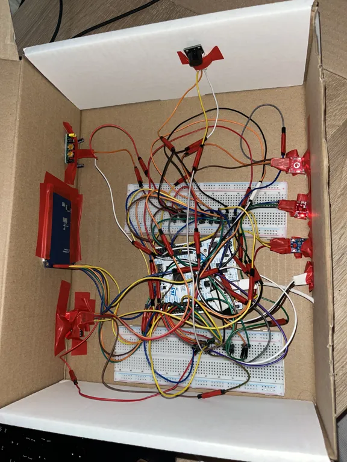
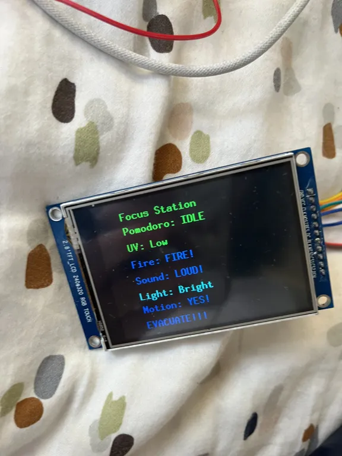
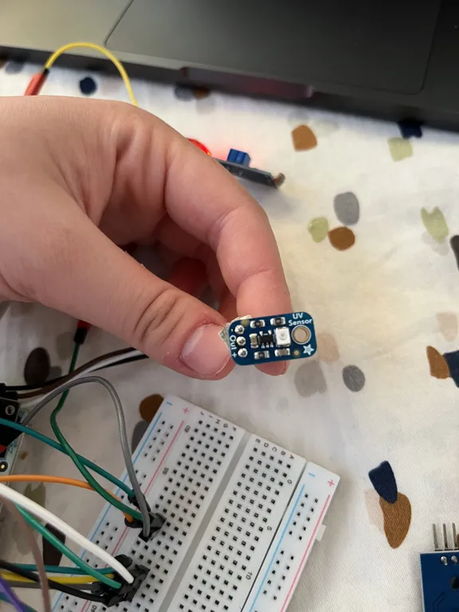
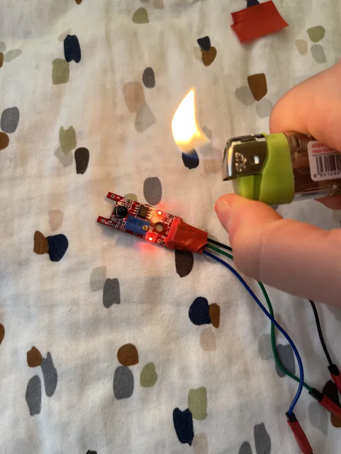
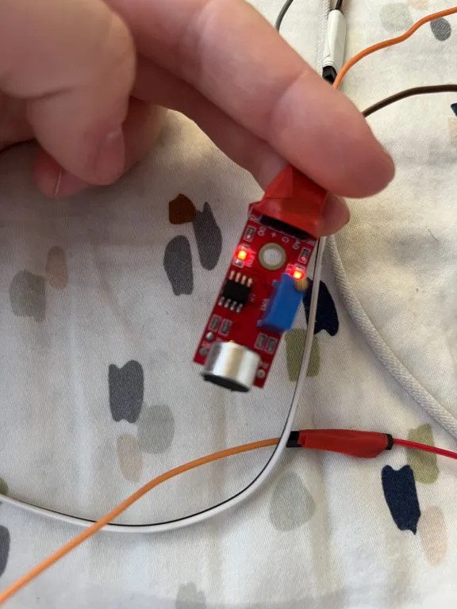
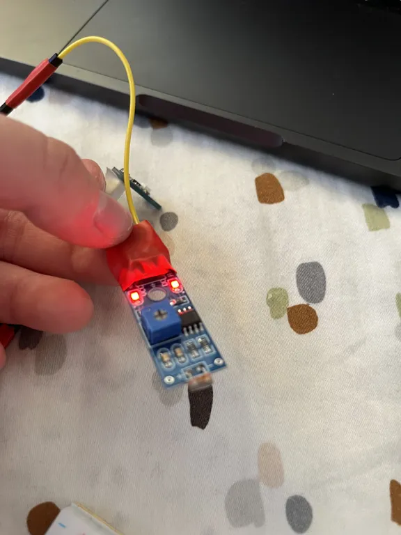
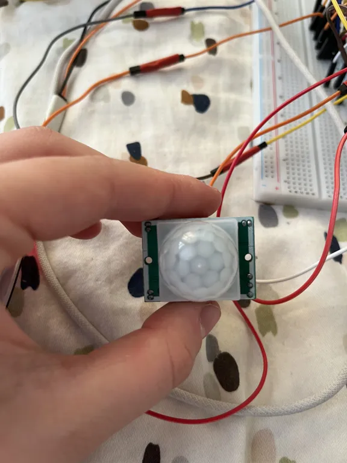
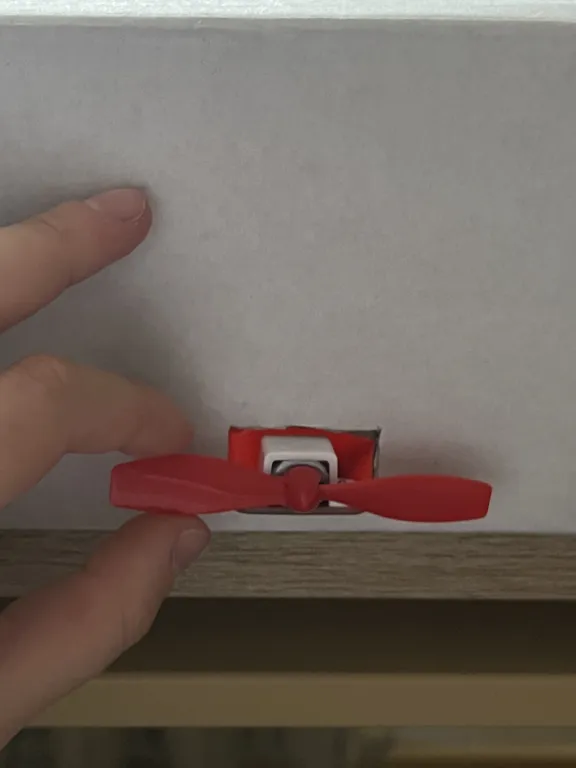
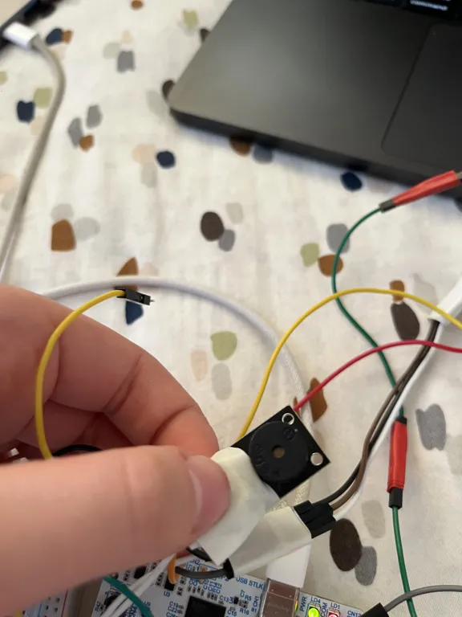
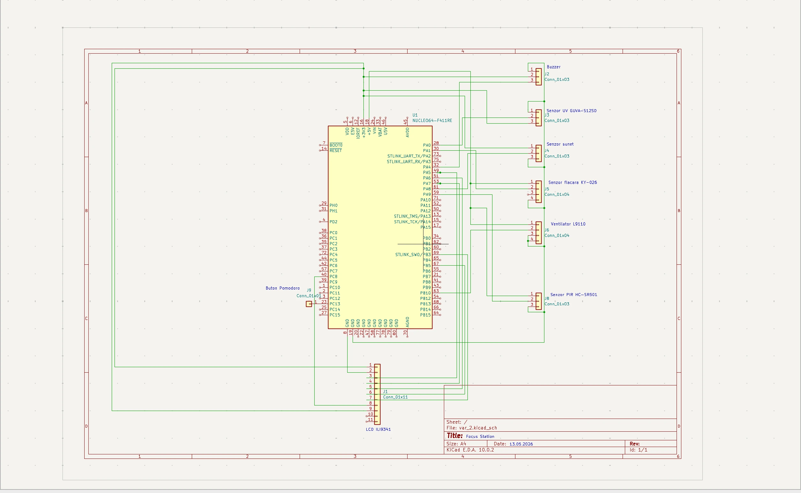

# The Focus Station

A desk-mounted environmental monitoring device that evaluates working conditions and computes a real-time Focus Score to help improve productivity.

:::info 

**Author**: Adelina Maria Alexe \
**GitHub Project Link**: [link_to_github](https://github.com/UPB-PMRust-Students/acs-project-2026-AdelinaAlexe)

:::

<!-- do not delete the \ after your name -->

## Description

The Focus Station is a device that monitors the environment at a user's desk and computes a Focus Score (0–100) representing how favorable the conditions are for concentrated work. It reads ultraviolet light intensity, ambient noise, room brightness, user-presence, and fire risk factors. Based on these inputs, the device displays the score and individual sensor readings on a color LCD using a grid dashboard UI layout with dedicated alert pop-ups.

Additionally, it controls a desk cooling fan automatically, signals Pomodoro work/break intervals through a passive buzzer, and transmits all data via USB UART to a local web server application on the user's computer for historical logging, productivity analysis, and persistence. The system detects when the user leaves the desk during work mode and reminds them to return, and also warns if the user stays at the desk during break time.

## Motivation

I chose this project because it addresses a real problem I experience daily. As someone who spends long hours at a desk, I often fail to notice when the room gets too warm, the air becomes stale, or the noise level rises, all factors that silently reduce concentration and productivity.

I wanted a compact, single-device solution focused specifically on the desk environment that combines environmental monitoring with productivity tools. The Pomodoro timer integration with motion detection makes the device a complete productivity companion rather than just a passive monitor.

## Architecture 

- **Sensor Subsystem**: Reads environmental data from multiple sensors — UV light and flame detection via ADC, sound level via ADC with peak detection, ambient light via digital GPIO with LM393 comparator, and user presence via PIR digital GPIO. Each sensor is sampled every loop iteration (~1 second).
- **Pomodoro Timer**: A state machine cycling through IDLE → WORK (25 min) → BREAK (5 min) → WORK, controlled by the on-board push button. Transitions trigger buzzer alerts. The fan activates automatically during WORK sessions.
- **Display System**: An ILI9341 2.4" TFT LCD connected via SPI shows all sensor readings with color-coded status indicators (green = normal, yellow = warning, red = alert), the Pomodoro state and countdown timer, and contextual text recommendations.
- **Alert System**: A passive buzzer emits distinct patterns for different events — short beep for Pomodoro transitions, rapid triple beep for flame detection, and medium beep for presence-related reminders. Alerts are prioritized: fire > light warning > motion reminders > noise.
- **Fan Control**: A mini fan with integrated L9110 driver activates automatically when the Pomodoro timer enters WORK mode, providing airflow during focus sessions.
- **Motion Intelligence**: The PIR sensor tracks user presence and integrates with the Pomodoro state — if no motion is detected for 7 seconds during WORK, it alerts "Back to work!"; if motion persists for 10 seconds during BREAK, it warns "Step away!".

### Architecture Diagram

<!-- TODO: Add diagrams.net diagram exported as SVG -->


## Log

<!-- write your progress here every week -->

### Week 4 - 10 May

Set up the development environment for the STM32 Nucleo board. Resolved a USB driver issue on macOS where the ST-LINK interface was being claimed by a kernel driver, preventing probe-rs from accessing the board through SWD. After fixing this, successfully ran `probe-rs info` and confirmed the board is detected as an ARM Cortex-M33 chip.
 
Wrote and flashed the first blinky program using Embassy on the board. The green LED on PA5 blinks at 1 Hz, confirming that the entire toolchain (cross-compilation, flashing, defmt logging over RTT) works correctly.

### Week 11 - 17 May

Hardware Milestone:

Identified the user button on the board and discovered that the button on PC13 uses inverted logic when pressed. Implemented a toggle mechanism with debouncing for the button and built the initial Pomodoro state machine with three states: IDLE, WORKING, and BREAK.
 
Started connecting and testing sensors one by one. Connected the buzzer and verified it produces tones. Connected the UV sensor via ADC and implemented baseline calibration to handle ADC. Connected the flame sensor via ADC and discovered that the analog output drops significantly when flame is detected (inverted logic). Implemented intensity-based flame detection with multiple severity levels.

Set up the LCD display via SPI with the mipidsi driver. Required configuring the PLL clock to 160 MHz for adequate SPI transfer speed. Integrated the display with sensor readings, showing color-coded text that updates in real time.
 
Created the full project structure with separate modules for each subsystem: sensors (UV, flame, sound), outputs (buzzer, fan), pomodoro state machine, and display.

### Week 18 - 24 May

Integrated all remaining components into the system. Connected the sound sensor via ADC using analog peak detection — sampling 100 readings per cycle and computing the maximum deviation from baseline to detect noise spikes. Connected the light sensor (photoresistor) as a digital input for ambient light detection. Connected the PIR motion sensor for user presence tracking.
 
Connected the new fan module with integrated driver. Implemented logic to activate the fan automatically during Pomodoro WORK sessions and deactivate it during BREAK and IDLE.
 
Implemented the motion-aware Pomodoro logic: tracking consecutive ticks of no-motion during WORK (triggers "Back to work!" alert after 7 seconds) and motion during BREAK (triggers "Step away!" alert after 10 seconds).
 
Built the complete alert priority system on the LCD: flame detection (highest priority, red "EVACUATE!!!"), excessive light ("Close blinds!"), motion reminders during Pomodoro, noise warnings ("Headphones on!"), and "All good!" when everything is normal. Each alert triggers appropriate buzzer patterns.
 


## Hardware

### STM32 Nucleo-U545RE-Q
 
The main microcontroller board, featuring an ARM Cortex-M33 core running at 160 MHz via PLL. It includes an integrated ST-LINK/V3E debugger for programming and real-time logging via RTT. The board provides both Arduino-compatible and ST Morpho headers for peripheral connections.
 
### LCD Display (ILI9341)
 
A 2.4" color TFT display with 240×320 pixel resolution, communicating over SPI at 16 MHz. It serves as the main user interface, showing the Pomodoro timer state and countdown, all sensor readings with color-coded status indicators (green/yellow/red), and contextual alert messages. The display uses the mipidsi driver with the embedded-graphics library for text rendering.
 

 
### UV Sensor (GUVA-S12SD)
 
A photodiode sensitive to UVA and UVB radiation. It outputs an analog voltage proportional to UV intensity, read via ADC. The sensor requires baseline calibration at startup to compensate for ADC offset at the 160 MHz system clock. UV levels are categorized as Low, Moderate, High, Very High, or Extreme with corresponding color coding on the display.
 

 
### Flame Sensor (KY-026)
 
An infrared flame detection module with both analog and digital outputs. The analog output (connected via ADC) provides intensity readings: the value drops significantly when a flame is present. The sensor is powered at 5V for adequate sensitivity. Flame detection triggers an immediate triple-beep buzzer alarm and displays "EVACUATE!!!" in red on the LCD.
 

 
### Sound Sensor
 
A microphone module with analog output connected via ADC. The system uses peak detection, sampling 100 readings per loop cycle and computing the maximum deviation from a calibrated baseline. When the deviation exceeds a threshold, noise is detected and "Headphones on!" is displayed as a recommendation. The sensor includes a potentiometer for sensitivity adjustment.
 

 
### Light Sensor (LM393 Photoresistor)
 
A photoresistor module with an integrated LM393 comparator that provides a digital output. It detects whether the ambient light level is above or below an adjustable threshold (set via onboard potentiometer). When excessive light is detected (e.g., direct sunlight on the desk), the system alerts "Close blinds!" with a buzzer beep. The display shows "Light: Bright" or "Light: Dark" accordingly.
 

 
### PIR Sensor (HC-SR501)
 
A passive infrared motion sensor that detects human presence through body heat radiation. It has a detection range of up to 7 meters with a 110 degrees field of view. The sensor outputs a digital HIGH signal when motion is detected. In the Focus Station, it integrates with the Pomodoro timer, tracking whether the user is at the desk during WORK mode and whether they have stepped away during BREAK mode, providing appropriate reminders.
 

 
### Mini Fan with L9110 Driver
 
A small DC fan module with an integrated L9110 H-bridge driver, eliminating the need for external transistors or MOSFETs. The fan is controlled via a single GPIO pin: HIGH to run, LOW to stop. In the Focus Station, it activates automatically when the Pomodoro timer enters WORK mode, providing airflow during focus sessions, and deactivates during BREAK and IDLE states.
 

 
### Passive Buzzer
 
A buzzer module driven by GPIO that produces audible tones when the pin is set HIGH. It generates different alert patterns depending on the event: a short confirmation beep at startup and Pomodoro transitions, a rapid triple beep for flame detection emergencies, and medium-length beeps for presence-related Pomodoro reminders.
 


### Schematics

<!-- TODO: Add KiCad schematic exported as SVG -->


### Bill of Materials

<!-- Fill out this table with all the hardware components that you might need.

The format is 
```
| [Device](link://to/device) | This is used ... | [price](link://to/store) |

```

-->

| Device | Usage | Price |
|--------|-------|-------|
| [STM32 Nucleo-U545RE-Q](https://www.st.com/en/evaluation-tools/nucleo-u545re-q.html) | Main microcontroller board | Provided by university |
| [LCD ILI9341 2.4" TFT](https://cdn-shop.adafruit.com/datasheets/ILI9341.pdf) | Display for Focus Score, sensors, and Pomodoro timer | ~70 RON |
| [HC-SR501 PIR Sensor](https://www.emag.ro/senzor-de-miscare-detector-pir-hc-sr501-sensibilitate-reglabila-33-x-23-x-30-mm-multicolor-2-a-020/pd/DZLTKLMBM/) | User presence detection at desk | ~10 RON |
| [GUVA-S12SD](https://cdn-shop.adafruit.com/datasheets/1918guva.pdf) | UV radiation sensor | ~25 RON |
| [KY-026 Flame Sensor](https://www.hwlibre.com/en/ky-026/) | Fire/flame detection | ~7 RON |
| [KY-038 Sound Sensor](https://www.openimpulse.com/blog/wp-content/uploads/wpsc/downloadables/Sound-Sensor-Schematic.pdf) | Noise detection | ~5 RON |
| [LM393 Light Sensor](https://www.emag.ro/modul-senzor-lumina-intensitate-luminoasa-yqzbml-mod-light/pd/D2PMPD2BM/?ref=history-shopping_487582703_156063_2) | Ambient light level detection | ~5 RON |
| [Passive Buzzer Module](https://www.handsontec.com/dataspecs/module/passive%20buzzer.pdf) | Pomodoro alerts and Focus Score warnings | ~5 RON |
| [Fan Module with L9110 Driver](https://www.emag.ro/modul-ventilator-5v-l9110-thbxal-fan-mod/pd/D75W5D2BM/?ref=history-shopping_487582703_156063_1) | Desk cooling during work sessions | ~15 RON |
| 1N4007 Diode | Flyback protection for fan motor | ~1 RON |
| Resistors (10kΩ, 20kΩ) | Voltage divider for MQ-7 analog output | ~2 RON |
| Breadboard + Jumper Wires | Prototyping connections | ~20 RON |


## Software

| Library | Description | Usage |
|---------|-------------|-------|
| [embassy-stm32](https://github.com/embassy-rs/embassy) | Async HAL for STM32 | Peripheral access: GPIO, SPI, ADC |
| [embassy-executor](https://github.com/embassy-rs/embassy) | Async task executor | Running the main loop with async delays |
| [embassy-time](https://github.com/embassy-rs/embassy) | Timekeeping and delays | Pomodoro countdown, sensor sampling intervals |
| [embassy-embedded-hal](https://github.com/embassy-rs/embassy) | Embedded HAL bridge | SpiDeviceWithConfig for shared SPI bus |
| [embassy-sync](https://github.com/embassy-rs/embassy) | Sync primitives | Mutex for SPI bus sharing |
| [mipidsi](https://github.com/almindor/mipidsi) | MIPI DCS display driver | Controlling the ILI9341 LCD over SPI |
| [embedded-graphics](https://github.com/embedded-graphics/embedded-graphics) | 2D graphics library | Drawing text and UI elements on the LCD |
| [defmt](https://github.com/knurling-rs/defmt) | Deferred formatting logger | Debug logging over RTT during development |
| [defmt-rtt](https://github.com/knurling-rs/defmt) | RTT transport for defmt | Transmitting log messages to host computer |
| [panic-probe](https://github.com/knurling-rs/probe-run) | Panic handler | Displaying panic messages via defmt |
| [heapless](https://github.com/rust-embedded/heapless) | Static data structures | Fixed-size strings for display text formatting |

## Links

<!-- Add a few links that inspired you and that you think you will use for your project -->

1. [Embassy documentation](https://embassy.dev/book/)
2. [STM32U545 Datasheet](https://www.st.com/resource/en/datasheet/stm32u545re.pdf)
3. [Nucleo-U545RE-Q User Manual (UM3062)](https://www.st.com/resource/en/user_manual/um3062-stm32u3u5-nucleo64-boards-mb1841-stmicroelectronics.pdf)
4. [Rust on STM32 Workshop](https://rust.ipworkshop.ro/docs/embassy/)
5. [ILI9341 Display Datasheet](https://cdn-shop.adafruit.com/datasheets/ILI9341.pdf)
6. [GUVA-S12SD UV Sensor Datasheet](https://cdn-shop.adafruit.com/datasheets/1918guva.pdf)
7. [mipidsi Rust crate documentation](https://docs.rs/mipidsi/latest/mipidsi/)
8. [embedded-graphics documentation](https://docs.rs/embedded-graphics/latest/embedded_graphics/)
