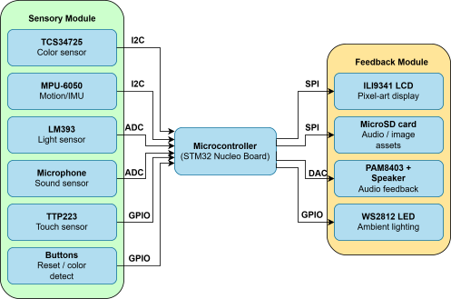
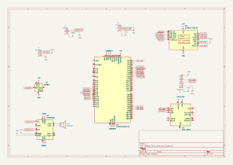

# Digital Fairy Companion
An embedded fairy companion that reacts to light, sound, touch, and color with animated expressions, synchronized audio, and mood-driven lighting.

:::info 

**Author**: Ciupitu Alexandra-Isabela\
**GitHub Project Link**: [link_to_github](https://github.com/UPB-PMRust-Students/acs-project-2026-SabeCiupi)

:::

<!-- do not delete the \ after your name -->

## Description

The Digital Fairy Companion functions as a reactive embedded system that translates environmental data into interactive emotional responses to simulate a sentient digital presence. By continuously monitoring real-time inputs from light, motion, sound, color sensors and by capacitive touch interaction, the system utilizes a complex Finite State Machine to manage over seventeen distinct behavioral states. These inputs are processed by an STM32 Nucleo microcontroller which autonomously coordinates visual animations on a 2.4-inch LCD, synchronized audio responses stored on a microSD card, and dynamic ambient lighting via RGB LEDs. In practice, the system adapts its persona based on environmental triggers, such as entering a sleep state in low light, providing a comprehensive multi-sensory user experience.

## Motivation

I chose this project because of a deep conviction that mood and mental well-being are fundamental pillars for personal growth and resilience in daily life. By merging the technical rigor of embedded systems with the whimsical charm of childhood nostalgia, I aimed to recreate the sense of magic that is often absent in standard modern technology. This project serves as a bridge between the complex mechanics of real-time sensor processing and the emotional human experience, providing a supportive companion that acknowledges and reacts to its user's environment. Ultimately, developing this system from the ground up allows me to explore how hardware and software can be harnessed not just for utility, but to foster a more mindful and enchanting atmosphere within a personal workspace.

## Architecture 

<!--Add here the schematics with the architecture of your project. Make sure to include:
 - what are the main components (architecture components, not hardware components)
 - how they connect with each other-->


### Components and Interconnection
The Digital Fairy Companion is structured into three primary functional modules that work in tandem to create an interactive experience:
* **Sensory Module**

  This layer is responsible for environmental data acquisition. It utilizes a TCS34725 for color identification, an MPU 6050 for motion and rhythm detection, a photoresistor for light intensity, an analog microphone for sound levels, and a TTP223 capacitive sensor for touch interaction. These sensors are connected to the central unit using a mix of I2C, SPI, and ADC interfaces.

* **Processing & Logic Module**

  At the core of the system sits the NUCLEO-U545RE-Q microcontroller, which implements a Finite State Machine (FSM) to manage over 10 distinct emotional states. It evaluates incoming sensor data to determine the appropriate behavior, such as switching from "Sleepy" to "Scared" based on sudden light and sound changes.

* **Feedback & Enclosure Module**

  The system produces outputs through a 2.4-inch ILI9341 LCD for pixel-art animations, a PAM8403 amplifier paired with a 1W speaker for audio, and WS2812 RGB LEDs for status-based lighting. The entire system is integrated into a thematic "Fairy House" enclosure, where the screen acts as a window and sensors are strategically hidden in decorative elements like an entrance flower or the roof.

### Data & Logic Flow
Data enters the system through various protocols: I2C for complex sensory modules (Color and IMU) and SPI for high-speed communication with the LCD and SD card. The microcontroller performs real-time analysis of these inputs to trigger state transitions. Once a state is identified, the MCU retrieves corresponding graphical frames and audio clips from the microSD card and updates the visual and auditory outputs simultaneously.

## Log

<!-- write your progress here every week -->
### Week 2 - 8 March
I choosed my project idea and I thought the details of the project.

### Week 13 - 19 April
I wrote the initial documentation.

### Week 5 - 11 May

This week, I focused on the hardware assembly of the project. I successfully soldered the components onto the pins using a soldering iron and solder, ensuring reliable electrical connections. Additionally, I purchased a speaker to complete the audio subsystem for the device.

### Week 12 - 18 May

This week, I finalized the remaining minor hardware details and adjustments to ensure all connections were perfectly secure. Additionally, I focused on implementing the software architecture, successfully writing the asynchronous code that integrates all sensors and brings my digital fairy companion to life.

### Week 19 - 25 May

## Hardware

Each component was selected to balance high performance with the low-power requirements of an always-on companion device:
* **Microcontroller (MCU)**

  The NUCLEO-U545RE-Q was chosen for its ultra-low-power capabilities and sufficient processing power to handle multiple serial protocols and complex FSM logic concurrently.

* **Display & Storage**

  The ILI9341 LCD module was selected for its vibrant color reproduction and integrated microSD slot, which simplifies the wiring for the SPI bus while providing ample storage for pixel-art assets.

* **Sensors**

  The TCS34725 provides superior color accuracy via I2C, while the MPU 6050 (GY-521) offers 3-axis precision for detecting physical interaction or "dizziness". The TTP223 capacitive touch sensor allows for a seamless "petting" interface without mechanical wear.

* **Audio Subsystem**

  To provide clear auditory feedback, the PAM8403 Class D amplifier is used to drive a compact 1W 8ohm speaker, delivering high-efficiency sound reproduction directly from the board's DAC.

* **Prototyping & Power**

  The system is assembled on an MB102 830-point breadboard using a combination of male-to-female and male-to-male jumper wires. Power is supplied through the USB connection of the Nucleo board, ensuring a stable 5V and 3.3V supply for all modules.

### Schematics

<!--Place your KiCAD or similar schematics here in SVG format.-->


### Bill of Materials

<!-- Fill out this table with all the hardware components that you might need.

The format is 
```
| [Device](link://to/device) | This is used ... | [price](link://to/store) |

```

-->

| Device | Usage | Price |
|--------|-------|-------|
| [ILI9341 2.4" LCD with Touch and SD Slot](https://www.bitmi.ro/ecran-lcd-ili9341-cu-touch-si-slot-pentru-card-sd-2-4-10797-bitmi-ro.html?gad_source=1&gad_campaignid=22990790771&gclid=Cj0KCQjwm6POBhCrARIsAIG58CI9J_OjbqLsP55WVXLVXK4t0tbIUI6HwqQBbrRAZelJB7tnRIu_BBwaAl8tEALw_wcB) | Display for pixel-art animations and SD card storage | [66,99 RON](https://www.bitmi.ro) |
| [TCS34725 Color Recognition Sensor](https://www.bitmi.ro/senzor-de-recunoastere-culorilor-tcs34725-11528.html?gad_source=1&gad_campaignid=21312430054&gclid=Cj0KCQjwm6POBhCrARIsAIG58CKA59ezjv7EMOcSnebIJfpuMzCeV7eYwOhPFfXKTtjKoG95O3QhUHIaAs4fEALw_wcB) | Detects ambient colors for state transitions | [19,99 RON](https://www.bitmi.ro) |
| [GY-521 MPU-6050 Gyroscope + Accelerometer](https://www.bitmi.ro/modul-giroscop-accelerometru-pe-3-axe-gy-521-11022.html?gad_source=1&gad_campaignid=22991722025&gclid=Cj0KCQjwm6POBhCrARIsAIG58CLV1czH8KcB0ugE427ynmQnYKl73YCqR8sPsFia3oSTV-r8sD_R5LIaAvUKEALw_wcB) | Motion and rhythm detection | [24,19 RON](https://www.bitmi.ro) |
| [PAM8403 Class D Audio Amplifier Module](https://www.bitmi.ro/modul-amplificator-audio-clasa-d-2x3w-dc-5v-pam8403-10764.html) | Drives the speaker for audio feedback | [5,99 RON](https://www.bitmi.ro) |
| [High Sensitivity Microphone Sound Sensor Module](https://www.bitmi.ro/modul-senzor-sunet-cu-microfon-sensibilitate-ridicata-iesire-analogica-11248.html?gad_source=1&gad_campaignid=21312430054&gclid=Cj0KCQjwm6POBhCrARIsAIG58CKOXY7KbNqWNDGkSCjvKiWgJLeFwFiP5H9MZ4EDyVmPl2ZfKPiSrCIaAh34EALw_wcB) | Detects ambient sound levels | [13,92 RON](https://www.bitmi.ro) |
| [WS2812 RGB5050 LED Module](https://www.bitmi.ro/modul-led-rgb5050-ws2812-10402.html) | Status-based ambient lighting | [3,99 RON](https://www.bitmi.ro) |
| [CJMCU RGB LED Module](https://www.optimusdigital.ro/en/others/13627-cjmcu-rgb-led-module.html?search_query=modul+led+rgb&results=34) | Status-based ambient lighting | [4,99 RON](https://www.optimusdigital.ro) |
| [LM393 Photodiode Sensor Module](https://www.bitmi.ro/senzori-electronici/modul-senzor-cu-fotodioda-lm393-10524.html) | Detects ambient light intensity | [3,65 RON](https://www.bitmi.ro) |
| [TTP223 Capacitive Touch Sensor](https://www.bitmi.ro/senzor-touch-capacitiv-ttp223-10993.html?gad_source=1&gad_campaignid=22991722025&gclid=Cj0KCQjwm6POBhCrARIsAIG58CJL3fHTJQgAh4WWhmBka0jOd8Hln5wbZWOXjDbRidbKQH-Fw2FF9ZcaAlqQEALw_wcB) | Touch/petting interaction interface | [1,98 RON](https://www.bitmi.ro) |
| [MB102 830-Point Breadboard](https://www.bitmi.ro/componente-electronice/breadboard-830-puncte-mb-102-10500.html) | Prototyping platform | [13,99 RON](https://www.bitmi.ro) |
| [400-Point Breadboard](https://www.bitmi.ro/electronica/breadboard-400-puncte-pentru-montaje-electronice-rapide-10633.html) | Buttons platform | [6,99 RON](https://www.bitmi.ro) |
| [40x Dupont Wires Male-Female 20cm](https://www.bitmi.ro/electronica/40-x-fire-dupont-tata-mama-20cm-10512.html) | Connecting modules to microcontroller | [6,99 RON](https://www.bitmi.ro) |
| [40x Dupont Wires Male-Male 20cm](https://www.bitmi.ro/electronica/40-x-fire-dupont-tata-tata-20cm-10511.html) | Breadboard connections | [8,99 RON](https://www.bitmi.ro) |
| [40x Dupont Wires Female-Female 30cm](https://www.bitmi.ro/electronica/40-fire-dupont-mama-mama-30cm-10503.html) | Breadboard connections | [6,99 RON](https://www.bitmi.ro) |
| Mini Speaker 1W 8Ω | Audio output | 18 RON |
| MicroSD Card | Storing graphical frames and audio clips | 39.99 RON |
| Tactile Push Button 6x6mm | Reset and color detection triggers | 0.65 RON x 3 |
| 1x40 Pin Header 2.54mm | Connecting PAM8403 to breadboard | 2 RON |
| NUCLEO-U545RE-Q | Main microcontroller running the FSM logic | - RON |


## Software
| Library | Description | Usage |
|---------|-------------|-------|
| [embassy-stm32](https://crates.io/crates/embassy-stm32) | Hardware Abstraction Layer (HAL) asynchronous dedicated to STM32 microcontrollers. | Initialization of system clocks and direct control of hardware peripherals: GPIO pins (Input, Output), asynchronous interruptions on pins (ExtiInput), communication bus (SPI, I2C), sound generator (DAC) and LED timers (SimplePwm). |
| [embassy-executor](https://crates.io/crates/embassy-executor) | High-efficiency asynchronous cooperative runtime for embedded systems. | Manage priorities and run parallel to the 9 competing tasks (tasks) of the fairy, alternating processing time without preemptive bottlenecks. |
| [embassy-time](https://crates.io/crates/embassy-time) | Asynchronous utilities for time management and timers. | Allows executing asynchronous breaks (Timer::after_millis), measuring the duration of events and releasing the processor during expectations. |
| [embassy-sync](https://crates.io/crates/embassy-sync) | Primitive thread-safe synchronization (channels, mutexes) for asynchronous environments. | It implements the inter-task message queue (Channel) used by sensors to send commands to the FSM brain, as well as providing support for safe atomic blockages. |
| [embassy-embedded-hal](https://crates.io/crates/embassy-embedded-hal) | Implementations of shared busses. | Allows safe sharing of the same physical SPI1 bus between the TFT screen and the MicroSD card reader, avoiding data collisions. |
| [embedded-graphics](https://crates.io/crates/embedded-graphics) | Optimised 2D graphics library for small integrated screens. | Define color models (Rgb565), coordinate points, and draw decoded pixel packets from the card directly on the screen. |
| [mipidsi](https://crates.io/crates/mipidsi) | High-level universal driver for screens based on SPI controllers. | Manages boot sequence, 240x320 resolution, and hardware control for ILI9341 chip color screen. |
| [display-interface-spi](https://crates.io/crates/display-interface-spi) | Transport software interface dedicated to SPI bus screens. | Translates drawing logic commands from the graphics driver into raw bit packs sent to the Data/Command (DC) and Clock physical pins. |
| [embedded-sdmmc](https://crates.io/crates/embedded-sdmmc) | High-efficiency asynchronous cooperative runtime for embedded systems. | Allows directory opening, real-time fragmented navigation and reading of animation files (.RAW) and audio (.WAV) stored on the MicroSD card. |
| [mpu6050](https://crates.io/crates/mpu6050) | Driver for inertial sensor (IMU) with 6 axes MPU6050. | Interfaces the sensor on the I2C bus and extracts the raw accelerations on the X, Y and Z axes to detect when the fairy is slightly moved or shaken. |
| [tcs3472](https://crates.io/crates/tcs3472) | Driver for optical color sensor and ambient light TCS34725. | Activates the RGB and Clear photodiodes of the sensor, allowing to read the colors from reality and send them to the normalization algorithm. |
| [embedded-hal](https://crates.io/crates/embedded-hal) | Traits (traits) and standard abstractions for embedded hardware in Rust. | Provides a common language between the sensor drivers and the physical pins of the microcontroller, mapping the software functionalities on the PWM channels. |
| [defmt](https://crates.io/crates/defmt) & [defmt-rtt](https://crates.io/crates/defmt-rtt)| Ultra-fast and efficient space logging framework for microcontrollers. | Sends diagnostic text messages and telemetry data from the board directly to the computer console via the Segger RTT protocol without consuming unnecessary Flash memory. |
| [panic-probe](https://crates.io/crates/panic-probe/) | Handler for critical errors (panic) integrated directly with defmt. | If the code encounters a fatal error, it stops execution safely and prints the exact code line and backtrace into the terminal for debugging. |
| [static_cell](https://crates.io/crates/static_cell) | Mechanism for the safe creation of static references to runtimes without allocation on heap. | It allows the transformation of communication buses (SPI and I2C) into global static resources, so that they can be shared and accessed by all tasks started in the main. |
| [cortex-m](https://crates.io/crates/cortex-m) | Functii de nivel scazut arhitectura de procesoare ARM Cortex-M. | Used for the execution of the microsecond loop at the assembly instruction level (cortex_m::asm::delay), ensuring the synchronization of the audio tact for DAC. |

### Description software
Loop states:
- STATE_NEUTRAL: The default companion state. The fairy loops an idle animation with occasional eye-blinking and soft audio. It actively listens to all environmental sensors.
- STATE_SLEEPY: Triggered when the photodiode detects sustained darkness (sleeping animation and plays a continuous lullaby).
- STATE_HAPPY: Triggered when the TTP223 touch sensor is actively held. The fairy loops a happy animation and playful sounds. It features a short grace period to prevent accidental interruption from touch bouncing.
- STATE_DANCE: Triggered by gentle movements from the MPU6050 accelerometer. The fairy loops a dancing animation while the RGB LED runs a high-speed disco stroboscope cycle.

Reaction states:
- STATE_HELLO: The initial hardware-protected introduction state at startup. It plays an introductory animation and audio clip before automatically transitioning to NEUTRAL.
- STATE_WAKING_UP: Executes only if the fairy is in SLEEPY mode and light returns.
- STATE_FEAR: Triggered by a sudden noise spike (NoiseBurst) or an ultra-fast light flash (blitz effect).
- STATE_ANGRY: Triggered by sustained loud noise or when the fairy is shaken/disturbed while trying to sleep. When the anger animation finishes, it dynamically checks the room: transitioning directly back to SLEEPY if it is dark, or to NEUTRAL if it is bright.
- STATE_DIZZY: Triggered by sudden, violent shaking detected by the gyroscope. It locks the fairy into a dizzy state for exactly 5 seconds before returning to normal.

EXTI BUTTONS:
- STATE_COLOR_DETECT: ctivated by pressing the dedicated color button. This state bypasses all background sensors. It polls the TCS34725 sensor, runs a custom saturation-boosting math algorithm, and streams live, vibrant BGR colors onto the TFT screen. A second press toggles the fairy back to her previous stable state.
- Emergency Reset: Pressing the hardware reset button instantly overrides any current state (including protected loops) and forces the system back to STATE_HELLO.

## Links

<!-- Add a few links that inspired you and that you think you will use for your project -->

1. [Nucleo STM32F401RE with CC3000 and ILI9341 LCD](https://youtu.be/UnLNsv0Yht0?si=uK1fpNcbcgJiIeQF)


