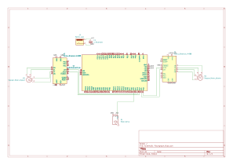

# Polargraph
A vertical drawing machine that uses a polar coordinate system to create pen-on-paper art

:::info 

**Author**: Alexandru-Vlad Bîrsan \
**GitHub Project Link**: https://github.com/UPB-PMRust-Students/acs-project-2026-vldxndr

:::

## Description

Polargraph - Vertical Plotter

The Polargraph is a vertical DRP (Digital Reconstruction Plotter) that operates on a polar coordinate system. Unlike the traditional plotter or printer that works on a X Y axis the polargrah transforms polar coordinates into coordonates on the paper by using two motors fixed over the paper that hold wires that have variable lenghts so they can position the drawing tool where it needs to be.

## Motivation

The idea came to me because I have previously studied architecture and have always wanted to have something that could draw using real writing utensils, because while a printer can draw exactly what you want using pin point accuracy it lacks the soul of a hand drawing. This project aims to have the accuracy of a printer while portraying a hand rendered drawing.

## Architecture 

## Log

### Week 27 - 30 April

Wrote initial documentation and made the first diagram while ordering the parts. Decided to use preexisting software for transforming drawings into lists of instructions.

### Week 12 - 18 May

Received all hardware components. Assembled the physical frame using a 60x80cm wooden board and mounted the two NEMA 17 stepper motors at 51.8cm apart. Wired the A4988 drivers directly to the STM32 Nucleo using dupont wires and a breadboard. Successfully tested basic stepper motor movement using Embassy async Rust firmware.

### Week 19 - 25 May

Implemented full polargraph kinematics (inverse kinematics using polar-to-cartesian conversion). Added G-Code parser over UART (USART1 at 115200 baud) using BufferedUart. Implemented line interpolation with 1mm segments for smooth curves. Added SG90 servo pen lift control (M3/M5 commands). Successfully tested drawing a square using a Python script to stream G-Code from a .ngc file.

## Hardware

The Polargraph is powered by an external 12V DC source to ensure constant torque for the stepper motors. For development purposes, the STM32 Nucleo is tethered via USB for real-time G-Code streaming and debugging. I also used a buck converter to give a steady current to the servo motor directly from the outlet converted to 3v3 because the connection on the stm 3v3 did not give suffiecient current. 3D printed a gondola that houses the servo motor(pen lifter) and the pen itself that is held up by the belts with
2 anchor points. Built a frame for the panel to stay upright and the electronic equipment to be held onto the back of it.

### Schematics

### Bill of Materials

| Device | Usage | Price |
| :--- | :--- | :--- |
| [STM32 Nucleo-U545](https://www.st.com/en/microcontrollers-microprocessors/stm32u545.html) | Main Controller (Brain of the project) | Owned |
| [NEMA 17 Stepper Motor (1.7A)](https://www.optimusdigital.ro/ro/motoare-pas-cu-pas/106-motor-pas-cu-pas-nema-17-40mm-17a.html) | Axis movement (2 pieces required) | [130 RON](https://www.optimusdigital.ro) |
| [A4988 Stepper Driver](https://sigmanortec.ro/) | Motor control (2 pieces required) | [20 RON](https://sigmanortec.ro) |
| [A4988 Expansion Board](https://sigmanortec.ro/) | Driver carrier with DIP microstepping and terminal block | [10 RON](https://sigmanortec.ro) |
| [SG90 Micro Servo](https://www.optimusdigital.ro/ro/servomotoare/9-servomotor-sg90.html) | Pen lift mechanism | [15 RON](https://www.optimusdigital.ro) |
| [12V 5A Power Supply](https://www.optimusdigital.ro/ro/surse-de-alimentare/123-sursa-de-alimentare-12v-5a.html) | External power for stepper motors | [55 RON](https://www.optimusdigital.ro) |
| [GT2 Pulleys & Belt Kit](https://www.optimusdigital.ro/ro/curele-si-fulii/145-fulie-gt2-20-dinti-5mm.html) | Mechanical transmission system | [40 RON](https://www.optimusdigital.ro) |
| [Breadboard MB-102](https://www.optimusdigital.ro/ro/prototipare/10-breadboard-830-puncte.html) | Prototyping and circuit connections | [15 RON](https://www.optimusdigital.ro) |
| [Jumper Wires M-M / F-M](https://www.optimusdigital.ro/ro/fire-conectori-si-socluri/894-set-fire-tata-tata-65-buc.html) | Connecting components to Nucleo | [15 RON](https://www.optimusdigital.ro) |
| [DC Jack Adapter](https://www.optimusdigital.ro/ro/fire-conectori-si-socluri/124-mufa-dc-mama-cu-terminal-block.html) | Connecting the 12V supply | [5 RON](https://www.optimusdigital.ro) |
| [Capacitor 100uF](https://www.optimusdigital.ro/ro/componente-pasive/220-condensator-electrolitic-100uf-35v.html) | Power spike protection for drivers | [5 RON](https://www.optimusdigital.ro) |

## Software

| Library | Description | Usage |
| :--- | :--- | :--- |
| [embassy-stm32](https://github.com/embassy-rs/embassy) | Async HAL for STM32 | GPIO for motor control, BufferedUart for G-Code streaming, PWM for servo |
| [embassy-executor](https://github.com/embassy-rs/embassy) | Async executor for embedded | Entry point and task runner |
| [embassy-time](https://github.com/embassy-rs/embassy) | Async timers | Precise delays for step pulses |
| [defmt](https://github.com/knurling-rs/defmt) | Logging framework | Debug logging via RTT |
| [panic-probe](https://github.com/knurling-rs/defmt) | Panic handler | Sends panic info through probe-rs |
| [libm](https://github.com/rust-lang/libm) | Math library for no_std | sqrtf and ceilf for inverse kinematics |
| [embedded-io-async](https://github.com/rust-embedded/embedded-hal) | Async IO traits | Read/Write on BufferedUart |

#### Host Software & Toolchain

To transform digital images into physical drawings, the project uses a multi-step toolchain:

1. **G-Code Generation**: Inkscape with G-Code extensions convert images (JPG/PNG) into paths using algorithms to give out the .ngc file that is required the polargraph to know where it should go.
2. **G-Code Streaming**: A Python script streams the generated `.ngc` file over USB serial (USART1 at 115200 baud) to the STM32, waiting for `ok\r\n` acknowledgement after each command before sending the next.

## Links

1. [Inkscape](https://inkscape.org/) - Vector graphics editor used for G-Code generation.
2. [Inkscape G-Code Extension](https://github.com/martymcguire/inkscape-unicorn) - Extension for exporting paths as G-Code (.ngc) files.
3. [Polargraph Physics](https://github.com/euphy/polargraph/wiki/Polargraph-physics) - Detailed explanation of the inverse kinematics involved.
4. [A4988 Datasheet](https://www.pololu.com/file/0J450/a4988_DMOS_microstepping_driver_with_translator.pdf) - Technical specifications for the motor drivers.
5. [Example](https://www.youtube.com/watch?v=aiw3hkDvp-M) - Working example