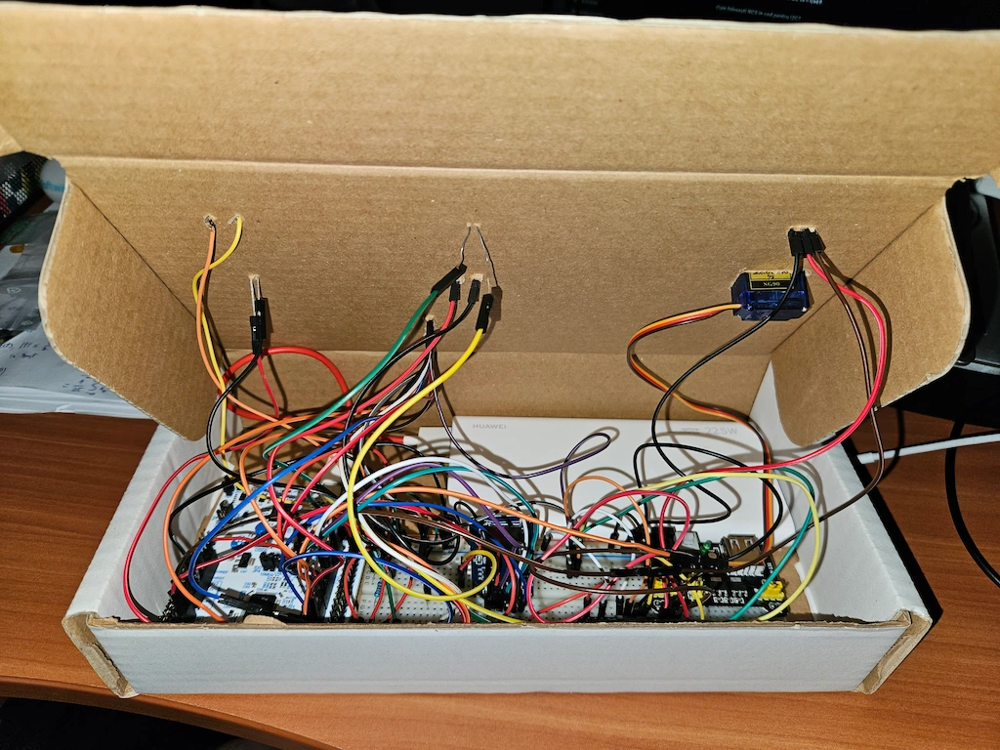
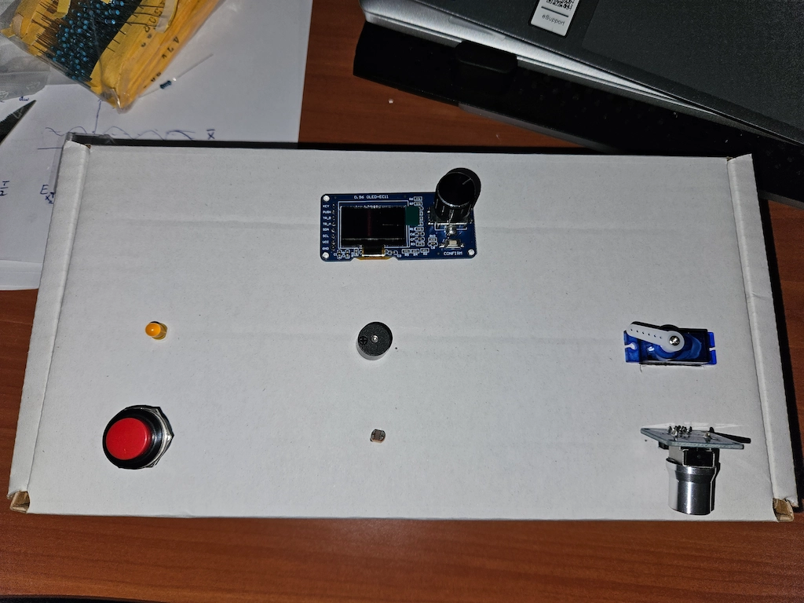
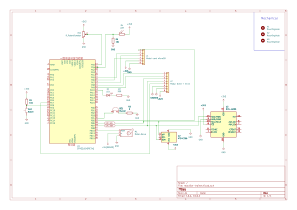

# Multi-modal Reaction Time Trainer
A reaction time training device with random rounds selected from 4 stimulus-response pairs.

:::info 

**Author**: Alexandru Dima \
**GitHub Project Link**: https://github.com/UPB-PMRust-Students/acs-project-2026-dimutz

:::

<!-- do not delete the \ after your name -->

## Description

A multi-modal reaction-time training device built on an STM32 microcontroller, using various visual, audio, and mechanical stimuli (LEDs, buzzer, OLED display, servo motor) and multiple user input methods (buttons, analog sensors, and IMU gestures). The device measures reaction time across randomized rounds, calculates performance scores in real time, stores user profiles and leaderboards in non-volatile memory, and provides a structured game-like experience with menus, sessions, and statistical feedback.

## Motivation

I chose this project in order to explore embedded systems through an interactive application focused on training and measuring human reaction times. It combines real-time input processing with precise timing to evaluate how quickly users respond to different stimuli. This makes it both a technical exercise in building a responsive system and a practical tool for improving reaction speed under varying conditions.

## Architecture 


## Log

<!-- write your progress here every week -->

### Week 21 - 27 April

Researched and ordered hardware components from Sigmanortec.

### Week 5 - 11 May

Tested hardware components, soldered MPU pins and built the hardware.

### Week 12 - 18 May

Developed the software and tested it. Some tweaks are needed.

### Week 19 - 25 May

## Hardware

The system is based on an STM32 NUCLEO development board, complemented by multiple input and output peripherals. It includes visual outputs (OLED display and LED), an audio output (buzzer), and mechanical output (servo motor). User interaction is handled through a push button, a rotary encoder, analog sensors (potentiometer and photoresistor), and an IMU sensor for gesture detection. Data storage is implemented using an SD card module and non-volatile memory (EEPROM) for saving user profiles and leaderboards.




### Schematics



### Bill of Materials

<!-- Fill out this table with all the hardware components that you might need.

The format is 
```
| [Device](link://to/device) | This is used ... | [price](link://to/store) |

```

-->

| Device | Usage | Price |
|--------|--------|-------|
| [Nucleo-U545-RE-Q](https://www.st.com/en/evaluation-tools/nucleo-u545re-q.html) | The microcontroller | Lab provided|
| [OLED display & EC11 Encoder Module](https://sigmanortec.ro/modul-cu-ecran-oled-de-096-inch-si-encoder-rotativ-ec11) | Display - menu + stimulus; Encoder - menu control | 39.98 RON |
| [SG90 Servomotor](https://sigmanortec.ro/Servomotor-SG90-limit-switch-p141662062) | Stimulus | 9.49 RON |
| [Active 5V Buzzer](https://sigmanortec.ro/Buzzer-activ-5v-p126421597) | Stimulus | 1.11 RON |
| [LED](https://sigmanortec.ro/led-5mm-verde) | Stimulus | 0.30 RON |
| [Momentary push button](https://sigmanortec.ro/Buton-fara-retinere-16mm-p125799983) | Response | 4.05 RON |
| [Potentiometer](https://sigmanortec.ro/modul-potentiometru-rotativ-10k-liniar-3-5v) | Response | 13.65 RON |
| [Photoresistor](https://sigmanortec.ro/Fotorezistor-5537-5mm-p160378607) | Response | 1.69 RON |
| [MPU-6500 Module](https://sigmanortec.ro/Modul-Accelerometru-Giroscop-I2C-MPU-6500-6-axe-p136248782) | Response | 12.00 RON |
| [MicroSD Module](https://sigmanortec.ro/Modul-MicroSD-p126079625) | Data export | 4.38 RON |
| [MicroSDHC Card](https://www.emag.ro/card-de-memorie-microsdhc-techstarr-clasa-10-de-8-gb-sku1031/pd/DMRDW8BBM/) | Data export | 14.98 RON |
| [EEPROM AT24C256](https://sigmanortec.ro/Modul-EEPROM-AT24C256-I2C-p136259349) | Profile storage | 7.24 RON |
| [MB102 Power Supply](https://sigmanortec.ro/Sursa-alimentare-3-3V-si-5V-pentru-breadboard-p126029417) | Servo power | 6.69 RON |
| [Resistor kit](https://sigmanortec.ro/kit-rezistori-30-valori-20-bucati) | Resistors | 15.16 RON |
| [Jumper Wires (M-M 20cm)](https://sigmanortec.ro/40-Fire-Dupont-20cm-Tata-Tata-p210851325) | Connections | 8.97 RON |
| [Jumper Wires (M-F 20cm)](https://sigmanortec.ro/40-Fire-Dupont-20cm-Tata-Mama-p210854317) | Connections | 8.97 RON |

## Software

| Library | Description | Usage |
|---------|-------------|-------|
| [embassy-stm32](https://github.com/embassy-rs/embassy/tree/main/embassy-stm32) | Async HAL for STM32 (GPIO, I²C, ADC, PWM, EXTI) | Board init, peripherals, and drivers for the STM32U545 |
| [embassy-executor](https://github.com/embassy-rs/embassy/tree/main/embassy-executor) | Async/await executor for embedded | Runs `main`, encoder/button tasks, and the application loop |
| [embassy-time](https://github.com/embassy-rs/embassy/tree/main/embassy-time) | Timers and delays | Round timing, debounce, random wait, and frame pacing |
| [embassy-sync](https://github.com/embassy-rs/embassy/tree/main/embassy-sync) | Sync primitives for Embassy | Mutex around the shared I²C bus |
| [embassy-embedded-hal](https://github.com/embassy-rs/embassy/tree/main/embassy-embedded-hal) | Adapters between Embassy and `embedded-hal` | `I2cDevice` for OLED, EEPROM, and MPU on one bus |
| [ssd1306](https://github.com/rust-embedded-community/ssd1306) | Display driver for SSD1306 OLED | 128×64 OLED over I²C |
| [embedded-graphics](https://github.com/embedded-graphics/embedded-graphics) | 2D graphics library | Menus, game UI, text, and the false-start mark |
| [embedded-hal](https://github.com/rust-embedded/embedded-hal) | Hardware abstraction traits | I²C trait used by EEPROM and MPU drivers |
| [defmt](https://github.com/knurling-rs/defmt) | Efficient embedded logging | Debug logs (rounds, false starts, sensor values) |
| [defmt-rtt](https://github.com/knurling-rs/defmt) | RTT transport for defmt | Sends log output to the debug probe |
| [cortex-m](https://github.com/rust-embedded/cortex-m) | Cortex-M support crate | Low-level CPU access (e.g. `nop` during ADC sampling) |
| [cortex-m-rt](https://github.com/rust-embedded/cortex-m-rt) | Runtime for Cortex-M | Reset vector and runtime startup |
| [panic-probe](https://github.com/knurling-rs/defmt) | Panic handler | Prints panics over defmt on the probe |
| [heapless](https://github.com/rust-embedded/heapless) | Collections without heap allocation | Fixed-size `Vec` and `String` for profiles and UI |
| [static_cell](https://github.com/embassy-rs/static-cell) | `'static` initialization helper | Stores the shared I²C bus for the firmware lifetime |

## Links

<!-- Add a few links that inspired you and that you think you will use for your project -->
