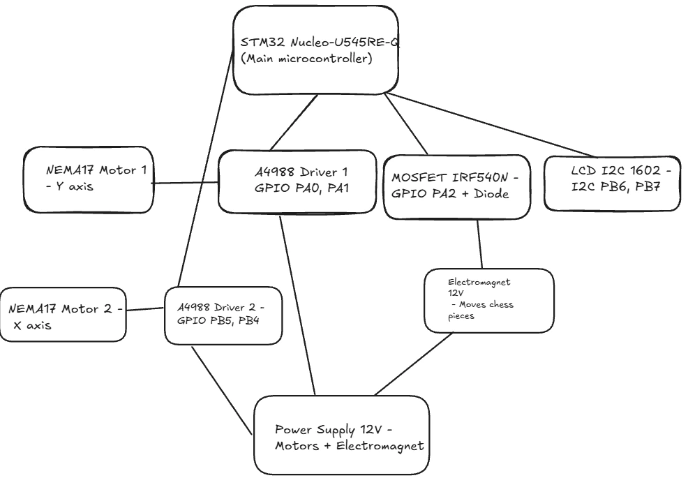
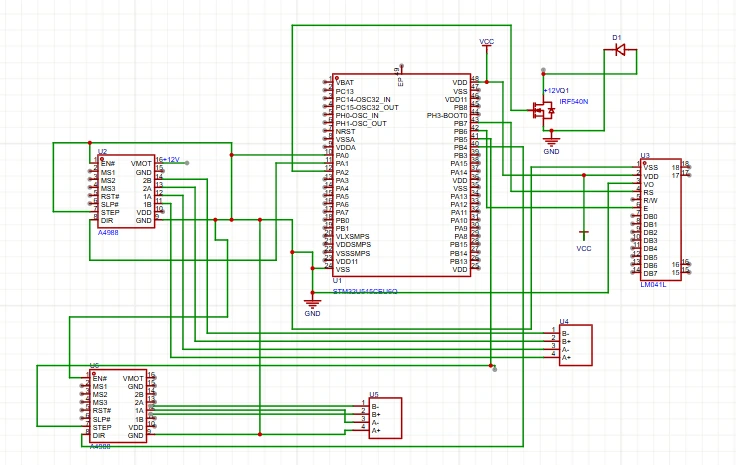

# Electronic Chess Board with Autonomous Play and Legal Move Display

An electronic chess board that autonomously moves pieces using an XY electromagnetic system, displays legal moves with LCD.

:::info

**Author:** Onea Amalia-Mihaela  \
**GitHub Project Link:** https://github.com/UPB-PMRust-Students/acs-project-2026-AmaliaOnea

:::

## Description

This project is an autonomous chess board powered by an STM32 Nucleo-U545RE-Q microcontroller. The board uses a system of two stepper motors to move an electromagnet along the X and Y axes beneath the board, allowing it to physically move chess pieces (which contain small magnets) without human intervention. An LCD display shows the current piece being moved and its legal moves.

The board implements a chess engine in Rust that computes valid moves and executes them automatically, moving pieces physically on the board.

## Motivation

I chose this project because it combines multiple engineering disciplines: mechanical design, electronics, and software. A self-playing chess board is a fascinating challenge that requires precise motor control and complex game logic — all implemented in Rust on an embedded system. It is a project that is both technically challenging and visually impressive, making it a perfect showcase for the knowledge gained throughout the semester.

## Architecture

### System Architecture

The system is composed of the following main modules:

- **STM32 Nucleo-U545RE-Q**: The main microcontroller that runs the chess engine, controls the motors, reads the Hall sensors, and drives the LEDs and LCD.
- **XY Motion System**: Two stepper motors (one for each axis) move a carriage beneath the board. An electromagnet mounted on the carriage attracts and moves the magnetic chess pieces.
-**LCD Display**: A 16x2 I2C LCD displays the current piece being moved and its legal moves.
- **Power Supply**: A 12V external power supply powers the stepper motors and electromagnet. A voltage regulator steps down to 5V for the logic components.

### Block Diagram

## Hardware

### 1. STM32 Nucleo-U545RE-Q
- **Role**: Main microcontroller
- **Specs**: ARM Cortex-M33, 160MHz, 256KB SRAM, 2MB Flash
- **Used for**: Running the chess engine, controlling all peripherals via GPIO, I2C, and PWM

### 2. Stepper Motors (x2) — NEMA 17
- **Role**: Move the electromagnet carriage along X and Y axes
- **Specs**: 1.8° step angle, 12V
- **Connection**: Controlled via A4988 driver modules

### 3. A4988 Stepper Motor Drivers (x2)
- **Role**: Drive the stepper motors from STM32 GPIO signals
- **Interface**: STEP and DIR pins connected to STM32 GPIO

### 4. Electromagnet 12V (x1)
- **Role**: Attract and move magnetic chess pieces beneath the board
- **Control**: Switched on/off via MOSFET IRF540N

### 5. MOSFET IRF540N (x1)
- **Role**: Control the electromagnet (the STM32 cannot supply enough current directly)
- **Connection**: Gate connected to STM32 GPIO, drain to electromagnet, source to GND

### 6. Diode 1N4007 (x1)
- **Role**: Flyback protection for the electromagnet
- **Connection**: In parallel with the electromagnet, reverse biased

### 9. Resistors 220Ω (x64)
- **Role**: Current-limiting resistors for LEDs

### 10. LCD I2C 1602 (x1)
- **Role**: Display the chess timer for both players
- **Interface**: I2C (SDA, SCL)

### 11. Power Supply 12V (x1)
- **Role**: Power the stepper motors and electromagnet

### 13. Capacitors 100µF (x2)
- **Role**: Stabilize voltage on the power supply lines

### 14. Breadboard + Jumper Wires
- **Role**: Prototyping and connections

## Schematics

## Bill of Materials

| Device | Usage | Price |
|--------|-------|-------|
| STM32 Nucleo-U545RE-Q | Main microcontroller | provided by lab |
| NEMA 17 Stepper Motor x2 | Move electromagnet on X and Y axes | ~200 RON |
| A4988 Stepper Driver x2 | Drive stepper motors | ~16 RON |
| Electromagnet 12V | Move chess pieces | ~50 RON |
| MOSFET IRF540N | Control electromagnet | ~5 RON |
| Diode 1N4007 | Flyback protection | ~1 RON |
| LCD I2C 1602 | Chess timer display | ~15 RON |
| Power Supply 12V | Power motors and electromagnet | ~30 RON |
| Voltage Regulator LM7805 | Step down 12V to 5V | ~3 RON |
| Capacitors 100µF x2 | Voltage stabilization | ~2 RON |
| Breadboard + Jumper Wires | Prototyping | ~25 RON |
| **Total** | | **~347 RON** |

## LOG
### Week 28 April - 2 May
- Components started arriving

### Week 5 May - 11 May
- All components arrived
- Connected and tested the LCD I2C display — successfully displayed text
- Connected and tested the electromagnet with MOSFET IRF540N
- Started assembling the XY motion system

### Week 12 May - 18 May
- Connected and tested the two NEMA17 stepper motors with A4988 drivers
- Built the XY motion system using T6 threaded rods
- Purchased plexiglass for the chess board surface
- Purchased Neodymium magnets for the chess pieces
- Assembled the chess board structure

## Software

| Library | Description | Usage |
|---------|-------------|-------|
| embassy-rs | Async runtime for embedded Rust | Task management, timers, GPIO control |
| embassy-stm32 | Embassy HAL for STM32 | GPIO, I2C, PWM control for motors and LCD |
| embassy-time | Timer abstractions | Delays and timing for motor steps |

## Links

1. [embassy-rs](https://github.com/embassy-rs/embassy)
2. [STM32 Nucleo-U545RE-Q Documentation](https://www.st.com/en/evaluation-tools/nucleo-u545re-q.html)
3. [PM Lab 02 - GPIO](https://embedded-rust-101.wyliodrin.com/docs/acs_cc/lab/02)
4. [PM Lab 03 - PWM](https://embedded-rust-101.wyliodrin.com/docs/acs_cc/lab/03)
5. [A4988 Stepper Driver Datasheet](https://www.pololu.com/product/1182)
