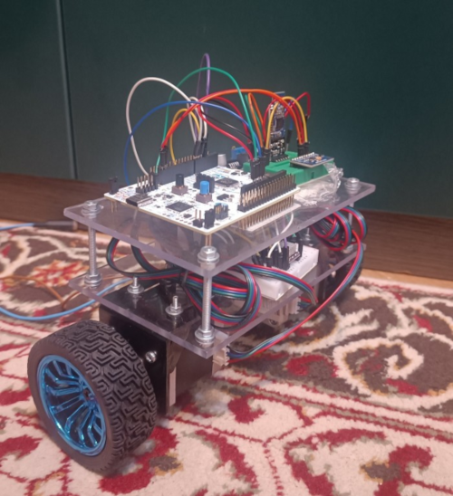
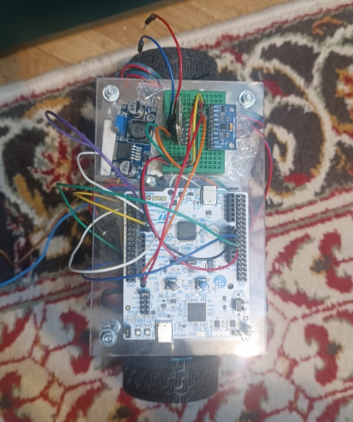
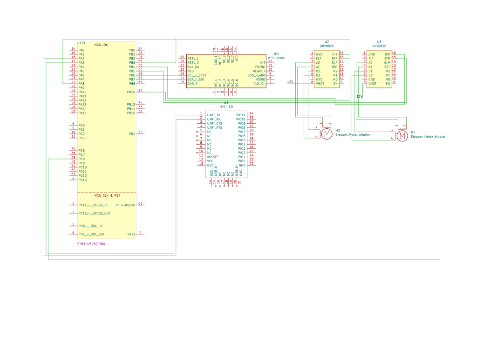

# Inverse Pendulum Robot
Self balancing two wheeled pendulum robot.

:::info 

**Author**: Fallah-Mirzaei Amir \
**GitHub Project Link**: https://github.com/UPB-PMRust-Students/acs-project-2026-amir-FM

:::

## Description

A robot that uses an accelerometer and a gyroscope to sense when it is falling and revert to a vertical position, which is parallel to the weight vector. The user can connect to it via Bluetooth and give it commands to move: front, back, turn right, and turn left. Gyroscope and accelerometer sensor data are fed into a feedback-based control loop stabilization algorithm. The output of this program is fed directly into the stepper motor controller.

From the research I have done, I learned that there are multiple control algorithms, with PID being the easiest to implement and understand. As a bonus, I will provide the use with the possibility to select what control algorithm the robot uses.
## Motivation

This is a project I had on my radar for a long time. Having no experience with Control Systems, I thought it was a great idea to start with this project. I also like the fact that this is a hardware-inclined task, because my experience in university is software-heavy.

## Architecture 

## Log

### Week 20 - 24 April

Made initial documentation and ordered hardware parts.

### Week 4 - 8 May

Parts started to arrive. I tested each part individually with some of them not working. I was forced to order three identical components to be sure one of them worked. Along side the hardware test I build for each component a small sanity check program to test the functionality.

### Week 11 - 15 May

Motors arrived. Started work on the main body of the robot. It was made from acrylic and M4 screws. It was very sturdy and can tolerate the occasional falls from testing.

### Week 18 - 22 May

Motors provided not enough torque, so I was forced to order stronger motors. After this episode the motors started to balance the platforms.

## Hardware

I am running the robot in a theadered format, for the ease of development, to concentrate my attention on building it, not on changing the battery every 40 minutes.

These are some images with the robot. In the end with the new motors it was 1.1kg in weight and 12cm in height from the bottom of the wheels. The testing was done with a 12V 6A transformer so I could test all day long.

### Schematics

The schematic does not include the power bus, just the data and commands wires.

### Bill of Materials

| Device | Usage | Price |
|--------|--------|-------|
| [STM32](https://www.farnell.com/datasheets/3927507.pdf) | Microcontroller | [129 RON](https://ro.farnell.com/stmicroelectronics/nucleo-u545re-q/development-brd-32bit-arm-cortex/dp/4216396?CMP=e-email-sys-orderack-GLB) |
| [MPU6050](https://cdn.sparkfun.com/datasheets/Sensors/Accelerometers/RM-MPU-6000A.pdf) | IMU (Gyroscope + Accelerometer) | [16 RON](https://www.emag.ro/modul-accelerometru-si-giroscop-mpu6050-ai382-s321/pd/DB606JBBM/)
| [HM-10](https://components101.com/sites/default/files/component_datasheet/HM10%20Bluetooth%20Module%20Datasheet.pdf) | Bluetooth Module | [27 RON](https://www.emag.ro/modul-bluetooth-4-0-ble-at-09-hm-10-msalamon-conectivitate-rapida-mic-si-eficient-ideal-pentru-proiecte-iot-economiseste-energie-fiabil-usor-de-montat-functioneaza-in-diverse-conditii-calitate-inalta-/pd/DHKDDVYBM/) |
| [LM2596](https://www.ti.com/lit/ds/symlink/lm2596.pdf) | Buck Converter 12V - 5V | [10 RON](https://www.emag.ro/modul-dc-dc-step-down-lm2596-765464701237/pd/DWHHRGBBM/) |
| [DRV8825](https://www.ti.com/lit/ds/symlink/drv8825.pdf) | Stepper Motor Driver | [2 x 12 RON](https://sigmanortec.ro/Driver-Stepper-DRV8825-p125423334) |
| [NEMA17](https://components101.com/motors/nema17-stepper-motor) | Stepper Motor | [2 x 100 RON](https://sigmanortec.ro/motor-pas-cu-pas-nema17-18-grade-42x42x48mm) |
| [Bracket](https://sigmanortec.ro/Suport-motor-Nema17-p135681865) | Nema17 mounting bracket | [2 x 64 RON](https://www.emag.ro/suport-prindere-motor-nema17-set-1-suport-4-suruburi-4-piulite-kqrexd-nema17-mounting-bracket/pd/D5DMPD2BM/) |

## Software

| Library | Description | Usage |
|---------|-------------|-------|
| [embassy-stm32](https://github.com/embassy-rs/embassy/tree/main/embassy-stm32) | Hardware Interface | Base library for project. |
| [embassy-executor](https://github.com/embassy-rs/embassy) | Async task executor | For Motor Driver Tasks |
| [defmt](https://github.com/knurling-rs/defmt) | Deferred formatting logger | Logging for the tuning of the PID |
| [panic-probe](https://github.com/knurling-rs/probe-run) | Panic handler | Displaying panic messages |

## Links

1. https://www.youtube.com/watch?v=IYOxj6VyC8s&pp=ygUXaW52ZXJ0ZWQgcGVuZHVsdW0gcm9ib3Q%3D
2. https://projecthub.arduino.cc/zjor/self-balancing-robot-with-arduino-nano-and-steppers-47e00e
