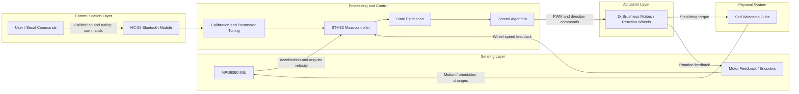
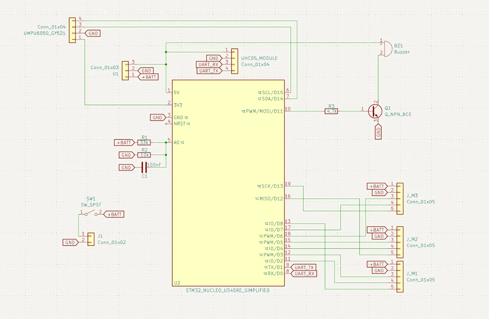

# Self-Balancing Cube

A self-balancing cube controlled by an STM32 microcontroller, using IMU feedback and internal reaction wheels to balance on an edge or corner.

:::info

**Author**: Ana-Maria-Raluca Lupu \
**GitHub Project Link**: [acs-project-2026-lupuana](https://github.com/UPB-PMRust-Students/acs-project-2026-lupuana)

:::

<!-- do not delete the \ after your name -->

## Description

This project implements a self-balancing cube based on reaction-wheel control. The system reads motion and orientation data from an IMU sensor, estimates the cube state, and computes corrective motor commands in real time. Three internal motors spin reaction wheels to generate stabilizing torques, allowing the cube to recover balance and remain upright on an edge or corner.

## Motivation

I chose this project because it combines embedded programming, control systems, electronics, mechanical design, and real-time testing in a single system. It is a good practical challenge because it requires both hardware integration and software development, especially sensor processing, feedback control, and actuator coordination on an STM32 platform.

## Architecture

The main architecture components of the project are:

- **Sensing layer**  
  Reads acceleration and angular velocity data from the MPU6050 IMU and, in the final system, wheel-speed feedback from the motor encoder signals.

- **State estimation layer**  
  Processes raw sensor data and computes the current orientation and angular motion of the cube.

- **Control layer**  
  Runs the balancing algorithm and computes correction commands for each reaction-wheel axis.

- **Actuation layer**  
  Sends PWM and direction control signals to the three Nidec reaction-wheel motors.

- **Communication and tuning layer**  
  Supports calibration and parameter adjustment, initially through USB/debug output during development and later through a Bluetooth serial connection using the HC-05 module.

### Architecture Diagram

## Log

### Week 14 - 29 April

- Finalized the project theme and received approval.
- Researched the reference project, selected the main components, and placed the orders.

### Week 4 - 10 May

- Received the ordered components.
- Reviewed the hardware setup.

### Week 11 - 17 May

- Set up the Rust embedded project.
- Verified firmware flashing and debugging on the STM32 board.
- Tested one Nidec motor in both rotation directions using PWM and direction control.
- Tested the MPU6050 IMU over I2C and verified gyroscope and accelerometer readings.
- Implemented initial tilt estimation tests using roll and pitch angles.
- Started integrating IMU input with motor response.

### Week 18 - 24 May

- Continue hardware integration of sensing and actuation.
- Investigate encoder feedback from the motors.
- Refine motor control behavior for smoother directional changes.
- Continue toward full cube assembly, calibration, and balancing experiments.

## Hardware

The hardware platform is built around an STM32 microcontroller, an MPU6050 IMU for motion sensing, and three Nidec brushless motors used as reaction wheels. The motors include feedback lines that are intended to be used for wheel-speed sensing during control. A Bluetooth module is planned for calibration and parameter tuning, while a buzzer will provide status feedback.

## Schematics

## Bill of Materials

| Device | Usage | Price | Link |
|---|---|---:|---|
| Dupont wire kit | Prototyping and signal wiring | 24.39 RON | [AliExpress](https://www.aliexpress.com/item/4000203371860.html?spm=a2g0o.order_list.order_list_main.5.b7a61802PaQuli) |
| 2x MPU6050 GY-521 | IMU sensing | 48.84 RON | [AliExpress](https://www.aliexpress.com/item/1005008796700745.html?spm=a2g0o.order_list.order_list_main.11.b7a61802PaQuli) |
| 3x Nidec 24H brushless servo motors | Reaction-wheel actuation | 138.57 RON | [AliExpress](https://www.aliexpress.com/item/1005005779471604.html?spm=a2g0o.order_list.order_list_main.17.b7a61802PaQuli) |
| HC-05 Bluetooth module | Wireless tuning and calibration | 24.35 RON | [AliExpress](https://www.aliexpress.com/item/32582656795.html?spm=a2g0o.order_list.order_list_main.23.b7a61802PaQuli) |
| 3S LiPo 11.1V 500mAh battery | Main power source | 85.33 RON | [AliExpress](https://www.aliexpress.com/item/1005006702079264.html?spm=a2g0o.order_list.order_list_main.29.b7a61802PaQuli) |
| Active 5V buzzer | Audio feedback / status signal | 15.72 RON | [AliExpress](https://www.aliexpress.com/item/1005010321957502.html?spm=a2g0o.order_list.order_list_main.35.b7a61802PaQuli) |
| LM7805 5V regulator module | Logic power regulation | 16.72 RON | [AliExpress](https://www.aliexpress.com/item/1005005382976127.html?spm=a2g0o.order_list.order_list_main.41.b7a61802PaQuli) |
| 3S LiPo balance charger | Battery charging | 28.24 RON | [AliExpress](https://www.aliexpress.com/item/1005007620618797.html?spm=a2g0o.order_list.order_list_main.47.b7a61802PaQuli) |
| ON/OFF switch | Main power control | 21.29 RON | [AliExpress](https://www.aliexpress.com/item/1005009232308550.html?spm=a2g0o.order_list.order_list_main.53.b7a61802PaQuli) |

## Software

| Library | Description | Usage |
|---|---|---|
| `embassy-stm32` | STM32 hardware abstraction layer for the Embassy ecosystem | Used for GPIO control, I2C communication with the MPU6050, UART/Bluetooth communication, timers, PWM generation, and encoder input handling |
| `embassy-executor` | Async task executor for embedded systems | Runs the main firmware tasks and coordinates sensing, control, communication, and actuation logic |
| `embassy-time` | Timing and delay utilities | Used for periodic sensor sampling, control-loop timing, calibration delays, and scheduled motor updates |
| `libm` | Mathematical functions for `no_std` environments | Used for trigonometric and square-root operations in orientation estimation and tilt-angle computation |
| `defmt` | Lightweight embedded logging framework | Used for runtime diagnostics, sensor debugging, motor-control validation, and calibration feedback |
| `defmt-rtt` | RTT transport backend for `defmt` logs | Sends debug messages from the STM32 board to the development PC through the ST-LINK interface |
| `panic-probe` | Panic handler for embedded Rust applications | Provides useful crash information during firmware debugging |
| `cortex-m` | Low-level ARM Cortex-M support crate | Provides architecture-specific utilities and interrupt-safe embedded primitives |
| `cortex-m-rt` | Runtime support for Cortex-M microcontrollers | Defines startup behavior and memory initialization for the STM32 firmware |
