# Smart Recycling Bin
An intelligent trash bin that encourages recycling through automation and reward systems.

:::info 

**Author**: Ana-Sorina Ciurea \
**GitHub Project Link**: https://github.com/UPB-PMRust-Students/acs-project-2026-anaciurea

:::

## Description

This project consists of building a smart recycling bin using an STM32 microcontroller programmed in Rust. The system improves user interaction by automatically opening the lid and rewarding users for recycling using NFC technology.

The bin detects hand movement to open automatically and allows users to scan an NFC card to receive rewards. Additionally, recyclable items can be identified using NFC tags attached to packaging.

## Motivation

I chose this project to explore embedded systems programming in Rust and to build a real-world application that promotes recycling. The combination of low-level programming and hardware interaction makes this project both challenging and practical.

## Architecture 

The system consists of the following main components:

- **STM32 microcontroller** – central unit running Rust code
- **Proximity sensor (IR/ultrasonic)** – detects when a user approaches
- **Servo motor** – controls lid opening and closing
- **NFC module (RC522)** – reads user cards and product tags

### System Flow

1. **Proximity Sensor detects hand** → Lid opens automatically
2. **NFC Card is scanned** → System registers and you receive bonuses
3. **When lid opens** → Speaker beeps and servo motor 

### Architecture Diagram

The STM32 microcontroller acts as the central controller, receiving input from sensors and the NFC module, and controlling the servo motor and LEDs accordingly.

## Log

### Week 5 - 11 May
- Defined project idea
- Selected STM32 platform

### Week 12 - 18 May
- Set up Rust embedded environment
- Tested GPIO and basic components

### Week 19 - 25 May
- Integrated sensors and servo motor
- Began NFC integration

## Hardware

The system is built around an STM32 Nucleo board and integrates multiple sensors and actuators.

### Components Overview

- STM32 Nucleo board
- Ultrasonic or IR proximity sensor
- Servo motor
- RC522 NFC module
- LEDs + resistors

### Connections

- Proximity sensor → GPIO pins  
- Servo motor → PWM pin  
- NFC module → SPI interface (MOSI, MISO, SCK, CS)  
- LEDs → GPIO pins (with resistors)  

### Schematics

## Bill of Materials

| Device | Usage | Price |
|--------|--------|-------|
| STM32 Nucleo board | Main controller | ~200 RON |
| Ultrasonic/IR sensor | Detects hand | 10 RON |
| Servo motor (SG90) | Opens lid | 15 RON |
| NFC module (RC522) | Reads cards/tags | 20 RON |
| LEDs + resistors | Feedback | 5 RON |

## Software

The software is written in Rust using embedded development frameworks.

| Library | Description | Usage |
|---------|-------------|-------|
| embedded-hal | Hardware abstraction layer | GPIO, PWM control |
| stm32 HAL crate | STM32 support | Peripheral access |
| NFC crate | NFC communication | Reading tags/cards |

The system uses a simple state-based logic to control interactions between sensors, actuators, and user input.

## Future Improvements

- Mobile app for tracking recycling points  
- Cloud integration for user accounts  
- More advanced object recognition  

## Links

1. https://docs.rust-embedded.org/  
2. https://github.com/stm32-rs  
3. https://randomnerdtutorials.com/