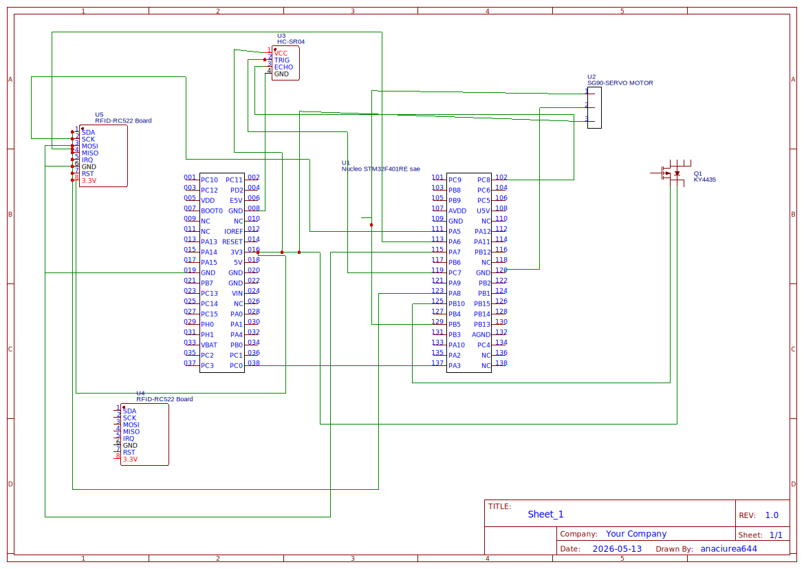

# Smart Recycling Bin
An intelligent trash bin that encourages recycling through automation and reward systems.

:::info 

**Author**: Ana-Sorina Ciurea \
**GitHub Project Link**: https://github.com/UPB-PMRust-Students/acs-project-2026-anaciurea

:::

## Description

This project consists of building a smart recycling bin using an STM32 microcontroller 
programmed in Rust with the Embassy async framework. The system automates lid control 
and rewards users for recycling via RFID card scanning.

An HC-SR04 ultrasonic sensor continuously measures the distance in front of the bin. 
When a hand is detected closer than 30 cm, a servo motor (SG90) opens the lid and a 
passive buzzer emits a short confirmation beep. When no obstacle is detected, the lid 
closes automatically.

Users can scan an RFID card using the RC522 module to receive 200 recycling points per 
scan. Points accumulate across reboots, as they are stored persistently in the STM32's 
internal Flash memory using a magic-number validation scheme to ensure data integrity.

The system runs two concurrent async tasks: one handling the ultrasonic sensor, servo, 
and buzzer logic, and one dedicated to RFID scanning and Flash storage — both managed 
by the Embassy executor.

## Motivation

I chose this project to explore embedded systems programming in Rust and to build a real-world application that promotes recycling. The combination of low-level programming and hardware interaction makes this project both challenging and practical.

## Architecture 

- **STM32 Nucleo (STM32F411RE)** – central unit running Rust code 
  with the Embassy async framework
- **HC-SR04 ultrasonic sensor** – detects hand proximity (threshold: 30 cm)
- **Servo motor (SG90)** – controls lid opening (90°) and closing (0°) 
  via PWM on TIM3 at 50 Hz
- **RC522 RFID module** – reads ISO 14443A cards via SPI1, 
  awards 200 points per scan
- **KY-006 passive buzzer** – emits a confirmation beep (2 kHz) 
  when the lid opens
- **Internal Flash memory** – persistent storage for RFID points 
  across reboots (offset 504 KB, magic-number validated)

### System Flow

The system runs two independent async tasks concurrently:

#### Task 1: Ultrasonic + Servo + Buzzer (every 500 ms)
1. HC-SR04 sends a 10 µs trigger pulse and measures ECHO duration
2. Calculates distance: `distance_cm = duration_µs / 58`
3. **distance < 30 cm** → servo opens lid (90°) + buzzer beeps 200 ms
4. **distance ≥ 30 cm or timeout** → servo closes lid (0°)

#### Task 2: RFID + Flash

1. **On boot** → restores points from Flash (validated via magic number);
   if no previous data, starts from 0
2. User can optionally scan an RFID card **at any time** to collect +200 bonus points,
   saved persistently to Flash with a 2s cooldown between scans
3. Points accumulate independently of the lid mechanism — scanning
   and recycling are two separate interactions

### Architecture Diagram

The STM32 microcontroller acts as the central controller, receiving input 
from the HC-SR04 sensor and RC522 RFID module, and controlling the servo 
motor and buzzer accordingly.

## Log

### Week 5 - 11 May
- Defined project idea
- Selected STM32 platform

### Week 12 - 18 May
- Set up Rust embedded environment
- Tested GPIO and basic components

### Week 19 - 25 May
- Integrated HC-SR04 ultrasonic sensor with servo and buzzer logic
- Integrated RC522 RFID module via SPI1
- Implemented persistent point storage in internal Flash
- Finalized two-task async architecture with Embassy

## Hardware

The system is built around an STM32 Nucleo board and integrates multiple sensors and actuators.

### Components Overview

- STM32 Nucleo (STM32F411RE)
- HC-SR04 ultrasonic sensor
- Servo motor (SG90)
- RC522 RFID module
- KY-006 passive buzzer
- Breadboard + resistors

### Connections

- HC-SR04 TRIG → PC7 
- HC-SR04 ECHO → PC8 
- Servo SG90   → PB5 
- Buzzer KY-006 → PB10 
- RC522 SCK    → PA5 
- RC522 MOSI   → PA7 
- RC522 MISO   → PA6 
- RC522 CS     → PA8 
- RC522 RST    → PA3 

### Schematics

## Bill of Materials

| Device | Usage | Price |
|--------|--------|-------|
| STM32 Nucleo board | Main controller | 200 RON |
| HC-SR04 | Detects hand | 10 RON |
| Servo motor (SG90) | Opens lid | 15 RON |
| RFID module RC522 | Reads cards/tags | 15 RON |
| Breadboard | Connecting components | 14 RON |
| KY-006 Buzzer pasiv | Confirms that the sensor is working | 3 RON |
| Resistors |  | 1 RON |

## Software

The software is written in Rust using embedded development frameworks.

| Library | Description | Usage |
|---------|-------------|-------|
| embassy-executor | Async task executor  | Spawner, concurrent tasks    |
| embassy-stm32    | STM32 HAL for Embassy| GPIO, SPI, PWM, Flash, Timer |
| embassy-time     | Async timers         | Timer, Instant, Delay        |
| mfrc522          | RC522 RFID driver    | Reading card UIDs            |
| embedded-hal-bus | SPI bus management   | ExclusiveDevice for CS       |
| defmt + defmt-rtt| RTT logging          | Debug output                 |
| panic-probe      | Panic handler        | Error handling               |

The system uses an async, event-driven architecture managed by the Embassy executor.

## Future Improvements

- Mobile app for tracking recycling points
- Cloud integration for user accounts
- Support for multiple RFID cards with individual point balances

## Links

1. https://docs.rust-embedded.org/  
2. https://github.com/stm32-rs  
3. https://randomnerdtutorials.com/