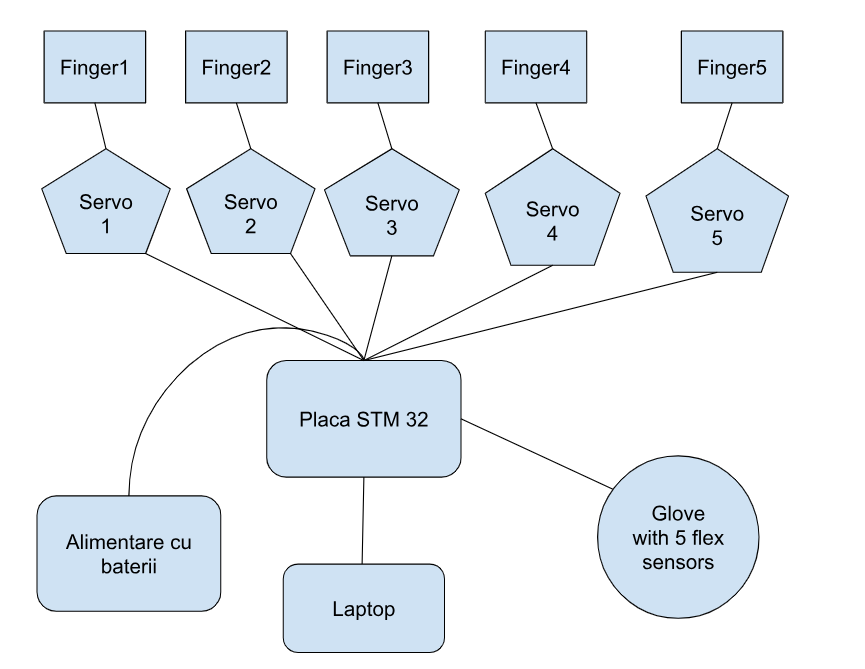

---

---

# Robotic Hand

A robotic hand that imitates the movement of a person's hand wearing a glove that has flex sensors on it.

> [!NOTE]
> **Author:** STANCIU Anastasia-Steliana
> **GitHub Project Link:**

## Description
The project is a robotic, 3D printed hand, that is actiond through some basic wires and servo-motors, that imitate the signals from a control glove. The glove has flex sensors, one on each finger, sending continuos signals to the board and servo-motors. The motion is intended to be as smooth and real-time as possible, providing a continuous flex of the fingers, rather than discrete.

## Motivation
This idea fits perfectly in the medical field. The main two innovations branching from my project are:

* It can be upgraded into a prosthetic hand that uses signals from an **EMG Muscle Sensor**, rather than from flex sensors.
* It can be used in **Kinetotherapy** to track the progress of patients and collect data and metrics, leading to both more customizable treatments and research data.
* It is a fun project, offering a great opportunity to discover hardware and human abilities in parallel, finding similarities and differences while learning how to model complex human movement.

This project is about using hardware and technology to consolidate inclusion and break the boundaries of disabilities, creating a world of possibilities.

## Arhitecture

In this section we will discuss components and the interconnections between them.

1. STM Board
Acționează ca unitatea de control de înaltă performanță. Procesează intrările analogice prin ADC-ul său de 12 biți (oferind o precizie mult mai mare decât Arduino) și generează semnale PWM pentru controlul celor 5 servomotoare. Funcționează la logică de 3.3V.
2. Servo-Motoare
    Convertesc semnalele PWM în mișcare unghiulară. Fiecare servo controlează un deget al mâinii robotice. Deși primesc semnal de control de la STM32, necesită o sursă de alimentare separată de 5V pentru a susține consumul de curent.

4. Flex Sensors
   Senzori rezistivi plasați pe mănușă. Aceștia fac parte dintr-un circuit de divizor de tensiune. Tensiunea variabilă rezultată este trimisă către pinii analogici ai STM32 pentru a detecta gradul de închidere a fiecărui deget.

6. Sursa de alimentare (baterii reincarcabile)

   

## Log
### Week 14-20 april
Finalized project idea, name, details and features, including code and hardware concepts.
### Week 20-27 april
Ordered hardware components.
### Week 27-1 may
Realized the documentation and sent 3D hand model to print.

## Hardware

### Bill Of Materials
| Componentă | Pret | Cantitate |
| :--- | :--- | :---: |
| STM32 | Din dotarea facultatii | 1 |
| Servomotor SG90 | 13.00 | 5 |
| Flex Sensor | 35.00 | 5 |
| Fire mama-tata | 10.00 | 10 |
| Fire tata-tata | 10.00 | 10 |
| 10k Resitors | 1.23 | 10 |
| Breadboard | 9.99 | 1 |
| 3D model | - | - |
| (optional) EMG sensor | 100.00 | 1 |

## Software
## Software Stack

| Library / Module | Description | Usage |
| :--- | :--- | :--- |
| **embassy-stm32** | Hardware Abstraction Layer (HAL) | Provides async support for handling I2C, SPI, ADC, and PWM peripherals. |
| **HAL / LL Drivers** | Low-Level Drivers | Direct hardware access for managing ADC (flex sensors) and PWM (servos). |
| **Servo Control Logic** | Custom PWM Mapper | Algorithmic mapping of flex sensor resistance values to 0°-180° servo angles. |
| **Median Filter** | Signal Processing Module | Digital filtering to remove noise and jitter from analog signals for smooth movement. |
| **Embassy Executor** | Real-time Task Scheduler | Handling concurrent asynchronous tasks for sensor polling and motor updates. |

## Link to 3D model
https://www.thingiverse.com/thing:1294517
