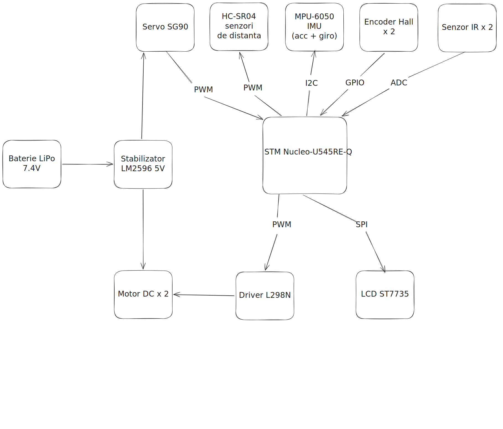
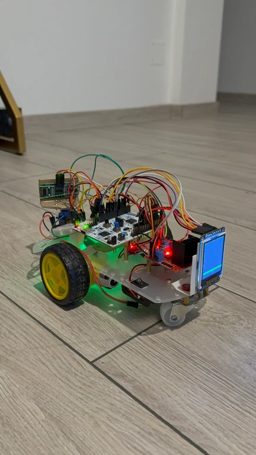
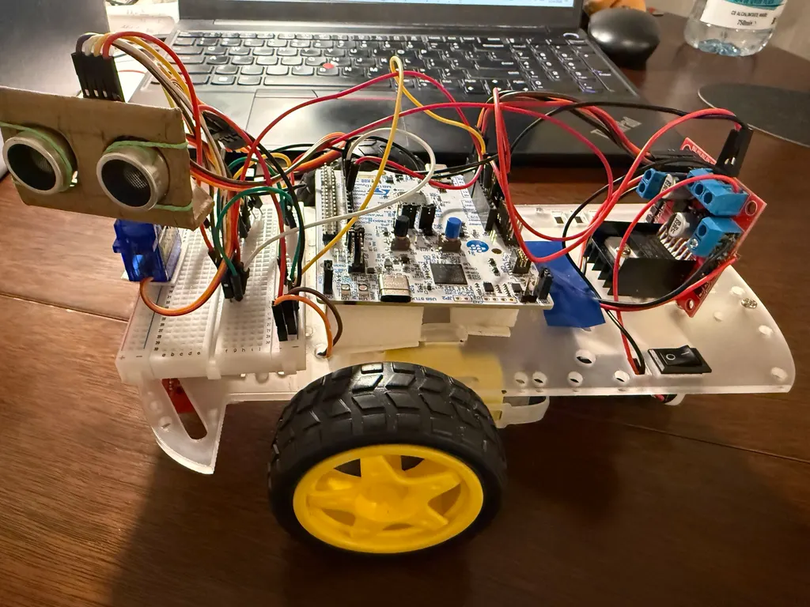
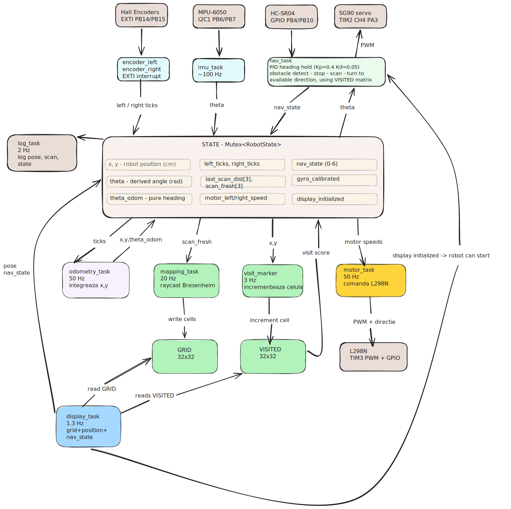

# AutoNav
Autonomous Robot with Mapping and Simplified SLAM

:::info

**Author**: Anca Stefania Maxim \
**GitHub Project Link**: https://github.com/UPB-PMRust-Students/acs-project-2026-ancamaxim

:::

## Description

AutoNav is an autonomous mobile robot that explores an unknown space, builds a 2D obstacle map in real time, and makes navigation decisions independently, without human intervention. The project implements a simplified SLAM (Simultaneous Localization and Mapping) system, adapted to the hardware constraints of an STM32 microcontroller.

The robot uses a ultrasonic sensor and a scanning servo to detect surrounding obstacles, wheel encoders for odometry, and an IMU for heading error correction. From this data, it builds a probabilistic occupancy grid, a 2D map where each cell has an associated probability of containing an obstacle.

The map is displayed live on a color LCD mounted on the robot, updated at 1.3 Hz.

## Motivation

This project was chosen because it covers all peripherals and protocols studied in the lab (SPI, I2C, PWM, GPIO, ADC, TIM input capture) demonstrated simultaneously in a functional integrated system. It implements algorithms relevant to real-world applications: odometry, sensor fusion, probabilistic mapping — all in Rust without an operating system. Similar SLAM systems are used in industrial robots (Amazon warehouses), autonomous vacuum cleaners (Roomba), exploration drones, and autonomous vehicles.

## Architecture 

**1. MCU (STM32 Nucleo-U545RE-Q)**
The central unit running all Embassy-rs async tasks. `
Coordinates all subsystems and shared state variables (Pose, Occupancy Grid, and Visited Cells Matrix), avoiding data races and enforcing correctness by using asynchronous Mutexes (`ThreadModeRawMutex`).

**2. Motor Subsystem**
The L298N dual H-bridge receives 1 kHz PWM signals from TIM3 (CH1 on PC6, CH2 on PC7) and drives two DC motors (left/right). Direction is controlled via four GPIO output pins (PA1, PA4, PB0, PC1 — the IN1–IN4 lines of the L298N). Two Hall encoder discs are read via GPIO EXTI interrupts (PB14 for left, PB15 for right): each rising or falling edge increments or decrements a signed tick counter in `RobotState`, with sign determined by the current commanded motor direction.
 
**3. Sensing Subsystem**
- **HC-SR04 ultrasonic sensor** (GPIO trigger on PB4, EXTI echo on PB10): distance is measured by busy-polling the echo line (no `async` awaits inside the timing loops, guaranteeing both edges are captured without executor preemption; I of course first tried to make this task run async using .wait_for_* functions wherever I could, but this resulted in low responsiveness and delayed robot reaction). The sensor is swept by an SG90 servo to three positions (far-left ≈ 0.105, center ≈ 0.075, far-right ≈ 0.045 duty cycle on TIM2 CH4, PA3 at 50 Hz) to collect left, center, and right scan distances.
- **MPU-6050 IMU** (I2C1 on PB6/PB7, address `0x68`): supplies raw gyroscope Z-axis data at ±250°/s full-scale. On startup, 100 samples are averaged to compute and store a static gyro bias before navigation begins.

**4. Localization Subsystem**
Pose estimation combines two independent angle sources through a complementary filter (\alpha = 0.98 gyro, 0.02 odometry):
 
- `imu_task` integrates bias-corrected (motors are asymmetrical, unfortunately and calibration had to be done) gyro Z at ~100 Hz to maintain `gyro_theta`, zeroing out readings below a 0.005 rad/s deadband to suppress drift at rest.
- `odometry_task` derives `theta_odom` from differential encoder ticks every 20 ms using the wheel geometry (radius = 3.4 cm, base = 13.5 cm, 38 ticks/rev). Position `(x, y)` is then integrated from the heading `theta`.

**5. Mapping & Navigation Subsystem**
- `mapping_task` consumes fresh scan readings published by `nav_task` into `STATE` (up to 3 readings per scan cycle: center, left, right). For each fresh reading it calls `integrate_scan`, which uses `ray_cast` (Bresenham's line algorithm) to mark all cells along the ray as free (decrement by 3, floored at 0) and the endpoint cell as occupied (increment by 20, capped at 255) in the 32×32 `GRID`. Each cell starts at `UNKNOWN = 128`; cells below 100 are considered free, above 155 occupied.
- `visit_marker_task` increments the `VISITED` counter for the robot's current grid cell at ~3 Hz, building a heatmap of explored areas.
- `nav_task` implements reactive obstacle avoidance with visit-aware turn selection: it drives forward with a PID heading-hold loop (Kp = 0.4, Ki = 0.0, Kd = 0.05, real-time dt measurement), stops on obstacle detection at 18 cm, applies a 120 ms active brake pulse, scans left and right with the servo, then picks the clearer direction, breaking ties by comparing 3×3 neighborhood visit counts from `VISITED` to prefer less-explored areas.

**6. Display Subsystem**
`display_task` drives an ST7735S 128×160 color LCD over SPI1 at 4 MHz (SCK PA5, MOSI PA7, CS PB5, DC PB3, RST PC2). The top 128×128 px renders the 32×32 occupancy grid at 4×4 px per cell. A dirty-tracking mechanism repaints only cells whose color index changed since the last frame, reducing SPI traffic. The robot is overlaid as a yellow triangle with a green heading line. A status bar at the bottom changes color to reflect the current navigation state. The display refreshes at ~1.3 Hz (750 ms sleep per frame), fast enough to observe map growth, slow enough to leave CPU budget for sensor tasks.

## Log
 
### Week 5 - 11 May
 
Decided upon hardware components and designed a block scheme with the hardware architecture I will build. Settled on a reactive SLAM approach (no global path planner) with a 32×32 probabilistic occupancy grid updated by Bresenham ray casting and a complementary filter for heading fusion.
 
### Week 12 - 18 May
 
Assembled hardware components. Tested each component individually: verified HC-SR04 ultrasonic echo timing, SG90 servo sweep range, MPU-6050 gyro output over I2C, Hall encoder edge counting on EXTI interrupts, and ST7735S display init over SPI. Finalized wiring and hardware integration.
 
### Week 19 - 25 May
 
Implemented and integrated the full software stack. Key challenges resolved during this week:
 
**Ultrasonic timing**: The initial async implementation using `wait_for_rising_edge` / `wait_for_falling_edge` from `ExtiInput` produced frequent fall-timeout errors. The Embassy executor was yielding between arming the rising-edge wait and the falling-edge wait, allowing other tasks to run and causing the echo's falling edge to be missed entirely. Replaced with a busy-poll approach — tight loops on `echo.is_high()` with no `.await` — which blocks the executor for the duration of the pulse (~1 ms typical, 25 ms max) and reliably captures both edges.
 
**PID heading hold**: The first version used a hard-coded `dt = 5 ms` matching the `FORWARD_LOOP_MS` constant. In practice the loop period is dominated by `get_dist` execution (~70–90 ms per call), causing the derivative term to be scaled by ~14×, making the robot snake aggressively. Fixed by measuring real elapsed time with `Instant::now()` each iteration and clamping dt to [20 ms, 200 ms].
 
**Obstacle threshold tuning**: Initial threshold of 15 cm gave insufficient braking distance — motors coast after speed = 0, and the scan-and-turn sequence adds >1.3 s of forward drift. Tried 22 cm, which caused the robot to get stuck rotating in any corridor where an occasional reading fell in the 15–22 cm band. Settled on 18 cm combined with an active 120 ms brake pulse (reverse at 0.30 speed) applied immediately on obstacle detection.
 
**Visit-aware exploration**: Without a turn bias, the robot would repeatedly re-enter already-explored corridors. Implemented `visit_marker_task` (3 Hz cell counter) and `visit_score_in_direction` (3×3 neighborhood sum), used by `nav_task` to break clearance ties in favor of less-visited directions.
 
## Hardware
 
The robot is built on a 2WD chassis powered by two DC motors with Hall encoders, driven by an L298N dual H-bridge. A single HC-SR04 ultrasonic sensor mounted on an SG90 scanning servo provides obstacle detection in three directions (front, left, right) without requiring multiple sensors. An MPU-6050 IMU provides gyroscope data for heading correction. An ST7735S 128×160 color LCD displays the live occupancy grid map, robot pose, and navigation state. The system is powered by a 7.4V 2000mAh LiPo battery with an LM2596 voltage regulator stepping down to 5V for logic.
 

### Schematics

### Bill of Materials

| Device | Usage | Price |
|--------|--------|-------|
| [STM32 Nucleo-U545RE-Q](https://www.st.com/en/evaluation-tools/nucleo-u545re-q.html) | Main microcontroller | provided |
| [2WD Robot Chassis](https://www.optimusdigital.ro/en/robot-chassis/2-robot-chassis.html) | Physical robot structure | [30 RON](https://www.optimusdigital.ro/en/robot-chassis/2-robot-chassis.html) |
| [DC Motors with Hall Encoders x2](https://www.optimusdigital.ro/en/dc-motors/1804-motor-with-encoder.html) | Propulsion + precise odometry | [40 RON](https://www.optimusdigital.ro/en/dc-motors/1804-motor-with-encoder.html) |
| [L298N Motor Driver](https://www.optimusdigital.ro/en/motor-drivers/145-l298n-dual-motor-driver.html) | Dual H-bridge motor control | [15 RON](https://www.optimusdigital.ro/en/motor-drivers/145-l298n-dual-motor-driver.html) |
| [HC-SR04 Ultrasonic Sensor x3](https://www.optimusdigital.ro/en/ultrasonic-sensors/9-hc-sr04-ultrasonic-sensor.html) | Distance measurement front + left + right | [20 RON](https://www.optimusdigital.ro/en/ultrasonic-sensors/9-hc-sr04-ultrasonic-sensor.html) |
| [SG90 Servo Motor](https://www.optimusdigital.ro/en/servomotors/26-sg90-micro-servo-motor.html) | Front sensor 180° rotation scanning | [15 RON](https://www.optimusdigital.ro/en/servomotors/26-sg90-micro-servo-motor.html) |
| [MPU-6050 IMU](https://www.optimusdigital.ro/en/inertial-sensors/96-mpu-6050-imu.html) | Gyroscope heading + accelerometer | [15 RON](https://www.optimusdigital.ro/en/inertial-sensors/96-mpu-6050-imu.html) |
| [IR Sensors x2](https://www.optimusdigital.ro/en/optical-sensors/4-ir-obstacle-sensor.html) | Floor edge / table edge detection | [10 RON](https://www.optimusdigital.ro/en/optical-sensors/4-ir-obstacle-sensor.html) |
| [ST7735 LCD 128x160](https://www.optimusdigital.ro/en/lcds/3-18-inch-tft-lcd.html) | Live 2D map + robot status display | [20 RON](https://www.optimusdigital.ro/en/lcds/3-18-inch-tft-lcd.html) |
| LiPo Battery 7.4V 2000mAh | Autonomous power supply (~45min) | 35 RON |
| Breadboard + Jumper Wires | Prototype circuit | 30 RON |

## Software
 
The entire program is `#![no_std]` and `#![no_main]` (no heap, no operating system, no RTOS scheduler). All concurrency is cooperative and driven by `async`/`await` under the Embassy executor.
 
### Concurrency Model
 
Embassy runs a single-threaded cooperative executor. Every task is a Rust `async fn` marked with `#[embassy_executor::task]`. Because only one task runs at a time and tasks yield at every `.await` point, shared state is safely exchanged through three `Mutex<ThreadModeRawMutex, _>` globals: `STATE` (the main `RobotState` struct), `GRID` (the 32x32 occupancy grid), and `VISITED` (the visit heatmap). Mutex guards are held for the minimum duration possible, tasks snapshot the fields they need and drop the guard immediately - to avoid blocking time-sensitive tasks such as `encoder_*_task`.
 
One deliberate exception to async discipline is the echo measurement in `get_dist`: the timing loops are busy-polls with no `.await`, blocking the executor for up to ~25 ms. This is intentional, since yielding between arming the rising-edge wait and the falling-edge wait caused the executor to miss the echo's falling edge entirely (fall-timeout errors). The busy-poll trades a short CPU window for measurement correctness.
 
### Embassy-rs Async Tasks
 
| Task | Frequency | Responsibility |
|------|-----------|----------------|
| `encoder_left_task` / `encoder_right_task` | Interrupt-driven (EXTI) | Waits for any edge on encoder pins PB14/PB15; increments or decrements `left_ticks` / `right_ticks` in `STATE` based on the current commanded motor direction. |
| `imu_task` | ~100 Hz | Initializes MPU-6050 over I2C, calibrates gyro bias from 100 startup samples, then continuously reads raw gyro Z, integrates to `gyro_theta` (with 0.005 rad/s deadband), applies complementary filter with `theta_odom`, and writes fused `theta` to `STATE`. Sets `gyro_calibrated = true` once done, unblocking `nav_task`. |
| `odometry_task` | 50 Hz (20 ms) | Drains and resets `left_ticks` / `right_ticks` from `STATE`, computes per-wheel arc length (wheel radius 3.4 cm, 38 ticks/rev), updates `theta_odom` and integrates `(x, y)` from the derived `theta`. Clamps position to [0, 160) cm. |
| `mapping_task` | 20 Hz (50 ms) | Reads and clears `last_scan_fresh[3]` from `STATE`. For each fresh slot, converts the sensor-relative angle to world frame using `theta`, then calls `integrate_scan` -> `ray_cast` to update `GRID`. |
| `visit_marker_task` | ~3 Hz (300 ms) | Reads `(x, y)` from `STATE`, converts to grid coordinates, and saturating-increments the corresponding cell in `VISITED`. |
| `nav_task` | ~10-15 Hz (sensor-paced) | Waits for `gyro_calibrated && display_initialized`. Then loops: measures front distance with PID heading hold (Kp=0.4, Ki=0.0, Kd=0.05, real-time dt); on obstacle, applies brake pulse, sweeps servo left/right, picks turn direction by clearance and visit score, executes timed in-place rotation. Publishes all scan readings to `STATE.last_scan_*`. |
| `motor_task` | 50 Hz (20 ms) | Reads `motor_left_speed` / `motor_right_speed` from `STATE` and drives L298N PWM duty cycle and direction pins. |
| `display_task` | ~1.3 Hz (750 ms) | Snapshots `GRID`, `VISITED`, and pose from `STATE`. Dirty-repaints only changed cells on the ST7735S (4x4 px per cell, 128x128 px grid area). Overlays robot as a yellow triangle with green heading line. Updates a color-coded nav-state status bar. Sets `display_initialized = true` after init, unblocking `nav_task`. |
| `log_task` | 2 Hz (500 ms) | Emits pose `(x, y, theta)`, raw gyro, scan distances, motor speeds, nav state, and ultrasonic diagnostic counters (ok / out-of-range / rise-timeout / fall-timeout) over RTT via `defmt`. |
 
### Global Shared State
 
**`RobotState` struct — protected by `Mutex<ThreadModeRawMutex, RobotState>`:**
 
| Field | Type | Writer | Readers | Meaning |
|-------|------|--------|---------|---------|
| `x`, `y` | `f32` | `odometry_task` | `mapping_task`, `nav_task`, `visit_marker_task`, `display_task` | Robot world position (cm) |
| `theta` | `f32` | `imu_task` | `odometry_task`, `nav_task`, `mapping_task`, `display_task` | Derived heading (rad) from complementary filter |
| `theta_odom` | `f32` | `odometry_task` | `imu_task` | Pure encoder-derived heading, fed into complementary filter |
| `gyro_bias` | `f32` | `imu_task` (startup) | `imu_task` | Static gyro Z offset (rad/s) |
| `gyro_calibrated` | `bool` | `imu_task` | `nav_task` | Startup gate: nav waits until IMU calibration completes |
| `display_initialized` | `bool` | `display_task` | `nav_task` | Startup gate: nav waits until display init finishes |
| `last_gyro_raw`, `last_omega` | `i16`, `f32` | `imu_task` | `log_task` | Latest raw gyro reading and deadband-filtered angular velocity |
| `left_ticks`, `right_ticks` | `i32` | `encoder_left/right_task` | `odometry_task` (drains to 0) | Signed encoder edge counts since last odometry cycle |
| `last_scan_dist[3]` | `[f32; 3]` | `nav_task` | `mapping_task`, `log_task` | Ultrasonic distances for center [0], left [1], right [2] (cm) |
| `last_scan_angle[3]` | `[f32; 3]` | `nav_task` | `mapping_task` | Sensor-relative ray angles: 0.0, +pi/2, -pi/2 |
| `last_scan_fresh[3]` | `[bool; 3]` | `nav_task` (sets) | `mapping_task` (reads and clears) | Indicates which scan slots hold unprocessed readings |
| `motor_left_speed`, `motor_right_speed` | `f32` | `nav_task` | `motor_task`, `encoder_left/right_task` | Commanded speeds in [-1.0, 1.0]; sign encodes direction |
| `nav_state` | `u8` | `nav_task` | `display_task`, `log_task` | FORWARD(0) / STOPPED(1) / SCAN_LEFT(2) / SCAN_RIGHT(3) / TURN_LEFT(4) / TURN_RIGHT(5) / TURN_AROUND(6) |
| `i2c_errors` | `u32` | `imu_task` | `log_task` | Cumulative I2C read failure count |
 
**Grid globals:**
 
| Static | Type | Writer | Readers | Meaning |
|--------|------|--------|---------|---------|
| `GRID` | `Mutex<_, [[u8; 32]; 32]>` | `mapping_task` | `display_task` | Occupancy probabilities; 128 = unknown, <100 = free, >155 = occupied |
| `VISITED` | `Mutex<_, [[u8; 32]; 32]>` | `visit_marker_task` | `nav_task` (turn decision) | Per-cell visit count; used to prefer unexplored directions |

| Library | Description | Usage |
|---------|-------------|-------|
| [embassy-stm32](https://github.com/embassy-rs/embassy) | Async HAL for STM32 | Used as the main async runtime and hardware abstraction layer for STM32U5 |
| [embassy-executor](https://github.com/embassy-rs/embassy) | Async executor without OS | Used for concurrent task scheduling (sensor, odometry, SLAM, display, WiFi tasks) |
| [embassy-time](https://github.com/embassy-rs/embassy) | Precision timers | Used for microsecond-precision timing for sensor readings and task scheduling |
| [embedded-graphics](https://github.com/embedded-graphics/embedded-graphics) | 2D graphics library | Used for rendering the 2D occupancy grid map on the LCD |
| [st7735-lcd](https://github.com/sajattack/st7735-lcd-rs) | Display driver for ST7735 | Used to drive the ST7735 128x160 color LCD via SPI |
| [heapless](https://github.com/rust-embedded/heapless) | Static data structures | Used for Vec and Queue without heap allocation |
| [libm](https://github.com/rust-lang/libm) | Math functions in no_std | Used for sin, cos, sqrt calculations in odometry and SLAM |

## Links

1. [Embassy-rs Documentation](https://embassy.dev/)
2. [Occupancy Grid Mapping - Wikipedia](https://en.wikipedia.org/wiki/Occupancy_grid_mapping)
3. [Frontier-Based Exploration](https://en.wikipedia.org/wiki/Frontier-based_exploration)
4. [Bresenham's Line Algorithm](https://en.wikipedia.org/wiki/Bresenham%27s_line_algorithm)
5. [PID Controller](https://en.wikipedia.org/wiki/PID_controller)
