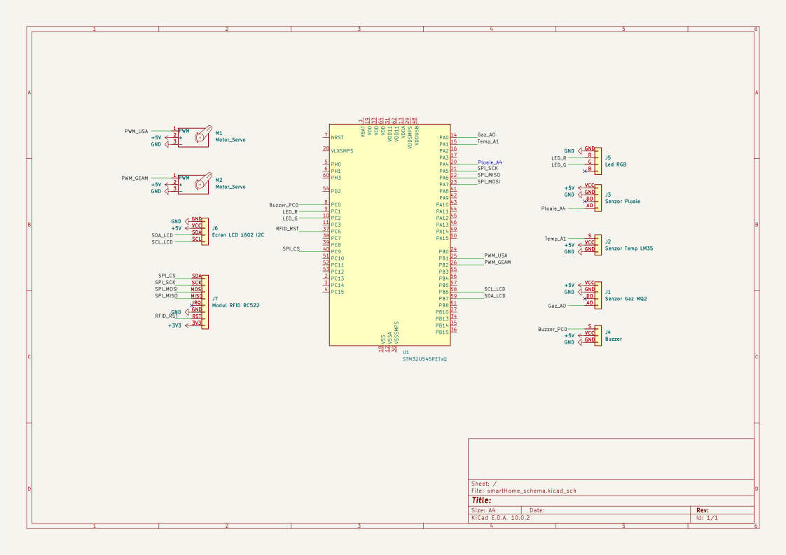

# Mini Smart Home
A miniature smart home model featuring automated security, climate control, emergency hazard detection.

:::info

**Author**: Badea Andreea-Bianca \
**GitHub Project Link**: [link_to_github](https://github.com/UPB-PMRust-Students/acs-project-2026-badeabianca)

:::

<!-- do not delete the \ after your name -->

## Description

This project is a miniature smart home prototype designed to demonstrate practical home automation and safety features. It integrates an RFID-based security system for door access, alongside a climate control module that automatically adjusts windows based on real-time temperature and rain detection. For safety, it features an emergency hazard protocol that triggers an alarm and opens windows if smoke or gas is detected. Additionally, the system includes a built-in LCD screen for monitoring environmental data and a RGB lighting system, creating a complete, interactive model of modern smart living.

## Motivation

I chose this project because I wanted to build something highly interactive that you can see working in real life. It is fascinating to learn how data from sensors can control physical movements, like unlocking a door with a card or automatically closing the windows when it rains. I also wanted to create a system that reacts to dangers, such as turning on an alarm and opening windows if it detects smoke or gas. Building this model is a great and simple way to learn how to connect sensors, motors, and lights together.

## Architecture

The final system will include modules for:
Environment sensing:

- Digital temperature and humidity sensor (DHT11).

- Rain sensor (detects precipitation to trigger window and awning control).

- Gas and smoke sensor (MQ2) for safety monitoring.

Output feedback: LCD 1602 display with an I2C interface, for showing system status (e.g., temperature, humidity, "Emergency Mode", system alerts).

Motorized components: Two SG90 servo motors: one for door access, one for window control.

Input system: RC522 RFID module for scanning the access card.

Indicators: RGB LED module and an active buzzer (for alarms).


## Log

<!-- write your progress here every week -->

### Week 23 - 29 March
Decided on the project idea.

### Week 13 - 19 April
I researched ideas for implementing the project and made a list of necessary materials.

### Week 20 - 26 April
I wrote the initial documentation.

### Week 27 April - 3 May
I ordered the components.

### Week 4 - 10 May
I tested the components and assembled the hardware part of the project.

### Week 11 - 17 May
I worked on the project's software.

## Hardware

The system is built around the STM32 Nucleo-U545RE-Q microcontroller. The sensory hardware includes a LM35 temperature sensor , a rain sensor , an MQ2 gas/smoke sensor for safety , and an RC522 RFID module for secure access. Outputs and physical movements are driven by SG90 servomotors , an active buzzer , an RGB LED module , and an I2C-enabled LCD1602 screen for displaying system data.

### Schematics



### Bill of Materials

<!-- Fill out this table with all the hardware components that you might need.

The format is
```
| [Device](link://to/device) | This is used ... | [price](link://to/store) |

```

-->

| Device | Usage | Price |
|--------|--------|-------|
| [STM32 Nucleo-U545RE-Q](https://www.st.com/en/evaluation-tools/nucleo-u545re-q.html) | The microcontroller | Lab Provided
| [SG90 Servo Motor](https://www.bitmi.ro/componente-electronice/servomotor-sg90-180-grade-9g-10496.html) | Controls door/window | [9.99 RON](https://www.bitmi.ro/componente-electronice/servomotor-sg90-180-grade-9g-10496.html) |
| [RC522 RFID Module](https://www.bitmi.ro/module-electronice/modul-rfid-rc522-13-59mhz-cu-card-si-tag-10468.html) | Access control | [14.99 RON](https://www.bitmi.ro/module-electronice/modul-rfid-rc522-13-59mhz-cu-card-si-tag-10468.html) |
| [LM35 Temperature Sensor](https://www.bitmi.ro/senzori-electronici/modul-senzor-de-temperatura-lm35-compatibil-arduino-10392.html) | Indoor climate monitor  | [9.99 RON](https://www.bitmi.ro/senzori-electronici/modul-senzor-de-temperatura-lm35-compatibil-arduino-10392.html) |
| [MQ2 Gas Sensor Module](https://www.bitmi.ro/senzori-electronici/modul-senzor-de-gaze-mq2-11214.html) | Hazard and smoke detector | [11.99 RON](https://www.bitmi.ro/senzori-electronici/modul-senzor-de-gaze-mq2-11214.html) |
| [RGB LED Module](https://www.bitmi.ro/module-electronice/modul-led-rgb-3-culori-10401.html) | Visual status indicator | [2.13 RON](https://www.bitmi.ro/module-electronice/modul-led-rgb-3-culori-10401.html) |
| [LCD1602 Display with I2C/IIC Module](https://www.bitmi.ro/componente-electronice/ecran-lcd1602-cu-modul-i2c-iic-10487.html) | System data screen | [24.99 RON](https://www.bitmi.ro/componente-electronice/ecran-lcd1602-cu-modul-i2c-iic-10487.html) |
| [Rain sensor](https://www.bitmi.ro/electronica/modul-senzor-de-ploaie-10455.html) | Rain sensor | [6.99 RON](https://www.bitmi.ro/electronica/modul-senzor-de-ploaie-10455.html) |

## Software

| Library | Description | Usage |
|---------|-------------|-------|
| cortex-m | Low-level ARM Cortex-M core access | Used for core processor control and critical sections |
| cortex-m-rt | Startup runtime for Cortex-M | Used for system initialization and reset vector handling |
| cortex-m-semihosting | Host PC debug communication | Used for sending debug messages during development |
| defmt | High-efficiency embedded logging | Used for formatting system logs and error outputs |
| defmt-rtt | RTT logging transport driver | Used for transmitting logs to the host PC in real-time |
| panic-probe | Panic handler for probe-rs | Used to catch runtime panics and print call stacks |
| embassy-stm32 | Async HAL for STM32 microcontrollers | Used to configure and control GPIO, ADC, I2C, and SPI |
| embassy-executor | Async/await task scheduler | Used to drive the main asynchronous execution loop |
| embassy-time | Timekeeping and delay utilities | Used for non-blocking sensor pooling and state timing |
| embedded-hal | Standardized hardware abstraction traits | Used as a unified interface for peripheral drivers |
| embedded-hal-bus | SPI/I2C bus sharing utilities | Used to manage peripheral access on shared buses safely |
| mfrc522 | MFRC522 RFID reader driver | Used to scan and read access cards at the entrance |
| hd44780-driver | Character LCD display driver | Used to print system status, temperature, and alerts to the screen |

## Links

<!-- Add a few links that inspired you and that you think you will use for your project -->

1. [DIY Smart Home](https://youtu.be/Ohjlj0z85hQ?is=nvKfke6AahJwSeIl)
