# TeddyBot
A wired animatronic toy that translates console commands into synchronized movements, audio and a pulsing LED heartbeat.

**Author**: Ivașcu Andreea-Daria \
**GitHub Project Link**: https://github.com/UPB-PMRust-Students/acs-project-2026-Daria-Ivascu


<!-- do not delete the \ after your name -->

## Description

This project consists of an interactive animatronic system designed to demonstrate embedded hardware control. The input stage utilizes a wired console where user commands are captured through tactile button presses. During the processing stage, the development board translates these digital signals to evaluate logic, initiate specific motor actuation routines and fetch stored audio files. The output stage is multi-sensory: it produces precise mechanical limb articulation, outputs pre-recorded audio playback and uses light modulation to create a glowing, pulsating "heartbeat" effect in the toy's chest.

## Motivation

The inspiration for this project stems from the desire to create technology that feels organic and approachable. Animatronics are widely used in entertainment, education and even therapeutic settings because of their ability to mimic life. The motivation here is to engineer a lifelike, interactive toy controlled via a wired interface. By programming the microcontroller to handle multiple routines simultaneously—triggering specific mechanical motions, playing contextual audio and modulating a glowing "heartbeat" - the project demonstrates how engineering and programming can be combined to build empathetic, interactive machines.

## Architecture 

The *hardware system* is centered around the STM32 microcontroller, which processes sensor inputs to drive physical actuators and log data.

**Processing**: The STM32 Nucleo-U545RE-Q handles all logic and signal generation. It connects to a PC via USB-C for flashing and debugging.

**Power Management**: A 5V power supply provides a stable power rail, independently feeding the STM32, sensors and servos to prevent voltage drops.

**Inputs**: 
    -- MPU-6050 (IMU): Captures user tilt data and sends it to the STM32 via I2C.

**IR Sensor**: Acts as a finish-line detector, connected via a digital GPIO pin.

**Outputs & Storage**: 
    -- SG90 Servos (X/Y axes): Driven by PWM signals to tilt the physical labyrinth board.

**MicroSD Module**: Uses the SPI protocol to save and log player high scores.

 

## Log

<!-- write your progress here every week -->

### Week 14 - 20 April
-- Finalized project theme and received approval
-- Researched and ordered all hardware components

### Week 4 - 8 May

### Week 12 - 18 May

### Week 19 - 25 May

## Hardware

The hardware centers on an STM32 microcontroller that orchestrates servo motors via an I2C driver for movement, an MP3 module for audio, an LED for a heartbeat and radio transceivers for wireless control.

### Schematics


### Bill of Materials

<!-- Fill out this table with all the hardware components that you might need.

The format is 
```
| [Device](link://to/device) | This is used ... | [price](link://to/store) |

```

-->

| Device | Usage | Price |
|--------|--------|-------|
| [STM32 Nucleo Board](https://www.st.com/) | Main Controller | Lab provided |
| [MG996R Servomotors](https://sigmanortec.ro/servomotor-mg996r-180-13kg) | Main limb actuators | - |
| [SG90 Servomotors](https://www.optimusdigital.ro/ro/motoare-servomotoare/26-micro-servomotor-sg90.html?search_query=servomotoare&results=97) | Small extremity actuators | - |
| [PCA9685 I2C Driver](https://sigmanortec.ro/Modul-PCA9685-interfata-I2C-16-CH-servo-motor-p126016016) | PWM servo expansion | - |
| [DFPlayer Mini](https://www.emag.ro/dfplayer-mini-modul-mp3-player-arduino-3-1-5/pd/DK58GGMBM/) | Audio playback module | - |
| [MicroSD Card](https://www.emag.ro/card-de-memorie-mediarange-micro-sdhc-4gb-clasa-10-cu-adaptor-sd-mr956/pd/DHJWRLMBM/) | Audio file storage | - |
| [10mm Red LED](https://www.optimusdigital.ro/en/leds/950-10x10-mm-red-led.html?srsltid=AfmBOoq14qgdMscniAdjqzy9HZMP2RshjHvYCZdgrUY_g9ixo1Gz1tTl) | Heartbeat visual effect | - |
| [220/330 Ohm Resistor](https://sigmanortec.ro/en/resistants-and-potentiometers) | LED current limiter | - |
| [LM2596 / XL4015 Step-Down](https://sigmanortec.ro/en/step-down-modules) | Power regulator for servos | - |
| [9V 3A Power / LiPo](https://www.optimusdigital.ro/en/289-power-supplies?srsltid=AfmBOoq3f-KrvqiBN6oDQnpXyE9FK3CV40c7X1dXbdmYt1nsYyCw-U9-) | Main power source | - |
| [2x NRF24L01 Modules](https://sigmanortec.ro/en/nrf24l01-24ghz-wireless-transceiver-module) | Wireless communication | - |
| [Secondary MCU](https://www.optimusdigital.ro/en/?srsltid=AfmBOorgNMK-8EYwWnG-F8riLxQWjm3cwY6i07jMs1itOrzb46B99JIZ) | Remote control | - |
| [Buttons / Joysticks](https://sigmanortec.ro/en/buttons-and-interruptors) | Remote user inputs | - |
| [Breadboard Kit + MB102 Power](https://www.emag.ro/kit-breadboard-830-gauri-65-fire-modul-tensiune-alimentare-mb102-jh027/pd/DY1YP6BBM/) | Prototyping and power rail | - |


## Software

| Library | Description | Usage |
|---------|-------------|-------|
| [embassy-stm32](https://github.com/embassy-rs/embassy) | Hardware Abstraction Layer | Used for the display for the Pico Explorer Base |
| [embedded-sdmmc](https://crates.io/crates/embedded-sdmmc) | SD Card File System | Manages SPI communication and file system |
| [mpu6050](https://crates.io/crates/mpu6050) | IMU Driver | Converting physical motion into digital angular data |

## Links

<!-- Add a few links that inspired you and that you think you will use for your project -->

1. [The Embedded Rust Book](https://docs.rust-embedded.org/book/)
2. [Embassy Framework Docs](https://embassy.dev/)
3. [MPU6050 Technical Documentation](https://invensense.tdk.com/wp-content/uploads/2015/02/MPU-6000-Datasheet1.pdf)

