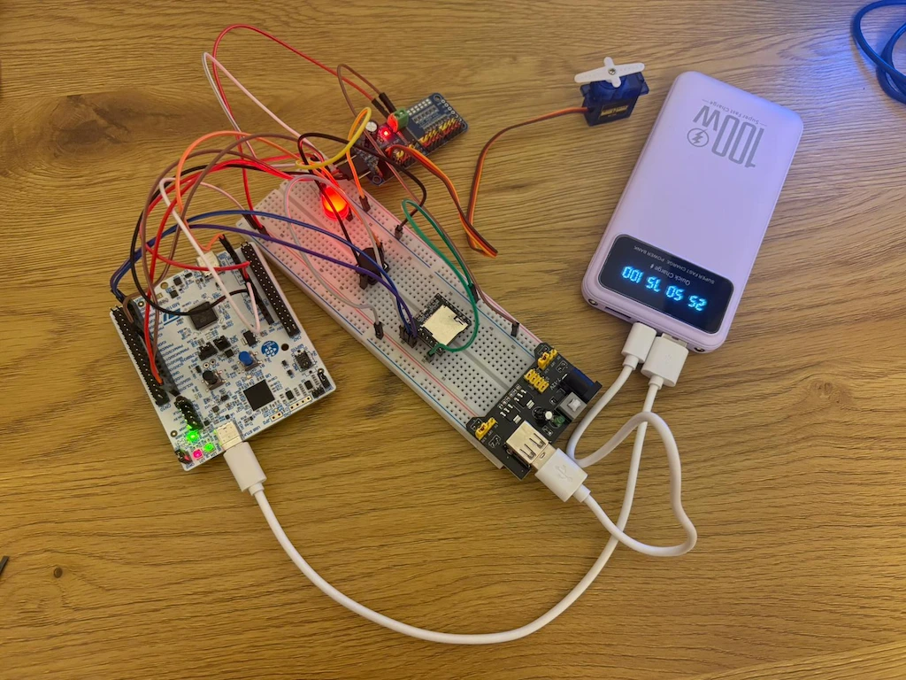
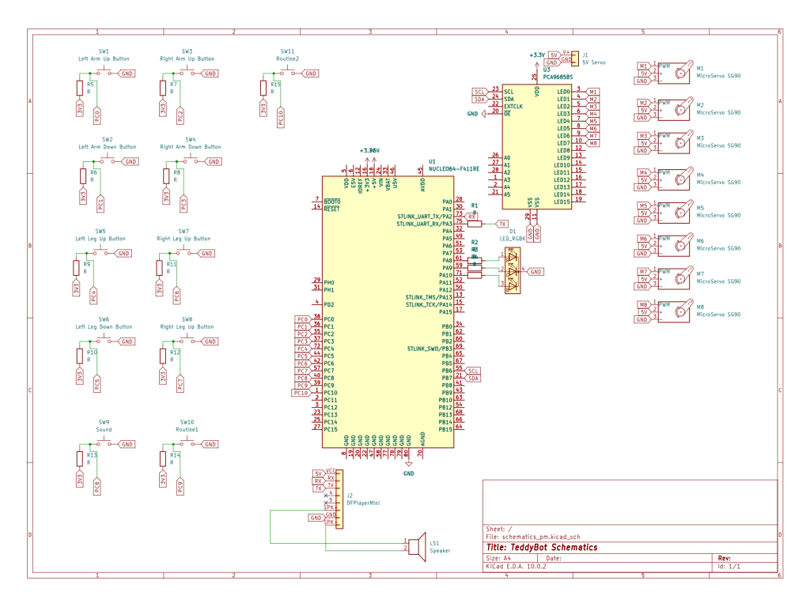

# TeddyBot
A wired animatronic toy that translates console commands into synchronized movements, audio and a pulsing LED heartbeat.

**Author**: Ivașcu Andreea-Daria \
**GitHub Project Link**: https://github.com/UPB-PMRust-Students/acs-project-2026-Daria-Ivascu


<!-- do not delete the \ after your name -->

## Description

This project consists of an interactive animatronic system designed to demonstrate embedded hardware control through multi-sensory outputs. The physical structure is built around a 40 cm plush teddy bear, laid flat on a backing panel where the development board and breadboards are mounted for stability. Rather than modifying the bear's structure, each limb is actuated through an external string-pull mechanism: individual servo motors are mounted on the panel and connected via thin strings to 
the skelet of the shoulders, elbows, hips and knees of the bear, pulling each joint into position when the corresponding servo rotates.
The input stage utilizes a wired console where user commands are captured through tactile button presses. Each button corresponds to a specific limb, sounds or predefined animation routine, allowing the user to trigger individual movements. These routines can also incorporate synchronized audio playback, combining mechanical motion and sound into cohesive, expressive animations.
During the processing stage, the STM32 Nucleo-U545RE-Q microcontroller translates these digital signals to evaluate logic, initiate specific motor actuation routines and fetch stored audio files. The output stage is multi-sensory: it produces precise mechanical limb articulation through the string-pull servo system, outputs pre-recorded audio playback and uses light modulation to create a glowing, pulsating "heartbeat" effect in the toy's chest.

## Motivation

The inspiration for this project stems from the desire to create technology that feels organic and approachable. Animatronics are widely used in entertainment, education and even therapeutic settings because of their ability to mimic life. The motivation here is to engineer a lifelike, interactive toy controlled via a wired interface. By programming the microcontroller to handle multiple routines simultaneously—triggering specific mechanical motions, playing contextual audio and modulating a glowing "heartbeat" - the project demonstrates how engineering and programming can be combined to build empathetic, interactive machines.

## Architecture 

The *hardware system* is centered around the STM32 microcontroller, which processes user inputs to drive physical actuators and generate audio-visual feedback.

**Processing**: The STM32 Nucleo-U545RE-Q handles all logic and signal generation. It connects to a PC via USB-C for flashing and debugging using ST-LINK/V3.

**Power Management**: A 5V powerbank serves as the primary power source, directly supplying the 5V rail for the servo motors through the PCA9685 driver. The STM32 microcontroller is also powered by the same source, utilizing its onboard voltage regulator to convert the 5V input into a stable 3.3V for the digital logic.

**Communications**:
- *I2C*: Used between the STM32 and the PCA9685 PWM driver for servo control commands.
- *UART*: Used between the STM32 and the DFPlayer Mini for audio playback commands.
- *PWM*: Generated by the PCA9685 for servo positioning and directly by the STM32 for LED modulation.
- *GPIO*: Used to read button inputs from the wired console.

**Inputs**:     
    - A wired console with tactile buttons connects to the STM32 via GPIO, allowing the user to trigger individual limb movements, predefined animation routines or audio files from the SD card through the DFPlayerMini.

**Outputs**: 
    - *PCA9685 PWM Driver*: Receives commands from the STM32 via I2C and generates PWM signals for all 8 servos simultaneously.
    - *MG996R Servos ×4*: Control shoulder and hip joints via PWM.
    - *SG90 Servos ×4*: Control elbow and knee joints via PWM.
    - *DFPlayer Mini*: Receives UART commands from the STM32 and plays pre-recorded audio files stored on a MicroSD card through an 8Ω 1W speaker.
    - *Red LED 10mm*: Driven by a PWM signal to simulate a heartbeat pulse effect in the chest of the teddy bear.

 

## Log

<!-- write your progress here every week -->

### Week 14 - 20 April
- Finalized project theme and received approval
- Researched all hardware components

### Week 27 April - 4 May
- Ordered all hardware components

### Week 4 - 8 May
- Tested all the components to ensure they are working
- Created first drafts for the TeddyBot

### Week 12 - 18 May
- Implemented the asynchronous control logic for the heartbeat light
- Configured and successfully integrated all 8 servo motors into the system through buttons
- Initialized the DFPlayer Mini module via UART and prepared the SD card with multiple audio tracks

### Week 19 - 25 May
- Developed synchronized, choreographed animation routines ("The Hug" and "Happy Dance") combining parallel multi-servo actuation with contextual audio feedback
- Reorganized the PCA9685 PWM channel mapping to physically isolate the left and right hemisphere wiring, significantly optimizing Teddy's cable management

## Hardware

The hardware centers on an STM32 microcontroller that orchestrates servo motors via an I2C PWM for movement, an MP3 module for audio, an LED for a heartbeat effect and a wired button console for user control.



### Schematics



### Bill of Materials

<!-- Fill out this table with all the hardware components that you might need.

The format is 
```
| [Device](link://to/device) | This is used ... | [price](link://to/store) |

```

-->

| Device | Usage | Price |
|--------|--------|-------|
| [STM32 Nucleo Board](https://www.st.com/) | Main Controller | Lab provided |
| [8x SG90 Servomotor](https://www.optimusdigital.ro/ro/motoare-servomotoare/26-micro-servomotor-sg90.html?search_query=servomotoare&results=97) | Main limb actuators | 13.99 RON each|
| [PCA9685 PWM Board 16 channels](https://www.emag.ro/placa-dezvoltare-general-pca9685-16-canale-pwm-12-biti-interfata-iic-alimentare-dc5-10v-gd-0015/pd/DDPYV8YBM/?ref=history-shopping_486605053_190386_1) | 16-channel I2C PWM driver for all servos | 37.51 RON |
| [DFPlayer Mini](https://www.emag.ro/modul-tf-16p-dfplayer-mini-player-audio-24-biti-32-gb-negru-auriu-5904162801930/pd/D8B8KLMBM/?ref=history-shopping_486605053_116388_1) | UART-controlled MP3 player module | 18.03 RON |
| [MicroSD Card](https://www.emag.ro/card-de-memorie-mediarange-micro-sdhc-4gb-clasa-10-cu-adaptor-sd-mr956/pd/DHJWRLMBM/) | Audio file storage | 24 RON |
| [10mm Red LED](https://sigmanortec.ro/led-rgb-10mm-catod-comun) | Heartbeat visual effect | 2.23 RON |
| [3W 8-Ohm Speaker](https://www.conexelectronic.ro/difuzoare/17459-DIFUZOR-3-W-8-OHMI-70X30MM.html?_gl=1*hv9gqd*_up*MQ..*_ga*MTk5Mjg4NTI2OC4xNzc3NDUwOTQ0*_ga_VNJZ3KSYZX*czE3Nzc0NTA5NDMkbzEkZzAkdDE3Nzc0NTA5NDMkajYwJGwwJGg5MjA3MDQxMw) | Audio output for DFPlayer Mini | 30.50 RON |
| [13x Tactile Push Buttons](https://sigmanortec.ro/Buton-12x12x7-3-p160373654) | Wired console input for limb control | 1.33 RON each|
| [Powerbank 5V 20000mAh](https://www.emag.ro/baterie-externa-nuodwell-power-bank-20000mah-pd-22-5w-quickcharge-3-0-display-led-compatibil-cu-cabluri-tip-type-c-lightning-micro-usb-2-x-usb-incorporate-2-x-led-flash-abs-pc-mov-cxf047/pd/D70J6DYBM/) | Main power source for all components | 63.04 RON |
| [2x MB-102 Breadboard 200x630 points](https://www.emag.ro/breadboard-h-hct-tronic-830-puncte-de-conectare-abs-200x630-puncte-034-066/pd/DBNQ7R3BM/?ref=history-shopping_486605053_1558_1) | Prototyping platform for all connections | 10 RON each |
| [MB-102 Breadboard 400 points](https://sigmanortec.ro/Breadboard-400-puncte-p129872825) | Secondary prototyping board for the audio module and auxiliary mini-circuits | 6.62 RON |
| [Breadboard Power Supply](https://www.optimusdigital.ro/en/linear-regulators/61-breadboard-source-power.html?srsltid=AfmBOoqlQHNAoC4v6awvvkiXtXCXTNmnI55AzQYZUKZm0con7M3yU4R7) | Power rail for breadboard | 4.69 RON |
| [20m Polymer-Coated Metal Wire](https://carrefour.ro/produse/franghie-rufe-20-m-metalica-19-31003679?srsltid=AfmBOopitDsjGte9fJsZudlIpfryQozfsu4lMLAeh88DVTkvehqwudn6) | Custom endoskeleton providing lightweight structural support and high malleability | 10 RON |
| [50 cm Teddy Bear](https://www.emag.ro/jucarie-de-plus-urs-wepzsxo-50cm-cu-papion-maro-deschis-pentru-baieti-casas00572/pd/DFV9XN3BM/) | Main body and physical casing of the robot | 64.41 RON |


## Software

| Library | Description | Usage |
|---------|-------------|-------|
| [embassy-stm32](https://github.com/embassy-rs/embassy) | Hardware Abstraction Layer | Manages the GPIO pins (buttons), I2C (motor driver), UART (DFPlayer) and Timers (for the LED heartbeat) |
| [embassy-time](https://crates.io/crates/embassy-time) | Time and Delay Management | Used for asynchronous delays and hardware debounce filtering for the buttons |
| [embassy-executor](https://crates.io/crates/embassy-executor) | Async/Await Executor | Runs the main logic and enables concurrent multitasking |
| [pwm-pca9685](https://crates.io/crates/pwm-pca9685) | PCA9685 I2C Driver | Handles the PWM signals to accurately control the angles of the 8 servo motors on the teddy's skeleton |
| [defmt](https://crates.io/crates/defmt) | Logging Framework | Sends text messages from the microcontroller to the PC console for debugging purposes |

## Links

<!-- Add a few links that inspired you and that you think you will use for your project -->

1. [The Embedded Rust Book](https://docs.rust-embedded.org/book/)
2. [Embassy Framework Docs](https://embassy.dev/)
3. [MPU6050 Technical Documentation](https://invensense.tdk.com/wp-content/uploads/2015/02/MPU-6000-Datasheet1.pdf)

