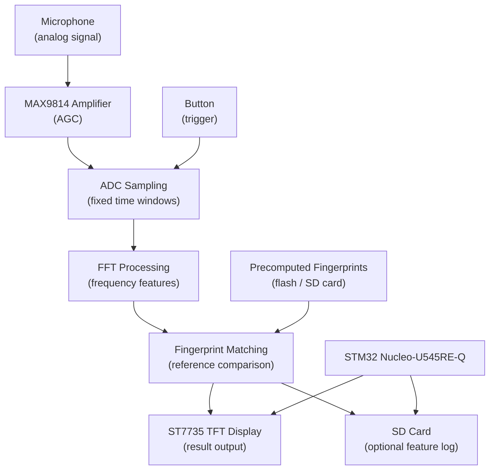

# Embedded Audio Recognition System

Real-time audio fingerprint recognition on an STM32 Nucleo microcontroller.

:::info

**Author**: Andreea-Maria Pascu \
**GitHub Project Link**: https://github.com/UPB-PMRust-Students/acs-project-2026-andreeaa-10.git

:::

## Description

The system captures audio through a microphone triggered by a button press. The analog signal is amplified by a MAX9814 module before being digitized by the STM32's ADC. Each fixed-length audio window is processed with FFT to extract frequency-domain features, which are then compared against precomputed fingerprints stored on the device. The closest match is displayed on the TFT screen in real time.

## Motivation

I chose this project because it combines signal processing and embedded programming in a way that felt more challenging than a typical sensor project. Through university coursework I have worked with algorithms and low-level programming, and this project is a natural next step (applying those concepts under real hardware constraints). I also listen to a lot of music, so building something that can actually recognize songs made it a more personal goal.

## Architecture

- **Audio Capture Module** - reads the microphone signal through the MAX9814 amplifier (with automatic gain control), then samples the amplified analog signal via the ADC in fixed-length windows triggered by a button press.
- **FFT Module** - applies a fast Fourier transform (FFT) on each sampled window to extract frequency-domain features.
- **Matching Module** - compares extracted frequency-domain features against precomputed fingerprints of reference songs stored in flash or on the SD card.
- **Display Module** - shows the identified song (or a no-match result) on the ST7735 TFT over SPI.
- **Logging Module (optional)** - writes captured feature vectors to the SD card for offline analysis.

## Log

### Week 6 - 12 April
Defined project scope: audio fingerprinting on STM32 Nucleo-U545RE-Q using Rust and Embassy. Identified main components and risks.

### Week 20 - 26 April
Performed initial research on required libraries and reviewed Embassy STM32 ADC examples.

### Week 27 - 3 May
Completed initial documentation. Hardware components ordered and received. 

### Week 4 - 10 May
Connected all hardware components on the breadboard. Verified that each component powers up correctly and tested basic communication (SPI bus with the display and SD card module, ADC input from the microphone amplifier).

### Week 11 - 17 May
Implemented basic ADC sampling and verified signal integrity using the MAX9814 module.

### Week 18 - 24 May
Completed full firmware implementation and host-side tooling: ADC sampling pipeline,
FFT + peak extraction, fingerprint generation and matching, UI state machine, and
Python scripts for audio capture, WAV conversion, and SD card flashing.

## Hardware

- **STM32 Nucleo-U545RE-Q** - main microcontroller running firmware in Rust with the Embassy async framework.
- **MAX9814 Microphone Amplifier Module** - amplifies the microphone signal and provides automatic gain control (AGC) before feeding it into the MCU ADC.
- **ST7735 TFT Display (1.8")** - shows recognition result over SPI.
- **SD Card Module** - optional storage for feature data, connected over SPI.
- **Push Buttons (x4)** - triggers recording session and menu navigation (up/down/select).
- **Breadboard** - solderless prototyping platform.
- **Jumper Wires (M-M, F-M, F-F)** - electrical interconnections between components.
- **Resistors** - used for biasing, current limiting, and voltage division.
- **Ceramic Capacitors** - used for decoupling, filtering, and signal stabilization.

### Schematics

### Bill of Materials

| Device | Usage | Price |
|--------|-------|-------|
| STM32 Nucleo-U545RE-Q | Main microcontroller | Provided by university |
| [MAX9814 amplifier module](https://www.emag.ro/amplificator-microfon-max9814-ai1095/pd/DJGRKFMBM/) | Microphone amplifier | ~24 RON |
| [ST7735 TFT Display (1.8")](https://sigmanortec.ro/Display-Color-1-8-TFT-LCD-p130546947) | Result display | ~41 RON |
| [MicroSD Card module](https://sigmanortec.ro/Modul-MicroSD-p126079625) | Feature logging | ~5 RON |
| [Push button (x4)](https://sigmanortec.ro/Buton-Mini-6x6x5-p134585482) | Recording trigger and menu navigation | ~8 RON |
| [Breadboard](https://www.emag.ro/breadboard-h-hct-tronic-830-puncte-de-conectare-abs-200x630-puncte-034-066/pd/DBNQ7R3BM/) | Prototyping | ~10 RON |
| [Jumper wires M-M](https://sigmanortec.ro/40-Fire-Dupont-30cm-Tata-Tata-p210849599) | Component interconnections | ~7 RON |
| [Jumper wires M-F](https://sigmanortec.ro/40-Fire-Dupont-30cm-Tata-Mama-p210854349) | Component interconnections | ~7 RON |
| [Jumper wires F-F](https://sigmanortec.ro/40-Fire-Dupont-30cm-Mama-Mama-p126421578) | Component interconnections | ~7 RON |
| [Ceramic Capacitor Kit](https://sigmanortec.ro/Set-condensatori-ceramici-300-bucati-p136306101) | Decoupling, filtering, and signal stabilization | ~13 RON |
| [Resistor Kit](https://sigmanortec.ro/kit-rezistori-30-valori-20-bucati) | Biasing, current limiting, and voltage division | ~15 RON |

**Estimated total**: ~137 RON

## Software

The firmware runs on the STM32 Nucleo-U545RE-Q using Rust and Embassy. Host-side tooling is in Python.

### Firmware architecture

The main loop runs as a single Embassy task and handles UI state, ADC sampling, FFT processing, fingerprint matching, and display output.

**Audio capture** - samples the MAX9814 output via ADC1 at ~6.5 kHz. Each 512-sample window has its DC offset removed before being passed to the FFT stage.

**FFT and peak extraction** - applies a Hann window on each 512-sample buffer, then runs `microfft::rfft_512`. The spectrum is split into four frequency bands and the dominant bin in each band is selected as a peak. Silent windows are discarded.

**Fingerprint generation** - pairs peaks within a ±5-window time delta into 32-bit hashes encoding `(f_anchor, f_target, Δt)`. The full database is loaded from the SD card at boot and kept in RAM.

**Matching** - builds a time-offset histogram between live and database hashes using fuzzy matching (±2 bins, ±1 time unit). The song with the highest cluster score above 20 is declared a match.

**Display** - a 3-option menu (Identify / Visualizer / Library) rendered on the ST7735 over SPI. The Identify screen drives the full record → match → result flow.

### Database loading

At boot, the device reads up to `NUM_SONGS` binary files (`SONG1.BIN`, `SONG2.BIN`, …) from the SD card. Each file contains 188 × 512 bytes of 8-bit unsigned audio sampled at 6590 Hz. Peaks and fingerprints are extracted and stored in a static `DATABASE` array in RAM.

### Host tooling

| Script | Purpose |
|---|---|
| `wav_to_bin.py` | Resamples a WAV to 6590 Hz, converts to 8-bit unsigned, outputs a 188 × 512 byte `.BIN` file |
| `check_bin.py` | Prints per-window dominant band for a `.BIN` file - sanity check before flashing |
| `flash_songs.py` | Sends `.BIN` files to the MCU over UART with per-chunk checksum + ACK handshake |
| `capture_audio.py` | Captures live ADC output from the MCU over UART and saves it as a WAV for offline analysis |

### Libraries

| Library | Description | Usage |
|---|---|---|
| [embassy-stm32](https://crates.io/crates/embassy-stm32) | Embassy HAL for STM32 | ADC, SPI, GPIO, timers |
| [microfft](https://crates.io/crates/microfft) | FFT for `no_std` | Real-valued 512-point FFT on audio windows |
| [mipidsi](https://crates.io/crates/mipidsi) | ST7735 SPI display driver | TFT display control |
| [embedded-graphics](https://crates.io/crates/embedded-graphics) | 2D graphics for embedded | Text and shape rendering on the display |
| [embedded-sdmmc](https://crates.io/crates/embedded-sdmmc) | SD card + FAT filesystem | Reading `.BIN` song files from SD card |
| [heapless](https://crates.io/crates/heapless) | Stack-allocated collections | `Vec` for peaks and fingerprints without `alloc` |
| [embedded-hal-bus](https://crates.io/crates/embedded-hal-bus) | Shared SPI bus | `RefCellDevice` for sharing SPI between display and SD card |
| [libm](https://crates.io/crates/libm) | `no_std` math | `cosf` for Hann window computation |

1. [Shazam algorithm overview](https://www.toptal.com/algorithms/shazam-it-music-processing-fingerprinting-and-recognition)