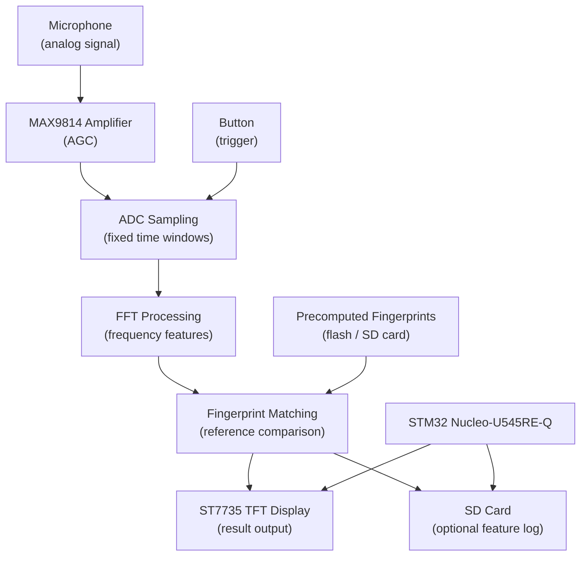
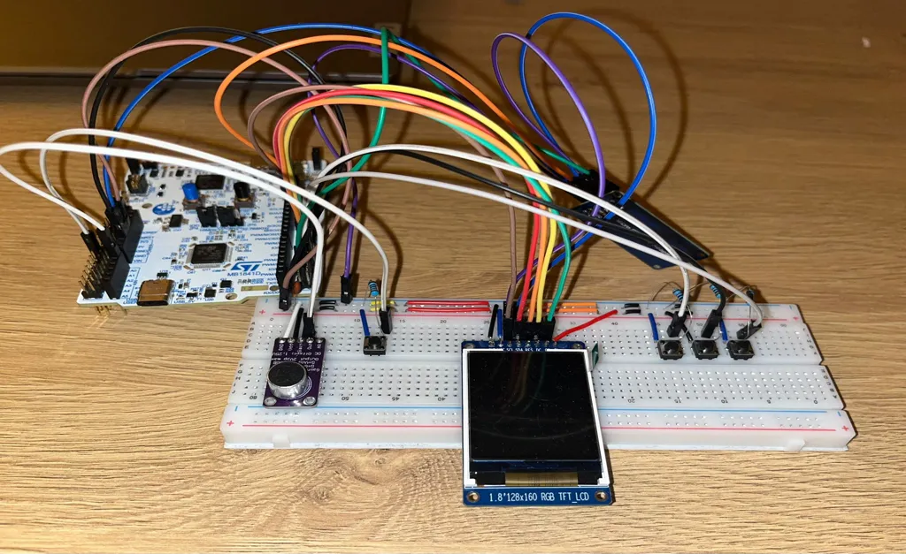
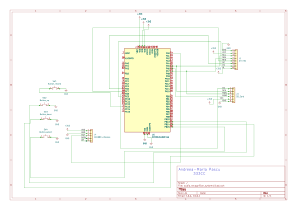

# Embedded Audio Recognition System

Real-time audio fingerprint recognition on an STM32 Nucleo microcontroller.

:::info

**Author**: Andreea-Maria Pascu \
**GitHub Project Link**: https://github.com/UPB-PMRust-Students/acs-project-2026-andreeaa-10.git

:::

## Description

The system captures audio through a microphone triggered by a button press. The analog signal is amplified by a MAX9814 module before being digitized by the STM32's ADC. Each fixed-length audio window is processed with FFT to extract frequency-domain features, which are then compared against precomputed fingerprints stored on the device. The closest match is displayed on the TFT screen in real time.

## Motivation

I chose this project because it combines signal processing and embedded programming in a way that felt more challenging than a typical sensor project. Through university coursework I have worked with algorithms and low-level programming, and this project is a natural next step (applying those concepts under real hardware constraints). I also listen to a lot of music, so building something that can actually recognize songs made it a more personal goal.

## Architecture

- **Audio Capture Module** - reads the microphone signal through the MAX9814 amplifier (with automatic gain control), then samples the amplified analog signal via the ADC in fixed-length windows triggered by a button press.
- **FFT Module** - applies a fast Fourier transform (FFT) on each sampled window to extract frequency-domain features.
- **Matching Module** - compares extracted frequency-domain features against precomputed fingerprints of reference songs stored in flash or on the SD card.
- **Display Module** - shows the identified song (or a no-match result) on the ST7735 TFT over SPI.
- **Logging Module (optional)** - writes captured feature vectors to the SD card for offline analysis.

## Log

### Week 6 - 12 April
Defined project scope: audio fingerprinting on STM32 Nucleo-U545RE-Q using Rust and Embassy. Identified main components and risks.

### Week 20 - 26 April
Performed initial research on required libraries and reviewed Embassy STM32 ADC examples.

### Week 27 - 3 May
Completed initial documentation. Hardware components ordered and received. 

### Week 4 - 10 May
Connected all hardware components on the breadboard. Verified that each component powers up correctly and tested basic communication (SPI bus with the display and SD card module, ADC input from the microphone amplifier).

### Week 11 - 17 May
Implemented basic ADC sampling and verified signal integrity using the MAX9814 module. Encountered issues related to sampling frequency versus signal bandwidth, which affected FFT stability and required further tuning of acquisition parameters.

### Week 18 - 24 May
Continued integration and refinement of the firmware and host-side tooling. Stabilized ADC acquisition after previous sampling issues and validated consistent FFT.

Completed full system implementation including ADC sampling pipeline, FFT + peak extraction, fingerprint generation and matching, UI state machine, and Python host scripts for audio capture, WAV conversion, and SD card flashing.

## Hardware

- **STM32 Nucleo-U545RE-Q** - main microcontroller running firmware in Rust with the Embassy async framework.
- **MAX9814 Microphone Amplifier Module** - amplifies the microphone signal and provides automatic gain control (AGC) before feeding it into the MCU ADC.
- **ST7735 TFT Display (1.8")** - shows recognition result over SPI.
- **SD Card Module** - optional storage for feature data, connected over SPI.
- **Push Buttons (x4)** - triggers recording session and menu navigation (up/down/select).
- **Breadboard** - solderless prototyping platform.
- **Jumper Wires (M-M, F-M, F-F)** - electrical interconnections between components.
- **Resistors** - used for biasing, current limiting, and voltage division.
- **Ceramic Capacitors** - used for decoupling, filtering, and signal stabilization.

### Schematics

### Bill of Materials

| Device | Usage | Price |
|--------|-------|-------|
| STM32 Nucleo-U545RE-Q | Main microcontroller | Provided by university |
| [MAX9814 amplifier module](https://www.emag.ro/amplificator-microfon-max9814-ai1095/pd/DJGRKFMBM/) | Microphone amplifier | ~24 RON |
| [ST7735 TFT Display (1.8")](https://sigmanortec.ro/Display-Color-1-8-TFT-LCD-p130546947) | Result display | ~41 RON |
| [MicroSD Card module](https://sigmanortec.ro/Modul-MicroSD-p126079625) | Feature logging | ~5 RON |
| [Push button (x4)](https://sigmanortec.ro/Buton-Mini-6x6x5-p134585482) | Recording trigger and menu navigation | ~8 RON |
| [Breadboard](https://www.emag.ro/breadboard-h-hct-tronic-830-puncte-de-conectare-abs-200x630-puncte-034-066/pd/DBNQ7R3BM/) | Prototyping | ~10 RON |
| [Jumper wires M-M](https://sigmanortec.ro/40-Fire-Dupont-30cm-Tata-Tata-p210849599) | Component interconnections | ~7 RON |
| [Jumper wires M-F](https://sigmanortec.ro/40-Fire-Dupont-30cm-Tata-Mama-p210854349) | Component interconnections | ~7 RON |
| [Jumper wires F-F](https://sigmanortec.ro/40-Fire-Dupont-30cm-Mama-Mama-p126421578) | Component interconnections | ~7 RON |
| [Ceramic Capacitor Kit](https://sigmanortec.ro/Set-condensatori-ceramici-300-bucati-p136306101) | Decoupling, filtering, and signal stabilization | ~13 RON |
| [Resistor Kit](https://sigmanortec.ro/kit-rezistori-30-valori-20-bucati) | Biasing, current limiting, and voltage division | ~15 RON |

**Estimated total**: ~137 RON

## Software

The firmware runs on the STM32 Nucleo-U545RE-Q using Rust and Embassy. Host-side tooling is in Python.

### Processing pipeline

1. Audio is captured from the MAX9814 microphone using the STM32 ADC in fixed-size windows. Each window is preprocessed by removing DC offset to stabilize the signal before analysis.

2. The signal is converted into the frequency domain using a 512-point FFT. A windowing function is applied to reduce spectral leakage and improve peak stability.

3. The resulting spectrum is reduced to a compact set of dominant frequency peaks, which serve as the main features of each audio window.

4. These features are combined across short time intervals to form robust audio fingerprints that capture consistent frequency relationships.

5. The generated fingerprints are compared against a precomputed database loaded from the SD card at startup, and a similarity score is computed for each reference song.

6. The song with the highest stable matching score above a predefined threshold is selected as the final result and displayed on the TFT screen.

### Database loading

At startup, the device loads precomputed audio fingerprints from multiple binary files stored on the SD card. Each file corresponds to a reference song and is processed into an in-memory database used for real-time matching during execution.

### Host tooling

| Script | Purpose |
|---|---|
| `wav_to_bin.py` | Converts a WAV file into the binary format used by the embedded system. It also resamples audio to 6590 Hz and encodes it as 8-bit unsigned data. |
| `check_bin.py` | Performs a quick validation of processed `.BIN` files by printing dominant frequency bands per window, used for sanity checking before deployment. |
| `flash_songs.py` | Transfers prepared `.BIN` audio files to the STM32 device over UART, ensuring reliable transmission using chunk-based acknowledgements. |
| `capture_audio.py` | Receives live ADC audio data from the microcontroller over UART and saves it as a WAV file for offline analysis and debugging. |

### Libraries

|### Libraries

| Library | Purpose | Usage |
|---|---|---|
| [embassy-stm32](https://crates.io/crates/embassy-stm32) | Embedded runtime for STM32 | Hardware abstraction (ADC, SPI, GPIO, timers) |
| [microfft](https://crates.io/crates/microfft) | Lightweight FFT library for `no_std` systems | Audio signal processing |
| [mipidsi](https://crates.io/crates/mipidsi) | Display driver for SPI screens | TFT display control |
| [embedded-graphics](https://crates.io/crates/embedded-graphics) | Graphics library for embedded devices | Rendering UI elements on the display |
| [embedded-sdmmc](https://crates.io/crates/embedded-sdmmc) | SD card + FAT filesystem support | Loading audio data from storage |
| [heapless](https://crates.io/crates/heapless) | Fixed-capacity data structures | Memory-safe buffers for embedded constraints |
| [embedded-hal-bus](https://crates.io/crates/embedded-hal-bus) | Shared peripheral access | SPI bus sharing between devices |
| [libm](https://crates.io/crates/libm) | Math functions for `no_std` environments | Basic signal processing math (e.g. windowing) |

1. [Shazam algorithm overview](https://www.toptal.com/algorithms/shazam-it-music-processing-fingerprinting-and-recognition)