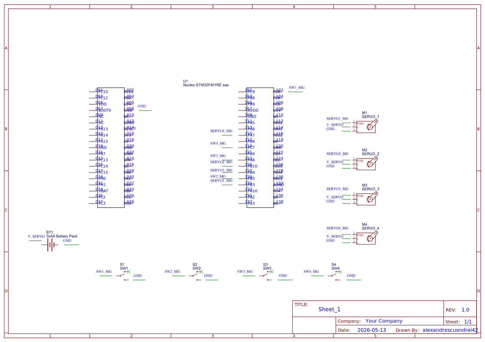

# RustMed Locker

A smart medication locker with four independent compartments, controlled by an STM32 NUCLEO board and written in Rust.

## Description

RustMed Locker is a small embedded system that works like a medication locker with four separate compartments. Each compartment is assigned to one dose from a daily schedule:

* **C1 - Morning Dose**
* **C2 - Noon Dose**
* **C3 - Evening Dose**
* **C4 - Night Dose**

The idea is simple: when a dose becomes active, only the corresponding compartment is unlocked. The user opens the drawer, takes the medication, closes the drawer, and then the system locks it again. If the user does not open the drawer in time, or if the drawer is left open, the system detects the problem and signals it using the buzzer, the onboard LED and terminal logs.

Each compartment has:

* one servo motor for locking and unlocking;
* one microswitch for detecting if the drawer is open or closed.

The project is controlled by an STM32 NUCLEO board. The firmware is written in Rust and uses PWM for the servo motors, GPIO inputs for the microswitches, and GPIO outputs for the buzzer and onboard LED.

The final version is built as a 4-drawer organizer. The servos are mounted so that each one can physically block or release a drawer, and the microswitches are positioned so that a closed drawer presses the switch. This makes it possible for the firmware to know when a drawer is closed and when it was opened.

## Motivation

I chose this project because I wanted something with both visible hardware movement and enough software logic to make it more than a simple component test. A medication locker was a good fit because it has a clear use case: organizing doses and making sure the user interacts with the correct compartment.

From the hardware side, the project uses several different components: servo motors, microswitches, a buzzer, an external power supply and the STM32 board. From the software side, it uses a state machine, timeouts, reminders, alarms, recovery logic and statistics.

I also liked that the project could be developed step by step. I first tested a single servo, then all four servos, then the microswitches, then the buzzer, and finally the full firmware. This made debugging easier because each part could be verified separately before combining everything into the final locker.

## Architecture

The STM32 NUCLEO board is the central controller of the project. It runs the Rust firmware and coordinates the whole locker. The firmware decides which compartment is active, controls the servos, reads the microswitches and generates feedback through the buzzer and LED.

The main architecture components are:

* **Medication schedule logic** - activates the compartments in the order Morning, Noon, Evening and Night.
* **Compartment state machine** - controls the lifecycle of each compartment.
* **Servo control** - sends PWM signals to the four servo motors.
* **Door sensing** - reads the four microswitches and converts their values into OPEN or CLOSED drawer states.
* **Feedback system** - controls the buzzer and LED for reminders, confirmations and alarms.
* **Statistics and logging** - keeps track of completed doses, missed doses, alarms and other events.

The high-level architecture is:

```text
+----------------------------------+
|           STM32 NUCLEO           |
|          Rust Firmware           |
+----------------+-----------------+
                 |
                 v
+----------------------------------+
|        Medication Schedule       |
|   Morning -> Noon -> Evening ->  |
|              Night               |
+----------------+-----------------+
                 |
                 v
+----------------------------------+
|      Compartment State Machine   |
| scheduled / reminder / unlock /  |
|        monitor / lock            |
+----------+-----------------------+
           |
           +---------------------------+
           |                           |
           v                           v
+----------------------+     +----------------------+
|    Servo Motors      |     |    Microswitches     |
|   Lock / Unlock      |     |   Open / Closed      |
|   C1 C2 C3 C4        |     |   C1 C2 C3 C4        |
+----------+-----------+     +----------+-----------+
           |                           |
           v                           v
+----------------------------------+
|        Physical Compartments     |
|     Morning / Noon / Evening /   |
|              Night               |
+----------------------------------+
                 |
                 v
+----------------------------------+
|          LED + Buzzer            |
|   reminders / alarms / status    |
+----------------------------------+
```

A normal interaction with one compartment is:

```text
1. The dose becomes active.
2. The buzzer and LED signal a reminder.
3. The servo unlocks the compartment.
4. The firmware waits for the drawer to be opened.
5. The firmware waits for the drawer to be closed.
6. The servo locks the compartment again.
7. The firmware stores the final result.
```

The firmware also handles abnormal situations. If the drawer is not opened in time, the dose is marked as missed. If the drawer is opened but not closed, the system enters an alarm state and then a recovery state. If a drawer that is not currently active is opened, the system treats it as an unauthorized access attempt.

## Log

### Week 5 - 11 May

I started by choosing the project idea and deciding the main components. I wanted a project that uses both sensors and actuators, so I chose a medication locker with four compartments. I planned the first version around an STM32 NUCLEO board, four servo motors and four microswitches.

The first tests were done with servo motors. I tested PWM control and checked how different duty cycle values change the servo position. This helped me understand how the locking mechanism could work in the final build.

I also decided the role of each compartment:

* C1 for the morning dose;
* C2 for the noon dose;
* C3 for the evening dose;
* C4 for the night dose.

### Week 12 - 18 May

During this week I connected and tested the main hardware setup. I connected all four servo motors and all four microswitches. The servo motors are powered from an external battery pack, because they can draw more current than the development board should provide. The ground of the battery pack is connected to the ground of the STM32 board, so the servo control signals have the correct reference.

I tested the microswitches using the internal pull-up configuration. In this wiring, the logic is:

* pressed switch = CLOSED drawer;
* released switch = OPEN drawer.

After testing, all four switches correctly reported OPEN and CLOSED, and all four servos moved independently. I also created the hardware schematic in EasyEDA and exported it for the documentation. The schematic includes the STM32 board, the servo signal lines, the switch inputs, the buzzer, the external servo power supply and the common ground.

I also added a buzzer to the circuit. The buzzer is used by the firmware for reminders, success signals and alarms.

### Week 19 - 25 May

This week I worked mainly on the software milestone. I replaced the basic hardware test code with the final firmware structure. The new firmware is based on a state machine and controls the locker as a complete system, not only as separate hardware components.

The implemented firmware includes:

* safe boot;
* startup diagnostics;
* four named medication compartments;
* servo lock/unlock control;
* drawer open/closed detection;
* switch debouncing;
* progressive reminders;
* missed dose detection;
* left-open drawer detection;
* recovery after alarm;
* tamper detection;
* buzzer and LED feedback;
* event logs;
* usage statistics;
* adherence score;
* separate servo calibration values for each compartment.

After this stage, I integrated the firmware with the hardware setup and used the switches and servos to test the main flows: completed dose, missed dose, left-open drawer and recovery.

## Hardware

The hardware is based on an STM32 NUCLEO development board. The board runs the Rust firmware and controls all inputs and outputs.

The final build uses:

* STM32 NUCLEO development board;
* 4 micro servo motors;
* 4 microswitches;
* 1 active buzzer;
* external battery pack for the servo motors;
* mini breadboard / wiring area;
* jumper wires;
* 4-drawer organizer used as the physical locker frame;
* mounting materials for fixing the servos, switches and wires.

The servo motors are used as the locking mechanism. Each servo has two useful positions:

* **LOCKED** - the servo arm blocks the drawer;
* **UNLOCKED** - the servo arm releases the drawer.

The microswitches are used as drawer sensors. In the final build, each drawer presses its switch when it is closed. When the drawer is opened, the switch is released.

```text
Switch pressed   -> drawer CLOSED
Switch released  -> drawer OPEN
```

The buzzer is used for sound feedback. It signals reminders, success and alarms. The onboard LED is used together with the buzzer so the user also gets visual feedback.

### Pin mapping

| Function    | Board pin | STM32 pin | Usage                         |
| ----------- | --------- | --------- | ----------------------------- |
| Servo 1     | D3        | PB3       | Lock/unlock C1 - Morning Dose |
| Servo 2     | D6        | PB10      | Lock/unlock C2 - Noon Dose    |
| Servo 3     | D5        | PB4       | Lock/unlock C3 - Evening Dose |
| Servo 4     | D11       | PA7       | Lock/unlock C4 - Night Dose   |
| Switch 1    | D2        | PC8       | Detect OPEN/CLOSED for C1     |
| Switch 2    | D4        | PB5       | Detect OPEN/CLOSED for C2     |
| Switch 3    | D7        | PA8       | Detect OPEN/CLOSED for C3     |
| Switch 4    | D8        | PC7       | Detect OPEN/CLOSED for C4     |
| Buzzer      | D12       | PA6       | Audio feedback and alarms     |
| Onboard LED | LED pin   | PA5       | Visual feedback               |

The servo motors are powered from the external battery pack. The STM32 board only provides the PWM control signals. The external battery ground and the STM32 ground are connected together.

### Schematics

The schematic was created in EasyEDA.



The schematic contains:

* the STM32 NUCLEO board;
* the four servo signal connections;
* the four microswitch inputs;
* the buzzer connection;
* the external power supply for the servos;
* the common ground connection.

### Bill of Materials

| Device                          | Usage                                                               | Price                  |
| ------------------------------- | ------------------------------------------------------------------- | ---------------------- |
| STM32 NUCLEO board              | Main board used to run the Rust firmware and control the components | Provided               |
| 4 x micro servo motors          | Used to lock and unlock the four compartments                       | Already owned          |
| 4 x microswitches               | Used to detect if each drawer is open or closed                     | Already owned          |
| Active buzzer                   | Used for reminders, confirmations and alarms                        | Already owned          |
| External battery pack           | Powers the servo motors separately from the board                   | Already owned          |
| Jumper wires                    | Used for all prototype connections                                  | Already owned          |
| Mini breadboard                 | Used for wiring and prototyping                                     | Already owned          |
| 4-drawer organizer              | Physical frame of the locker                                        | Bought for the project |
| Double-sided tape / Velcro tape | Used for mounting servos, switches and wires                        | Bought for the project |
| Basic cutting tools             | Used for adjusting mounting materials                               | Bought for the project |

## Software

| Library                                                   | Description                                  | Usage                                  |
| --------------------------------------------------------- | -------------------------------------------- | -------------------------------------- |
| [embassy-stm32](https://github.com/embassy-rs/embassy)    | STM32 hardware abstraction layer for Embassy | GPIO, PWM timers and peripheral access |
| [embassy-executor](https://github.com/embassy-rs/embassy) | Async executor for embedded Rust             | Runs the async firmware entry point    |
| [embassy-time](https://github.com/embassy-rs/embassy)     | Timing library for Embassy                   | Delays, reminders and timeouts         |
| [defmt](https://github.com/knurling-rs/defmt)             | Logging framework for embedded Rust          | Structured logs in the firmware        |
| [defmt-rtt](https://github.com/knurling-rs/defmt)         | RTT transport for defmt logs                 | Shows logs in the terminal             |
| [panic-probe](https://github.com/knurling-rs/panic-probe) | Panic handler for embedded Rust              | Debugging panics                       |

The firmware is written in Rust and runs directly on the STM32 NUCLEO board. The main software design is based on a state machine. This made the firmware easier to organize because each compartment has clear states and clear transitions.

The four logical compartments are:

```text
C1 - Morning Dose
C2 - Noon Dose
C3 - Evening Dose
C4 - Night Dose
```

Each compartment can be in one of these states:

```text
LOCKED
SCHEDULED
REMINDER_ACTIVE
UNLOCKING
WAITING_FOR_OPEN
DOOR_OPEN
WAITING_FOR_CLOSE
LOCKING
COMPLETED
MISSED
LEFT_OPEN
TAMPER_DETECTED
ALARM
RECOVERY
```

For a normal dose, the flow is:

```text
LOCKED
  |
  v
SCHEDULED
  |
  v
REMINDER_ACTIVE
  |
  v
UNLOCKING
  |
  v
WAITING_FOR_OPEN
  |
  v
DOOR_OPEN
  |
  v
WAITING_FOR_CLOSE
  |
  v
LOCKING
  |
  v
COMPLETED
```

This means the firmware does not mark a dose as completed only because the servo moved. The dose is completed only if the drawer was opened and then closed.

The firmware also handles error cases.

If the drawer is not opened in time:

```text
WAITING_FOR_OPEN
  |
  +-- timeout --> MISSED --> ALARM --> LOCKING
```

If the drawer is opened but not closed in time:

```text
WAITING_FOR_CLOSE
  |
  +-- timeout --> LEFT_OPEN --> ALARM --> RECOVERY
                                      |
                                      +-- drawer closed --> COMPLETED_AFTER_RECOVERY
                                      |
                                      +-- timeout --> LEFT_OPEN_UNRESOLVED
```

If another drawer is opened while it is not active:

```text
Inactive drawer OPEN --> TAMPER_DETECTED --> ALARM
```

The main software features are:

* **Safe boot** - all servos are moved to the locked position when the firmware starts.
* **Startup diagnostics** - the firmware tests the buzzer and LED and reads all switch states.
* **Medication schedule** - the firmware goes through Morning, Noon, Evening and Night doses.
* **Progressive reminders** - before marking a dose as missed, the firmware gives several reminders.
* **Automatic unlock and lock** - the active compartment is unlocked and then locked again after the interaction.
* **Completed dose detection** - the drawer must be opened and closed for the dose to count as completed.
* **Missed dose detection** - if the drawer is not opened in time, the dose is marked as missed.
* **Left-open detection** - if the drawer stays open too long, the firmware starts an alarm.
* **Recovery logic** - after a left-open alarm, the system waits again for the drawer to close.
* **Tamper detection** - if an inactive drawer is opened, the firmware detects unauthorized access.
* **Debouncing** - switch readings are filtered to avoid false changes.
* **Fail-safe locking** - after every compartment flow, the servo is returned to the locked position.
* **Audio and visual feedback** - buzzer and LED patterns are used for reminders, success and alarms.
* **Event log** - important actions are printed in the terminal with event numbers.
* **Statistics** - the firmware tracks completed doses, missed doses and alarms.
* **Adherence score** - the firmware computes the percentage of completed doses.
* **Servo calibration** - every compartment has separate locked and unlocked servo values.

The firmware prints logs in the terminal using `defmt`. This helped a lot during testing because I could see the exact current state, the active compartment, the drawer state and the final result for each dose.

## Links

1. [Embassy embedded Rust framework](https://embassy.dev/)
2. [Embassy GitHub repository](https://github.com/embassy-rs/embassy)
3. [Rust Embedded Book](https://docs.rust-embedded.org/book/)
4. [STM32 NUCLEO boards](https://www.st.com/en/evaluation-tools/stm32-nucleo-boards.html)
5. [EasyEDA](https://easyeda.com/)
