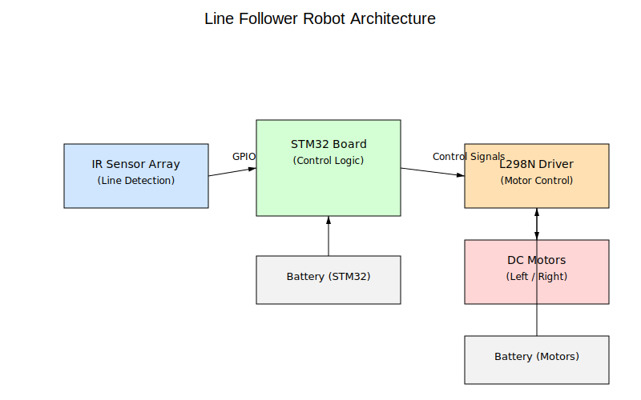
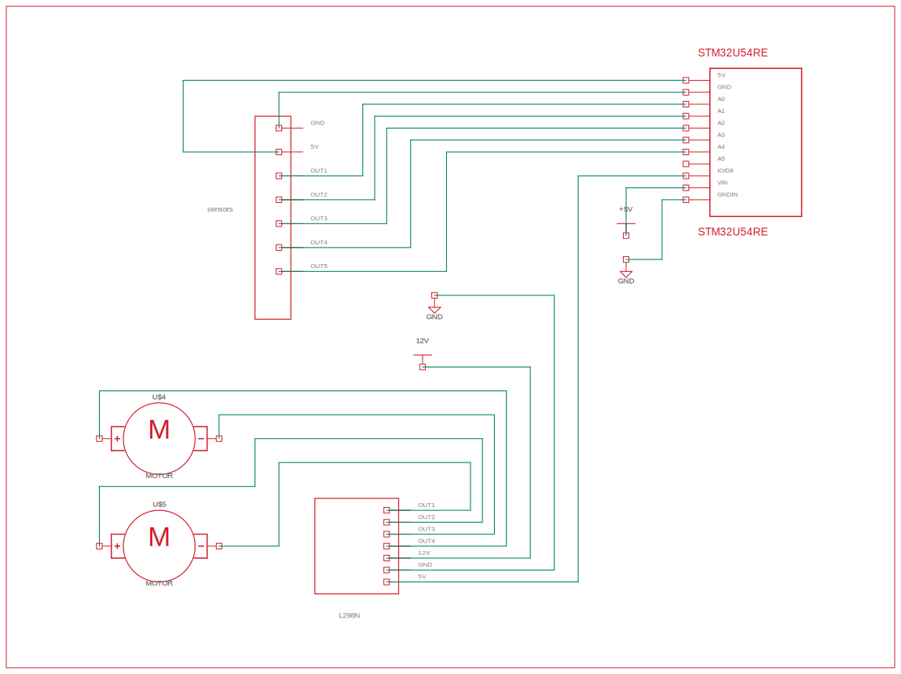

# Line Follower Robot

Autonomous robot that follows a line using an infrared sensor array and controls two DC gear motors through an L298N motor driver, based on an STM32 microcontroller.

:::info

**Author**: Andrei Bem \

**GitHub Project Link**: https://github.com/UPB-PMRust-Students/acs-project-2026-bemandrei

:::

## Description

This project consists of building an autonomous line follower robot using an STM32 microcontroller as the main control unit. The robot is designed to follow a black line drawn on a light surface using an infrared (IR) sensor array mounted at the front.

The IR sensors detect differences in reflectivity between the black line and the white background. These signals are read by the STM32 board, which processes them in real time and decides how the robot should move.

The robot uses two DC gear motors (yellow TT motors) for movement. These motors are controlled through an L298N motor driver, which allows independent control of each motor. This enables the robot to turn left or right by adjusting the speed or direction of each wheel.

A key aspect of this project is the use of two separate power sources:
- one battery pack for the STM32 (logic)
- one battery pack for the motors (through L298N)

This design ensures stable operation by preventing voltage drops and noise generated by motors from affecting the microcontroller.

## Motivation

I chose this project because it represents a fundamental concept in robotics: autonomous navigation using simple sensors.

The project helped me understand:
- how embedded systems interact with hardware components
- how to read and process digital sensor signals
- how to control motors using a driver module
- how to design a stable power system

Additionally, this project is a good introduction to embedded programming using STM32 and real-time control systems.

## Architecture

The system is divided into four main layers:

**Sensing Layer**: IR Sensor Array  
A board containing multiple infrared sensors placed in a line. Each sensor detects whether it is positioned over a dark line or a light surface.

**Control Layer**: STM32 Microcontroller  
The STM32 board reads sensor inputs via GPIO pins and applies the control logic. Based on the sensor pattern, it determines the movement direction.

**Actuation Layer**: L298N Motor Driver + DC Motors  
The L298N module receives control signals from the STM32 and drives the motors. Each motor can be controlled independently, allowing differential steering.

**Power Layer**: Dual Battery System  
- Battery pack 1 → STM32 (logic)  
- Battery pack 2 → L298N + motors  

All grounds are connected together to ensure proper signal reference.

---

### Architecture Diagram

### Hardware photo

---

## Electrical Design and Connections

The system is built using three main hardware blocks: STM32 board, IR sensor array and L298N motor driver.

### 1. Motor Driver (L298N)

The L298N module controls the motors and acts as an interface between STM32 and the motors.

Connections:

- OUT1 + OUT2 → Left motor  
- OUT3 + OUT4 → Right motor  

Control signals from STM32:

- IN1 → GPIO (controls left motor direction)
- IN2 → GPIO
- IN3 → GPIO (controls right motor direction)
- IN4 → GPIO

Optional:
- ENA → PWM pin (left motor speed control)
- ENB → PWM pin (right motor speed control)

Power supply:
- +V (VIN) → Motor battery pack (+)
- GND → Motor battery (-)

---

### 2. IR Sensor Array

The IR sensor board is placed in front of the robot and contains multiple sensors.

Connections:

- VCC → STM32 power (3.3V or 5V depending on module)
- GND → STM32 GND

Outputs:

- OUT1 → STM32 GPIO
- OUT2 → STM32 GPIO
- OUT3 → STM32 GPIO
- OUT4 → STM32 GPIO
- OUT5 → STM32 GPIO

Each output returns a digital signal indicating whether the line is detected.

---

### 3. STM32 Board Power

The STM32 is powered separately from the motors:

- VCC → Battery pack (logic supply)
- GND → Common ground

---

### 4. Power System (VERY IMPORTANT)

The robot uses **two battery packs**:

- Battery pack 1 → powers STM32
- Battery pack 2 → powers L298N and motors

Even though power is separated, **ALL GNDs MUST BE CONNECTED**:
- STM32 GND
- L298N GND
- Sensor GND

Without a common ground, the system will not function correctly.

---

### Functional Flow

1. Sensors detect the line position  
2. STM32 reads sensor signals  
3. Control logic determines direction  
4. STM32 sends commands to L298N  
5. L298N drives motors  
6. Robot adjusts movement continuously  

---

## Log

### Week 1 - 7 May

Researched how line follower robots work and how IR sensors detect surfaces.  
Chose components and designed the architecture.

### Week 8 - 14 May

Assembled the robot chassis and mounted motors and wheels.  
Connected L298N and tested motor movement.

### Week 15 - 21 May

Connected IR sensor array and tested sensor readings.  
Implemented basic movement logic.

### Week 22 - 28 May

Improved control logic and movement stability.  
Worked on documentation and testing.

---

## Hardware

**STM32 Development Board**  
Main controller used for reading sensors and controlling motors.

**IR Sensor Array**  
Detects the position of the line.

**L298N Motor Driver**  
Controls the motors.

**DC Gear Motors (TT Yellow Motors)**  
Provide movement.

**Rubber Wheels**  
Attached to motors.

**Battery Packs (x2)**  
Separate power for logic and motors.

**Chassis**  
Supports all components.

**Jumper Wires**  
Electrical connections.

---

### Schematics
We have schematic file mad with AUTODESK FUSION!

---

### Bill of Materials

| Device | Usage | Price |
|--------|-------|-------|
| STM32 Development Board | Main controller | 60 |
| L298N Motor Driver | Motor control | 10.99 |
| IR Sensor Array | Line detection | 15 |
| DC Gear Motors (x2) | Movement | 20 |
| Wheels (x2) | Movement | 10 |
| Battery pack (motors) | Power | 15 |
| Battery pack (STM32) | Power | 15 |
| Jumper wires | Connections | 10 |
| Chassis | Structure | 20 |

---

## Software

The firmware is implemented using embedded Rust.

| Library | Description | Usage |
|---------|-------------|-------|
| `embassy-stm32` | STM32 support | GPIO and timers |
| `embassy` | Async runtime | Task scheduling |
| `embedded-hal` | Hardware abstraction | GPIO |
| `defmt` | Logging | Debugging |

### Control Logic

| Sensor Input | Action |
|-------------|--------|
| Center sensors active | Move forward |
| Left sensors active | Turn left |
| Right sensors active | Turn right |
| No sensors active | Stop |

---

## Links

https://en.wikipedia.org/wiki/Line_follower
https://www.st.com/en/microcontrollers-microprocessors/stm32-32-bit-arm-cortex-mcus.html
