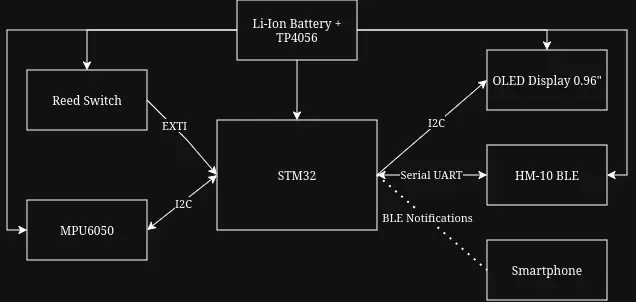
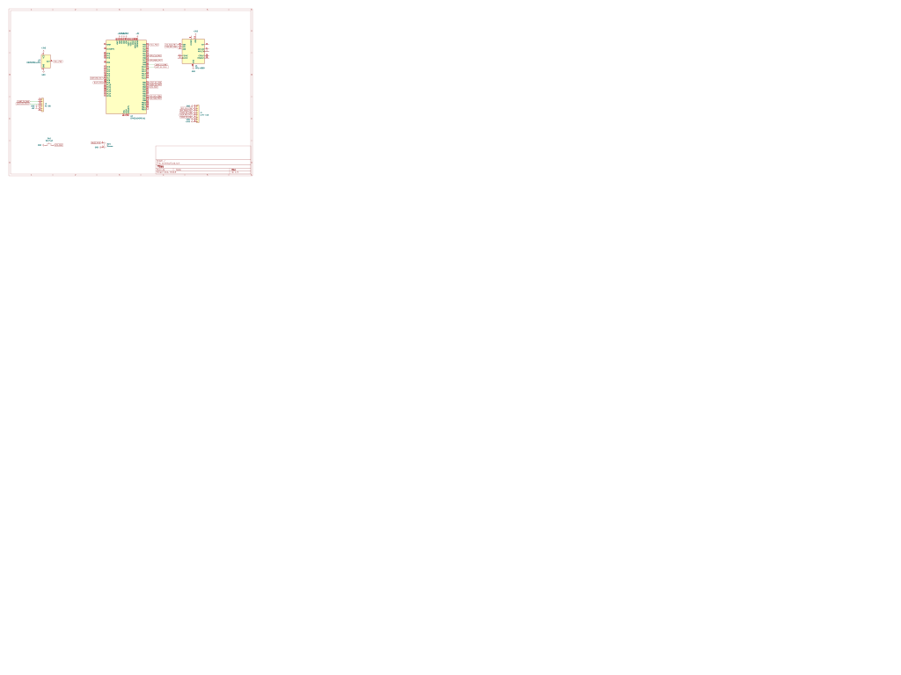
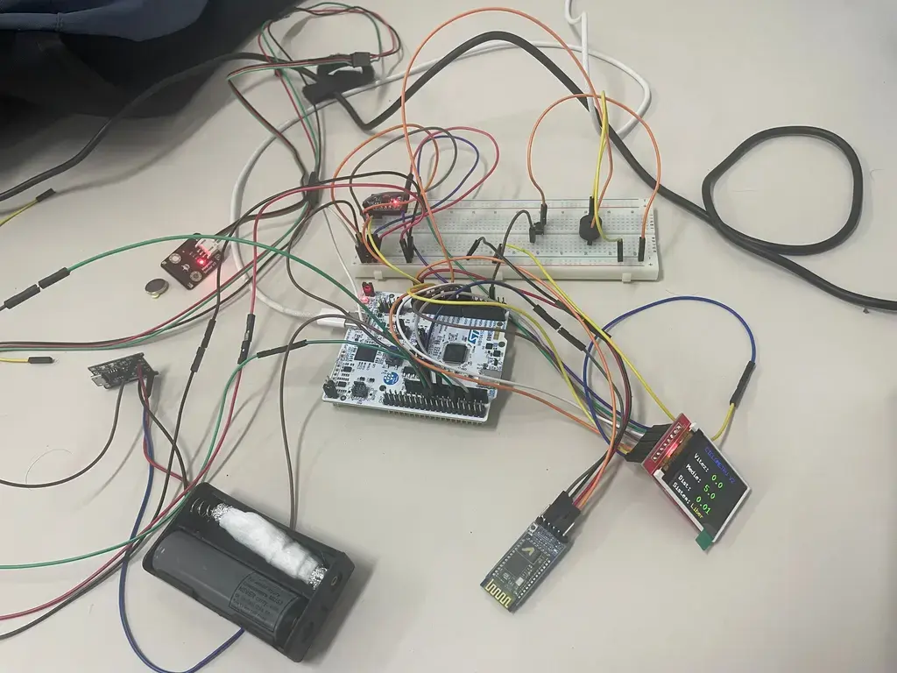

# SmartBike: Cyclometer and Smart Anti-Theft System

A bicycle speed monitoring system and anti-theft alarm, developed on an STM32 platform.

:::info 

**Author**: Nicolae Andrei \
**GitHub Project Link**: https://github.com/UPB-PMRust-Students/acs-project-2026-nikoeu.git

:::

## Description

The project consists of developing a "dashboard computer" for a bicycle, featuring two main functionalities: a cyclometer and an anti-theft system. The cyclometer function uses a magnetic sensor (Reed switch) mounted on the fork and a magnet on the spoke to calculate the speed and distance traveled, displaying the data on a small screen. The anti-theft function uses a gyroscope/accelerometer module to detect unauthorized movements or shocks when the bicycle is "armed". In case of suspicious movement, the system sends a notification to the user's phone via a Bluetooth Low Energy (BLE) connection, compatible with iPhone.

## Motivation

Cycling is a useful and relaxing activity, but securing the bike and monitoring performance can often require the purchase of expensive commercial equipment. I chose this project to combine my passion for cycling with electronics and embedded programming. It represents an excellent challenge to learn how to manage hardware interrupts for the speed sensor, I2C communication for the gyroscope, and serial communication for the Bluetooth module.

## Architecture 

The system is centralized around the STM32 development board, which receives and processes signals from the sensors, updates the display, and manages wireless communication.

**Components and Connections:**
- **Microcontroller (STM32):** The brain of the project. It manages the state logic (Armed/Disarmed/Riding).
- **Speed Sensor (Magnetic Contact / Reed):** Connected to a digital pin on the STM32 acting as an interrupt (EXTI). With each wheel rotation, the sensor sends a signal that helps calculate the speed based on the wheel's circumference.
- **Motion Sensor (MPU6050):** Connected via the I2C protocol to the STM32. It detects the acceleration and tilt of the bicycle for the alarm function.
- **0.96" OLED Display:** Also connected via I2C, used to display the current speed, alarm status, and distance.
- **Bluetooth Module (HM-10 / BLE):** Connected via UART (TX/RX) to the STM32. It transmits data and alerts to a Bluetooth terminal application on iOS.

## Log

### [Week 27 April - 1 May]
Defined the project architecture, selected the final components, and ordered the necessary hardware parts (development board, sensors, Bluetooth module).

## Hardware

The project requires components that are energy-efficient and small enough to be mounted on the bicycle's handlebars/fork.

* **STM32 Development Board:** The central processor executing the code.
* **Magnetic Sensor (Reed Switch):** A magnetically actuated switch, essential for counting wheel rotations.
* **MPU6050 Gyroscope/Accelerometer:** Used to detect sudden changes in position (anti-theft).
* **HM-10 Bluetooth Module (BLE):** Enables communication with iOS devices, which support the Bluetooth Low Energy standard.
* **0.96" OLED Display:** For the visual interface on the handlebars.
* **Power Module and Li-Ion Battery:** To provide portability to the system.

### Schematics

### Photos

### Bill of Materials

| Device | Usage | Price |
|--------|--------|-------|
| [STM32](https://www.st.com/en/evaluation-tools/nucleo-u545re-q.html) | The main microcontroller | [129 RON](https://ro.farnell.com/stmicroelectronics/nucleo-u545re-q/development-brd-32bit-arm-cortex/dp/4216396?CMP=e-email-sys-orderack-GLB) |
| [HM-10 BLE Bluetooth Module](https://components101.com/sites/default/files/component_datasheet/HM10%20Bluetooth%20Module%20Datasheet.pdf) | iOS compatible wireless communication | [27 RON](https://www.emag.ro/modul-bluetooth-4-0-ble-at-09-hm-10-msalamon-conectivitate-rapida-mic-si-eficient-ideal-pentru-proiecte-iot-economiseste-energie-fiabil-usor-de-montat-functioneaza-in-diverse-conditii-calitate-inalta-/pd/DHKDDVYBM/) |
| [MPU6050 Accelerometer Module](https://cdn.sparkfun.com/datasheets/Sensors/Accelerometers/RM-MPU-6000A.pdf) | Motion detection for the alarm | [16 RON](https://www.emag.ro/modul-accelerometru-si-giroscop-mpu6050-ai382-s321/pd/DB606JBBM/) |
| [Magnetic Sensor / Reed Switch](https://components101.com/sensors/mc38-magnetic-switch-sensor-pinout-features-datasheet-working-alternative-application) | Wheel rotation detection | [14 RON](https://www.emag.ro/senzor-magnetic-pentru-deschiderea-usilor-ferestrelor-mc-38-200v-28x14-mm-alb-5904162802746/pd/D0G5KLMBM/) |
| [0.96" OLED Display I2C](https://www.raystar-optronics.com/oled-graphic-display-module/i2c-oled.html) | Displaying speed and status | [25 RON](https://www.emag.ro/afisaj-grafic-oled-128x64-0-96-inch-galben-albastru-3874784221572/pd/DGTRPXYBM/) |
| [Battery and TP4056 charging module](https://www.watelectronics.com/tp4056-ic/) | Powering the system | [~25 RON](https://www.emag.ro/incarcator-li-ion-li-pol-cu-buffer-usb-c-tp4056-1a-multicolor-tp4056-18650-usbc/pd/DNW798MBM/) |
| [Wires, Breadboard, Misc](https://en.wikipedia.org/wiki/Breadboard) | Connecting the components | [17 RON](https://www.emag.ro/breadboard-400-puncte-ai059-s69/pd/DRJ66JBBM/?ref=sponsored_products_search_f_b_1_1&recid=recads_1_8684ac9f2906edfe68a0228ea6dcd1b66c67460d7e4d136276e77f11306d5dd0_1777327637&aid=c690b69a-4232-11f1-801c-06eaf0d4245d&oid=50658364&scenario_ID=1) |

## Software

Because the project is part of the PMRust course, the main ecosystem relies on the Rust programming language for embedded systems.

| Library | Description | Usage |
|---------|-------------|-------|
| [embassy-stm32](https://github.com/embassy-rs/embassy) | Hardware Abstraction Layer (HAL) | Pin configuration, UART for Bluetooth, and I2C for sensors |
| [embassy-executor](https://github.com/embassy-rs/embassy) | Async executor | Managing asynchronous tasks (reading sensors and transmitting BLE simultaneously) |
| [mpu6050](https://crates.io/crates/mpu6050) (or similar) | MPU6050 Driver | Interfacing and reading data from the accelerometer |
| [embedded-graphics](https://github.com/embedded-graphics/embedded-graphics) | 2D graphics library | Drawing text (speed) on the OLED display |
| [ssd1306](https://crates.io/crates/ssd1306) | OLED Display Driver | Hardware control of the small screen on the handlebars |

## Links

1. [Embassy Guide for STM32](https://embassy.dev/book/dev/getting_started.html)
2. [Recommended iOS App: BLE Serial Terminal](https://apps.apple.com/us/app/hm10-bluetooth-serial-lite/id1030450153)
3. [How a Hall/Reed sensor works on a bicycle](https://www.youtube.com/watch?v=Ex31DqFvDbs)