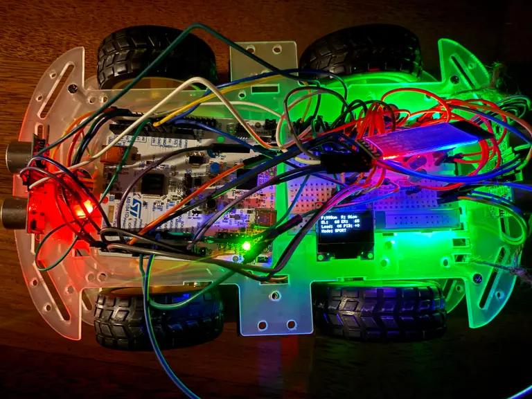

# CargoBot
Remote-controlled cargo robot with Bluetooth telemetry

:::info

**Author**: Andrei Rusanescu \
**GitHub Project Link**: [link_to_github](https://github.com/UPB-PMRust-Students/acs-project-2026-andreirusanescu)

:::

<!-- do not delete the \ after your name -->

## Description

CargoBot is a remote-controlled four-wheeled robot that carries cargo and navigates surfaces with imperfections. It is controlled from a laptop keyboard via Bluetooth and uses an STM32 Nucleo-U545RE-Q microcontroller programmed in Rust with Embassy-rs. It sends real-time telemetry data to a PC dashboard via Bluetooth, while simultaneously displaying information on an onboard OLED.

The central idea of the project is measuring and visualizing the impact of cargo load on motor performance: when the robot carries something heavy, the PID controller automatically increases the PWM duty cycle to maintain a constant speed. This compensation is observable live on the robot's OLED, on the PC dashboard, and through 3 LEDs (green/blue/red) that visually indicate the effort level.

## Motivation

I am particularly interested in cars and networking. This project combines multiple peripherals studied in the lab (PWM, GPIO, I2C, UART (Bluetooth)) into a functional system. It is a challenge that clearly demonstrates technical effort - the difference in motor effort with and without cargo, and how to compensate for the load. It really excites me because I get to apply what I've learnt in electronics, microprocessor programming in Rust and really build a hardware product.

## Architecture

The system is organized around five main subsystems:

**1. MCU (STM32 Nucleo-U545RE-Q)**
The central unit running all Embassy-rs async tasks. Coordinates all subsystems and shared state protected by Mutex.

**2. Motor Subsystem**
The L298N dual H-bridge receives PWM signals from the STM32 and drives 4 DC motors (2 per channel, left/right side in parallel - skid steering). The two IR LM393 optical sensors read encoder disc pulses on GPIO interrupts and compute RPM per side.

**3. Sensing Subsystem**
- MPU-6500 (I2C, address 0x68): reads accelerometer + gyroscope data, combined via complementary filter to get a stable tilt angle
- 2x HC-SR04 (GPIO trigger/echo): front and rear obstacle detection
- 2x IR LM393 encoders: RPM feedback for PID

**4. Communication Subsystem**
HC-06 Bluetooth module connected to STM32 via UART. Bidirectional: laptop sends raw keyboard characters (w, a, s, d, x, p), and the robot streams back high-efficiency text-based CSV telemetry (T,Load,Comp,Ax,Ay,Gz) at 10Hz to reduce microcontroller overhead.

**5. Display & Indicators Subsystem**
- OLED SSD1306 128x64 (I2C, address 0x3C, shared bus with IMU): displays active metrics like distance, encoder ticks, load %, and current power mode.
- 3x LEDs (green/blue/red) on GPIO: visual indicator of motor effort based on PWM duty cycle
- PC Dashboard: Tkinter window with embedded real-time Matplotlib animation canvas displaying streaming physics graphs.

**Embassy-rs Async Tasks:**

| Task | Frequency | Responsibility |
|------|-----------|----------------|
| encoder_left_task / right | Interrupt-driven | Counts wheel encoder slot edges using GPIO EXTI triggers. |
| distance_task | 16 Hz | Triggers and measures echo responses from front/rear HC-SR04 sensors. |
| imu_task | 50 Hz | Reads raw Accel/Gyro data from MPU-6500 over I2C and stores scaled values. |
| pid_task | 5 Hz | Performs Low-Pass filtering, fast auto-calibration, and runs the PI speed compensation loop. |
| telemetry_task | 10 Hz | Formats data into a CSV string and transmits it wirelessly over UART. |
| display_task | 2 Hz | Refreshes the on-board OLED graphics. |
| bluetooth_task | Async Rx | Listens for incoming control characters from the PC. |

**Navigation & PI Compensation Logic:**
Instead of basic tilt-triggering, CargoBot uses an intelligent sensor-fusion approach:
1. **Auto-Calibration**: On first throttle, it calibrates the ideal steady-state wheel RPM.
2. **Load Tracking**: A Low-Pass filter smooths out encoder noise. If the filtered RPM drops below the reference value due to cargo weight or friction, the robot calculates the exact `Load %`.
3. **PI Regulation**: A Proporțional-Integral loop dynamically scales up the PWM duty cycle to maintain constant cruise speed, bypassing inertia during start-up via a dedicated blind window.

**Peripheral Usage:**

| Peripheral | Component | Usage |
|-----------|-----------|-------|
| PWM | STM32 -> L298N | Motor speed control (0–100% duty cycle) |
| GPIO Output | STM32 -> HC-SR04 trigger | pulse to trigger ultrasonic |
| GPIO Input Interrupt | HC-SR04 echo -> STM32 | Measure echo duration -> distance |
| GPIO Input Interrupt | LM393 encoders -> STM32 | Count pulses -> compute RPM |
| GPIO Output | STM32 -> LEDs R/G/B | Load indicator: green (ECO mode), blue (DRIVE mode), red (SPEED mode) |
| GPIO Output | STM32 -> L298N IN1-IN4 | Motor direction control |
| I2C (shared bus) | STM32 -> MPU-6500 (0x68) | Accelerometer + gyroscope for tilt angle |
| I2C (shared bus) | STM32 -> SSD1306 (0x3C) | OLED telemetry display |
| UART | STM32 -> HC-06 | Bidirectional Bluetooth: commands in, telemetry out |

## Log

<!-- write your progress here every week -->

### Week 6 - 12 Apr
Ordered most of the components needed.

### Week 13 - 19 Apr
Assembled the mechanical parts (wheels, motors, car platform).

### Week 20 - 26 Apr
Working on the Schematic in KiCad.
Tested individual components: bluetooth module, display, motors, distance sensors, LM393 speed sensors.

### Week 27 Apr - 3 May
Ordered Li-Ion Samsung 18650 3.6V 3450mAh 8A batteries, a charger for the batteries,
more male-female and female-female jumpers and a smaller breadboard (400 points).

### Week 4 - 10 May
Soldered IMU and OLED display in the lab.
Assembled final product.
Started to write the software for the cargobot and tested it carrying another car.
The car automatically stops when it detects an object at less than 15cm distance.

### Week 11 - 17 May
Wrote even more software. Noticed that with adding more components, the responsiveness of the
bluetooth commands degraded, so I had to debug a lot with the frequencies, which led me to
activate the 16MHz crystal of the board to raise the frequency on i2c (for the display).

I had problems with the HC-SR04 distance sensors as well. They are placed back-to-back,
which initially caused significant acoustic interference (cross-talk) because they were
attempting to fire and update simultaneously at the same frequency. This ultrasonic overlap
caused one of the sensors to constantly freeze or report false timeouts, as it would accidentally
catch the stray echo generated by the opposite sensor. 

To solve this limitation, I refactored the software into a single, synchronized Embassy async
task (`distance_task`). Instead of running concurrently, the sensors are now triggered sequentially:
the system measures the front distance, waits for a deliberate 30ms gap to let any residual acoustic
noise dissipate, and only then triggers the rear sensor. This simple interleaving completely eliminated
the sensor locking issue.

### Week 18 - 24 May
Finalized the closed-loop motor control by deploying a tuned PI velocity regulator ($K_P=35, K_I=15$) and locking the noisy derivative term ($K_D$) to zero.
Implemented a $7/8$ exponential moving average Low-Pass filter to smooth out encoder slot jitter, a rapid auto-calibration routine to sample target cruise speeds, and a 1.6-second startup "blind window" to stop the controller from confusing physical takeoff inertia with cargo load.
Built the custom companion PC interface using Python Tkinter and Matplotlib to handle low-latency key debouncing and animate the 10Hz text-based CSV telemetry streams in real time.

## Hardware

The robot is built on a 4WD chassis powered by four DC motors (3–6V) wired in parallel per side (skid steering) and driven by an L298N dual H-bridge. Speed is dynamically regulated via 1kHz PWM signals from the STM32, while directional control is managed through discrete GPIO pins. Two LM393 IR optical sensors read wheel encoder discs to provide real-time RPM feedback, which serves as the primary metric for the PI load-compensation algorithm.

For environmental and physics telemetry, an MPU-6500 IMU communicates over a shared I2C bus to track linear accelerations ($A_x$, $A_y$, $A_z$) and yaw rate ($G_z$). Spatial awareness is handled by two HC-SR04 ultrasonic sensors placed at the front and rear, utilizing timed GPIO echo interrupts for obstacle detection. Visual feedback is split between an onboard SSD1306 OLED display for standalone diagnostics and an HC-06 Bluetooth module that streams raw, high-frequency CSV telemetry packets to a custom Python dashboard on a PC.

### Schematics

<!-- Place your KiCAD schematics here in SVG format. -->
KiCad Schematic:

### Bill of Materials

| Device | Usage | Price |
|--------|--------|-------|
| [STM32 Nucleo-U545RE-Q](https://www.st.com/en/evaluation-tools/nucleo-u545re-q.html) | Main microcontroller (Cortex-M33), runs all Embassy-rs tasks | 0 RON (provided by university) |
| [4x DC motors (3-6V), encoder discs, wheels](https://www.bitmi.ro/set-motor-dc-3v-6v-cu-reductor-si-roata-11227.html) | Wheels and motors for the CargoBot | [40 RON](https://www.bitmi.ro/set-motor-dc-3v-6v-cu-reductor-si-roata-11227.html)
| [2x IR Speed Sensor LM393](https://sigmanortec.ro/Senzor-viteza-IR-LM393-p125686023) x2 | Optical encoder reading, counts pulses from encoder discs to compute RPM | [16.22 RON](https://sigmanortec.ro/Senzor-viteza-IR-LM393-p125686023) |
| [L298N Dual H-Bridge](https://sigmanortec.ro/Punte-H-Dubla-L298N-p125423236) | Motor driver, controls speed (PWM) and direction of both motor sides | [8.96 RON](https://sigmanortec.ro/Punte-H-Dubla-L298N-p125423236) |
| [MPU-6500 Accelerometer & Gyroscope](https://sigmanortec.ro/Modul-Accelerometru-Giroscop-I2C-MPU-6500-6-axe-p136248782) | 6-axis IMU, measures tilt angle via complementary filter (I2C, 0x68) | [9.92 RON](https://sigmanortec.ro/Modul-Accelerometru-Giroscop-I2C-MPU-6500-6-axe-p136248782) |
| [HC-06 Bluetooth Module](https://sigmanortec.ro/Modul-bluetooth-HC-06-p125923853) | Bidirectional wireless UART, receives keyboard commands, sends telemetry JSON | [25.13 RON](https://sigmanortec.ro/Modul-bluetooth-HC-06-p125923853) |
| [OLED SSD1306 0.96" I2C](https://sigmanortec.ro/display-oled-096-i2c-iic-alb) | On-board display, shows RPM, tilt, obstacle distance, state, load level (I2C, 0x3C) | [14.01 RON](https://sigmanortec.ro/display-oled-096-i2c-iic-alb) |
| [2x HC-SR04 Ultrasonic Sensor](https://sigmanortec.ro/Senzor-ultrasunete-HC-SR04-p125423514) x2 | Obstacle detection, front and rear, GPIO trigger/echo | [18.80 RON](https://sigmanortec.ro/Senzor-ultrasunete-HC-SR04-p125423514) |
| [18650 Battery Holder 2S](https://sigmanortec.ro/suport-acumulatori-18650-2s) | Holds 2x 18650 cells in series, 7.4V output for L298N and STM32 | [5.74 RON](https://sigmanortec.ro/suport-acumulatori-18650-2s) |
| [2x Li-Ion Samsung 18650 3.6V 3450mAh 8A](https://www.emag.ro/acumulator-li-ion-samsung-18650-3-6v-3450mah-8a-cu-borne-joase-si-fara-bms-model-inr18650-35e-3450ma-lincr18650-35e/pd/DWVV74MBM/) | Batteries to provide voltage for the motors and for the board | [63 RON](https://www.emag.ro/acumulator-li-ion-samsung-18650-3-6v-3450mah-8a-cu-borne-joase-si-fara-bms-model-inr18650-35e-3450ma-lincr18650-35e/pd/DWVV74MBM/) |
| [Battery charger](https://www.emag.ro/incarcator-dublu-pentru-acumulator-baterie-reincarcabila-4-2v-1000ma-li-ion-ultrafire-18650-10440-14500-16340-17335-17500-17670-18500-0201/pd/DMG7FVBBM/) | Charges the Li-ion batteries | [35 RON](https://www.emag.ro/incarcator-dublu-pentru-acumulator-baterie-reincarcabila-4-2v-1000ma-li-ion-ultrafire-18650-10440-14500-16340-17335-17500-17670-18500-0201/pd/DMG7FVBBM/) |
| 3x LED (red/yellow/green) + resistors | Visual motor effort indicator | 0 RON (owned) |
| [Female-Female jumper wires](https://sigmanortec.ro/40-fire-Dupont-10cm-Mama-Mama-p129872525) | Wires for connections | [7.73 RON](https://sigmanortec.ro/40-fire-Dupont-10cm-Mama-Mama-p129872525) |
| [Male-Female jumper wires](https://sigmanortec.ro/40-fire-Dupont-10cm-Tata-Mama-p210855157) | Wires for connections | [7.73 RON](https://sigmanortec.ro/40-fire-Dupont-10cm-Tata-Mama-p210855157) |
| Male-Male jumper wires | Wires for connections | 0 RON (owned) |

## Software

| Library | Description | Usage |
|---------|-------------|-------|
| [embassy-stm32](https://github.com/embassy-rs/embassy) | Async HAL for STM32U5 | PWM, I2C, UART, GPIO, Timer drivers |
| [embassy-executor](https://github.com/embassy-rs/embassy) | Async task executor | Spawning and running concurrent tasks |
| [embassy-time](https://github.com/embassy-rs/embassy) | Async timers and delays | Task scheduling at fixed frequencies |
| [embassy-sync](https://github.com/embassy-rs/embassy) | Synchronization primitives | Mutex and Channel for inter-task shared state |
| [ssd1306](https://github.com/rust-embedded-community/ssd1306) | OLED SSD1306 driver | I2C display rendering |
| [embedded-graphics](https://github.com/embedded-graphics/embedded-graphics) | 2D graphics library | Drawing text and shapes on OLED |
| [heapless](https://github.com/rust-embedded/heapless) | No-alloc data structures | String/Vec without heap allocation |
| [defmt](https://github.com/knurling-rs/defmt) + defmt-rtt | Logging framework | Debug output via probe |
| [libm](https://github.com/rust-lang/libm) | Math functions (no_std) | atan2, sqrt for complementary filter |
| Python pyserial | Serial communication | PC-side script to receive telemetry and send commands over Bluetooth |
| Python matplotlib + tkinter | Desktop GUI & Plotting | Live dashboard with telemetry and PID |

## Links

1. [Embassy-rs documentation](https://embassy.dev)
2. [STM32 Nucleo-U545RE-Q user manual](https://www.st.com/en/evaluation-tools/nucleo-u545re-q.html)
3. [MPU-6500 datasheet](https://invensense.tdk.com/products/motion-tracking/6-axis/mpu-6500/)
4. [SSD1306 OLED driver crate](https://github.com/rust-embedded-community/ssd1306)
5. [L298N datasheet](https://www.st.com/resource/en/datasheet/l298.pdf)
6. [HC-SR04 ultrasonic sensor guide](https://cdn.sparkfun.com/datasheets/Sensors/Proximity/HCSR04.pdf)
