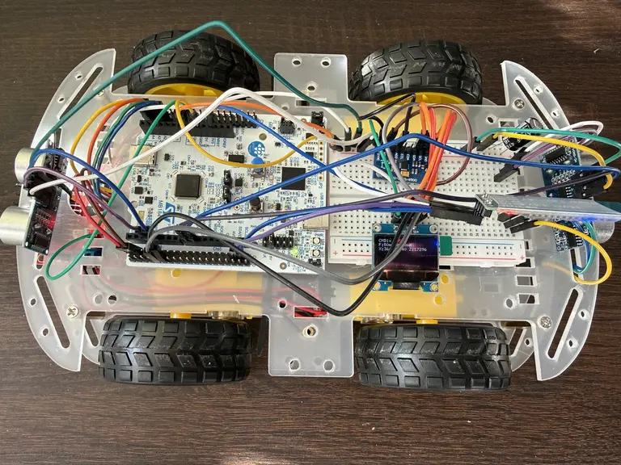
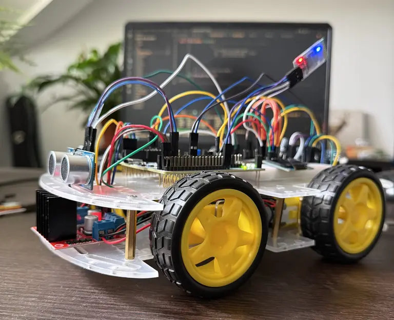
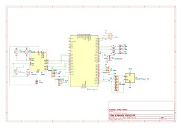

# CargoBot
Remote-controlled cargo robot with Bluetooth telemetry

:::info

**Author**: Andrei Rusanescu \
**GitHub Project Link**: [link_to_github](https://github.com/UPB-PMRust-Students/acs-project-2026-andreirusanescu)

:::

<!-- do not delete the \ after your name -->

## Description

CargoBot is a remote-controlled four-wheeled robot that carries cargo and navigates surfaces with imperfections. It is controlled from a laptop keyboard via Bluetooth and uses an STM32 Nucleo-U545RE-Q microcontroller programmed in Rust with Embassy-rs. It sends real-time telemetry data to a PC dashboard via Bluetooth, while simultaneously displaying information on an onboard OLED.

The central idea of the project is measuring and visualizing the impact of cargo load on motor performance: when the robot carries something heavy, the PID controller automatically increases the PWM duty cycle to maintain a constant speed. This compensation is observable live on the robot's OLED, on the PC dashboard, and through 3 LEDs (green/yellow/red) that visually indicate the effort level.

## Motivation

I am particularly interested in cars and networking. This project combines multiple peripherals studied in the lab (PWM, GPIO, I2C, UART, Bluetooth) into a functional system. It is a challenge that clearly demonstrates technical effort - the difference in motor effort with and without cargo, and how to compensate for the load.

## Architecture

The system is organized around five main subsystems:

**1. MCU (STM32 Nucleo-U545RE-Q)**
The central unit running all Embassy-rs async tasks. Coordinates all subsystems and shared state protected by Mutex.

**2. Motor Subsystem**
The L298N dual H-bridge receives PWM signals from the STM32 and drives 4 DC motors (2 per channel, left/right side in parallel - skid steering). The two IR LM393 optical sensors read encoder disc pulses on GPIO interrupts and compute RPM per side.

**3. Sensing Subsystem**
- MPU-6500 (I2C, address 0x68): reads accelerometer + gyroscope data, combined via complementary filter to get a stable tilt angle
- 2x HC-SR04 (GPIO trigger/echo): front and rear obstacle detection
- 2x IR LM393 encoders: RPM feedback for PID

**4. Communication Subsystem**
HC-06 Bluetooth module connected to STM32 via UART. Bidirectional: laptop sends movement commands (forward/backward/left/right + speed), robot sends back JSON telemetry at 5Hz.

**5. Display & Indicators Subsystem**
- OLED SSD1306 128x64 (I2C, address 0x3C, shared bus with IMU): displays RPM, tilt angle, obstacle distance, state, load level
- 3x LEDs (green/yellow/red) on GPIO: visual indicator of motor effort based on PWM duty cycle
- Passive buzzer on PWM: horn and audio feedback

**Embassy-rs Async Tasks:**

| Task | Frequency | Responsibility |
|------|-----------|----------------|
| sensor_task | 20 Hz | Read IMU (I2C) + ultrasonic sensors |
| motor_task | 50 Hz | Apply PWM to L298N, read encoders |
| navigation_task | 10 Hz | State machine: FORWARD / COMPENSATE / AVOID / STOP |
| telemetry_task | 5 Hz | Serialize JSON and send over UART to HC-06 |
| display_task | 4 Hz | Update OLED |

**Navigation State Machine:**

| State | Entry Condition | Action |
|-------|----------------|--------|
| FORWARD | No obstacle | Move at target speed, PID active |
| COMPENSATE | Pitch > 5 deg (ramp) | Increase PWM proportional to tilt angle |
| AVOID | Obstacle < 30cm | Stop, rotate, resume forward |
| STOP | Manual command / error | Motors off, telemetry continues |

**Peripheral Usage:**

| Peripheral | Component | Usage |
|-----------|-----------|-------|
| PWM | STM32 -> L298N | Motor speed control (0–100% duty cycle) |
| PWM | STM32 -> Buzzer | Horn |
| GPIO Output | STM32 -> HC-SR04 trigger | 10 micro-s pulse to trigger ultrasonic |
| GPIO Input Interrupt | HC-SR04 echo -> STM32 | Measure echo duration -> distance |
| GPIO Input Interrupt | LM393 encoders -> STM32 | Count pulses -> compute RPM |
| GPIO Output | STM32 -> LEDs R/Y/G | Load indicator: green (&lt;35%), yellow (35–65%), red (>65%) |
| GPIO Output | STM32 -> L298N IN1-IN4 | Motor direction control |
| I2C (shared bus) | STM32 -> MPU-6500 (0x68) | Accelerometer + gyroscope for tilt angle |
| I2C (shared bus) | STM32 -> SSD1306 (0x3C) | OLED telemetry display |
| UART | STM32 -> HC-06 | Bidirectional Bluetooth: commands in, telemetry out |

## Log

<!-- write your progress here every week -->

### Week 6 - 12 Apr
Ordered most of the components needed.

### Week 13 - 19 Apr
Assembled the mechanical parts (wheels, motors, car platform).

### Week 20 - 26 Apr
Working on the Schematic in KiCad.
Tested individual components: bluetooth module, display, motors, distance sensors, LM393 speed sensors.

### Week 27 Apr - 3 May
Ordered Li-Ion Samsung 18650 3.6V 3450mAh 8A batteries, a charger for the batteries,
more male-female and female-female jumpers and a smaller breadboard (400 points).

### Week 4 - 10 May
Soldered IMU and OLED display in the lab.
Assembled final product.
Started to write the software for the cargobot and tested it carrying another car.
The HC-SR04 sensors are not so precise as the car sometimes crashes into walls if driven into.

### Week 11 - 17 May

## Hardware

The robot is built on a 4WD chassis with 4 DC motors (3–6V) driven through an L298N dual H-bridge using skid steering (left/right side in parallel). Speed and direction are controlled via PWM from the STM32. Two IR optical sensors read encoder discs on the motors to compute RPM. An MPU-6500 IMU over I2C measures tilt angle using a complementary filter. Two HC-SR04 ultrasonic sensors handle obstacle detection front and rear. An SSD1306 OLED displays live telemetry. An HC-06 Bluetooth module provides bidirectional communication with the laptop.

### Schematics

<!-- Place your KiCAD schematics here in SVG format. -->
KiCad Schematic:

### Bill of Materials

| Device | Usage | Price |
|--------|--------|-------|
| [STM32 Nucleo-U545RE-Q](https://www.st.com/en/evaluation-tools/nucleo-u545re-q.html) | Main microcontroller (Cortex-M33), runs all Embassy-rs tasks | 0 RON (provided by university) |
| [4x DC motors (3-6V), encoder discs, wheels](https://www.bitmi.ro/set-motor-dc-3v-6v-cu-reductor-si-roata-11227.html) | Wheels and motors for the CargoBot | [40 RON](https://www.bitmi.ro/set-motor-dc-3v-6v-cu-reductor-si-roata-11227.html)
| [2x IR Speed Sensor LM393](https://sigmanortec.ro/Senzor-viteza-IR-LM393-p125686023) x2 | Optical encoder reading, counts pulses from encoder discs to compute RPM | [16.22 RON](https://sigmanortec.ro/Senzor-viteza-IR-LM393-p125686023) |
| [L298N Dual H-Bridge](https://sigmanortec.ro/Punte-H-Dubla-L298N-p125423236) | Motor driver, controls speed (PWM) and direction of both motor sides | [8.96 RON](https://sigmanortec.ro/Punte-H-Dubla-L298N-p125423236) |
| [MPU-6500 Accelerometer & Gyroscope](https://sigmanortec.ro/Modul-Accelerometru-Giroscop-I2C-MPU-6500-6-axe-p136248782) | 6-axis IMU, measures tilt angle via complementary filter (I2C, 0x68) | [9.92 RON](https://sigmanortec.ro/Modul-Accelerometru-Giroscop-I2C-MPU-6500-6-axe-p136248782) |
| [HC-06 Bluetooth Module](https://sigmanortec.ro/Modul-bluetooth-HC-06-p125923853) | Bidirectional wireless UART, receives keyboard commands, sends telemetry JSON | [25.13 RON](https://sigmanortec.ro/Modul-bluetooth-HC-06-p125923853) |
| [OLED SSD1306 0.96" I2C](https://sigmanortec.ro/display-oled-096-i2c-iic-alb) | On-board display, shows RPM, tilt, obstacle distance, state, load level (I2C, 0x3C) | [14.01 RON](https://sigmanortec.ro/display-oled-096-i2c-iic-alb) |
| [2x HC-SR04 Ultrasonic Sensor](https://sigmanortec.ro/Senzor-ultrasunete-HC-SR04-p125423514) x2 | Obstacle detection, front and rear, GPIO trigger/echo | [18.80 RON](https://sigmanortec.ro/Senzor-ultrasunete-HC-SR04-p125423514) |
| [18650 Battery Holder 2S](https://sigmanortec.ro/suport-acumulatori-18650-2s) | Holds 2x 18650 cells in series, 7.4V output for L298N and STM32 | [5.74 RON](https://sigmanortec.ro/suport-acumulatori-18650-2s) |
| [2x Li-Ion Samsung 18650 3.6V 3450mAh 8A](https://www.emag.ro/acumulator-li-ion-samsung-18650-3-6v-3450mah-8a-cu-borne-joase-si-fara-bms-model-inr18650-35e-3450ma-lincr18650-35e/pd/DWVV74MBM/) | Batteries to provide voltage for the motors and for the board | [63 RON](https://www.emag.ro/acumulator-li-ion-samsung-18650-3-6v-3450mah-8a-cu-borne-joase-si-fara-bms-model-inr18650-35e-3450ma-lincr18650-35e/pd/DWVV74MBM/) |
| [Battery charger](https://www.emag.ro/incarcator-dublu-pentru-acumulator-baterie-reincarcabila-4-2v-1000ma-li-ion-ultrafire-18650-10440-14500-16340-17335-17500-17670-18500-0201/pd/DMG7FVBBM/) | Charges the Li-ion batteries | [35 RON](https://www.emag.ro/incarcator-dublu-pentru-acumulator-baterie-reincarcabila-4-2v-1000ma-li-ion-ultrafire-18650-10440-14500-16340-17335-17500-17670-18500-0201/pd/DMG7FVBBM/) |
| 3x LED (red/yellow/green) + resistors | Visual motor effort indicator | 0 RON (owned) |
| [Female-Female jumper wires](https://sigmanortec.ro/40-fire-Dupont-10cm-Mama-Mama-p129872525) | Wires for connections | [7.73 RON](https://sigmanortec.ro/40-fire-Dupont-10cm-Mama-Mama-p129872525) |
| [Male-Female jumper wires](https://sigmanortec.ro/40-fire-Dupont-10cm-Tata-Mama-p210855157) | Wires for connections | [7.73 RON](https://sigmanortec.ro/40-fire-Dupont-10cm-Tata-Mama-p210855157) |
| Male-Male jumper wires | Wires for connections | 0 RON (owned) |

## Software

| Library | Description | Usage |
|---------|-------------|-------|
| [embassy-stm32](https://github.com/embassy-rs/embassy) | Async HAL for STM32U5 | PWM, I2C, UART, GPIO, Timer drivers |
| [embassy-executor](https://github.com/embassy-rs/embassy) | Async task executor | Spawning and running concurrent tasks |
| [embassy-time](https://github.com/embassy-rs/embassy) | Async timers and delays | Task scheduling at fixed frequencies |
| [embassy-sync](https://github.com/embassy-rs/embassy) | Synchronization primitives | Mutex and Channel for inter-task shared state |
| [ssd1306](https://github.com/rust-embedded-community/ssd1306) | OLED SSD1306 driver | I2C display rendering |
| [embedded-graphics](https://github.com/embedded-graphics/embedded-graphics) | 2D graphics library | Drawing text and shapes on OLED |
| [heapless](https://github.com/rust-embedded/heapless) | No-alloc data structures | String/Vec without heap allocation |
| [defmt](https://github.com/knurling-rs/defmt) + defmt-rtt | Logging framework | Debug output via probe |
| [libm](https://github.com/rust-lang/libm) | Math functions (no_std) | atan2, sqrt for complementary filter |
| Python pyserial | Serial communication | PC-side script to receive telemetry and send commands over Bluetooth |
| Python matplotlib / Flask | Data visualization | Live dashboard with RPM, PWM, tilt, distance graphs |

## Links

1. [Embassy-rs documentation](https://embassy.dev)
2. [STM32 Nucleo-U545RE-Q user manual](https://www.st.com/en/evaluation-tools/nucleo-u545re-q.html)
3. [MPU-6500 datasheet](https://invensense.tdk.com/products/motion-tracking/6-axis/mpu-6500/)
4. [SSD1306 OLED driver crate](https://github.com/rust-embedded-community/ssd1306)
5. [L298N datasheet](https://www.st.com/resource/en/datasheet/l298.pdf)
6. [HC-SR04 ultrasonic sensor guide](https://cdn.sparkfun.com/datasheets/Sensors/Proximity/HCSR04.pdf)
