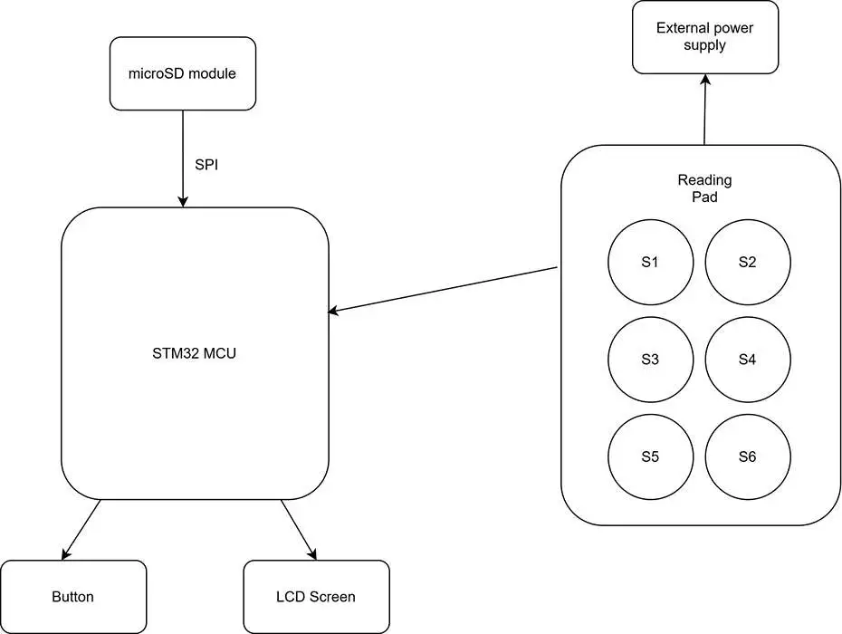
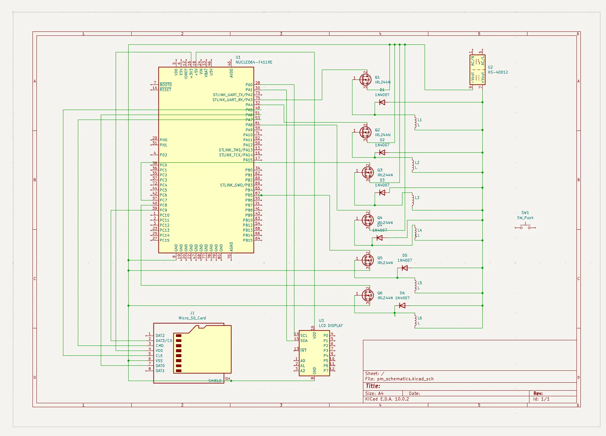

# Braille Display
A mini e-reader for Braille alphabet

:::info 

**Author**: Alexandra Prigoreanu \
**GitHub Project Link**: https://github.com/UPB-PMRust-Students/acs-project-2026-aprigoreanu20

:::

<!-- do not delete the \ after your name -->

## Description

The purpose of the project is to build a Braille display, which loads content from an SD card and outputs the coresponding Braille letters on the display. The goal is to allow visually impaired people to read file contents using a device that has similar functionalities to that of a classic e-reader.

## Motivation

Over the last 20 years, E-readers have become a practical solution to encourage reading. Their lightweight design and ease of use made them a convenient alternative to purchasing and storing a large collection of printed books. This is especially relevant for blind people, as they require specially produced books using the Braille alphabet. This process can be both time-consuming, as well as expensive. E-readers offer an efficient solution by providing access to a wide range of books for visually impaired people.

## Architecture

### Software achitecture:
Software will be written in Rust, using Embassy. The main logic components are:
- input: read button input (next / previous page logic), read data source (from SD card)
- Braille encoder: convert ASCII characters to Braille letter pattern
- Display: convert Braille pattern to GPIO signals

## Log

<!-- write your progress here every week -->
### Week 20 - 26 April
Researched mechanical solutions for Braille pins

### Week 5 - 11 May
- Purchased components
- Built the circuit

### Week 12 - 18 May
- Tested all components
- Wrote software part of the project

### Week 19 - 25 May
- Fixed last minute issues
- Finishing touches

## Hardware

<!-- Detail in a few words the hardware used. -->
### Hardware Components:
- microcontroller: STM32 Nucleo-U545RE-Q with ARM Cortex-M33 core
- input system: SD card (and a SD card module for communication with the MCU), user input buttons (next / previous page)
- LCD display: displays the character currently shown on the Braille display for easy testing
- actuation system: 6 push-pull solenoids per Braille letter
- power system: 12V external supply for powering the solenoids

### Schematics
<!-- Place your KiCAD or similar schematics here in SVG format. -->

### Bill of Materials

<!-- Fill out this table with all the hardware components that you might need.
| [Device](link://to/device) | This is used ... | [price](link://to/store) | -->
| Device | Usage | Price |
|--------|--------|-------|
| [STM32 Nucleo-U545RE-Q](https://www.st.com/resource/en/data_brief/nucleo-c031c6.pdf) | Microcontroller | [Provided by university](https://ro.mouser.com/ProductDetail/STMicroelectronics/NUCLEO-U545RE-Q?qs=mELouGlnn3cp3Tn45zRmFA%3D%3D&utm_id=6470900573&utm_source=google&utm_medium=cpc&utm_marketing_tactic=emeacorp&gad_source=1&gad_campaignid=6470900573&gbraid=0AAAAADn_wf043yhXebcoAqw1Iff8pYQm8&gclid=CjwKCAjwn4vQBhBsEiwAq3hhN_h0Pu1D5L2QilgHGkEgC0pYCNrOPTKM_4GwgZndlKvavfXNY44vDBoCf8MQAvD_BwE) |
|[12V Push Pull Solenoids](https://www.hobbytronics.co.za/Content/external/1274/D2512640695.pdf) | The actuation system for raising and lowering the Braille pins | [6x24 RON](https://sigmanortec.ro/en/electromagnetic-piston-jf-0530b-with-solenoid-12v-push-pull) |
|[IRLZ44NPBF N-MOSFET TRANSISTOR](https://www.tme.eu/Document/71cf1899624764088671ce6de5d15eb4/irlz44n.pdf) | Acts as a switch between the 12V power system for the solenoids and the logical control from the MCU  | [6x4.52 RON](https://www.tme.eu/ro/details/irlz44npbf/tranzistori-canal-n-tht/infineon-technologies/) |
|[1N4007 Flyback Diode](https://www.alldatasheet.com/datasheet-pdf/view/14624/PANJIT/1N4007.html) | Protects the MCU from higher current coming from 12V power supply  | [6x4.52 RON](https://www.optimusdigital.ro/en/diodes/7457-dioda-1n4007.html?gad_source=1&gad_campaignid=19615979487&gbraid=0AAAAADv-p3BnFuc6ibFlpEHe_cuA18OsU&gclid=CjwKCAjwn4vQBhBsEiwAq3hhNxS2gEkTvwjruVyPiq5TcYVGZN2fPa5pg4qdPRYverdqT5pWP5pvghoCgqUQAvD_BwE) |
|[External Power Supply](https://www.emag.ro/sursa-alimentare-12v-3a-36w-dc-5-5x2-5mm-jfgtew-psu-12v-3a/pd/DKSWQD2BM/?ref=history-shopping_487342570_156063_1) | Provides external power to the 6 solenoids | [37 RON](https://www.emag.ro/sursa-alimentare-12v-3a-36w-dc-5-5x2-5mm-jfgtew-psu-12v-3a/pd/DKSWQD2BM/?ref=history-shopping_487342570_156063_1) |\
| [MicroSD Module](https://www.scribd.com/document/713821680/Datasheet-MicroSD-Module) | Bridges communication over I2C between MCU and microSD card | [4.38 RON](https://sigmanortec.ro/en/microsd-module) |
| [LCD Screen](https://www.alldatasheet.com/datasheet-pdf/view/2215051/DFROBOT/LCD1602.html) | Displays the same character on screen for as the one on the Braille display | [≈23 RON](https://www.emag.ro/display-lcd-2-x-16-cu-convertor-i2c-80-x-35-mm-verde-albastru-negru-2-e-001/pd/DHRJ0LMBM/?ref=history-shopping_488462707_116388_1) |
| [Breadboard](https://cdn.sparkfun.com/datasheets/Prototyping/breadboard.pdf) | Links components | [6.68 RON](https://www.emag.ro/placa-test-breadboard-400-ai059-a-s69/pd/D5WBP7MBM/?cmpid=146414&utm_source=google&utm_medium=cpc&utm_campaign=(RO:Whoop!)_3P-Y_%3e_Jucarii_hobby&utm_content=79559830074&gad_source=1&gad_campaignid=2078923891&gbraid=0AAAAACvmxQju_-5kCgI0zuYMG_czWNv7o&gclid=Cj0KCQjwzqXQBhD2ARIsAKrIeU_L4OOHxJEEV4YuFYvaqBnYcNX1SfWxlMkFc0cRrBv4U0NG-aLphYcaAkNfEALw_wcB) |

<!-- 
| Device | Usage | Price |
|--------|--------|-------|
| [Raspberry Pi Pico W](https://www.raspberrypi.com/documentation/microcontrollers/raspberry-pi-pico.html) | The microcontroller | [35 RON](https://www.optimusdigital.ro/en/raspberry-pi-boards/12394-raspberry-pi-pico-w.html) | -->

## Software

| Library | Description | Usage |
|---------|-------------|-------|
| [embassy-stm32](https://github.com/embassy-rs/embassy/tree/main/embassy-stm32) | Hardware Abstraction Layer | HAL for bridging interaction between STM32 MCU and Rust software |
| [embassy-executor](https://github.com/embassy-rs/embassy) | Async executor | Schedules and runs async tasks |
| [embassy_time](https://docs.rs/embassy-time/latest/embassy_time/) | Timers and delays | Delays for LCD initialization and SPI device |
| [embassy_sync](https://docs.embassy.dev/embassy-sync/0.8.0/default/index.html) | Synchronization primitives for inter-task communication | Used to coordinate events between tasks |
| [embedded_hal_bus ](https://docs.rs/embedded-hal-bus/latest/embedded_hal_bus/) | Allows bus sharing between devices | Wraps SPI bus so that SD card driver can read it |
| [hd44780_driver ](https://docs.rs/hd44780-driver/latest/hd44780_driver/) | Driver for HD44780 LCD display | Interface to HD44780 LCD |
| [embedded_sdmmc ](https://docs.rs/embedded-sdmmc/latest/embedded_sdmmc/) | SD card filesystem driver | Allows reading from SD card |
| [defmt](https://github.com/knurling-rs/defmt) | Console printing | Allows printing to console for debug purposes |

## Links

<!-- Add a few links that inspired you and that you think you will use for your project -->

1. [Automatic Braille Display](https://www.sciencebuddies.org/science-fair-projects/project-ideas/Elec_p109/electricity-electronics/refreshable-braille-display)
2. [Braille News Reader](https://medium.com/exploring-android/braillebox-building-a-braille-news-reader-with-android-things-f848fe6de596)
