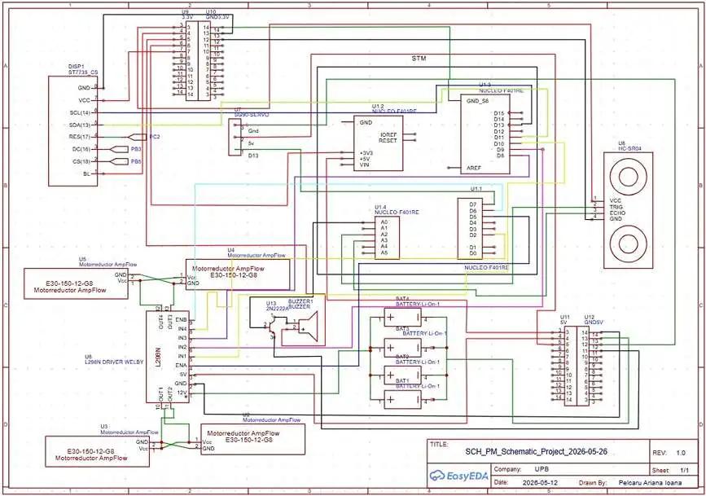
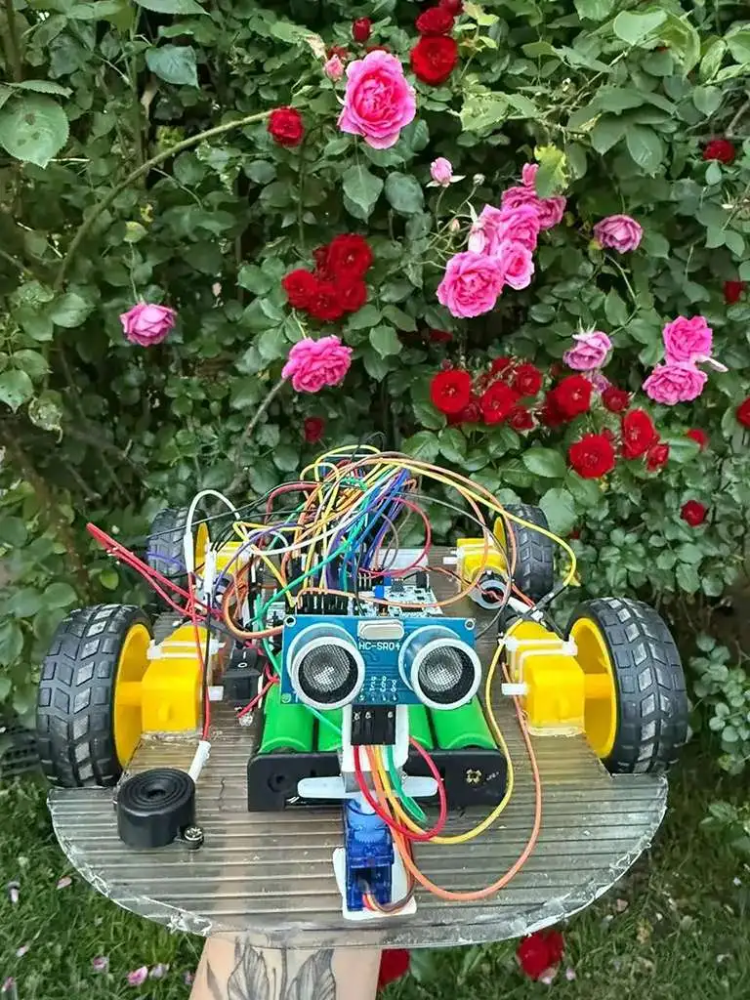
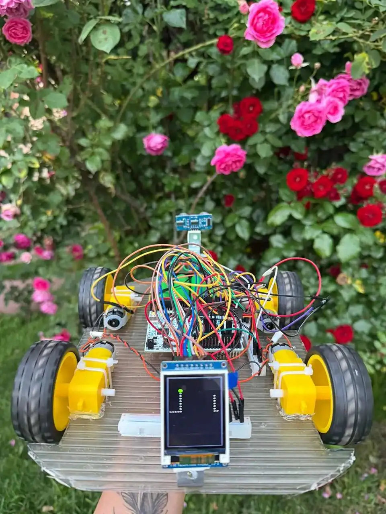
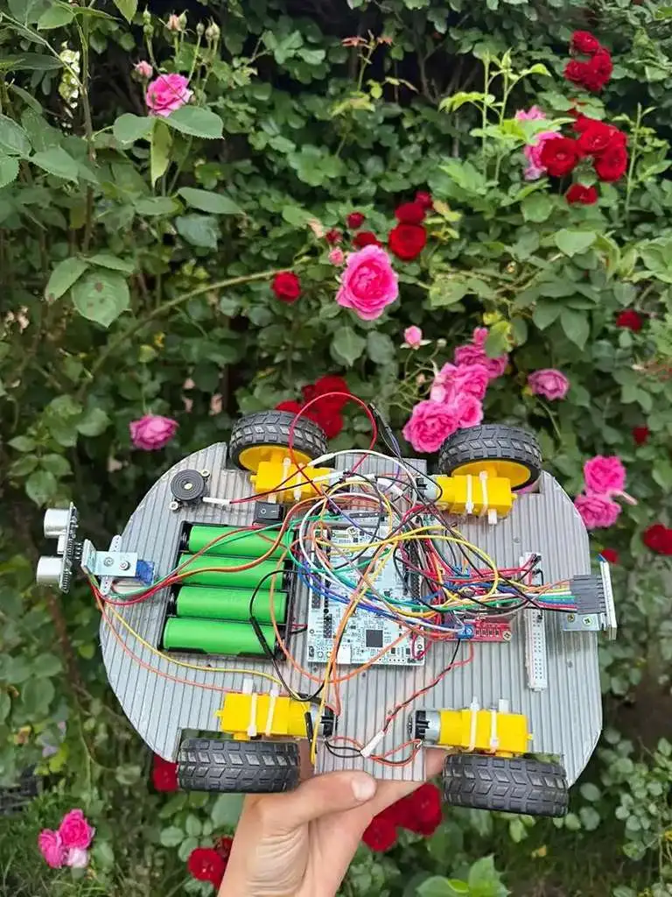

# Autonomous Vehicle with Dynamic Path Replanning
**An autonomous robotic system capable of navigating along a predefined path and dynamically adapting its route in real time to avoid obstacles.**

:::info
**Author:** ariana.pelcaru \
**GitHub Project Link :** https://github.com/UPB-PMRust-Students/acs-project-2026-aryuqq
:::

## Description

The Autonomous Vehicle with Dynamic Path Reconfiguration demonstrates intelligent navigation in environments with unpredictable obstacles. Under normal conditions, it follows a predefined path using embedded control logic.

The vehicle continuously monitors its surroundings with distance sensors to detect obstacles in real time. When an obstacle is detected, the system analyzes the data, recalculates an alternative route, and adjusts its movement to safely avoid collisions while continuing toward its destination.

## Motivation

Autonomous vehicles have the potential to significantly improve safety and efficiency in real-world transportation systems. Human error remains one of the main causes of accidents, especially in dynamic and unpredictable environments where quick reactions are required.
This project was inspired by the idea of reducing such risks by enabling a system that can perceive obstacles and react instantly without human intervention.

## Architecture
The main architectural components of the autonomous vehicle system are:

- **STM32 Main Controller (Nucleo Board)** – central processing unit that runs the real-time control loop, handles sensor input, decision-making, and actuator control for navigation.

- **Ultrasonic Sensor (HC-SR04)** – used for real-time obstacle detection in front of the robot; triggers avoidance logic when distance is below a defined threshold.

- **Motor Driver (L298N) + DC Motors** – provides bidirectional control of the drive system, allowing forward movement, reverse motion, and turning maneuvers based on navigation decisions.

- **Servo Motor (Steering/Scanning System)** – controls directional scanning of the environment, enabling the system to evaluate left/right paths when obstacles are detected.

- **ST7735 TFT Display** – visual output module used to render the robot’s map, movement trail, obstacle positions, and system status messages in real time.

- **Buzzer (Audio Alert System)** – provides immediate acoustic feedback when an obstacle is detected or when avoidance behavior is triggered.

- **Power Supply (Battery Pack)** – ensures autonomous operation of the system by powering all modules, including motors, sensors, and microcontroller.

## Project Photos

## Log

### Week 20-26 Apr
- This week, I focused on defining the overall architecture of the autonomous vehicle project based on STM32. I worked on shaping the main system modules (sensing, control, actuation, and user interface) and clarified how they interact in a real-time embedded system.
- I also worked on the project documentation, writing the initial structure and describing the main functionalities and expected system behavior.
- In addition, I made a first draft of the required components (HC-SR04 sensor, L298N motor driver, DC motors, servo motors) and researched their roles in the system.
- Connected the Hardware
- Tested the sensors

### Week 11-17 May
- This week, I started the software development for the autonomous vehicle, implementing the main control logic
- I also improved the hardware structure by redesigning the connections and layout to ensure better compatibility and stable operation of all components together.

### Week 19 - 27 May

- Completed the software implementation
- Completed the final design
- Finalized the documentation

## Hardware

- **Microcontroller:** STM32 Nucleo Board
- **Sensor:** HC-SR04 Ultrasonic Sensor
- **Actuators:** DC Motors, Servo Motor
- **Motor Driver:** L298N Motor Driver
- **Display:** ST7735 LCD Display
- **Input:** ON/OFF Button
- **Other:** Breadboard, jumper wires, battery pack, Buzzer

## Software Design

### Description

#### 1. Design Patterns:

- **Controller / Manager pattern** (Motor control, Display manager, Sensor handler)
- **State machine navigation logic** for autonomous obstacle avoidance
- **Circular buffer processing** for movement trail visualization
- **Event-driven asynchronous execution** using Embassy runtime

#### 2. Key Features:

- **Autonomous obstacle detection and avoidance** using ultrasonic distance sensing
- **Real-time navigation decision making** with left/right path evaluation
- **Graphical map visualization** with robot tracking and obstacle marking
- **Servo-based environmental scanning** for route analysis
- **PWM motor speed and steering control**
- **Audio warning system** using buzzer feedback on obstacle detection
- **Continuous position tracking with trail fading effect**

## Bill of Materials

### Hardware

| Device | Usage | Price | Link |
|--------|------|-------|------|
| STM32 Nucleo Board | Main controller | ~50–120 RON | https://ro.rsdelivers.com/product/stmicroelectronics/nucleo-f030r8/stmicroelectronics-stm32-nucleo-64-mcu-development/8029412??cm_mmc=RO-PLA-DS3A-_-google-_-CSS_PMAX_RO_EN_Catch-All-APRIL26-_--_-&matchtype=&&s_kwcid=AL!14853!3!!!!x!!&gclsrc=aw.ds&gad_source=1&gad_campaignid=23736421110&gbraid=0AAAAADxE2BaCPLsfTln0p4lXSlR_I6PeK&gclid=CjwKCAjw5s_QBhAdEiwADD_gBkeMIJsm4ndLVWnCTqbiwNYLKSDluTfOigp-Ow376m_SSJX9eYVeyBoC86YQAvD_BwE |
| HC-SR04 Ultrasonic Sensor | Obstacle detection | ~15 RON | https://www.optimusdigital.ro/ro/senzori-senzori-ultrasonici/2328-senzor-ultrasonic-de-distana-hc-sr04-compatibil-33-v-i-5-v.html?search_query=Senzor+Ultrasonic+de+Distan%C8%9Ba+HC-SR04++%28Compatibil+3.3+V+%C8%99i+5+V%29&results=9 |
| L298N Dual Motor Driver | Motor control | ~15 RON | https://www.optimusdigital.ro/en/brushed-motor-drivers/145-l298n-dual-motor-driver.html |
| DC Motors + Wheels Set (4x) | Robot movement | ~50 RON | https://www.emag.ro/set-motoreductor-cu-roata-4-bucati-3874783591881/pd/DMXQ1DYBM/ |
| SG90 Servo Motor | Steering / scanning | ~27 RON | https://www.conexelectronic.ro/senzori-si-module-pentru-platforme-de-dezvoltare/15482-MINISERVOMOTOR-SG90-9G.html |
| LCD 1.8” TFT Display (optional alternative) | Graphical display | ~61 RON | https://www.emag.ro/display-lcd-1-8-inch-general-128x160-digital-3-3v-pentru-arduino-emag-b-gd-0017/pd/D5XYV8YBM/ |
| ON/OFF Button | System control | ~1–2 RON | https://www.optimusdigital.ro/ro/butoane-i-comutatoare/7377-comutator-kcd10-101.html?search_query=Comutator+KCD10-101&results=1 |
| Breadboard | Prototyping | ~5 RON | (Generic component) |
| Dupont Wires (Male-Female) | Connections | ~5 RON | https://www.emag.ro/10-x-fire-dupont-mama-tata-20cm-ai306-s459/pd/DZJ66JBBM/ |
| Dupont Wires (Male-Male) | Connections | ~5 RON | https://www.emag.ro/10-x-fire-dupont-tata-tata-20cm-ai308-s451/pd/DV8M9WBBM/ |
| Active Buzzer 3V | Audio feedback / alerts | ~5 RON | https://www.optimusdigital.ro/en/buzzers/635-3v-active-buzzer.html |
| Battery x4 | Power supply | ~88 RON | https://www.optimusdigital.ro/ro/acumulatori-li-ion/13662-us18650vtc5c-2600mah-30a.html?search_query=Murata+US18650VTC5C+2600mAh+-+30A&results=1 |
| Battery Support | Battery holder | ~8 RON | https://www.optimusdigital.ro/ro/suporturi-de-baterii/991-suport-de-baterii-4x18650.html?search_query=Suport+de+Baterii+4x18650&results=2 |

### Software

| Library | Description | Usage |
|---------|-------------|-------|
| [embassy-executor](https://github.com/embassy-rs/embassy) | Async runtime for embedded systems | Handles concurrent task execution for sensor reading, obstacle detection, motor control, and display updates |
| [embassy-time](https://github.com/embassy-rs/embassy) | Embedded timing utilities | Manages delays for ultrasonic measurements, motor timing, servo positioning, and display refresh cycles |
| [embassy-stm32](https://docs.embassy.dev/embassy-stm32/) | STM32 Hardware Abstraction Layer | Provides access to GPIO, PWM timers, SPI communication, and peripheral initialization |
| [embassy-stm32::gpio](https://docs.embassy.dev/embassy-stm32/) | GPIO control module | Controls motor driver pins, trigger signal, buzzer output, and reads ultrasonic echo input |
| [embassy-stm32::spi](https://docs.embassy.dev/embassy-stm32/) | SPI communication interface | Drives communication with the ST7735 display |
| [embassy-stm32::timer::simple_pwm](https://docs.embassy.dev/embassy-stm32/) | PWM timer control | Generates PWM signals for DC motor speed control and servo positioning |
| [embedded-hal](https://github.com/rust-embedded/embedded-hal) | Embedded hardware abstraction traits | Standardized peripheral access across drivers |
| [embedded-hal-bus](https://github.com/rust-embedded/embedded-hal) | Shared bus abstraction | Provides exclusive SPI device access for display communication |
| [mipidsi](https://github.com/almindor/mipidsi) | TFT display driver | Controls the ST7735s display initialization and rendering |
| [embedded-graphics](https://github.com/embedded-graphics/embedded-graphics) | 2D graphics rendering library | Draws robot map, obstacle markers, movement trail, countdown screen, and interface graphics |
| [defmt](https://github.com/knurling-rs/defmt) | Lightweight embedded logging framework | Logs robot state, distance measurements, obstacle detection, and navigation decisions |
| [defmt-rtt](https://github.com/knurling-rs/defmt) | RTT transport for defmt logs | Sends debugging information to host during execution |
| [panic-probe](https://github.com/knurling-rs/panic-probe) | Panic handler for embedded debugging | Reports runtime crashes and diagnostic errors during development |

# Links
1. [Lab Materials](https://pmi.acs.pub.ro/)
2. [About Rust](https://docs.rust-embedded.org/book/)
3. [Youtube_Video](https://www.youtube.com/watch?v=kPSBpfUpHt0)
