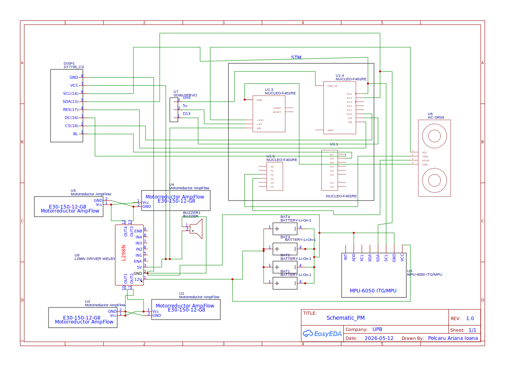

# Autonomous Vehicle with Dynamic Path Replanning
**An autonomous robotic system capable of navigating along a predefined path and dynamically adapting its route in real time to avoid obstacles.**

:::info
**Author:** ariana.pelcaru \
**GitHub Project Link :** https://github.com/UPB-PMRust-Students/acs-project-2026-aryuqq
:::

## Description

The Autonomous Vehicle with Dynamic Path Reconfiguration demonstrates intelligent navigation in environments with unpredictable obstacles. Under normal conditions, it follows a predefined path using embedded control logic.

The vehicle continuously monitors its surroundings with distance sensors to detect obstacles in real time. When an obstacle is detected, the system analyzes the data, recalculates an alternative route, and adjusts its movement to safely avoid collisions while continuing toward its destination.

## Motivation

Autonomous vehicles have the potential to significantly improve safety and efficiency in real-world transportation systems. Human error remains one of the main causes of accidents, especially in dynamic and unpredictable environments where quick reactions are required.
This project was inspired by the idea of reducing such risks by enabling a system that can perceive obstacles and react instantly without human intervention.

## Architecture

## Log

### Week 20-26 Apr
- This week, I focused on defining the overall architecture of the autonomous vehicle project based on STM32. I worked on shaping the main system modules (sensing, control, actuation, and user interface) and clarified how they interact in a real-time embedded system.
- I also worked on the project documentation, writing the initial structure and describing the main functionalities and expected system behavior.
- In addition, I made a first draft of the required components (HC-SR04 sensor, L298N motor driver, DC motors, servo motors) and researched their roles in the system.

### Week 27-3 Apr
- [To be completed]

### Week 4-10 Apr
- [To be completed]

## Hardware

- **Microcontroller:** STM32 Nucleo Board
- **Sensor:** HC-SR04 Ultrasonic Sensor
- **Optional Sensor:** MPU6050 IMU Sensor
- **Actuators:** DC Motors, Servo Motors
- **Motor Driver:** L298N Motor Driver
- **Display:** 16x2 LCD
- **Input:** ON/OFF Button
- **Other:** Breadboard, jumper wires, battery pack

## Bill of Materials

| Device | Usage | Price |
|--------|------|-------|
| STM32 Nucleo Board | Main controller | ~50–120 RON |
| HC-SR04 Ultrasonic Sensor | Obstacle detection | ~10 RON |
| MPU6050 (optional) | Orientation sensing | ~15 RON |
| L298N Motor Driver | Motor control | ~15 RON |
| DC Motors (2–4x) | Robot movement | ~20–40 RON |
| Servo Motor | Steering / scanning | ~10–20 RON |
| LCD 16x2 I2C | User interface display | ~15–20 RON |
| ON/OFF Button | System control | ~1–2 RON |
| Breadboard | Prototyping | ~5 RON |
| Jumper Wires | Connections | ~5 RON |
| Battery Pack (Li-Ion / Li-Po) | Power supply | ~30–60 RON |

# Links
1. [Lab Materials](https://pmi.acs.pub.ro/)
2. [About Rust](https://docs.rust-embedded.org/book/)
3. [Youtube_Video](https://www.youtube.com/watch?v=kPSBpfUpHt0)
