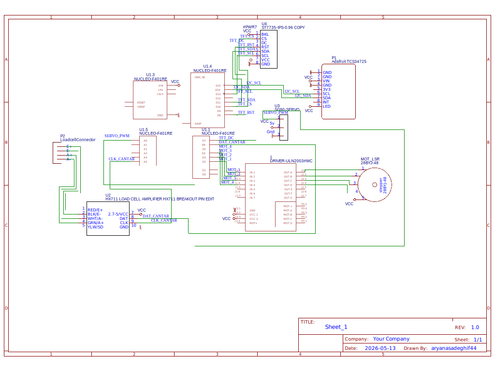
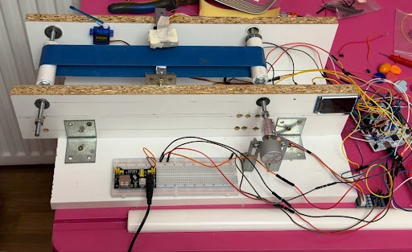
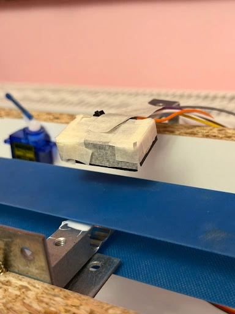
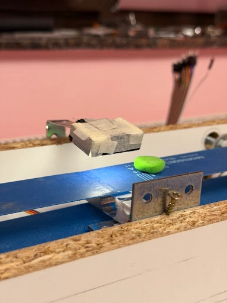
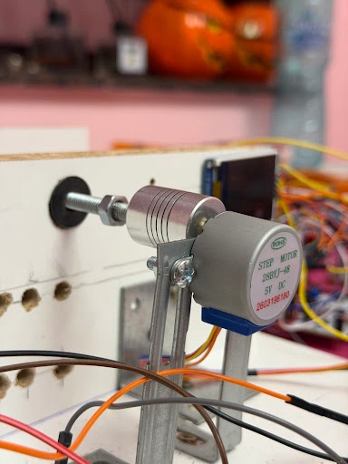
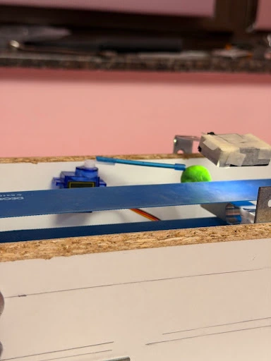
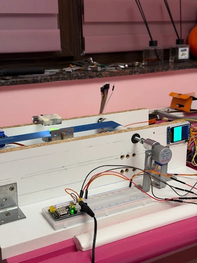
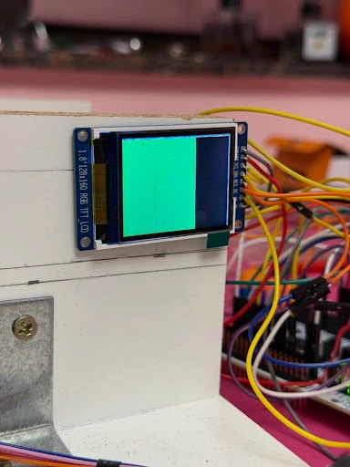
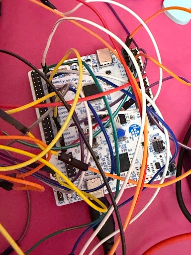

# Automated Optical Sorting System
An automated system designed to identify and sort objects based on their optical properties and weight using an STM32 microcontroller and Rust (Embassy).

:::info
**Author:** Ariana Sadeghi \
**GitHub Project Link:** [GitHub Repo](https://github.com/UPB-PMRust-Students/acs-project-2026-arianasadeghi)
:::

## Description
The project consists of an industrial-style sorting line that uses a TCS34725 color sensor to detect the RGB signature of objects and an HX711 load cell for weight validation. Based on the sensor data, a custom calibration algorithm classifies the items. A mechanical arm (SG90 servomotor) acts as the sorting mechanism, while a stepper motor drives the conveyor belt continuously. The system's status and detected colors are visually fed back in real-time through an SPI TFT display.

## Motivation
I chose this project to explore the integration of multiple digital communication protocols (I2C, SPI) and precise motor control (PWM and Stepper sequences) in a real-time automation scenario using the Embassy async framework in Rust.

## Architecture
**Main Components**
* **Sensing Module:** TCS34725 Color Sensor (I2C) for optical recognition and HX711 Amplifier with a Load Cell for weight detection.
* **Control Logic:** Continuous polling loop acting as a state machine for detection, classification, and precise timing delays.
* **Actuation Module:** 28BYJ-48 Stepper motor (with ULN2003 driver) for the conveyor belt and an SG90 Servomotor (PWM) for the sorting arm.
* **User Interface:** TFT LCD display controlled via SPI to show current calibration data and detected colors.

## Log
* **Week 5 - 11 May:** Project idea selection and hardware requirements gathering. Basic component testing (Stepper and Servo motors) and pinout planning.
* **Week 12 - 18 May:** Color sensor (TCS34725) I2C integration, TFT display SPI setup, and writing the initial color calibration logic.
* **Week 19 - 25 May:** Finalizing the state machine integration in Rust, fine-tuning the RGB calibration thresholds for specific object colors, adjusting servo timings to sync with the conveyor belt, and completing GitHub documentation.

## Hardware
The system is built around an STM32 Nucleo board programmed in Rust. 
The main peripherals include:
* **TCS34725:** RGB Color Sensor for object detection.
* **HX711:** Load cell amplifier with a 1kg/5kg load cell.
* **1.8" TFT Display:** SPI-driven screen for visual feedback.
* **28BYJ-48 Stepper Motor & ULN2003:** Drives the conveyor belt.
* **SG90 Servomotor:** Acts as the sorting arm.

## Schematics

## Physical Implementation
Below are the layout views of the fully assembled automated sorting system, showcasing the conveyor alignment, sensor housing, and mechanical integration.

*Figure 1: Overall assembly of the conveyor belt line and electronics integration.*

*Figure 2: Close-up of the TCS34725 color sensor featuring a custom paper shield to block ambient light reflections.*

*Figure 3: Color sensor actively scanning an object passing underneath on the conveyor belt.*

*Figure 4: The 28BYJ-48 stepper motor and mechanical coupling driving the conveyor belt.*

*Figure 5: SG90 servomotor configured as the sorting arm, positioned to intercept rejected items.*

*Figure 6: The 1.8" SPI TFT display providing real-time visual feedback of the detected colors.*

*Figure 7: Close-up view of the TFT screen displaying active color recognition.*

*Figure 8: The STM32 Nucleo board handling all I2C, SPI, and PWM signals asynchronously.*

## Bill of Materials

| Device | Usage | Price |
|---|---|---|
| STM32 Nucleo Board | Main Microcontroller | - |
| TCS34725 Module | Optical/Color Sensing | 22,68 RON |
| HX711 | Weight Sensing | 4,57 RON |
| Load Cell | Weight Sensing | 12,80 RON |
| 1.8" TFT Display | User Interface | 40,62 RON |
| 28BYJ-48 | Conveyor movement | 10,29 RON |
| ULN2003 | Conveyor movement | 4,97 RON |
| SG90 Servomotor | Sorting Arm | 9,49 RON |

## Software

**Concurrency & Async Execution**
The software architecture leverages the cooperative multitasking model provided by the Embassy framework in Rust. Since the stepper motor requires precise step impulses every 3ms to maintain constant conveyor speed, a traditional blocking approach (`delay_ms`) would freeze sensor polling and screen updates. By utilizing `async/await` and asynchronous hardware timers (`Timer::after_millis`), the system interleaves the conveyor drive loop, the I2C color polling, and the SPI screen drawing tasks seamlessly. This ensures zero jitter for the motor and deterministic real-time execution without the overhead of a traditional RTOS.

**System State Machine**
The control loop operates as a finite state machine (FSM) with the following operational transitions:
* **IDLE / SCANNING:** Conveyor belt runs continuously; the system polls the TCS34725 Clear channel waiting for a threshold drop.
* **COLOR_IDENTIFICATION:** Object detected; RGB channels are sampled and evaluated against the software-defined calibration boundaries.
* **WEIGHT_VALIDATION:** The system captures data from the HX711 load cell using a moving average filter to determine and validate the mass.
* **SORTING_ACTION:** A specific PWM duty cycle is sent to the SG90 servomotor after a precise kinematic delay, moving the arm to sort the object.
* **RESET:** The servo returns to its default position (0°), the TFT display resets to idle status, and the FSM returns to the scanning state.

**High-Level Logic**
Practically, the software follows these stages during a successful sorting cycle:
1. **Movement:** The stepper motor runs continuously using a non-blocking sequence to drive the conveyor belt.
2. **Detection:** Continuous polling of the TCS34725 sensor via I2C to read Clear, Red, Green, and Blue light channels, alongside weight readings from the HX711.
3. **Decision:** Comparing RGB values against preset, fine-tuned thresholds to identify specific colors (e.g., White, Yellow, Pink, Purple, Brown).
4. **Action:** Updating the TFT display with the detected color and triggering a precise PWM sequence to extend and retract the Servo arm at the exact moment the object passes.

**Libraries and Drivers**

| Library | Description | Usage |
|---|---|---|
| `embassy-stm32` | Hardware Abstraction (HAL) | Peripheral control (I2C, SPI, PWM, GPIO) |
| `embassy-time` | Time Management | Delay management and timing for the stepper/servo |
| `defmt` / `defmt-rtt` | Logging Framework | Real-time debugging and color calibration output |

## Links
* [Embassy Rust Documentation](https://embassy.dev/)
* [TCS34725 Color Sensor Datasheet](https://cdn-shop.adafruit.com/datasheets/TCS34725.pdf)
* [HX711 Datasheet](https://cdn.sparkfun.com/datasheets/Sensors/ForceFlex/hx711_english.pdf)
* [Laboratories text](https://embedded-rust-101.wyliodrin.com/docs/acs_cc/category/lab)