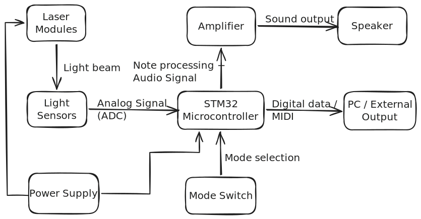
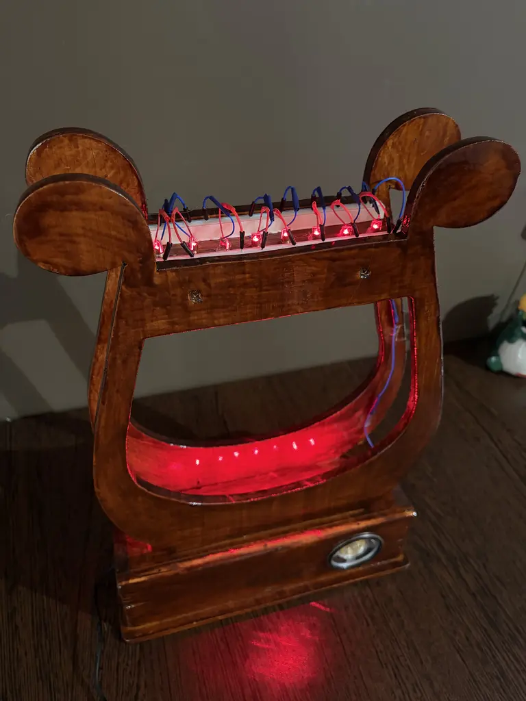
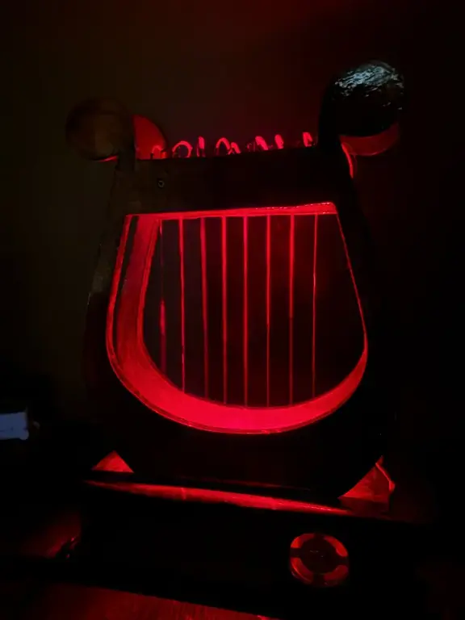
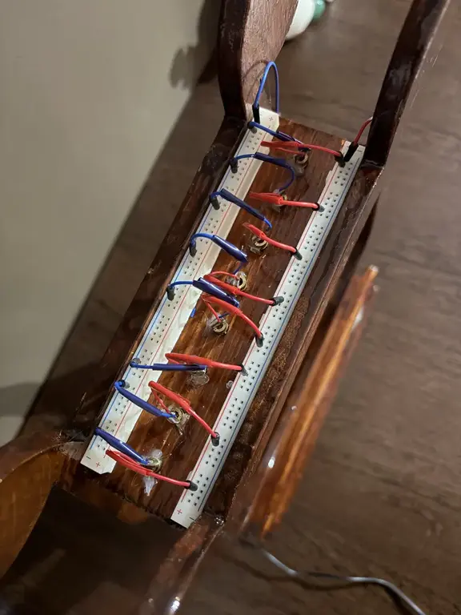
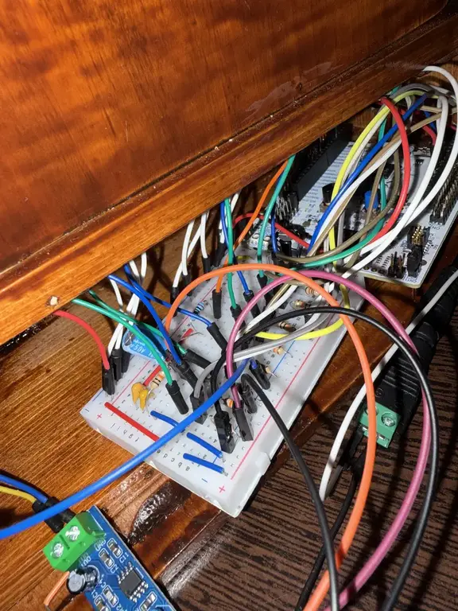
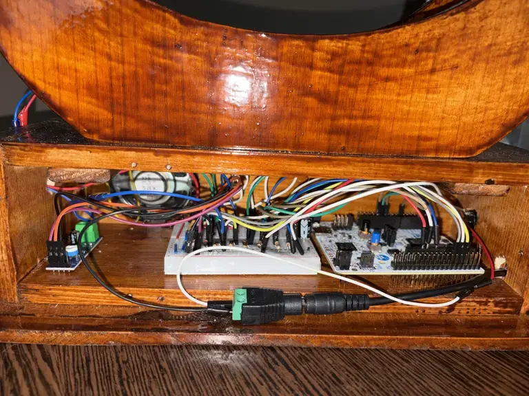
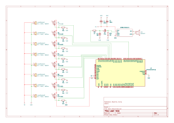

# Laser Harp
A laser-based musical instrument that converts interrupted light beams into sound in real time.

:::info 

**Author**: Beatrice-Elena Sălăvăstru \
**GitHub Project Link**: [link_to_github](https://github.com/UPB-PMRust-Students/acs-project-2026-beatriceelena5)

:::

<!-- do not delete the \ after your name -->

## Description

A laser harp system with 8 laser beams acting as strings. Each beam is aligned with a phototransistor. When the user interrupts one of the beams, the STM32 detects the event and plays the corresponding note through a speaker.

## Motivation

As someone interested in both music and technology, I want to build an interactive system that translates physical gestures into sound. This project allows me to explore working with optical sensors, handling real-time input from multiple sources, and generating audio signals on a microcontroller. It also gives me the opportunity to integrate hardware and software into a complete system, while creating a visually engaging and intuitive user experience.

## Demo

<iframe width="100%" height="450"
src="https://www.youtube.com/embed/olEfG4KMzfE"
title="Laser Harp Demo"
frameborder="0"
allow="accelerometer; autoplay; clipboard-write; encrypted-media; gyroscope; picture-in-picture; web-share"
allowfullscreen></iframe>

## Architecture 

## Log

<!-- write your progress here every week -->

### Week 5 - 11 April
Designed and built the wooden frame for the laser harp. Planned the layout of laser beams and sensors to ensure proper alignment and stability.

### Week 12 - 18 April
Ordered all hardware components from TME and Sigmanortec. 

### Week 4 - 10 May
Built and tested the electronic circuit using a simple test program. The goal of this stage was to verify that the laser modules, phototransistors, STM32 inputs and audio amplifier worked correctly before integrating the final software.

### Week 11 - 17 May
Implemented the sample-based audio playback system. The project was changed from simple frequency generation to playback of RAW audio samples stored directly in the STM32 Flash memory. The system now works as a standalone instrument: the audio is played directly through the speaker, without depending on a USB connection to the laptop for sound generation.

## Hardware

The project is built around the **STM32 Nucleo-U545RE-Q**, which reads the sensors and controls the audio output.

The physical harp uses 8 laser modules, each aligned with a phototransistor. The phototransistors are connected to GPIO pins configured as external interrupt inputs. When a laser beam is interrupted, the corresponding input changes state and the STM32 detects the event as a string trigger.

For audio output, the STM32 generates a high-frequency PWM signal on `PB3 / TIM2_CH2`. This signal is passed through a simple analog filtering stage and then sent to an **LM386 audio amplifier**, which drives an 8Ω speaker.

The structure is mounted on a custom wooden frame that keeps the lasers and sensors aligned.

### Hardware Photos

### Schematics

### Bill of Materials  

| Device | Usage | Price |
|--------|--------|-------|
| Nucleo U545RE | Microcontroller | ~120 RON |
| Laser modules x10 | Light beams (strings) | 20 RON total |
| TEPT4400 x11 | Light detection | 16.76 RON total |
| LM386 module | Audio amplification | 4.14 RON |
| Speaker (8Ω) | Sound output | 23.02 RON |
| Resistors 10kΩ | Signal conditioning | 10.38 RON |
| Capacitors 100µF | Power filtering | 4.07 RON |
| Capacitors 100nF | Noise filtering | 6.47 RON |
| Capacitors 0.1µF | Decoupling | 8.16 RON |
| Rocker switch | Power ON/OFF | 4.43 RON |
| Power supply 5V 2A | Power source | 22.61 RON |
| DC jack connector | Power connection | 3 RON |

## Software

| Library | Description | Usage |
|---------|-------------|-------|
| [embassy-stm32](https://github.com/embassy-rs/embassy) | STM32 HAL for Embassy | Used for GPIO/EXTI input handling, PWM audio output, timer configuration and clock setup |
| [embassy-executor](https://github.com/embassy-rs/embassy) | Async task executor | Runs the main application and the separate laser string monitoring tasks |
| [embassy-time](https://github.com/embassy-rs/embassy) | Timekeeping and delays | Used for sensor cooldowns and precise audio sample timing |
| [embassy-sync](https://github.com/embassy-rs/embassy) | Synchronization primitives | Provides the channel used to send triggered note indices from sensor tasks to the audio loop |
| [defmt](https://github.com/knurling-rs/defmt) | Lightweight logging framework | Used for debug and status messages |
| [defmt-rtt](https://github.com/knurling-rs/defmt) | RTT logging transport | Sends debug logs from the board to the PC |
| [panic-probe](https://github.com/knurling-rs/probe-run) | Panic handler | Reports crashes through the debug probe |

## Links

<!-- Add a few links that inspired you and that you think you will use for your project -->

1. [Arduino-Laser-Harp](https://www.instructables.com/Arduino-Laser-Harp-1/)

