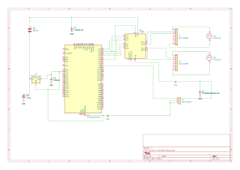

# Smart Fishing Boat - STM32 Rust Project

:::info

**Author**: Bianca Mircea \
**GitHub Project Link**: https://github.com/biancaamircea/website.git

:::

<!-- do not delete the \ after your name -->

## Description

This project is an autonomous smart fishing boat built using an STM32 microcontroller programmed in Rust.  
The boat is capable of navigating on water using two independent motors and can deploy fishing bait using a mechanical catapult system.

## Motivation

I chose this project because I wanted to combine embedded systems with real-world robotics.  
A fishing assistant boat is a practical and fun application of microcontrollers, motor control, and mechanical actuation.

## Architecture

The system is composed of the following main components:

- STM32 microcontroller (main control unit)
- Motor driver module (controls 2 DC motors)
- Two DC motors (propulsion system)
- Servo / actuator (catapult mechanism)
- Power supply (battery system)

### How they connect:

- STM32 sends PWM signals to motor driver → controls movement
- STM32 controls servo signal → triggers catapult
- Battery powers all components through power distribution circuit

## Log

<!-- write your progress here every week -->

### Week 5 - 11 May
- Defined project idea
- Chosen STM32 + Rust as platform

### Week 12 - 18 May
- Designed basic architecture
- Selected motor + servo components

### Week 19 - 25 May
- Started firmware implementation in Rust
- Testing motor control logic

## Hardware

The project uses embedded hardware components for movement and bait delivery.

### Schematics

### Bill of Materials

| Device | Usage | Price |
|--------|------|------|
| STM32 Microcontroller | Main controller | ~50 RON |
| 2x DC Motors | Boat propulsion | ~40 RON |
| Motor Driver (L298N) | Controls motors | ~20 RON |
| Servo Motor | Catapult mechanism | ~15 RON |
| Battery Pack | Power supply | ~60 RON |
| Waterproof chassis | Boat structure | ~100 RON |

## Software

| Library | Description | Usage |
|--------|-------------|------|
| embedded-hal | Rust hardware abstraction layer | GPIO and PWM control |
| stm32f4xx-hal | STM32 HAL for Rust | Microcontroller control |
| cortex-m-rt | Runtime for embedded Rust | Boot and execution |

## Links

1. https://docs.rust-embedded.org/book/
2. https://www.st.com/en/microcontrollers-microprocessors/stm32-32-bit-arm-cortex-mcus.html
3. https://github.com/rust-embedded/embedded-hal
4. Inspiration: bait-casting fishing boats (like the one in the image)
