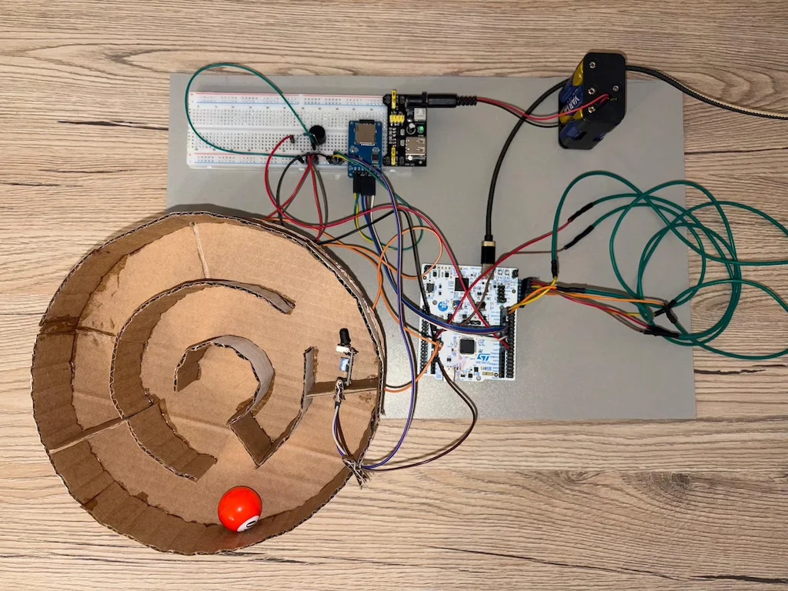
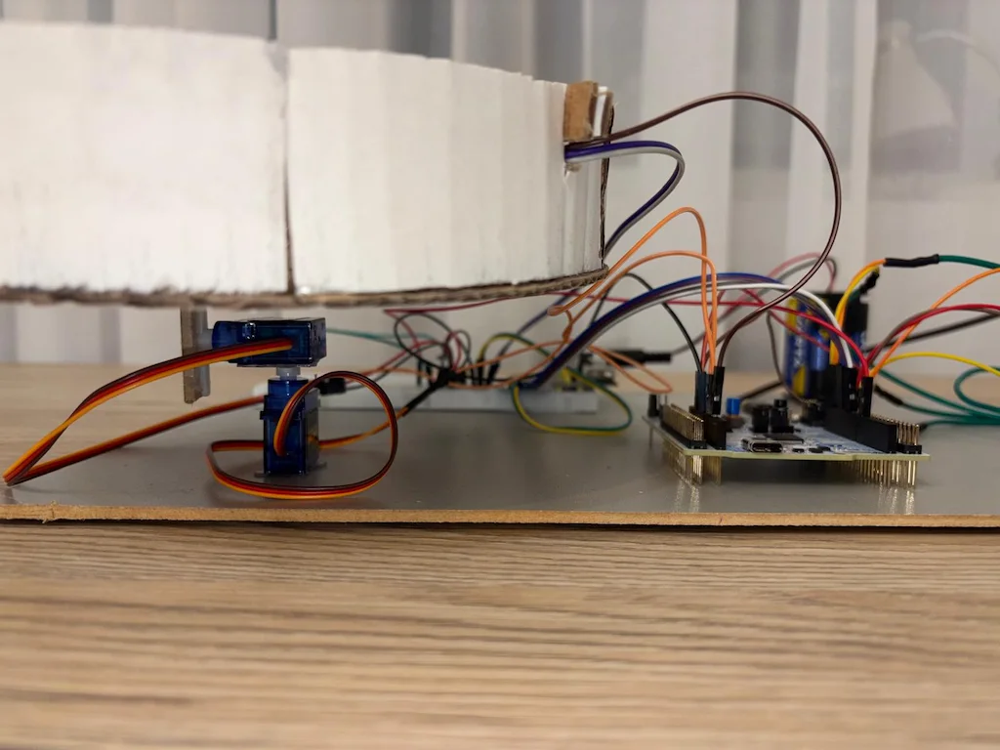
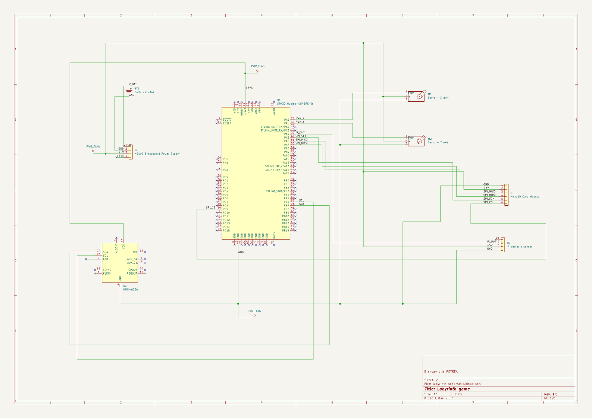

# Labyrinth game
A physical labyrinth platform that mirrors the orientation of a handheld Nucleo board using IMU sensors and servo actuation.

:::info

**Author**: PETREA Bianca-Iulia \
**GitHub Project Link**: https://github.com/UPB-PMRust-Students/acs-project-2026-biancapetrea16

:::

<!-- do not delete the \ after your name -->

## Description

The project implements a physical 2-axis (X-Y) labyrinth platform driven by two servomotores. Instead of a traditional joystick, the system uses a handheld Nucleo board equipped with an MPU6050 accelerometer and gyroscope to detect tilt. The hardware labyrinth "mirrors" the handheld board's orientation in real-time. A proximity sensor (IR) marks the end of the maze, and the completion time is recorded onto an SD card to maintain a "High Score" leaderboard.

## Motivation

I chose this project to explore the concept of remote motion mirroring. It requires a precise synchronization between the handheld controller (IMU data processing) and the mechanical platform (PWM actuation).

## Architecture

The project is built as a motion mirroring system between the controller and the maze:
 - **Handheld Controller (Nucleo + IMU)**: Detects pitch and roll angles via I2C.
 - **Main Processor**: Translates orientation data into PWM duty cycles.
 - **Mechanical Platform**: Uses two servos to tilt the physical maze.
 - **End-of-Game Logic**: An IR sensor triggers the timer stop.
 - **Persistence Layer**: An SD card module stores the leaderboard via SPI.

 

## Log

<!-- write your progress here every week -->

### Week 14 - 20 April
- Finalized project theme and received approval.
- Researched and ordered all hardware components (IMU, servos, SD module, IR sensor).

### Week 4 - 10 May
- Mapped all pin connections between the Nucleo board, sensors, and actuators.

### Week 12 - 18 May
- Started developing the software implementation in Rust.
- Set up the main code structure and began integrating peripheral drivers.

### Week 18 - 24 May
- Implemented the final core control loop featuring asynchronous multitasking powered by Embassy.
- Developed a robust digital signal processing pipeline for the MPU6050: added a digital deadzone filter (800 units threshold) to suppress MEMS noise, and an exponential moving average low-pass filter (0.80/0.20 split) to ensure smooth, organic servo actuation.
- Added a sudden movement detection routine (3000 units threshold) to dynamically trigger game activation and capture the starting timestamp.
- Completed the persistence layer over SPI using a multi-layered abstraction stack ('ExclusiveDevice', 'SdCard', and 'VolumeManager') to safely parse past records and append new scores into 'scor.txt' under a FAT32 file system.
- Finished integration of the hardware IR sensor and spawned an independent background executor task to handle the victory beep sequence via bit-banged PWM square waves (1kHz) on the buzzer pin upon maze completion.
- Conducted final mechanical assembly and wiring, securing a stable, standalone runtime operation.

### Final Project Setup

*Figure 1: Full assembly showing the mechanical platform and the handheld controller unit.*


*Figure 2: Detail of the 2-axis gimbal mechanism powered by SG90 servos.*

## Hardware

The project uses the STM32 Nucleo-U545RE-Q board as the brain, connected to sensors for input and motors for output.

### Schematics
The hardware connections are detailed below, routing all components to the STM32 Nucleo board. Power distribution is handled via a breadboard 5V and GND rail supplied by the Nucleo board (for testing) or an MB102 module (for portable use).



### Bill of Materials

<!-- Fill out this table with all the hardware components that you might need.

The format is
```
| [Device](link://to/device) | This is used ... | [price](link://to/store) |

```

-->

| Device | Usage | Price |
|--------|--------|-------|
| [STM32 Nucleo-U545RE-Q](https://www.st.com/) | Main Controller | Lab Provided |
| [MPU6050 IMU (Soldered)](https://www.optimusdigital.ro/ro/senzori-ineriali/51-modul-accelerometru-giroscop-mpu6050.html) | Handheld tilt detection (I2C) | 15.49 RON |
| [2x SG90 Servomotors](https://www.optimusdigital.ro/ro/motoare-servomotoare/26-micro-servomotor-sg90.html?search_query=servomotoare&results=97) | Labyrinth tilt control (PWM) | 27.98 RON |
| [Micro SD Card Slot Module](https://www.optimusdigital.ro/ro/memorii/1516-modul-slot-card-microsd.html?search_query=micro+sc+card+slot&results=32) | SPI Interface for SD card | 4.39 RON |
| [MediaRange 4GB MicroSDHC](https://www.emag.ro/card-de-memorie-mediarange-micro-sdhc-4gb-clasa-10-cu-adaptor-sd-mr956/pd/DHJWRLMBM/) | Storage for High Scores | 23.00 RON |
| [IR Obstacle Sensor](https://www.optimusdigital.ro/ro/senzori-optici-cu-infrarosu/2843-modul-senzor-infrarosu-de-obstacole.html) | Finish line detection | 19.99 RON |
| [Breadboard Kit + MB102 Power](https://www.emag.ro/kit-breadboard-830-gauri-65-fire-modul-tensiune-alimentare-mb102-jh027/pd/DY1YP6BBM/) | Prototyping and power rail | 35.00 RON |
| [6xAA Battery Holder (DC Jack)](https://www.emag.ro/suport-baterii-6xaa-mufa-um-3x6-ai258-s385/pd/DLQ5D3MBM/) | Power for motors | 11.00 RON |
| [Varta Longlife Power AA (8 pcs)](https://www.emag.ro/baterii-alcaline-varta-helps-longlife-power-aa-6-2-buc-4906121428/pd/DRFZL2MBM/) | Power source | 22.00 RON |
| [Resistors Set (600 pcs)](https://www.emag.ro/set-600pcs-rezistente-0-25w-30-tipuri-toleranta-1-20-de-bucati-pentru-fiecare-valoare-ideal-pentru-proiecte-electronice-si-ingineri-include-rezistente-10-100-1k-10k-100k-pana-la-1m-utilizat-pentru-pro/pd/DBV351YBM/) | Circuit components | 28.00 RON |
| [Jumper Wires (F-M 20cm)](https://www.emag.ro/set-40-cabluri-jumper-tata-mama-pentru-breadboard-multicolore-20cm-034-031/pd/DQ8P4G3BM/) | Connections | 14.00 RON |
| [Jumper Wires (F-M 40cm)](https://www.emag.ro/set-40-cabluri-arduino-tata-mama-40-cm-multicolor-5904162803460/pd/DH8RKLMBM/) | Long range connections | 19.00 RON |
| [Jumper Wires (M-M 30cm)](https://www.emag.ro/set-40-cabluri-jumper-30-cm-conectori-tata-tata-ideale-pentru-placi-de-contact-si-conectori-goldpin-2-54-mm-compatibile-cu-arduino-si-alte-module-perfecte-pentru-prototipuri-electronice-ak7/pd/DV0FC1YBM/) | Breadboard connections | 16.00 RON |


## Software

| Library | Description | Usage |
|---------|-------------|-------|
| [embassy-stm32](https://github.com/embassy-rs/embassy) | Hardware Abstraction Layer | Handling I2C, SPI, and PWM peripherals |
| [mpu6050](https://crates.io/crates/mpu6050) | IMU Driver | Converting raw data to tilt angles |
| [embedded-sdmmc](https://crates.io/crates/embedded-sdmmc) | SD Card File System | Managing the High Score log file |

## Links

<!-- Add a few links that inspired you and that you think you will use for your project -->

1. [MPU6050 Technical Documentation](https://invensense.tdk.com/wp-content/uploads/2015/02/MPU-6000-Datasheet1.pdf)
2. [The Embedded Rust Book](https://docs.rust-embedded.org/book/)
3. [Embassy Framework Docs](https://embassy.dev/)