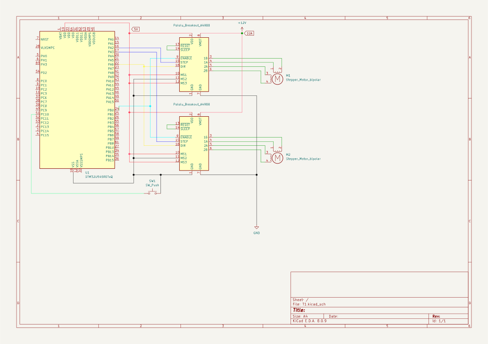

# Piano motor-synth

:::info

**Author**: Bobei Bogdan Dumitru \
**GitHub Project Link**: https://github.com/UPB-PMRust-Students/acs-project-2026-WolfishAtom7515

:::

## Description

A small yet challenging embedded Rust project running on an STM32 microcontroller. A motor (either a servo or stepper, depending on the complexity achieved) produces audible musical notes by rapidly switching the PWM frequency to match each note's frequency, turning mechanical vibration into sound. The project functions as a minimal piano, with one button per note across a full octave, plus a dedicated button that plays an original song composed by me.

## Motivation

I chose this project out of my passion for both music and programming. I wanted to build something that sits at the intersection of the two, where my music theory knowledge and my programming experience could work together toward a single, tangible result.

## Architecture 

The project is split into three main logical components:


- Input Layer — Button Matrix
13 GPIO pins configured as digital inputs with internal pull-up resistors. 12 buttons correspond to one chromatic octave (C, C#, D, D#, E, F, F#, G, G#, A, A#, B), and 1 dedicated button triggers the pre-composed song. Each button press is detected asynchronously via Embassy tasks.

- Control Layer — Note Resolver
When a button press is detected, the note resolver maps it to a frequency in Hz (e.g. A4 = 440 Hz, C5 = 523 Hz). For the song button, it steps through a pre-defined sequence of (frequency, duration) pairs. This layer runs entirely in software on the STM32.

- Output Layer — PWM Motor Driver
The resolved frequency is written directly into the TIM2 timer registers (ARR and CCR) via the STM32 PAC, changing the PWM frequency in real time. The motor (servo SG90 or stepper Nema-17 via A4988 driver) vibrates at that frequency, producing an audible tone. A 50% duty cycle is used for maximum vibration amplitude.


## Log

<!-- write your progress here every week -->

### Week 5 - 11 May

Set up the Embassy + STM32 project from scratch. Configured TIM2 for PWM output and tested basic servo control with a single button. Verified that the PWM signal reaches the servo correctly and that the duty cycle values produce the expected positions.

### Week 12 - 18 May

### Week 19 - 25 May

## Hardware

The project uses an STM32U545 Nucleo board as the main microcontroller. For sound output, the system is driven by two Nema-17 stepper motors, each controlled through an A4988 driver. The stepper motors were chosen for their higher torque, louder acoustic output, and improved sound clarity compared to simpler motor alternatives. All motors are powered by an external 12V/10A switching power supply, ensuring stable operation and preventing voltage drops caused by simultaneous motor current spikes. User input is handled through 13 tactile push buttons connected to GPIO pins configured with internal pull-up resistors.

### Schematics



### Bill of Materials (yet to come)

<!-- Fill out this table with all the hardware components that you might need.

The format is 
```
| [Device](link://to/device) | This is used ... | [price](link://to/store) |

```

-->

| Device | Usage | Price |
|--------|--------|-------|
| [STM32U545](https://www.st.com/resource/en/user_manual/um3062-stm32u3u5-nucleo64-boards-mb1841-stmicroelectronics.pdf) | The microcontroller | [113 RON](https://ro.mouser.com/ProductDetail/STMicroelectronics/NUCLEO-U545RE-Q?qs=mELouGlnn3cp3Tn45zRmFA%3D%3D&utm_id=6470900573&utm_source=google&utm_medium=cpc&utm_marketing_tactic=emeacorp&gad_source=1&gad_campaignid=6470900573&gbraid=0AAAAADn_wf1J6XpRotkoYj96_ZbUSaPnH&gclid=Cj0KCQjw77bPBhC_ARIsAGAjjV9JETny_HVaRTMCWUsjLF5mX_nrK4cA6P9VX1bEVQVYmCTCGeIwhOAaAlZUEALw_wcB) |
| [Stepper Motor Nema-17 1.5A](https://www.handsontec.com/dataspecs/motor_fan/nema17-42BYGH60.pdf) | Motor that sings, gooad quaity, yet pricy| [67 RON](https://sigmanortec.ro/Nema17-1-5A-p125805542) |
| [Servomotor SG90](http://www.ee.ic.ac.uk/pcheung/teaching/DE1_EE/stores/sg90_datasheet.pdf) | Decent sound, but not quite precise| [13 RON](https://sigmanortec.ro/servomotor-sg90-360-continuu) |
| [Driver stepper A4988](https://www.pololu.com/file/0j450/a4988_dmos_microstepping_driver_with_translator.pdf) | The driver dedicated for the stepper motor | [8 RON](https://sigmanortec.ro/Driver-stepper-A4988-Radiator-p125711037) |
| [Charger 12W, 2A](https://sigmanortec.ro/Sursa-alimentare-12V-2A-mufa-5-5x2-1-p136264881) | Current source for the motors | [22 RON](https://sigmanortec.ro/Sursa-alimentare-12V-2A-mufa-5-5x2-1-p136264881) |

## Software

| Library | Description | Usage |
|---------|-------------|-------|
| **embassy-stm32** | STM32 hardware driver | Controlling pins, timers, and peripherals |
| **embassy-time** | Time and delay management | Handling timeouts and periodic events |
| **embassy-sync** | Async sync primitives | Inter-task communication (Mutex, Channels) |
| **cortex-m** | Core processor access | Managing interrupts and CPU instructions |
| **cortex-m-rt** | Startup/Runtime for ARM | Initializing memory and the entry point |
| **defmt** | Low-overhead logger | Fast logging for embedded systems |
| **defmt-rtt** | RTT transport for logs | Transferring logs through debuggers |
| **embassy-embedded-hal** | HAL helper utilities | Adapting hardware traits for Embassy |
| **embassy-executor** | Async task scheduler | Running and managing async tasks |
| **embassy-futures** | Async helpers | Combining or waiting for multiple futures |
| **embassy-usb** | Async USB stack | Implementing USB device functionality |
| **embedded-hal-async** | Async hardware traits | Standard interface for non-blocking drivers |
| **panic-probe** | Debug panic handler | Reporting crashes via the probe |

## Links

<!-- Add a few links that inspired you and that you think you will use for your project -->

1. [Instructables](https://www.instructables.com/Music-With-Servo-Motor/)
2. [Instagram](https://www.instagram.com/local_host_audio_/?next=)
3. [Youtube](https://www.youtube.com/watch?v=NOsFIrsdKwY)

