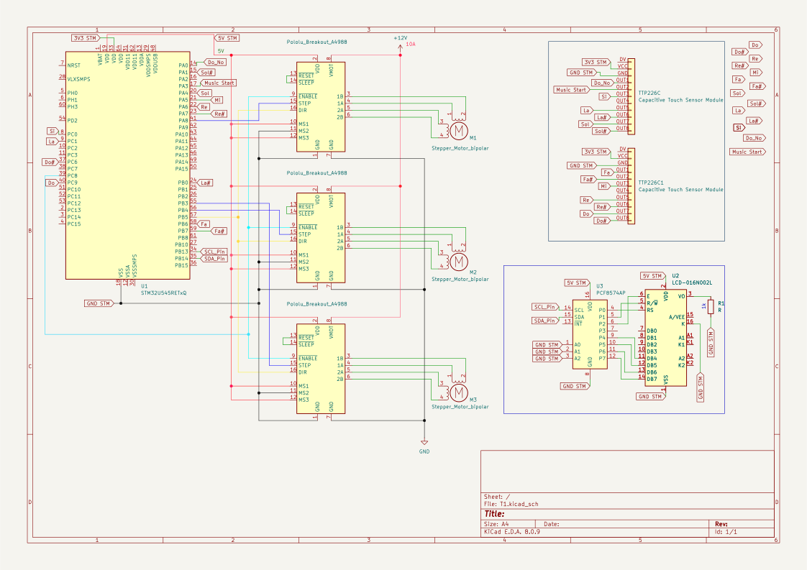

# Piano motor-synth

:::info

**Author**: Bobei Bogdan Dumitru \
**GitHub Project Link**: https://github.com/UPB-PMRust-Students/acs-project-2026-WolfishAtom7515

:::

## Description

A challenging and highly rewarding embedded Rust project running on an STM32 microcontroller. Instead of a traditional speaker, this project uses three Nema-17 stepper motors as sound synthesizers. By rapidly switching the PWM frequency sent to the motor drivers, the mechanical vibrations are turned into audible musical notes. 

The project functions as an electromechanical piano. It features two capacitive touch sensor modules that act as a simplified keyboard. You can either play it with the system dynamically allocating notes across the three motors to allow for chords playing or press a dedicated input to play an original, pre-composed song. To complete the experience, an LCD screen provides real-time visual feedback, displaying the current note being played.

## Motivation

I chose this project out of my passion for both music and programming. I wanted to build something that sits at the intersection of the two, where my music theory knowledge and my low-level embedded Rust experience could work together toward a single, tangible result. There is something incredibly satisfying about forcing industrial hardware (stepper motors) to create delicate art (music).perience could work together toward a single, tangible result.

## Architecture 

The project is split into three main logical components, working asynchronously to handle inputs, process logic, and drive outputs:

- **Input Layer — Capacitive Touch Keyboard**
Instead of mechanical buttons, user input is handled by two capacitive touch sensor modules. These represent the piano keys. The input is processed asynchronously via Embassy tasks, detecting both single taps and multiple simultaneous touches. 

- **Control Layer — Polyphonic Note Resolver & Chord Manager**
This is the "brain" of the synth. When touches are detected, the resolver maps them to specific frequencies in Hz (e.g., A4 = 440 Hz, C5 = 523 Hz). Because the system has three independent motors, this layer handles polyphony: it intelligently distributes the pressed notes across the available motors, allowing you to play rich chords. If the "pre-defined song" mode is triggered, this layer overrides the live input and steps through a hardcoded sequence of frequency-duration pairs.

- **Output Layer — PWM Motor Drivers & Visual Display**
The resolved frequencies are written directly into the STM32 timer registers (ARR and CCR) to dynamically change the PWM frequency for each of the three A4988 stepper drivers. A 50% duty cycle ensures maximum physical vibration (and thus, optimal volume). Concurrently, this layer communicates via I2C with an LCD 1602 display, instantly updating the screen with the name of the most recent note or the root note of the song currently playing.

This is the logic diagram:


## Log

<!-- write your progress here every week -->

### Week 5 - 11 May

First week, I set up the Embassy plus STM32 project from scratch. Wrote the basic initial configuration code and acquired the Nema-17 stepper motor. I spent the week experimenting with it, configuring the timer for PWM output, and figuring out the core mechanics of making the stepper tomove at a specific speed in order to vibrate the frequencies to produce distinct pitches.

### Week 12 - 18 May

I ordered two additional stepper motors to expand the project's capabilities. I set up and wired the capacitive touch sensor modules, writing the logic to actually play the setup like a musical instrument. I also integrated the new heavy-duty 12V/10A power supply, ensuring the electrical foundation was ready to safely handle the current draw of all three motors simultaneously.

### Week 19 - 25 May

The last week, I ordered the 1602 LCD screen and integrated it into the system for real-time visual feedback. On the software side, I focused on the architecture, implementing the asynchronous code required to drive all three motors concurrently, allowing for true polyphony (playing chords however I want). Finally, I coded and fine-tuned the complete pre-composed song that the system can play autonomously.

## Hardware

The project uses an STM32U545 Nucleo board as the main microcontroller. For sound output, the system is driven by three Nema-17 stepper motors, each controlled through an individual A4988 driver. Stepper motors were chosen over simple servos for their higher torque, significantly louder acoustic output, and improved tonal clarity. 

Because three motors drawing current simultaneously can cause massive power spikes (especially when playing chords), the entire motor array is powered by an external 12V/10A switching power supply. For user input, the system uses two Capacitive Touch Sensor Modules configured to mimic the keys of a piano, allowing for a natural and interactive live playing experience. Additionally, an I2C 1602 LCD screen is used for real-time visual feedback.

### Schematics



### Bill of Materials 

<!-- Fill out this table with all the hardware components that you might need.

The format is 
```
| [Device](link://to/device) | This is used ... | [price](link://to/store) |

```

-->

| Device | Usage | Price |
|--------|--------|-------|
| [STM32U545](https://www.st.com/resource/en/user_manual/um3062-stm32u3u5-nucleo64-boards-mb1841-stmicroelectronics.pdf) | The microcontroller | [113 RON](https://ro.mouser.com/ProductDetail/STMicroelectronics/NUCLEO-U545RE-Q?qs=mELouGlnn3cp3Tn45zRmFA%3D%3D&utm_id=6470900573&utm_source=google&utm_medium=cpc&utm_marketing_tactic=emeacorp&gad_source=1&gad_campaignid=6470900573&gbraid=0AAAAADn_wf1J6XpRotkoYj96_ZbUSaPnH&gclid=Cj0KCQjw77bPBhC_ARIsAGAjjV9JETny_HVaRTMCWUsjLF5mX_nrK4cA6P9VX1bEVQVYmCTCGeIwhOAaAlZUEALw_wcB) |
| [Stepper Motor Nema-17 1.5A](https://www.handsontec.com/dataspecs/motor_fan/nema17-42BYGH60.pdf) | Motor that sings, gooad quaity, yet pricy| [67 RON x3](https://sigmanortec.ro/Nema17-1-5A-p125805542) |
| [Driver stepper A4988](https://www.pololu.com/file/0j450/a4988_dmos_microstepping_driver_with_translator.pdf) | The driver dedicated for the stepper motor | [8 RON x3](https://sigmanortec.ro/Driver-stepper-A4988-Radiator-p125711037) |
| [Ecran LCD 1602](https://www.vishay.com/docs/37484/lcd016n002bcfhet.pdf) | LCD Ecran for printing the current note | [21 RON](https://www.emag.ro/ecran-lcd-1602-iic-i2c-albastru-ai848-s815/pd/D0WQLTMBM/) |
| [Capacitive Touch Sensor Module](https://www.openimpulse.com/blog/wp-content/uploads/wpsc/downloadables/TTP226-Datasheet.pdf) | Touch sensor for user input | [9.60 RON x2](https://sigmanortec.ro/en/8ch-ttp226-capacitive-touch-sensor-module) |
| [Breadboard 830 points MB-102](https://handsontec.com/dataspecs/accessory/Breadboard-Full.pdf) | For backend connectivity| [11 RON](https://sigmanortec.ro/en/breadboard-830-points-mb-102) |
| Sursa alimentare YDSPS120-1201000 12V 10A| Current source for the motors | [45 RON](https://www.emag.ro/sursa-alimentare-dc-12v-10a-profesionala-carcasa-metalica-2-iesiri-ip20-ydsps120-1201000/pd/DWVK183BM/) |
| Cablu trifazat pentru impamantare | Connect the power supply to a grounded electrical outlet | [25 RON](https://www.bricodepot.ro/cablu-de-schimb-pentru-aparate-cu-impamanatare-diall-h05vv-f-1-5-mmp-x-3-m-alb/cpd/100652891/) |


## Software

| Library | Description | Usage |
|---------|-------------|-------|
| **embassy-stm32** | STM32 hardware driver | Controlling pins, timers, and peripherals |
| **embassy-time** | Time and delay management | Handling timeouts and periodic events |
| **embassy-sync** | Async sync primitives | Inter-task communication (Mutex, Channels) |
| **cortex-m** | Core processor access | Managing interrupts and CPU instructions |
| **cortex-m-rt** | Startup/Runtime for ARM | Initializing memory and the entry point |
| **defmt** | Low-overhead logger | Fast logging for embedded systems |
| **defmt-rtt** | RTT transport for logs | Transferring logs through debuggers |
| **embassy-embedded-hal** | HAL helper utilities | Adapting hardware traits for Embassy |
| **embassy-executor** | Async task scheduler | Running and managing async tasks |
| **embassy-futures** | Async helpers | Combining or waiting for multiple futures |
| **embassy-usb** | Async USB stack | Implementing USB device functionality |
| **embedded-hal-async** | Async hardware traits | Standard interface for non-blocking drivers |
| **panic-probe** | Debug panic handler | Reporting crashes via the probe |

## Links

<!-- Add a few links that inspired you and that you think you will use for your project -->

1. [Instructables](https://www.instructables.com/Music-With-Servo-Motor/)
2. [Instagram](https://www.instagram.com/local_host_audio_/?next=)
3. [Youtube](https://www.youtube.com/watch?v=NOsFIrsdKwY)

