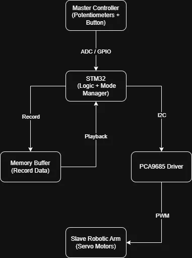
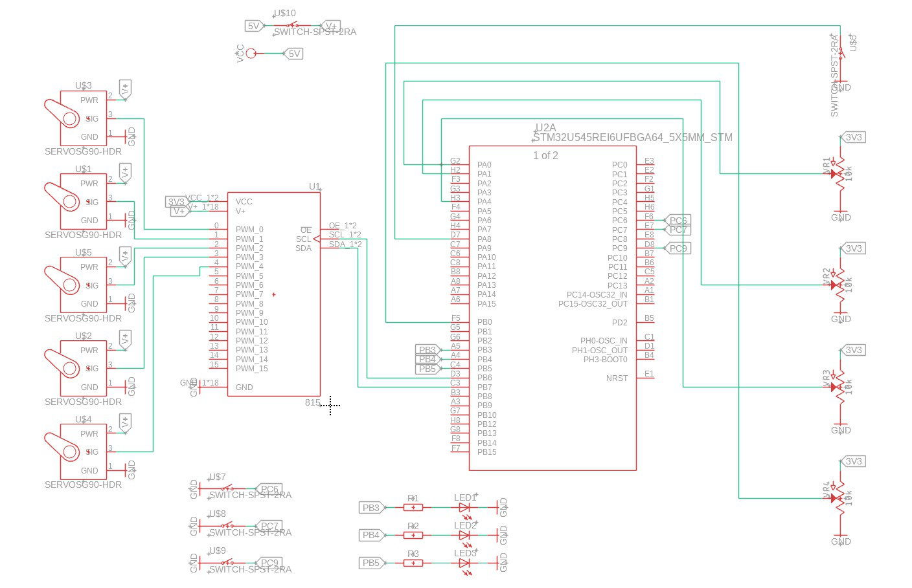

# Robotic Arm with Master-Slave Control Mode
A robotic arm controlled via potentiometers with record and playback functionality.

:::info 

**Author**: Istrate Camelia-Elena \
**GitHub Project Link**: https://github.com/UPB-PMRust-Students/acs-project-2026-camistrate.git

:::

<!-- do not delete the \ after your name -->

## Description

This project implements a robotic arm controlled by an STM32 microcontroller programmed in Rust. The system consists of a master controller with potentiometers and a slave robotic arm driven by multiple servo motors.

The system supports two operating modes:

- **Manual Mode**: the master controller (potentiometers) directly controls the slave robotic arm in real time.
- **Record & Playback Mode**: the system records a sequence of movements performed in manual mode (master) and later replays them automatically on the slave robotic arm.

The STM32 reads analog input values from the master controller, processes them, and sends commands to a PWM servo driver module that controls the robotic arm in real time.

## Motivation

The idea for this project originated from a brainstorming session, inspired by a simple robotic arm concept seen on social media. I wanted to improve that concept by building a more refined and reliable system.
To extend the original idea, I added a record and playback feature, enabling the robotic arm to capture and reproduce movements, making the system more advanced and interactive.

## Architecture 

The system is divided into the following main components:

- **Master Controller**: consists of potentiometers and a push button, used to generate control inputs and select the operating mode.

- **Processing Unit (STM32)**:
  - reads analog inputs (ADC) and digital inputs (GPIO)
  - processes control data
  - manages operating modes (manual, record, playback)
  - communicates with external modules

- **Memory Buffer**:
  - stores recorded servo positions over time during record mode
  - provides stored data during playback mode

- **Servo Driver (PCA9685)**:
  - receives commands from the STM32 via I2C
  - generates PWM signals for controlling multiple servo motors

- **Slave Robotic Arm (Actuators)**:
  - consists of multiple servo motors (base, shoulder, elbow, wrist, gripper)
  - executes movements based on PWM signals

## Log

<!-- write your progress here every week -->
### Week 6 - 12 April
In this week, I did a brainstorming session and chose the project idea.

### Week 20 - 24 May
In this period, I researched the hardware requirements for the project, identified the necessary components, and placed orders for them.

### Week 27 April - 3 May
During this week, I focused on developing the project documentation.

### Week 4 - 10 May

### Week 11 - 17 May

### Week 18 - 24 May

## Hardware

The project uses an STM32 development board as the main controller. A set of potentiometers and a push button are used as input devices to control the system.

The robotic arm is driven by multiple servo motors, controlled through a PCA9685 servo driver module using I2C communication. The servos are powered by an external power supply, while the STM32 handles the control logic.

All components are connected using standard wires and connectors, and the mechanical structure of the arm is made from 3D printed parts.

### Schematics

### Bill of Materials

| Device | Usage | Price |
|--------|--------|-------|
| [STM32 Nucleo Board](https://www.st.com/en/evaluation-tools/stm32-nucleo-boards.html) | Main microcontroller used for processing inputs and controlling the robotic arm | Free (Provided by faculty) |
| [10k Potentiometer](https://sigmanortec.ro/Potentiometru-1K-5K-10K-20K-50K-100K-p136286400) | Used as analog input for controlling servo positions | 4 x 1.31 RON |
| [MG996R Servo Motor](https://sigmanortec.ro/servomotor-mg996r-180-13kg) | High torque servo motors used for main joints (base, shoulder, elbow) | 3 x 29.5 RON |
| [Mini Push Button](https://sigmanortec.ro/buton-mini-6x6x5-4-pini) | Used for switching between operating modes |4 x 0.36 RON |
| [SG90 Micro Servo](https://sigmanortec.ro/Servomotor-SG90-limit-switch-p141662062) | Used for controlling the gripper | 1 x 9.5 RON |
| [XT60 Connector](https://sigmanortec.ro/Conector-XT60-Mama-Tata-p148577270) | Used for power supply connection | 2 x 4.3 RON |
| [Power Switch KCD11](https://sigmanortec.ro/Intrerupator-KCD11-250V-3A-2-pini-p166528374) | Used to turn the system on/off | 1 x 1.19 RON |
| [PCA9685 Servo Driver](https://sigmanortec.ro/Modul-PCA9685-interfata-I2C-16-CH-servo-motor-p126016016) | Generates PWM signals for controlling multiple servo motors via I2C | 1 x 27.27 RON |
| **Total** |  | **141.5 RON + Free board** |

## Software

| Library | Description | Usage |
|---------|-------------|-------|
| [embassy-stm32](https://github.com/embassy-rs/embassy) | Hardware abstraction layer for STM32 microcontrollers | Used for accessing peripherals such as ADC, GPIO, and I2C |
| [embassy-executor](https://github.com/embassy-rs/embassy) | Async runtime for embedded systems | Used to manage tasks and timing in the application |
| [embedded-hal](https://github.com/rust-embedded/embedded-hal) | Common hardware abstraction traits for embedded systems | Provides generic interfaces for peripherals like I2C and GPIO |
| PCA9685 driver crate | Driver for controlling the PCA9685 PWM module | Used to control servo motors via I2C |
| [defmt](https://github.com/knurling-rs/defmt) | Lightweight logging framework for embedded systems | Used for debugging and monitoring values |
| [panic-probe](https://github.com/knurling-rs/defmt) | Panic handler for embedded Rust applications | Used for debugging runtime errors |

## Links

<!-- Add a few links that inspired you and that you think you will use for your project -->

1. https://www.hackster.io/WolfxPac/simple-and-smart-robotic-arm-using-arduino-1ceda6

