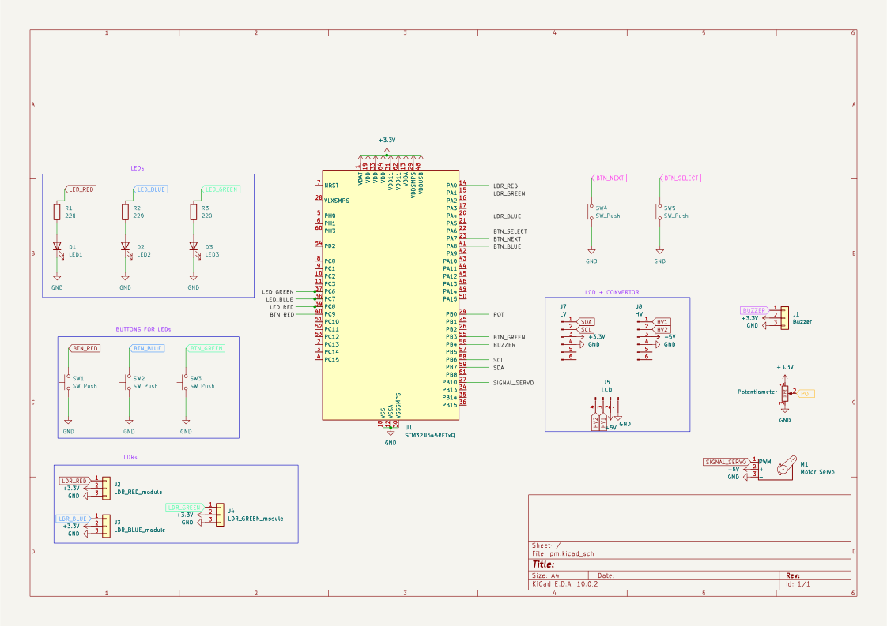

# Reaction time trainer
A device that measures and evaluates user reaction time using randomly generated stimuli.

:::info 

**Author**: Ion Cristina-Gabriela \
**GitHub Project Link**: https://github.com/UPB-PMRust-Students/acs-project-2026-cristinaion0109

:::

<!-- do not delete the \ after your name -->

## Description
The project involves designing and implementing a device based on an STM32 microcontroller that tests user reaction speed using randomly generated visual, auditory and sensor-based stimuli.

The system measures the time between the appearance of a stimulus and the user’s response, detects incorrect actions, false starts, or delayed reactions, and applies penalties when necessary. After each round, the user receives immediate feedback on their performance, including the reaction time, while at the end of a session, the device displays overall statistics such as the best time, average time and total number of errors.


## Motivation
The main source of inspiration was the set of project ideas proposed by the professor, which I found both interesting and suitable for an embedded systems application. Additionally, I was particularly drawn to the concept of measuring reaction time, as I have always been curious to understand, beyond simple numbers, how quickly we can process visual or auditory stimuli.

This project allows me to work with different types of inputs and outputs, such as LEDs, sensors, and displays, while also implementing timing and user interaction, making it both practical and engaging.


## Architecture 


## Log

### Week 21 - 27 April
I looked for the components I needed

### Week 28 April - 4 May
I received the components ordered from Drot and Bitmi

<!-- write your progress here every week -->
### Week 5 - 11 May
I completed the full schematic. I have a clear view of the system architecture.

I connected all hardware components. I verified all electrical connections.

I tested every module individually. I configured the Rust development environment and I started writing the initial firmware.

### Week 12 - 18 May
I implemented the core game firmware using the Rust Embassy async framework.

I integrated all hardware components into asynchronous tasks. This includes LEDs, buttons, photoresistors, the potentiometer, the servo, and the buzzer.

I added the scoring logic and life tracking system. I implemented precise reaction time measurement for each round. I also configured the display to show real-time stats, rounds and game-over screens.

I implemented a comprehensive False Start detection system. It monitors all inputs simultaneously during the random waiting phase.

I have integrated audio feedback using the buzzer. The system now plays distinct sounds for correct and incorrect actions.

### Week 19 - 25 May

## Hardware
The system is based on an STM32 Nucleo board, which acts as the main controller. It handles the generation of stimuli, reads user inputs from various sensors and components, and measures the reaction time with high precision

Main parts:

- STM32 Nucleo Board - This is the main controller of the device. It generates stimuli, reads inputs from buttons and sensors, measures reaction time, and manages the game logic, including scoring, error detection and game mode selection
- LEDs - These are used as visual stimuli. When a specific LED lights up, the user must press the corresponding button as quickly as possible. They provide a simple and fast way to test reaction to visual signals
- Buttons - These are the main input devices for the user. Each button corresponds to a specific action or stimulus. The system detects button presses and checks whether the response is correct and within the allowed time
- Active Buzzer - This component generates audio stimuli. When a sound is played, the user must respond by rotating the potentiometer
- Passive Buzzer - This component generates audio feedback based on game outcomes
- Potentiometer - This component is used to detect user input. In response to certain stimuli (sound), the user must rotate the potentiometer. The STM32 reads its value and determines whether the action was performed correctly
- Photoresistors - These sensors detect changes in light intensity. The system can display instructions such as covering a specific sensor, and the user must react
- Servo Motor: The servo is used to create a mechanical stimulus by raising a small flag. When the flag is lifted, the user must press a specific button
- Display (LCD): The display is used to show instructions, reaction times and game statistics. It also provides a menu for selecting the game mode and guides the user throughout the session


### Schematics



### Bill of Materials

<!-- Fill out this table with all the hardware components that you might need.

The format is 
```
| [Device](link://to/device) | This is used ... | [price](link://to/store) |

```

-->

| Device | Usage | Price |
|--------|--------|-------|
| [STM32 Nucleo-U545RE-Q](https://www.st.com/en/evaluation-tools/nucleo-u545re-q.html) | The microcontroller | Provided by university |
| [LED](https://www.drot.ro/platforma-arduino/1031-led-dioda-ro-ie-5-mm.html) | Stimulus | 0,44 RON |
| [LED](https://www.drot.ro/platforma-arduino/1032-led-dioda-verde-5-mm.html) | Stimulus | 0,44 RON |
| [LED](https://www.drot.ro/platforma-arduino/1035-led-dioda-albastra-5-mm.html) | Stimulus | 0,44 RON |
| [Potentiometer](https://www.drot.ro/platforma-arduino/7597-potentiometru-liniar-10k-ohm.html) | Analog input | 3,92 RON |
| [Servomotor sg90](https://www.bitmi.ro/electronica/servomotor-sg90-180-grade-9g-10496.html#resp-tab2) | Stimulus | 9,99 RON |
| [3 x Photoresistor](https://www.bitmi.ro/electronica/modul-senzor-cu-fotorezistor-ldr-compatibil-arduino-10394.html) | Light-dependent input | 3 x 2,43 RON |
| [Passive buzzer](https://www.bitmi.ro/electronica/modul-buzzer-pasiv-ky-006-10678.html#resp-tab2) | Audio feedback | 2,99 RON |
| [Active buzzer](https://www.bitmi.ro/electronica/modul-buzzer-activ-compatibil-arduino-10397.html) | Stimulus | 3,24 RON |
| [Breadboard](https://www.bitmi.ro/electronica/breadboard-830-puncte-mb-102-10500.html) | For prototyping and power distribution | 13,99 RON |
| [Breadboard](https://www.bitmi.ro/electronica/breadboard-400-puncte-pentru-montaje-electronice-rapide-10633.html) | For prototyping and power distribution | 6,99 RON |
| [LCD Display](https://www.bitmi.ro/electronica/display-lcd1602-hd44780-albastru-iluminat-10486.html) | Human-Machine Interface | 13,99 RON |
| [I2C LCD Interface Module](https://www.bitmi.ro/electronica/modul-interfata-i2c-pentru-lcd1602-10456.html) | I2C converter | 9,99 RON |
| [Bidirectional Logic Level Converter](https://www.bitmi.ro/electronica/convertor-nivel-logic-iic-i2c-bidirectiona-4-canale-10462.html) | Logic level shifter | 2,99 RON |
| [Buttons](https://www.drot.ro/platforma-arduino/1180-mikroswitch-tc-1212t-12-x-12-x-7-3-mm-smd-pcb.html) | Digital inputs | 6 x 0,87 RON |
| [Male-to-Male jumper wires](https://www.bitmi.ro/electronica/40-x-fire-dupont-tata-tata-20cm-10511.html) | For breadboard and peripheral connections | 8,99 RON |
| [Male-to-Female jumper wires](https://www.bitmi.ro/electronica/40-x-fire-dupont-tata-mama-20cm-10512.html) | For breadboard and peripheral connections | 6,99 RON |


## Software

The firmware is built using Rust and the Embassy async framework, allowing efficient, non-blocking execution of multiple game elements simultaneously.

1. Centralized Game Management:

    The core game loop operates as a finite state machine that coordinates the entire gameplay experience:

    - It supports two distinct game modes: Normal Mode (a balanced gameplay experience with fixed, comfortable timeout windows for each round, allowing the player to focus on accuracy), Speed Mode (An intense mode where the system automatically reduces the timeout window as the player advances through rounds, demanding faster reaction times)
    - Random Round Selection: Dynamically switches between 4 distinct round types (LED, Potentiometer, Photoresistor, or Servo)
    - State & Life Tracking: Manages the player's lives, increments scores, and triggers the appropriate game-over or victory transitions

2. Multi-Peripheral Asynchronous Integration

    - Inputs (Buttons & Servo Trigger): Managed through hardware interrupts (EXTI) and thread-safe signals (Signal) to capture user actions instantly
    - Outputs (Display & Buzzer Tasks): Run as independent background tasks that wait for instructions through Channel queues. This prevents screen updates and audio generation from freezing or lagging the main game logic
    - Analog Sensors (Potentiometer & Photoresistors): Sampled smoothly via the ADC during specific gameplay windows to accurately read light levels and potentiometer positions

3. Anti-Cheating - detect false start

    An active monitoring system runs during the random waiting phase ("Get ready..."). It polls all hardware entry points simultaneously (buttons, potentiometer, and all 3 light sensors). By calculating the change of the analog inputs, it securely catches any premature movement or light alterations regardless of environmental conditions, instantly penalizing the player


| Library | Description | Usage |
|---------|-------------|-------|
| [embassy-stm32] | The main library that connects the Rust code to the STM32 hardware | Used to initialize and configure all physical pins and peripherals: ADC (sensors), PWM (servo/buzzer), I2C (display communication), and EXTI (interrupt-based buttons). |
| [embassy-time] | Time management utilities for delays, timestamps, and intervals | Used for the sensor polling loops to catch cheating, enforcing maximum response deadlines (timeouts) for each round, and measuring the player's exact reaction time |
| [embassy-executor] | The runtime task manager for asynchronous execution | Used to launch and run multiple separate tasks (like the game manager, display updates, and buzzer sounds) concurrently |
| [embassy-futures] | Async flow control and concurrency utilities | Uses select and select3 to monitor multiple events at the same time |
| [embassy-sync] | Thread-safe synchronization primitives for communication | Uses Channel and Signal to safely pass data (like button events or display commands) between different running tasks |
| [hd44780_driver] | Hardware driver for the HD44780-compliant character LCD display | Used to initialize the screen mode, control the cursor, and print real-time game text (scores, lives, and states) via the I2C bus |


## Links

<!-- Add a few links that inspired you and that you think you will use for your project -->

1. [https://github.com/UPB-PMRust/lab-solutions]
2. [https://github.com/embassy-rs/embassy/tree/main/examples/stm32]
3. [https://docs.rs/hd44780-driver/latest/hd44780_driver/]
