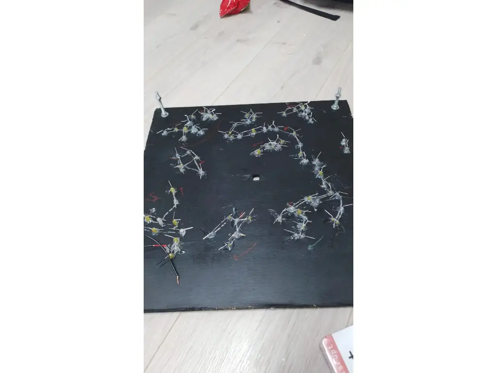
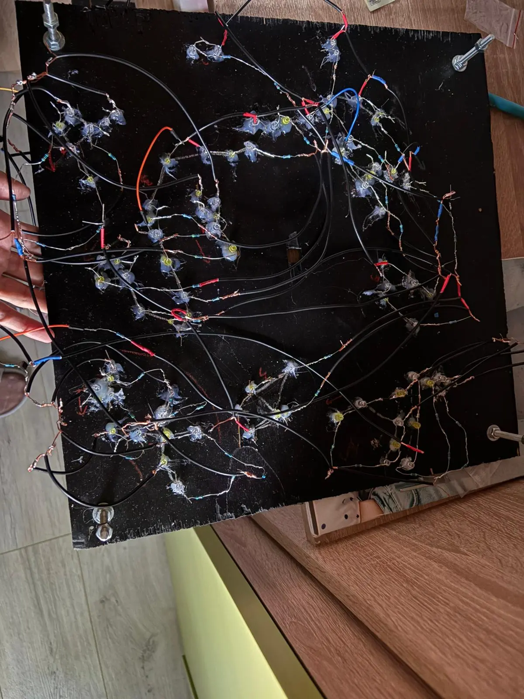
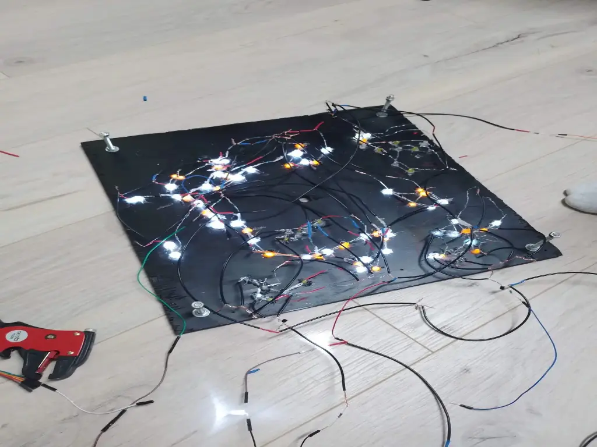
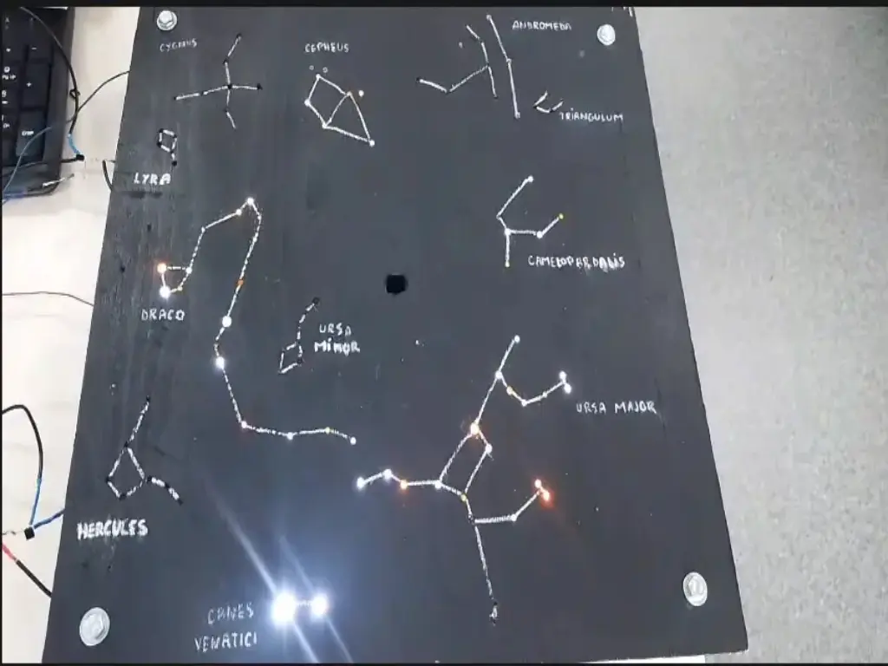
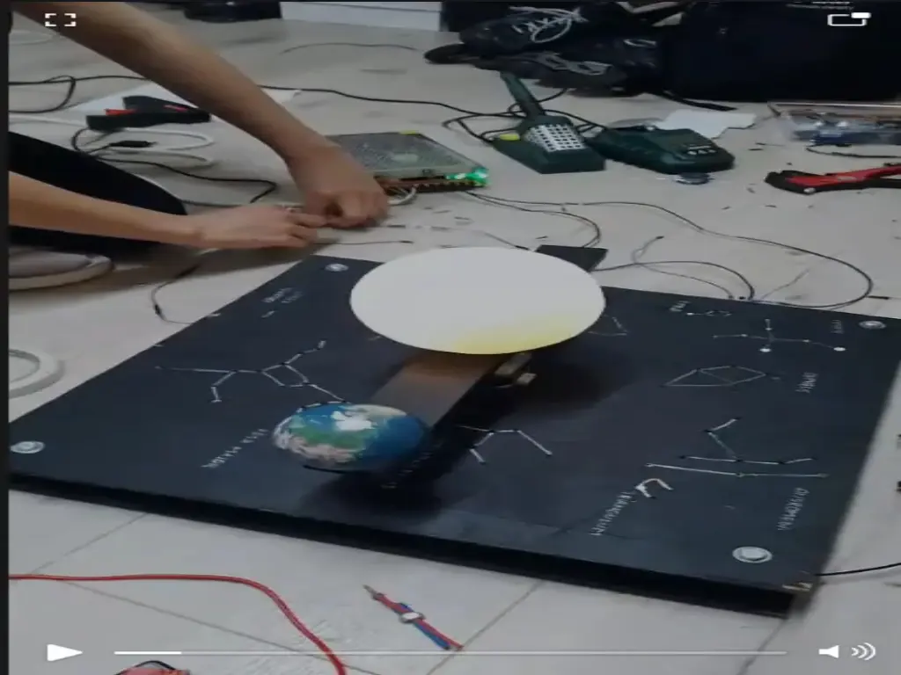
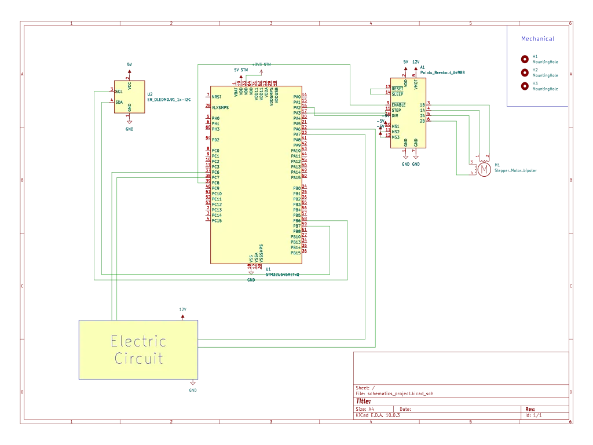
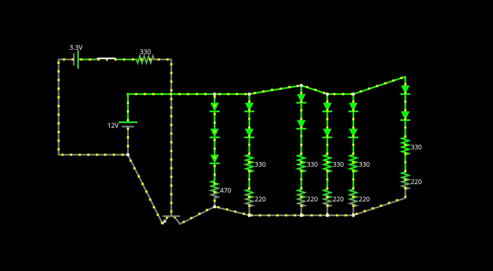

# Mini Solar System Simulator
A model depicting the Earth's rotation and revolution movements around the Sun, surrounded by constellations

:::info 

**Author**: Daria-Antonia Niculescu \
**GitHub Project Link**: https://github.com/UPB-PMRust-Students/acs-project-2026-ifrit18

:::

## Description
This project is a mechanical and electronic simulation of orbital motion, designed as an interactive educational tool. The device uses an STM32 development board to control the rotation of a mechanical arm (representing Earth's orbit) around a light center (the Sun). The project provides real-time information on an OLED screen and envisions constellations through LED light points.

## Motivation
I chose this project because it allows me to bring together two of my biggest passions: astronomy and hardware. It presents a unique challenge to bridge the gap between abstract celestial mechanics and tangible physical implementation and also give me the opportunity to present a visually stunning scenary.

## Architecture 

The project is divided into a few main parts that work together.

**TM32 Control Unit**: The brain that processes encoder inputs, manages orbital timing, and controls the OLED and motor driver.

**Precision Drive System**: A NEMA 17 motor with an A4988 driver provides micro-stepping for smooth revolution, using a flexible coupling to dampen vibrations.

**Visual Interface (HMI)**: A 0.96" OLED displays real-time telemetry, while a rotary encoder allows for intuitive speed and menu adjustments.

**Celestial Lighting**: A central WS2812B RGB Ring represents the Sun, complemented by a 16-LED matrix to illuminate specific star patterns.

**Power Management**: A 12V supply powers the motor, while an LM2596 Step-Down converter provides stable 5V logic power for the STM32 and LEDs.

**Rapid-Prototyping Framework**: Uses an MB-102 Breadboard and Kapton tape for a screwless, modular assembly that is easy to modify and repair.

## Gallery
**Step 1**

**Step 2**

**Step 3**

**Step 4**

**Step 5**

## Video Demonstration
[Watch the project demo here](https://drive.google.com/drive/folders/1OKeiW1OGHsNHTvHbE8E_I3Dv4BRAlutm?usp=drive_link)

## Log

### Week 20 - 24 April
Ordered the hardware components.

### Week 27 - 30 April
Picked up the hardware components and started the documentation process.

### Week 4 - 10 May
Created the constellation design. Cut up the model for the sky and made the holes for the stars.
Also connected the NEMA Motor to the driver.

### Week 11 - 17 May
Started working on the electric circuit and sticking the 92 LEDs into the right position.
Grouped the LEDs into 2 groups controlled by four pins. As I was makeing them, I was testing them
one by one. On Sunday night, I short-circuited the microcontroller.

### Week 18 - 24 May
Got a new microcontroller, then I started redoing the circuit and better isolating the wires.
On Tuesday, it worked!! Added the OLED screen, the motor and started the software part, which was the easiest.

### Week 25 - 27 May
Completed the documentation.

## Hardware
**Fastening**: Structural screws were eliminated in favor of hot gun glue for securing modules onto the aluminum arm, ensuring a lightweight and non-conductive mounting solution.

**Constellations**: The star map is implemented via a manually perforated wood panel, with rear-mounted LEDs aligned to the apertures to create a precise point-source light effect.

### Bill of Materials

| Device| Usage |  Price |
| :---- | :---- | :---- |
| **STM32 Blue Pill** | Central Processing Unit | free |
| **Motor NEMA 17** | Stepper motor for the orbital motion of the arm | ~70 lei |
| **Driver A4988** | Current and step control for the motor | ~ 8 lei |
| **OLED 0.96" I2C** | Real-time telemetry display and menu | ~ 18 lei |
| **Encoder Rotativ** | User input device (speed, navigation) | ~ 4 lei |
| **Plastic Sun** | Visual representation of the Sun| ~ 15 lei | 
| **Sursă 12V 20A** | Main power supply for the entire system | ~ 65 lei |
| **Cuplaj 5x8mm** | Mechanical motor-shaft connection | ~ 10 lei |
| **Glue gun** | Insulating mechanical fastening | borrowed |
| **LED-uri 5mm & 3mm** | Point-source lighting for the constellation map | ~27 lei |

### Schematics

### Electric Circuit for one pin

## Software

My program runs on an STM32 microcontroller using the Embassy async framework and spawns three 
concurrent tasks: a stepper motor driver that continuously pulses a STEP pin with precise 
microsecond timing, a LED sequencer that cycles through four constellation/season LED groups 
on a 2-second base timer, and a main loop that drives a 128×64 SSD1306 OLED display over I2C, 
rendering a simple calendar that cycles through the 12 Romanian month abbreviations every 2 seconds.

| Library | Description | Usage |
| :---- | :---- | :---- |
| [embassy-stm32](https://docs.embassy.dev/embassy-stm32) | Async framework for embedded Rust | Peripheral drivers, I2C, GPIO |
| [embassy-executor](https://docs.embassy.dev/embassy-executor) | Async task executor for embedded | Running 3 parallel async tasks |
| [embassy-time](https://docs.embassy.dev/embassy-time) | Time management in Embassy | Async timers and delays |
| [ssd1306](https://crates.io/crates/ssd1306) | OLED display driver | Real-time data display via I2C |
| [embedded-graphics](https://crates.io/crates/embedded-graphics) | 2D graphics library for embedded | Text rendering on OLED |
| [defmt](https://crates.io/crates/defmt) | Lightweight logging framework | Debug output over RTT |
| [panic-probe](https://crates.io/crates/panic-probe) | Panic handler for embedded | Debugging and error reporting |

