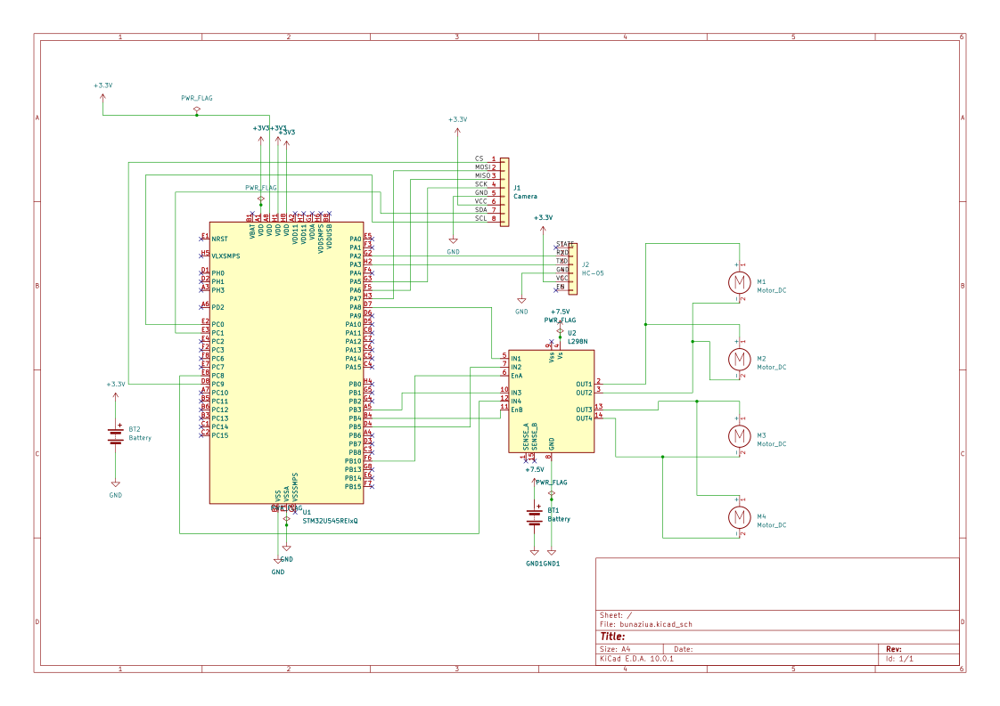

# Spy Photo Car
A remote-controlled smart car with Bluetooth control and onboard photo capture.

:::info
Author: Florea Delia Cristina \
GitHub Project Link: https://github.com/UPB-PMRust-Students/acs-project-2026-Deliutz
:::

## Description

Spy Photo Car is a remote-controlled smart car built using the STM32 Nucleo-U545RE-Q board and programmed in Rust. The car is controlled wirelessly from a laptop through a custom desktop application that communicates with the STM32 using an HC-05 Bluetooth module.

The system allows the user to control the movement of the car directly from the laptop application. The L298N motor driver controls the DC motors, allowing the car to move forward, backward, left, right, and stop. The desktop application sends simple movement commands through the Bluetooth connection, and the STM32 interprets these commands to drive the motors.

The project also includes an ArduCAM Mini Module Camera Shield with OV2640. When the user presses the photo button inside the laptop application, the car stops, the STM32 captures a JPEG image using the camera module, and the image is sent back through the HC-05 Bluetooth connection. The application receives the image, decodes it, and displays the captured photo directly in the same interface.

The firmware is written using Rust and embassy-rs, focusing on low-level hardware interaction, UART communication, GPIO control, I2C camera configuration, SPI communication with the ArduCAM FIFO, and asynchronous timing.

## Motivation

I chose this project to explore embedded programming in Rust and to understand how multiple hardware modules can work together in a real interactive system. The goal was to build a complete remote-controlled car that combines movement, wireless communication, camera capture, and a desktop user interface.

Additionally, I wanted to create a practical and interactive project where the user can both control the car and receive visual information from it. The photo capture feature makes the car useful as a small “spy” or inspection vehicle, because it can move remotely and take pictures from its surroundings.

## Architecture

The project is structured as a modular embedded system where the STM32 acts as the central controller.

Main Components:
* **The Controller**: The STM32 Nucleo-U545RE-Q board — the main unit that handles motor control, Bluetooth communication, camera control, and data transfer.
* **The Communication System**: The HC-05 Bluetooth module used to send commands from the laptop application to the STM32 and to transmit image data back to the laptop.
* **The Actuation System**: The L298N motor driver controlling the DC motors used for the car movement.
* **The Photo Capture System**: The ArduCAM Mini Module Camera Shield with OV2640, used to capture JPEG images when the user requests a photo.
* **The Desktop Application**: A Rust application built with egui/eframe that provides movement buttons and a photo button, then displays the last received image.
* **The Power System**: A 7.4V Li-ion battery used for the motor driver and motors, and a separate 3.7V battery used for the low-voltage electronics through the required regulated supply.
* **The Mechanical System**: The chassis, wheels, motors, breadboard, and wires used to build the physical car platform.

## Log

### Week 5 - 11 May
- Project idea definition  
- Hardware selection  
- Initial setup (Rust + toolchain)

### Week 12 - 18 May
- STM32 configuration  
- Motor driver integration (L298N)  
- Movement testing  
- Bluetooth (HC-05) communication setup  

### Week 19 - 25 May
- Desktop control application setup  
- ArduCAM OV2640 camera integration  
- JPEG image capture testing  
- Photo transfer from STM32 to the laptop application  

## Hardware

The system uses an STM32 microcontroller board along with a Bluetooth module, a motor driver, DC motors, a camera module, batteries, and mechanical components for the car platform.

### Schematics

### Bill of Materials

| Device | Usage | Price |
|--------|--------|-------|
| STM32 Nucleo-U545RE-Q | Main microcontroller board | ~125 RON |
| L298N | Motor driver for DC motors | ~25 RON |
| HC-05 | Bluetooth serial communication | ~30 RON |
| Li-ion battery 7.4V | Power supply for motors / L298N | ~35 RON |
| DTED Electric 3.7V battery | Power supply for low-voltage electronics | ~25 RON |
| Breadboard | Prototyping and wiring | ~10 RON |
| ArduCAM Mini Module Camera Shield with OV2640 | JPEG photo capture | ~200 RON |
| Wires | Electrical connections | ~10 RON |
| DC motors | Movement | ~15 RON |
| Wheels | Car movement support | ~15 RON |
| Chassis / frame | Mechanical structure of the car | ~30 RON |

## Software

| Library | Description | Usage |
|---------|-------------|-------|
| [embassy-stm32](https://docs.embassy.dev/embassy-stm32) | STM32 HAL for embassy-rs | GPIO, UART, I2C, SPI, timers |
| [embassy-time](https://docs.embassy.dev/embassy-time) | Async timing | Motor timing, command timeout, camera delays |
| [embedded-hal](https://docs.rs/embedded-hal) | Hardware abstraction | GPIO and peripheral concepts |
| [serialport](https://docs.rs/serialport) | Serial communication | Bluetooth communication on the PC side |
| [egui / eframe](https://github.com/emilk/egui) | GUI framework | Desktop control interface and photo display |
| [image](https://docs.rs/image) | Image decoding library | Decoding received JPEG data in the laptop application |

## Links

1. https://embassy.dev  
2. https://www.st.com/resource/en/reference_manual/rm0456-stm32u5-series-advanced-armbased-32bit-mcus-stmicroelectronics.pdf  
3. https://docs.rs/embedded-hal