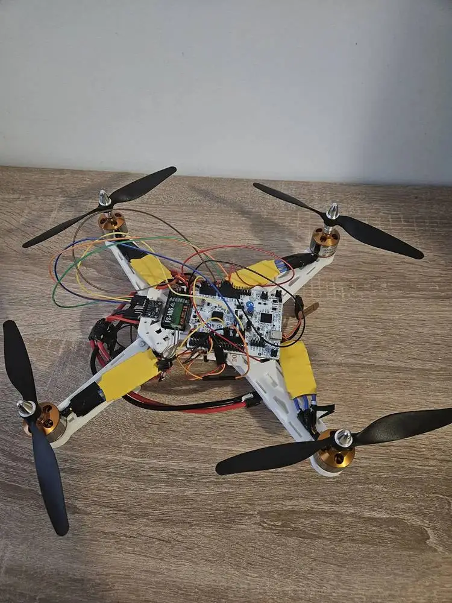
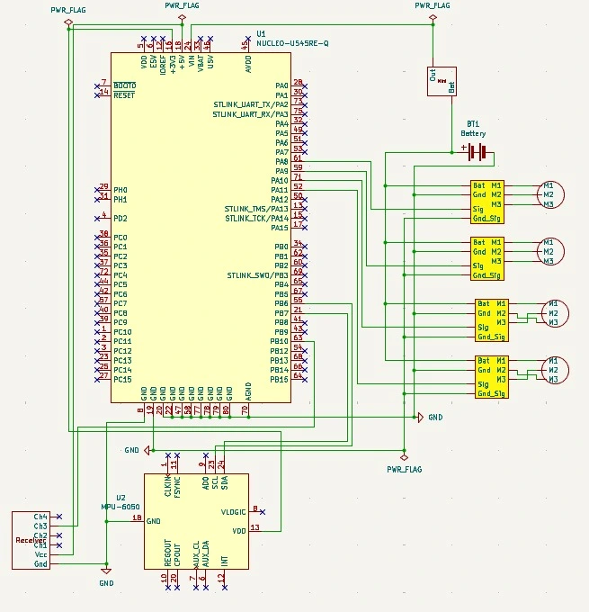

# Quadcopter
A radio controled drone capable of pitch roll and yaw.

:::info 

**Author**: Rizea Eduard-Ionut \
**GitHub Project Link**: https://github.com/UPB-PMRust-Students/acs-project-2026-Edy1298

:::

<!-- do not delete the \ after your name -->

## Description

A quadcopter made using a NUCLEO board that acts as a flight controller. Based on the inputs it receives from the radio reciever and gyroscope the Nucleo board processes them and sends coresponding signals to each of the 4 ESC's in order to keep the drone stable. 
Everything will be built on a 3D printed body and powered by a Lipo 3s battery.

## Motivation

I believe that it would be a fun challenging experience and I find drone building quite interesting.

## Architecture 

The system starts with the receiver, which sends pilot commands to the Nucleo  flight controller. At the same time, the gyroscope provides live motion data.

The Nucleo board processes both the pilot inputs and sensor data. It compares the desired state with the actual state and calculates the necessary corrections to maintain stability or execute movement.

These corrections are sent as signals to the four ESCs, which regulate the speed of each motor. By adjusting motor speeds independently, the system controls lift and enables movement in all directions.

The 3S LiPo battery supplies power to the entire system.


## Log

<!-- write your progress here every week -->
### Week 20 - 26 April
Got approval and researched the components. 
Ordered all of the components.

### Week 5 - 11 May
Received all of the components. 
Finished the design.
Managed to connect the receiver and remote controller, and modify the signals based on the gyroscope's readings. 

### Week 12 - 18 May
Joined the 3D pieces together.
Started soldering the ESCs and Motors.
Started soldering the squid cables that connect the ESC's and Nucleo to the battery. 

### Week 19 - 25 May
Finished the squid cables and powered all the motors.
Added independent PWM output to all four ESCs with 1000-2000µs pulses at 50Hz.
Created a rudimetary stabilisation alogrithm using the pid crate.  


## Hardware

The project uses the Nucleo board as a flight controller. It receives data from the radio receiver and gyroscope. And after processing the data, it sends signals to each of the ESCs that are connected to the motors. 

### Schematics

<!-- Place your KiCAD or similar schematics here in SVG format. -->


### Bill of Materials

<!-- Fill out this table with all the hardware components that you might need.

The format is 
```
| [Device](link://to/device) | This is used ... | [price](link://to/store) |

```

-->

| Device | Usage | Price |
|--------|--------|-------|
| [STM32 Nucleo-U545RE-Q](https://www.st.com/) | Main Controller | Lab Provided |
| [4 x A2212 1400kV Motors](https://www.drot.ro/platforma-arduino/1631-motor-outrunner-a2212-10t-fara-perii-1400-kv.html) | Motors | 36 RON |
| [4 X 30A ESC](https://sigmanortec.ro/Controller-Motor-ESC-30A-p139673260) | ESC | 47 RON | 
| [Lip Tattu 1550 mAh](https://www.lerato.ro/acumulator-lipo-tattu-cu-mufa-xt60-1550-mah-galben.html) | Battery | 120RON |
| [MPU6050](https://www.optimusdigital.ro/ro/senzori-senzori-inertiali/13611-modul-accelerometru-i-giroscop-cu-3-axe-mpu6050-cu-pini-lipiti.html?search_query=MPU6050&results=7) | Gyroscope | 15 RON |
| [Receiver FlySky](https://www.emag.ro/receptor-rc-flysky-fs-ia6b-ia6b-2-4g-6ch-ppm-pentru-transmitator-rc-fs-i6x-fs-i6s-i8-lrz20250306-4905/pd/DMN64Y3BM/) | Radio Receiver | 159 RON


## Software

| Library | Description | Usage |
|---------|-------------|-------|
| [embassy-stm32](https://github.com/embassy-rs/embassy) | Hardware Abstraction Layer | Handling I2C, SPI, and PWM peripherals |    
| [embassy-executor](https://github.com/embassy-rs/embassy) | Async executor for embedded systems | Running the PWM reader, IMU/PID and mixer tasks concurrently on a single-threaded executor |
| [pid](https://crates.io/crates/pid) | Generic PID controller implementation | Three independent rate-mode PID loops for roll, pitch, and yaw stabilization |
| [embassy-time](https://github.com/embassy-rs/embassy) | Timekeeping, delays, and timeouts | Fixed-rate scheduling of the 250 Hz PID loop, the 50 Hz mixer loop, and the 3 ms RC pulse timeout |
| [embassy-embedded-hal](https://github.com/embassy-rs/embassy) | Async adapters for embedded-hal traits | Bridging Embassy peripherals to standard embedded-hal interfaces |
| [embedded-hal-async](https://github.com/rust-embedded/embedded-hal) | Async traits for embedded peripherals | Type abstractions used by Embassy drivers |
| [embassy-sync](https://github.com/embassy-rs/embassy) | Async synchronization primitives | Mutex-protected shared state for throttle and PID corrections between tasks |

## Links

<!-- Add a few links that inspired you and that you think you will use for your project -->
[Video Inspiration](https://m.youtube.com/watch?v=fQhsgUEnV2w)
